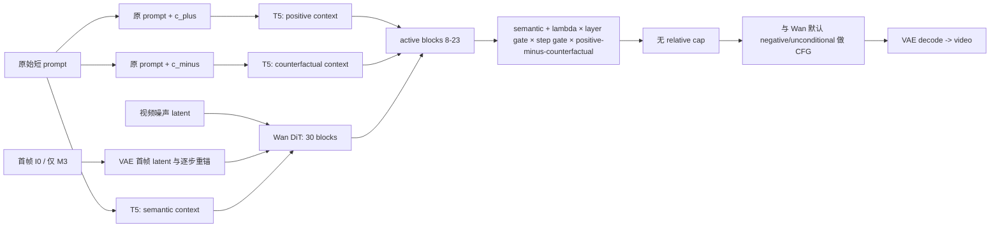
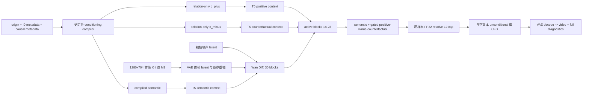

# ACE-Router 初版与新版：核心公式、架构和注入参数说明

> 日期：2026-09-01  
> 基础模型：`Wan2.2-TI2V-5B`，30 个 DiT block  
> 对比范围：初版 `initial_v1` M3/M4 与当前新版 `compiled + safe residual` M3/M4。M2 的 `positive - semantic` 仅作为 cplus-only 消融，不属于这里的主 ACE 对比。  
> 重要边界：两版 ACE 都是 training-free 的推理期适配，均未训练新参数；两版都只有 layer 和 denoising-step 两个路由轴，尚没有 output-video-time 和 spatial ROI 路由。

## 1. 一句话区别与统一公式

初版和新版的核心思想相同：在 Wan 原有 semantic cross-attention 之外，用同一个视频 query 分别计算“正确因果条件”和“最近错误反事实条件”的 cross-attention，并把二者之差作为因果方向注入指定 DiT block。

对第 \(\ell\) 个 block、采样第 \(k\) 个去噪步，先定义：

\[
q_{\ell,k}=\operatorname{Norm}_3(h_{\ell,k}),
\]

\[
r_{sem}=\operatorname{CA}(q_{\ell,k},c_{sem}),\qquad
r_+=\operatorname{CA}(q_{\ell,k},c_+),\qquad
r_-=\operatorname{CA}(q_{\ell,k},c_-),
\]

\[
\Delta r_{causal}=r_+-r_-.
\]

其中 \(c_-\) 不是 CFG negative prompt，而是一个肯定式描述的最近错误过程，例如“结果在触发前已经发生”“没有传播前沿而同时倒下”“完整瓶和碎片同时存在”。ACE 只修改 conditional forward；unconditional forward 不注入 c+/c-。

初版公式为：

\[
d^{old}_{\ell,k}
=\lambda_0g_{layer}(\ell)g_{step}(k)\Delta r_{causal},
\]

\[
h'_{\ell,k}=h^{self}_{\ell,k}+r_{sem}+d^{old}_{\ell,k}.
\]

新版先形成候选 residual：

\[
d^*_{\ell,k}
=\lambda_0g_{layer}(\ell)g_{step}(k)\Delta r_{causal},
\]

然后按 batch 中每个样本独立计算相对 L2 cap：

\[
a_b=\min\left(
1,
\frac{\tau\lVert r_{sem,b}\rVert_2}
{\lVert d^*_{\ell,k,b}\rVert_2+\epsilon}
\right),
\qquad
d^{new}_{\ell,k,b}=a_bd^*_{\ell,k,b},
\]

\[
h'_{\ell,k}=h^{self}_{\ell,k}+r_{sem}+d^{new}_{\ell,k}.
\]

这里 \(a_b\le 1\)，因此 cap 只压制过强 residual，不会把弱 residual 放大；差分、范数与裁剪在 FP32 中计算。M3 的 \(\tau=0.02\)，M4 的 \(\tau=0.015\)。这表示**单个 active block 的最终 ACE residual 范数**最多约为该 block semantic residual 的 2% 或 1.5%，并不表示最终视频只变化 2%/1.5%。

两版最后都进入标准 CFG：

\[
\epsilon
=\epsilon_u+s_{cfg}(\epsilon_c^{ACE}-\epsilon_u).
\]

因此 `lambda0 × layer gate × step gate` 只是 CFG 之前对原始 \(r_+-r_-\) 的候选系数，不能直接解释成最终视频的变化百分比。初版 unconditional 使用 Wan 默认 negative prompt；新版改为空文本。现有 HD97 对比同时测试了 CFG 3.5 和 5，当前观察是 3.5 整体更稳，5 更适合作压力测试。

## 2. 核心架构图与条件变化

初版架构：



新版架构：



block 内部的真实执行位置可概括为：

```text
hidden
  -> self-attention residual
  -> Norm3 得到同一个 query
  -> CA(query, semantic)
  -> CA(query, c+)
  -> CA(query, c-)
  -> semantic + gated/capped (positive - counterfactual)
  -> FFN residual
  -> 下一个 block
```

两版条件结构的差别是：

| 项目 | 初版 initial_v1 | 新版 compiled + safe |
|---|---|---|
| semantic | 原始短 prompt | M3：原 prompt + 实体/初态/变化变量/保护项；M4 还加入文字化初始场景和布局 |
| c+ | `原 prompt + causal_positive` | 只保留 relation-only `causal_positive` |
| c- | `原 prompt + causal_counterfactual` | 只保留 relation-only `causal_counterfactual` |
| 主要问题/目的 | 三个分支都重复主体、外观和动作词，差分混入句长与语义重复 | semantic 管场景与任务，c+/c- 尽量只管单一关系差，减少纹理/实体重复 |
| M3 图像路径 | 原生 I2V，I0 进入模型 | 保持原生 I2V，不改图像路径 |
| M4 图像路径 | 纯 T2V，图片不进入模型 | 仍为纯 T2V；只读取 I0 JSON 作为文字规格，不读取图片 tensor |
| CFG unconditional | Wan 默认 negative prompt | 空文本 |
| diagnostics | summary | full，记录 raw/candidate/applied norm、cap 系数和裁剪比例 |

## 3. 层与去噪步的注入强度

### 初版：`mvp_mid16 + legacy`

初版 M3/M4 共用：

```text
lambda0 = 0.5
residual_cap_ratio = None
```

层 gate：

| DiT block | `g_layer` | 设计含义 |
|---:|---:|---|
| 0～7 | 0 | 不改早期感知、初始几何和背景结构 |
| 8～13 | 0.4 | 对象定位向关系表示过渡，给予中等强度 |
| 14～23 | 1.0 | 假定为动作、关系和运动推理的主要窗口，给予完整强度 |
| 24～29 | 0 | 不干扰后期表示整合、边缘和纹理细化 |

50-step 去噪 gate：

| 去噪 step | 生成阶段的近似解释 | `g_step` |
|---:|---|---:|
| 0～14 | 高噪声、全局规划 | 1.0 |
| 15～29 | 中前期结构形成 | 0.7 |
| 30～39 | 中后期收敛 | 0.3 |
| 40～49 | 最终细节阶段 | 0.0 |

初版的实际候选系数 \(\lambda_0g_{layer}g_{step}\) 为：

| block \ step | 0～14 | 15～29 | 30～39 | 40～49 |
|---|---:|---:|---:|---:|
| 0～7 | 0 | 0 | 0 | 0 |
| 8～13 | 0.20 | 0.14 | 0.06 | 0 |
| 14～23 | 0.50 | 0.35 | 0.15 | 0 |
| 24～29 | 0 | 0 | 0 | 0 |

这套设计来自最初的理论先验：运动/因果关系应在 DiT 中层表达，并在高噪声的早期去噪阶段先规划，后期减少抽象条件以保护画质。它的优点是简单、强、容易观察有无变化；缺点是没有 residual 安全上限，且在轨迹尚未形成的最早 30% 去噪阶段强度最大。实际审计中，旧 HD97 的单个记录点 `applied/semantic` 最大值达到 M3 18.37%、M4 15.51%，说明 `lambda0=0.5` 并不等于温和引导。

### 新版 M3：`mid_b + safe_i2v_v1`

```text
lambda0 = 0.10
residual_cap_ratio = 0.02
active blocks = 14～23
```

| block \ step | 0～14 (`g_step=0.5`) | 15～34 (`1.0`) | 35～44 (`0.3`) | 45～49 (`0.1`) |
|---|---:|---:|---:|---:|
| 0～13 | 0 | 0 | 0 | 0 |
| 14～23 | 0.05 | 0.10 | 0.03 | 0.01 |
| 24～29 | 0 | 0 | 0 | 0 |

表中数值是 cap 前候选系数；最终每个 active block 还要满足 \(\lVert d\rVert_2/\lVert r_{sem}\rVert_2\le 2\%\)。

M3 这样设计的原因是：I0 已提供实体、布局和初始几何，高噪声最早阶段不需要用强因果 residual 再次改写场景，因此前 30% 降到 0.5；轨迹和粗结构开始建立后的 30%～70% 提到 1.0，让关系差在更合适的阶段发挥作用；后期逐步减弱，但末 10% 保留 0.1，用于避免旧版最后 20% 完全关掉 ACE 后终态约束丢失。层窗口收窄到 14～23，是为了去掉 8～13 的额外累计扰动，把预算集中在关系/动作候选中层。

### 新版 M4：`mid_b + safe_t2v_v1`

```text
lambda0 = 0.08
residual_cap_ratio = 0.015
active blocks = 14～23
```

| block \ step | 0～14 (`g_step=0.25`) | 15～34 (`0.8`) | 35～44 (`0.3`) | 45～49 (`0.1`) |
|---|---:|---:|---:|---:|
| 0～13 | 0 | 0 | 0 | 0 |
| 14～23 | 0.020 | 0.064 | 0.024 | 0.008 |
| 24～29 | 0 | 0 | 0 | 0 |

最终每个 active block 还要满足 \(\lVert d\rVert_2/\lVert r_{sem}\rVert_2\le 1.5\%\)。M4 没有 I0 锚点，早期噪声中的实体数量、类别、构图和位置都不稳定；此时过强 residual 更容易把“因果关系词”错误完成为新物体、局部特写或结果预置。因此 M4 的 `lambda0`、最早阶段 gate、中段 gate 和 cap 都比 M3 更保守。M4 的定位是困难的纯 T2V 迁移对照，不是当前优先主线。

三套 schedule 可以放在一起看：

| 版本 | active layer | 前 30% | 30%～60/70% | 60/70%～80/90% | 最后 10/20% | cap |
|---|---|---:|---:|---:|---:|---:|
| 初版 M3/M4 | 8～13: 0.4；14～23: 1.0 | 1.0 | 0.7 | 0.3 | 0 | 无 |
| 新版 M3 | 14～23: 1.0 | 0.5 | 1.0 | 0.3 | 0.1 | 2% |
| 新版 M4 | 14～23: 1.0 | 0.25 | 0.8 | 0.3 | 0.1 | 1.5% |

这里必须区分两个时间概念：`g_step(k)` 控制的是从噪声求解到视频的计算阶段，不是成片中的第几帧。新版把高噪声阶段降低、去噪中段提高，并不能告诉模型“前 1/3 保持初态、中间发生接触、后 1/3 保持终态”。这正是当前 ACE 仍会出现结果预置和中间态删除的根本原因，也是下一步 TRACE-Time 要增加 output-time gate \(\alpha_m(f)\) 的原因。

## 4. 参数设计判断与当前结论

| 参数 | 初版设计 | 新版设计 | 当前判断 |
|---|---|---|---|
| `lambda0` | M3/M4 都为 0.5，优先确认残差是否有可见作用 | M3=0.10，M4=0.08 | 降低全局扰动；M4 因无 I0 更保守 |
| layer gate | blocks 8～13 中等、14～23 强，共 16 层累计 | 只保留 blocks 14～23，共 10 层 | 减少累计改写，把预算集中到关系/动作中层 |
| step gate | 高噪声最强，最后 20% 完全关闭 | 最早阶段减弱，中段最强，末 10% 保留小 gate | 保护布局并兼顾终态保持；仍不能代替 output-time phase |
| residual cap | 无 | M3 2%，M4 1.5%，逐样本、逐 block、非放大型 | 新版最确定的工程收益；把异常大 residual 限制在明确预算内 |
| c+/c- | 两边都重复原 prompt | relation-only，只描述一条关系差 | 减少实体、外观、句长重复进入差分，但尚不能保证 T5 真正理解逻辑差 |
| semantic | 原始短 prompt | 元数据确定性编译；M4 比 M3更完整 | 显式利用实体、初态、布局、变化变量和保护项 |
| negative/CFG | Wan 默认 negative，CFG 5 | empty unconditional；已比较 CFG 3.5/5 | CFG 3.5 更稳；CFG 5 会同时放大正确变化和复制/形变 |
| diagnostics | 稀疏 summary | full + candidate/applied/cap 记录 | 能区分“方向本身弱”与“方向过强被 cap 接管” |

新版并不是新训练出的 router，也不是已经找到的最优超参数；它是依据首轮失败审计得到的**安全、可解释 pilot 起点**。现有结果支持保留四点：条件职责分离、relation-only 反事实差分、中层稀疏注入、相对范数 cap。现有结果还不能证明 ACE 已经实现可靠物理控制，因为两版 residual 仍对所有输出视频时间 token 和所有空间 token 全局生效。

当前最准确的架构判断是：

```text
初版 ACE
= 强但无上限的全局因果方向
= 容易看到变化，也容易累计过冲和改坏主体

新版 ACE-safe
= 编译后的 semantic + 关系差分 + 中层窄窗口 + 去噪中段主导 + 小终态 gate + 相对范数上限
= 已变得数值安全、画面更稳、部分样本过程更完整
- 仍缺输出时间 phase、事件区域、实体排他关系和源-流-汇约束
```

对应实现与配置来源：

- `code/v1/ace_router/model_adapter.py`
- `code/v1/ace_router/schedules.py`
- `code/v1/ace_router/conditioning.py`
- `code/v1/inference/infer_ace_router_m3.yaml`
- `code/v1/inference/infer_ace_router_m4.yaml`
- `code/v1/inference/infer_ace_router_m3_initial_v1_hd97.yaml`
- `code/v1/inference/infer_ace_router_m4_initial_v1_hd97.yaml`
