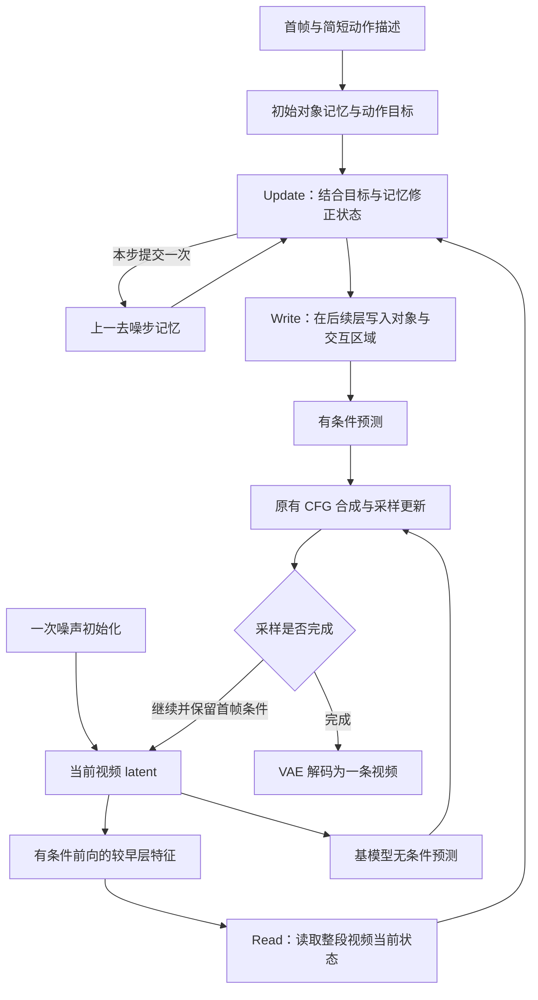

# 20260908-A-RIVIA：后续方法设计流程与依据

生成日期：2026-09-08；当日篇次：A（第一篇）。本文为后续方法的初步整合设计，所述能力均需通过实现、训练和实验验证。

设计依据：[9 月 4 日 StateBridge 方案](TRACE_v3_visual_audit_and_v4_statebridge_plan_20260904.md)、[9 月 5 日方法主文档](TRACE_strong_stage_json_visual_diagnosis_and_next_plan_20260905.md)、[9 月 5 日技术说明](TRACE_strong_stage_json_visual_diagnosis_and_next_plan_20260905.technical_archive.md)。以 9 月 5 日的 RIVIA 循环状态读写为主线，融合输入因果可行性、语义与状态分离、分步训练及独立验证的设计要求。

## 1. 总体方法：让状态参与视频的形成过程

后续方法采用 **RIVIA（Recurrent Inference for Video with Iterative Adjustment，循影）**：以 Wan 为视频生成主干，新增一个共享 StateBridge，在去噪过程中持续读取对象与材料状态，结合动作目标更新记忆，再将需要的变化写回视频特征。

正式输入为首帧与简短动作描述。每条请求只初始化一次视频噪声，沿一条采样轨迹输出一条视频。首轮聚焦图生视频，使首帧提供对象外观与初始布局；文生视频的布局初始化作为后续扩展。

整体设计包含两个相互配合的条件通道：

| 条件通道 | 承载内容 | 进入生成过程的方式 | 设计理由 |
|---|---|---|---|
| 语义通道 | 场景、对象类别、动作意图、必要的原因和镜头描述 | 简短文本经原生文本条件通路进入 Wan | 保留基模型对语言、场景与外观的已有理解，降低重复模板和互相冲突的描述对生成的干扰 |
| 状态通道 | 同一对象的逐时位置、相互作用、结构变化和材料来源 | 非文本状态经共享 StateBridge 进入对象及交互区域 | 让接触、运动传递、形变与材料转移具有明确表示，并能根据当前视频的表现继续修正 |

阶段文字、JSON 文本差分及其幅度匹配退出正式控制路径。已有 JSON 中有用的对象编号、方向和关系可以直接编码为状态字段；正式使用无需用户提供完整轨迹或阶段 JSON。

这样设计的关键原因是：动作描述可以表达“发生碰撞”，但生成还需要决定两球如何到达接触位置、接触后各自怎样运动，以及运动中如何保持球面外观。状态通道将这些相互依赖的过程连接起来。对象槽位、材料记录和局部写入提供结构约束，能否落实为正确视频仍由训练和输出验证决定。

## 2. 输入准备：先建立能够发生的动作

首帧与描述进入目标初始化前，先检查对象类别、数量、布局、作用来源和显示时长是否支持任务。检查围绕当前实际输入进行，历史样例的首帧问题不能直接视为新输入仍然存在的问题。

动作原因分为四类：已有初始运动、重力与支撑解除、风或热等环境作用、可见执行者或装置。对于碰撞，需要有朝向接触点的初始运动；对于压缩或撕裂，需要有施力者和抓持关系；对于充气，需要合理的进气连接；对于融化，需要热条件及相应的真实时间或延时摄影设定。

准备流程是：先确认对象和必要参与者，再确认初始关系与可行路径，最后确认片段时长能覆盖作用过程和结束。需要修订的输入在进入方法对照前确定，并保留原输入与修订输入的区别。

语义描述保留动作的先后关系，目标状态另行保存未来过程。描述“书落地后打开”可以表达任务意图，初始对象记录仍对应首帧中的闭合书。对象清单、禁止类别、内部状态键值和终态检查项不再反复扩写成正向文本。

这一步用于避免让状态模块承担输入矛盾造成的额外难题，也使后续实验能够区分输入改善与模型方法改善。必要的手、风、热和初始动量都是因果信息，应按任务明确表达。

## 3. 状态表示：以对象、视频时间和材料关系组织过程

### 3.1 在两个时间尺度上保持明确索引

状态按“对象 × 视频时间”组织，跨去噪步骤保留和更新。两种时间分别表示：

- 视频时间 `τ`：同一段动作内部的先后，例如接近、接触、响应与停住。
- 去噪步骤 `k`：整段视频从噪声逐渐形成的迭代过程，每一步都可以重新估计整段动作。

沿用现有 97 帧配置时，状态序列对齐 25 个 latent 时间位置；长度改变时同步调整对齐方式。关键事件标签保留原视频的时间区间，映射到 latent 时间后仍需在解码视频中检查真实发生顺序。

一次去噪步中的“已经接触”表示模型对某个视频时刻的当前估计，并不意味着下一去噪步必须推进到动作的下一阶段。明确区分两种时间，才能在后续去噪中同时修正接触前的路径和接触后的响应。

### 3.2 共享状态空间包含什么

| 状态内容 | 建议表示 | 为什么需要 |
|---|---|---|
| 对象身份与外观 | 首帧局部视觉原型、跨时刻对应关系、当前外观特征 | 为同一对象在不同位置和姿态下提供连续身份依据 |
| 几何与可见性 | 位置、尺度、朝向、区域及可见／遮挡／出画标记 | 区分真实运动、尺度漂移、遮挡和消失，确定读写的空间位置 |
| 相互作用 | 接触对象、接触区间、支撑关系、施力者与被作用者 | 将运动变化连接到具体作用，避免仅生成结果位置 |
| 合法形变 | 书脊与开合角、海绵厚度、气球充气状态等类型字段 | 使形变沿对象结构发生，保留刚体与可变形部分的区别 |
| 材料状态 | 材料来源、源端、途中、接收端、相态及来源关联 | 联合表达流动、融化、脱落、破碎与撕裂 |
| 观察可靠性 | 字段有效范围、可见程度、噪声条件下的置信信息 | 防止把看不清或无法判断的内容当作确定错误持续纠正 |

视觉特征负责承载材质、纹理和新显露表面的细节，少量可解释字段负责过程监督与判断。单一进度标量可以辅助描述事件阶段，但不能替代位置、接触、形变和材料状态。

### 3.3 按事件结构更新状态

刚体运动联合更新位姿、接触与响应。双球碰撞需要同时形成相交的接触路径和接触后的速度变化；多米诺需要连接相邻骨牌的接触传播；箱子倾倒需要保持结构并绕合理支点转动。

具有连接结构的对象按结构改变形状。书的下落与绕书脊开合分别表示；海绵的厚度变化关联手部施力、卸力与桌面支撑；气球的充气与破裂使用不同的过程变量。动作顺序可以有约束，具体状态可以往复变化，例如先压缩再恢复、连续反弹后停住。

材料转移采用共同来源记录，以同一转移过程更新源端、途中与接收端。例如倒沙时，出料使源端减少，空中颗粒形成在途量，落地后转为堆积；融化时，固态与液态共享同一材料来源。若场景存在流入、溢出或出画，也需记录相应边界通量。

这里使用的“量”必须明确含义：有标定时可以是质量或体积；普通视频先采用可靠的相对量及变化关系。二维区域面积、倾斜容器中的液面高度和颜色深浅不能直接等同于真实材料量。共同材料记录提供一致性条件，视频是否表现出对应变化还要单独检查。

破碎与撕裂保留材料父记录，通过连接关系变化产生同源碎片或纸片。完整对象的可见区域随过程转换，碎片拥有各自的后续位置。染料和密集颗粒采用区域分布，可辨种子补充个体轨迹。这样既能表达拓扑变化，也能避免为每种材料另建一套生成网络。

## 4. 目标与观察：分别回答“应该怎样”和“当前怎样”

目标初始化根据首帧、简短描述和初始布局提出粗略状态过程，包括参与对象、必要事件顺序、可能的接触位置以及来源与去向。轨迹细节可在后续更新中调整，任务规定的必要动作继续作为目标依据。

观察分支从当前去噪步骤的 DiT 特征读取实际状态，以对象身份定位，并结合噪声时间解释特征。期望接触、期望液量和目标进度在更新部分再与观察结合，避免将目标值直接用作观察结果。

例如，“红球撞蓝球”的目标需要两球接触；如果当前特征对应绕行，观察应报告绕行或接触尚不确定，更新模块再联合修正接触前后轨迹。“倒水”的目标需要源量、流束与接收量共同变化，观察则分别反映当前视频已经呈现出的部分。

早期高噪声下的读数可能不稳定，遮挡区域也可能缺少证据。更新应结合当前观察可靠性、噪声时间和历史记忆学习修正力度，并允许后续更清楚的特征纠正早期判断。终态保持约束作用于视频中的事件过程，不能把一次不可靠读数永久锁定为完成。

开发时分别使用人工过程状态和模型预测目标。人工状态用于检验状态表示与写入是否有效；正式效果以首帧和描述预测的目标为准。这样可以定位失败发生在目标提出、当前观察还是状态执行。

## 5. 共享 StateBridge：在同一次前向中读取、更新和写回

StateBridge 内部包含目标初始化、Read、Update 和 Write，复用同一个状态空间和跨层共享主体。读出、更新与写入可以使用各自必要的小型投影或输出头，各事件类型通过状态字段与表示方式适配。



### 5.1 读取与记忆更新

每个去噪步先从较早的网络位置读取整段对象状态，再将观察、上一轮记忆、动作目标及实际噪声时间送入 Update。Update 学习生成所需的状态调整，同时维护跨步身份与过程信息。

接触纠正需要跨对象、跨视频时刻联合计算；材料纠正需要统一来源与去向；外观保持需要关联对象运动前后的位置。完整状态更新比只按一个进度差调节注入幅度更适合这些问题。因此正式方案采用可学习的记忆更新；早期的确定性误差门控可以保留为简化对照，用于衡量学习更新的实际收益。

记忆是对当前整段生成的可修订估计。它提供历史对应与目标连续性，并在新证据出现时更新，避免每一步完全重新建立对象关系。

### 5.2 写入位置与写入内容

Write 将状态调整转换为 DiT 特征残差，在当前前向的后续少量层生效。写入覆盖对象内部、边缘、接触区域、材料经过区域、刚离开的区域及新显露区域，位置由当前对象对应和所需变化共同确定。

包含离开区域是为了处理运动后的残影，包含接触区域是为了连接两个对象的相互作用，包含新显露区域是为了支持转动和形变后的外观生成。仅固定在首帧框内写入，无法覆盖这些变化。

身份原型为材质与外观提供参照，当前特征与视频训练负责生成随姿态变化的细节。局部残差限制直接写入范围，但后续网络仍会传播信息，背景和其他对象的影响需要通过完整视频检验。

写入投影从零初始化，方向与尺度通过训练学习。层位置和不同噪声阶段的写入作用通过实验确定，不沿用旧文本差分对全局文本输出的强制幅度匹配。

### 5.3 采样与记忆的调用纪律

一次有条件前向内部完成读取、更新和后续写入；多个写入层共享本轮状态调整，每个去噪步只提交一次持久记忆。无条件分支沿用基模型计算，不更新持久记忆，两路预测由原有 CFG 合成。

采样器按自身时间和历史推进视频 latent，首帧条件按 Wan 原有图生视频协议保留。新请求重新初始化自己的记忆。这样跨步信息与一条采样轨迹对应，也避免多层写入或两路 CFG 前向重复提交状态。

## 6. 数据流程：同时学习完整过程与运动外观

训练使用 WISA-80K 与 nkp37/OpenVid-1M 的原始视频。前者优先检索相关物理过程，后者补充清楚的主体运动、手部操作、不同材质和场景；实际片段根据动作完整性与画面质量共同选择。

统一流程为：原始视频解码，保留真实时间信息，选取包含原因、作用、变化与结束的片段，再进行 Wan VAE 编码、状态标注和训练缓存。普通运动与物理过程数据共同训练，使方法在学习动作的同时保留自然外观。

自动分割、跟踪等工具辅助建立对象区域和对应关系，人工复核接触、出流、裂口、支撑解除及结束等关键事件。标签同时记录单位或归一化定义、坐标体系与可见范围。未知字段不参与对应状态损失，其余有效字段继续提供监督。

数据描述与元数据用于检索和初筛，逐时位置、接触及材料变化以视频观察为依据。对于无法直接测量的内部量、温度或浓度，不将描述性估计当作精确逐帧真值。融化等长过程保留热条件和显示时间尺度，避免通过任意重采样制造不合理速度。

在进入生成训练前，选取球面、手指、玻璃、金属和细粒子视频做 VAE 重建检查，并比较生成的解码输出、编码前图像与编码后帧。这样可以区分表示尺度、生成控制与导出造成的细节损失，使后续修改落在实际发生问题的环节。

训练与评估按原始视频和场景划分，同源相邻片段、加噪版本和近重复内容进入同一分区。开发样例用于定位问题，独立场景用于检验推广能力。

## 7. 训练流程：先证明状态可以写入，再学习可靠反馈

首版冻结 Wan、文本编码器和 VAE 的既有权重，训练 StateBridge 的相关部分。写入训练仍需让梯度经过受影响的主干层，才能学习残差怎样改变最终视频。对象池化特征可以复用于读取训练，完整写入与循环训练需要经过实际视频主干。

总体保留两个主要目标：

```text
L_total = L_generation + λ_state × L_state
```

生成目标负责真实视频的过程与外观；状态目标统一组织目标预测和当前状态读取的监督。连续量按尺度归一化，离散事件使用适合的分类监督，各字段按有效标注范围参与计算。统一状态目标保留字段类型差异，不把接触类别、位置和材料份额全部强行解释成同一种连续数值。

### 7.1 阶段一：学习目标过程与状态写入

从真实视频提取可靠状态轨迹，使用人工复核的过程状态训练写入，先检验对象定位、状态编码及作用区域能否推动正确过程。与此同时，训练首帧与描述到粗略目标过程的预测。

逐步增加预测目标参与写入训练，并分别报告人工目标和预测目标的结果。单步生成训练采用 Wan 实际的加噪、时间与预测目标约定，保留首帧条件。

先完成这一阶段，是因为反馈最终仍依赖写入执行。如果正确轨迹输入后视频仍不能形成接触或材料转移，应先修表示、空间对应和写入训练。

### 7.2 阶段二：学习当前生成状态的读取

读取训练先从真实视频加噪后的特征起步，再补充模型实际生成中的特征记录。对于记录的中间去噪步骤，离线解码其对清楚视频的估计，标注当前表现出的位置、数量、接触与材料变化。

标签必须与该步特征对应，含糊区域按可辨程度监督。最终失败视频用于归纳症状；缺少对应中间特征时，不能直接用于监督某个去噪步的内部读数。

这一阶段让 Read 接触实际生成中的绕行、复制、漏执行和状态跳变，减小只在真实视频特征上训练造成的分布差异。可靠性要按噪声位置和状态类型检查，不能只用一个总体进度误差代替。

### 7.3 阶段三：学习跨步更新与反馈

读取与写入具备可用基础后，联合训练 Update 及共享读写部分。先从同一真实视频的加噪表示展开 2–4 个连续去噪步骤，每一步使用模型实际更新后的 latent 与上一轮记忆，再逐步评估完整采样过程。

短循环的生成监督可以在展开末端，将当前预测对应的清楚视频估计与同一参考视频对齐；具体计算沿用主干的时间与预测约定。自由生成记录主要补充实际观察和纠错监督，没有配对关系时不与任意真实视频强行做逐像素对齐。

短展开用于学习记忆、读数和写入之间的相互影响，完整采样用于检查长期误差积累、状态摆动与外观损伤。只有反馈在完整视频中带来额外改善，才将其纳入正式方法效果。

### 7.4 阶段四：扩充对象结构与材料类型

先建立双球接触、单球连续性及倒水／倒沙的联合转移能力，再增加书脊开合、刚体倾倒、海绵压缩、充气破裂、玻璃破碎、融化、种子脱落与染料扩散。

这些扩展复用共享状态空间和读写机制，通过补充相应字段、区域表示与训练数据完成。每次扩展同时回查已覆盖动作及运动外观，避免新类别训练损伤已有能力。

## 8. 验证流程：分别检验表示、目标、观察和记忆

方法验证从原生 Wan 的简短语义输入参考开始，逐项增加状态写入、实际观察与跨步记忆。已有弱阶段与强阶段视频作为历史参考；原生 Wan 基线通过原有接口单独建立。

| 对照设计 | 要回答的问题 | 对后续方法的作用 |
|---|---|---|
| 原生 Wan 与状态写入 | 状态条件能否改善完整动作，同时保持运动外观 | 决定状态表示和写入机制是否成立 |
| 人工过程目标与预测过程目标 | 写入可执行的情况下，模型能否自行提出可行过程 | 定位目标初始化的训练缺口 |
| 目标驱动写入与实际观察反馈写入 | 当前偏差的读数是否帮助生成修正 | 判断反馈是否具有增量价值 |
| 有反馈但每步重建记忆，与跨步保留记忆 | 历史对应是否减少身份切换、重复和状态摆动 | 单独检验跨步记忆的贡献 |
| 联合材料记录与各区域独立预测 | 来源与去向共同更新是否改善视频中的材料变化 | 检验材料状态组织方式 |
| 对象与交互区域写入，与较粗空间作用方式 | 写入位置是否改善动作与局部细节 | 检验空间对应和区域覆盖 |

对照固定首帧、描述、采样设置和评估协议，采用预先确定的多个 seed，全部结果计入统计。人工轨迹属于额外监督条件，单独报告；输入修订的收益另行比较。模型、采样及方法配置随结果记录，并同时报告时间、显存和前向调用成本。

最终评价直接检查完整视频中的动作完成、物理关系与运动主体画质。重点覆盖原因是否出现、接触是否真实发生、作用后的响应是否连续、材料来源是否对应，以及结束后是否保持合理状态。连续关键帧和原尺寸局部图用于发现单看末帧无法判断的跳变与细节损伤。

反射、遮挡、出画和实体消失分别判断；爆裂、撕裂和接触响应允许真实的快速变化；自然运动模糊及火焰变化按场景解释。内部状态读数用于诊断，独立视频检查与人工复核负责最终判断。

## 9. 后续推进顺序及每一步的设计目的

| 顺序 | 要完成的方法内容 | 进入下一步前需要回答的问题 |
|---|---|---|
| 1 | 确定因果可行的输入协议，建立简短语义的原生 Wan 参考，检查真实视频重建 | 输入、基模型和编解码分别提供怎样的基础能力？ |
| 2 | 建立对象、视频时间与材料状态接口，实现共享读写路径和每步一次的记忆提交 | 零初始化写入能否保持基模型计算，状态与视频特征是否正确对齐？ |
| 3 | 准备首批完整过程视频，训练人工状态写入与目标预测 | 正确过程能否进入视频，正式输入能否提出可执行目标？ |
| 4 | 训练当前状态读取，并用实际生成特征校准 | 读数能否反映生成中真实存在的偏差和不确定性？ |
| 5 | 训练短循环更新，验证完整采样中的反馈与跨步记忆 | 反馈是否改善过程，记忆是否有独立收益，运动外观是否保持？ |
| 6 | 扩充结构与材料类型，在开发样例和独立场景中验证 | 改善能否覆盖更多事件，并保留已获得的正确动作与画质？ |

每一步根据验证结果修改对应的输入、状态表示、目标预测、读取、更新或写入环节，再推进下一阶段。最终形成的完整方法应同时具备可行的动作目标、与当前视频对应的观察、可执行的状态写入以及有效的跨步记忆，其价值由输出视频中的连续过程与运动外观共同建立。
