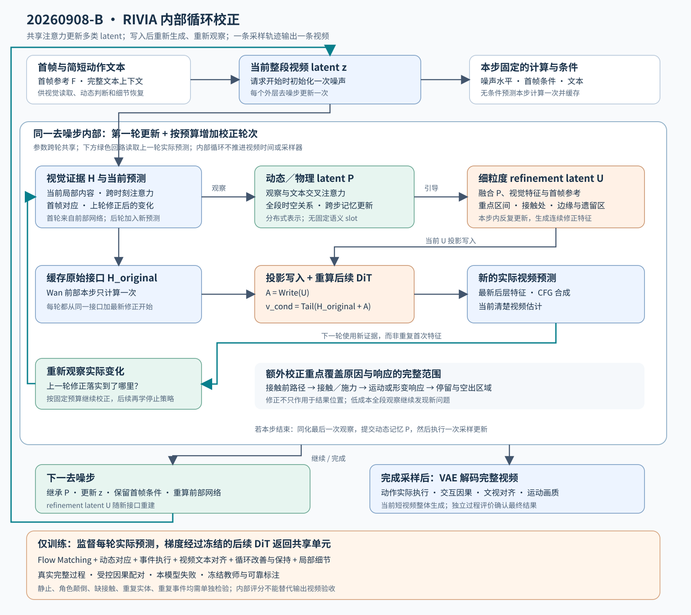
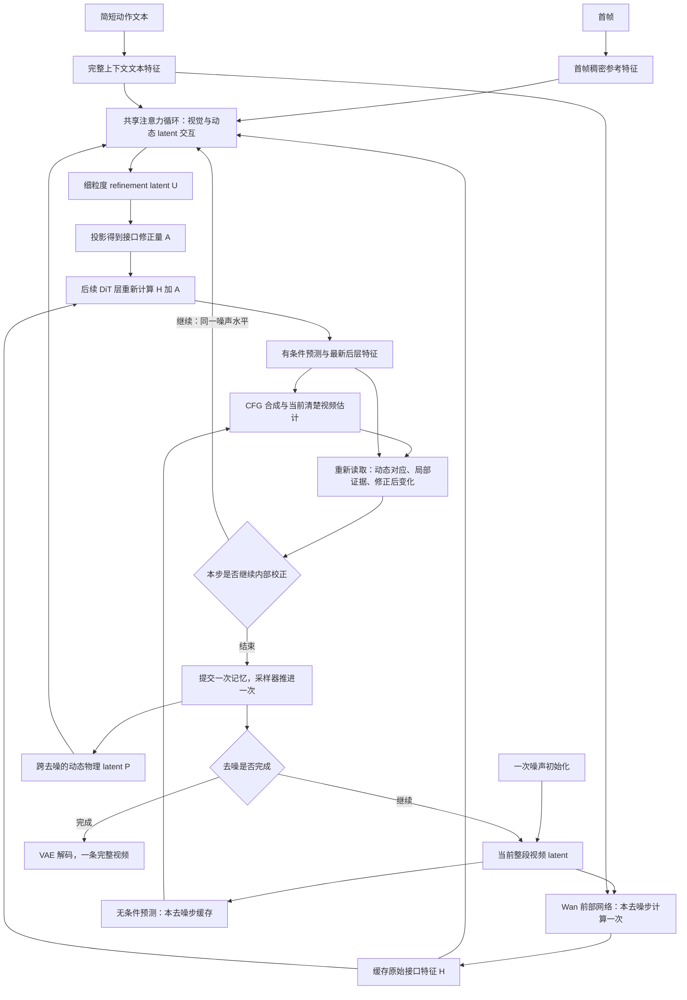
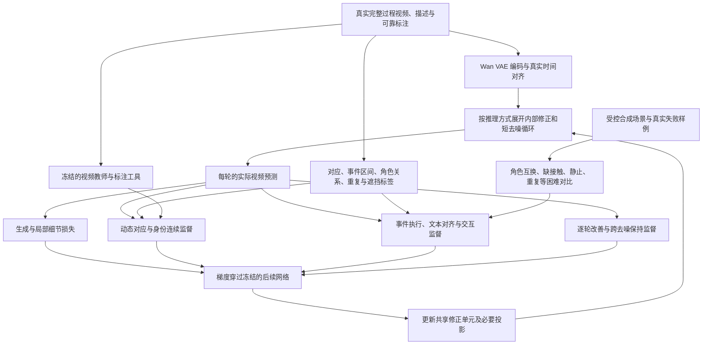
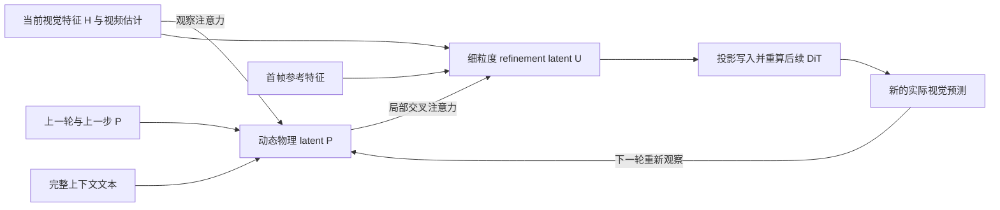

# 20260908-B-RIVIA：内部循环校正的完整流程、模块实现与训练设计

生成日期：2026-09-08；当日篇次：B（第二篇）。本文承接 [A 篇](20260908-A-RIVIA_StateBridge_后续方法设计流程与依据.md) 与 [9 月 5 日技术说明](TRACE_strong_stage_json_visual_diagnosis_and_next_plan_20260905.technical_archive.md)，根据本轮讨论重新设计核心结构。本文提出待实现、待验证的方法，不将预期效果表述为已经获得的结果。

## 1. 本轮确定的核心方向

**核心是：在同一条视频生成轨迹内部，共享一个可学习的循环修正单元；它观察当前生成内容，更新稠密时空记忆，修改视频特征，再根据修改后的实际预测继续校正。**

采用以下具体设计：

1. **内部采用交互的视觉、动态／物理和细粒度修正 latent。** 各类 latent 是稠密、连续、可学习的特征场，按任务职责分工；不把接触、速度、质量、进度等逐项安排为固定含义的 query 或 slot。
2. **循环发生在两个层次。** 每个去噪步骤继承前一步的记忆；选定步骤内允许共享模块执行额外修正，且每次修正后重新计算受影响的 DiT 后续层，重新观察更新后的预测。
3. **学习目标覆盖动作与过程。** Flow Matching 继续学习视频分布，另以动态对应、事件执行、细粒度文本对齐、身份连续性和循环改善监督，训练模块怎样修正。
4. **当前短视频整体生成，内部按事件与交互区域分配注意力和训练权重。** 长视频的分段生成放在短视频闭环有效之后，单独处理边界状态传递。

Reader、Corrector、Writer 可以作为解释职责的名称，工程上优先实现为一个采用双向跨 latent 注意力和时空注意力的共享 `RefinementCell`，配合必要投影。结构选择服从实际效果，不以必须保留三个独立模块为前提。

这里把用户所说的“各项同性”按身份、时空、材料、因果、文本及跨去噪的一致性理解；另外讨论合法坐标变换下的等变性。物理场景有重力、支撑和动作方向，不能对所有方向强加无条件的各向同性。

### 1.1 对 A 篇需要实质修改的地方

A 篇将内部表示过多地解释成对象字段，容易把方法推向手工状态机；本篇改为从视频特征中学习分布式状态。位置、接触、事件次数等可以出现在训练标注和评价工具里，但不要求生成网络逐字段维护它们。

A 篇把额外监督概括为一个 `L_state`，不足以说明模型为什么能够学到接触、因果与角色绑定。本篇把关键监督及其梯度去向分别展开，并要求损失作用到实际生成内容。损失数量由可验证的学习需求决定。

A 篇的跨步记忆保留，但进一步加入“写入后重算、重读”的内部回路。仅让记忆变化、视频预测不变，不能称为完成了一轮生成校正。

## 2. 按问题借鉴其他领域的方法

### 2.1 跨领域方法怎样落到本项目

以下论文用于选择具体机制，不把它们拼接成多个完整大模型。训练时可以借助离线教师，正式采样主要运行 Wan 与轻量循环单元。

| 要解决的问题 | 相关研究与领域 | 借鉴什么 | 在本项目中的改造与边界 |
|---|---|---|---|
| 怎样让细粒度运动信息进入现代视频主干 | [Wan-Move](https://arxiv.org/abs/2512.08765)，轨迹控制视频生成 | 将轨迹与首帧特征对齐成时空 latent 条件 | 借鉴条件在时空上的对齐；本项目还需自行预测和修正运动，并学习接触及角色关系 |
| 不同功能的 latent 怎样与视频特征交互 | [VideoJAM](https://arxiv.org/abs/2502.02492)，外观与运动联合生成；[PHANTOM](https://arxiv.org/abs/2604.08503)，潜在动态联合生成 | 让动态表示直接参与生成与训练 | 用轻量动态 latent 与细粒度修正 latent 交互，加入写入后重读的共享循环 |
| 遮挡与真实场景下怎样保持运动对应 | [CoTracker3](https://arxiv.org/abs/2410.11831)，视频跟踪 | 实视频伪标签、联合时序跟踪与可见性处理 | 离线产生可靠对应及遮挡标签；不能把伪标签错误当成物理事实 |
| 新观察如何持续修正内部世界表示 | [CUT3R](https://arxiv.org/abs/2501.12387)，持续三维感知 | 可学习持久状态随观察更新 | 借鉴状态更新思想，采用稠密时空记忆；当前生成中的重复观察不能冒充新增真实传感证据 |
| 计算深度如何增加而不复制一套参数 | [Recurrent Depth](https://arxiv.org/abs/2502.05171)，语言模型潜在推理 | 参数共享的内部重复计算 | 训练不同循环次数并检验收益；推理增加轮数不自动保证更好 |
| 如何从任务中学习修正方向 | [Learning to learn](https://arxiv.org/abs/1606.04474)，学习优化器 | 用展开后的任务损失训练更新规则 | 修正器学习从当前证据和历史变化提出残差；首版不依赖推理时外部评分器反向传播 |
| 为什么需要把表征学习与生成学习连接起来 | [REPA](https://arxiv.org/abs/2410.06940)，生成表征对齐 | 将去噪特征投影到可靠视觉表征 | 采用视频动态特征并关注交互区间；图像语义对齐本身不能证明因果正确 |
| 怎样学到比像素外观更丰富的过程表示 | [V-JEPA 2](https://arxiv.org/abs/2506.09985)，视频自监督与预测 | 视频上下文和未来的潜在表示学习 | 可作为离线动态教师；其特征仍需通过本文的角色、接触和事件测试校准 |
| 哪些局部区域值得再计算 | [MaskGIT](https://arxiv.org/abs/2202.04200)，迭代生成 | 根据当前结果分配后续细化 | 学习连续的时空修正分布；不直接把 Wan token 改成离散掩码生成，也不把置信度等同于物理正确性 |
| 循环为什么只在训练样本上有效 | [Self Forcing](https://arxiv.org/abs/2506.08009)，视频生成训练 | 训练时面对模型自身输出，缓解训练与推理不一致 | 在去噪与内部修正回路中使用自身预测；先采用短展开，不直接照搬其自回归模型与缓存 |
| 长视频运动控制怎样保持稳定开销 | [MotionStream](https://arxiv.org/abs/2511.01266)，交互式流式视频 | 运动条件、滑动时间上下文与自身生成展开训练 | 用于后续长视频版本；当前双向 Wan 不能不经训练直接套用其因果缓存 |
| 红球、蓝球都有，但谁撞谁错了 | [VideoCon](https://arxiv.org/abs/2311.10111)，视频语言对齐 | 实体、动作和事件顺序的困难对比描述 | 建立角色互换、缺接触、重复执行等对比监督；负例用于判别训练，不注入正向提示词 |
| 如何发现“只动一下”“重复两次”“顺序颠倒” | [TemporalBench](https://arxiv.org/abs/2410.10818)，细粒度视频理解 | 频次、幅度和事件顺序评价 | 构造过程级训练与验收；不能只看首末帧或整段平均相似度 |
| 画质目标与过程目标互相干扰怎么办 | [PCGrad](https://arxiv.org/abs/2001.06782)，多任务优化 | 检测并缓解任务梯度冲突 | 首先测共享参数上的梯度冲突；持续冲突时再采用梯度处理，并单独消融 |

其中，现代视频生成中的 latent 交互、参数共享的潜在循环、模型自身预测展开和过程对比监督构成首版主线。持续三维感知与自监督表征提供状态更新和监督思路；视频跟踪主要用于离线标签。模块取舍依据与 DiT 接口的适配、有效监督和计算预算，不以罗列论文数量或直接嵌入完整旧模型为目标。

### 2.2 “早期有物理信息，后期被破坏”应怎样使用

[Seeking Physics in Diffusion Noise](https://arxiv.org/abs/2603.14294) 在其测试的模型上发现，高噪声下的部分 DiT 中间特征已经包含可区分物理合理性的信息。这是“特征中存在预测信号”的证据，不能直接推出每条生成轨迹早期都形成了正确事件。

[PhaseLock](https://arxiv.org/abs/2606.06361) 研究少步与完整采样之间的运动退化，使用少步生成的 latent 变化指导完整生成。需要区分：它的两步采样使用单独的少步时间表，不能等同于常规 50 步采样中第 2 步的中间结果。本文拟保留的是同一轨迹中经校准、与任务一致的动态证据，而不是无条件复制某个早期视频。

因此，先在本地 Wan2.2-TI2V-5B 上测量不同层、噪声位置和内部修正轮数的动态表征与输出变化，再决定哪些阶段适合强修正、哪些可靠内容值得保留。DiT 网络层深度、去噪进度和视频时间分别记录。

Flow Matching 是学习分布与向量场的生成目标，原则上也能从视频分布中学习运动和物理相关性；不能把它定义为“只优化画质、绝对学不到物理”。本项目的实际问题是：短暂接触、细小施力区域、角色绑定与事件次数可能在平均生成损失中缺少足够的有效监督，因此需要额外学习信号。[Flow Matching 原论文](https://arxiv.org/abs/2210.02747)、[VideoJAM](https://arxiv.org/abs/2502.02492)

### 2.3 哪些内容已经有先例

[RIN](https://arxiv.org/abs/2212.11972) 已研究生成过程中的读写与跨步信息传递；[PHANTOM](https://arxiv.org/abs/2604.08503) 在 Wan2.2-TI2V 上联合生成视觉与潜在物理动态；[PILA](https://arxiv.org/abs/2606.04737) 使用物理属性表示与适配器修改 Flow Matching 向量场；[CoECT](https://arxiv.org/abs/2603.09094) 建模因果事件链；[Goal Force](https://arxiv.org/abs/2601.05848) 使用物理目标与合成因果原语训练生成。

因此，“加物理分支”“加状态”“加循环”“加物理损失”都不宜单独作为首次贡献。本文的拟创新集中在：**面向过程错误的稠密内部修正、修正后重新执行生成网络形成的真实反馈、按因果影响范围定位修正，以及可信动态在后续去噪中的保持。** 新颖性需要持续对照相关工作，效果需要实验建立。

## 3. 完整系统流程



[打开可放大的完整流程图](20260908-B-RIVIA_完整流程示意图.svg)。下方 Mermaid 图分别展开推理、训练与多 latent 交互，便于修改设计。

### 3.1 推理总图



图中的内部回路始终处理同一段视频。增加一轮校正不会在视频时间轴上再执行一次碰撞，也不会重新初始化噪声。完整视频的状态差异表现于视频时间轴；内部迭代用于改善同一段过程的预测。

### 3.2 训练总图



训练标注可以解释一个动作为什么错，但正式推理不要求用户输入这些标注，也不逐步调用外部大模型来判断。离线教师与最终独立评价工具具有不同职责，不能用参与优化的同一个分数证明方法有效。

## 4. 内部到底保存什么，修改什么

### 4.1 使用少量稠密张量，不建立语义 slot 清单

| 张量 | 含义与形状示意 | 更新方式 |
|---|---|---|
| 视频 latent `z` | Wan 当前整段视频压缩表示 | 由采样器在每个外层去噪步更新 |
| 接口特征 `H` | `[B,T,h,w,D]`，来自 Wan 指定层 | 每个去噪步重新计算；同一步内部循环中保留原始副本 |
| 动态／物理 latent `P`，也是循环记忆 `M` | `[B,T,hc,wc,dp]`，较粗空间网格、完整视频时间范围 | 通过当前视觉证据、文本及历史进行注意力更新；跨轮次和去噪步骤传递 |
| 细粒度 refinement latent `U` | `[B,T,h,w,du]`，对应细粒度写入网格 | 融合当前视觉、动态 latent 与上一轮真实变化，形成可修改的连续特征；本步内迭代 |
| 接口修正量 `A` | 将 `U` 投影回接口维度得到 | 每轮由更新后的 `U` 重新计算；下一去噪步重新建立 |
| 首帧参考 `F` | 首帧的稠密外观特征图 | 对当前请求固定，供对应与外观恢复使用 |

`P` 的第一个通道不预定义为位置，第二个通道不预定义为接触，也不存在“红球 query”“源液量 query”等固定语义槽位。不同类型的过程通过相同特征场、文本条件和训练数据学习。它被称为动态／物理 latent，是因为通过动态、交互和因果相关监督赋予其职责；该名称本身不证明它已经学到物理规律。

时空坐标仍然存在，因为模型需要知道修改发生在哪个视频时刻和哪个画面区域。坐标索引与人为规定状态语义是两回事。

训练期间允许用分割、轨迹或事件读出头探测特征，也允许标注中的对象 ID 用于配对和计数。它们服务于监督与诊断，不成为正式前向必须维护的实体账本。

### 4.2 这些 latent 为什么各有用处

视觉特征 `H` 保留基模型的画面表达能力；动态 latent `P` 以较低空间成本关联全段运动、施力与响应；refinement latent `U` 把这些变化落实到边缘、接触区域和遗留区域。三者通过双向信息传递联系起来：视觉证据更新动态判断，动态判断指导局部修正，修改后的新视觉证据再次更新动态判断。



首版将 motion 与 interaction 共置于 `P`，以监督和消融确认其作用。若运动路径清楚而交互仍错，再比较单独的 motion latent 与 interaction latent 是否能提供额外收益；不预先把每类信息都扩成一套大网络。

trajectory latent 可作为专项扩展：从文本、首帧和当前特征预测连续时空轨迹表示，用可靠点轨迹监督，并将首帧特征沿预测运动对齐。轨迹使用网格或数据驱动的表示，不预分配“第几个实体 query”。它主要帮助运动和身份对应，接触、施力与重复执行仍需事件监督。正式输入仍是首帧与简短文本，人工轨迹只作为额外条件对照。[Wan-Move](https://arxiv.org/abs/2512.08765)

### 4.3 三种索引必须分开

- `τ`：视频时间，描述动作的先后。
- `k`：外层去噪步骤，描述整段视频逐渐形成。
- `r`：同一去噪步内的校正轮数，描述对当前预测的重复改善。

记忆可以写成 `M[k,r,τ,x,y]`。沿 `τ` 表达球移动、书下落和液体转移；沿 `r` 与 `k` 改善这些变化的预测。把校正轮数当成事件发生次数，会直接产生用户担心的动作重做。

### 4.4 为什么采用特征接口修正

首版修正对象是一个确定层位置的 DiT 特征，而不是反复改提示词，也不是推理时优化模型权重。特征修正经过后续生成网络，能够共同改变位置、外观、遮挡和细节。

直接修改最终 latent 或速度预测可作为简化对照，成本低，但需要检验它是否增加局部伪影。首版保留后续 DiT 计算，让模块学习生成网络能够执行的修正方向。

把修改点前移并重算更多层，可以检验更大修改范围的效果与成本。固定修改点且输入相同时，完整重跑前部与使用其缓存应数值等价。正式原型优先缓存未被修改的前部网络，只重算受接口修改影响的后续部分；修改点之后的 attention 结果不能原样复用。

## 5. 共享循环单元怎样实现

### 5.1 第一步：读取当前结果及其变化

第一次校正读取当前接口特征、噪声条件和首帧参考；后续轮次增加最新的后层特征及当前清楚视频估计。读入的是本轮实际预测，不能每轮复用第一次预测。

首次没有当前清楚视频估计时，使用显式的来源／可用性标记，不能拿真实未来视频补齐输入。前部特征、后部特征与 latent 估计分别投影到统一维度，并加入来源和位置编码，使同一个注意力单元能够识别证据来自哪里。

建议将读取证据组织为四种计算，结果合并成一个连续特征场：

1. **当前局部特征。** 将接口或后层特征投影到较低通道，保留对象边界、姿态和局部材质信息。
2. **跨视频时间的对应。** 用位置编码下的时间注意力与多尺度跨帧注意力，捕捉位移、遮挡、重新出现和运动中的外观变化。
3. **首帧到当前过程的对应。** 用首帧特征辅助判断当前表面来自哪里，同时允许旋转后的新表面与合法形变出现。
4. **前一轮到本轮的变化。** 比较实际预测和特征的改变，让模块知道上一次修正引发了什么，而不是只知道上次输出了多大的残差。

粗尺度 `P` 保留全段上下文，细尺度注意力从当前画面和预测结果提取局部证据；采用分解式时空注意力或局部窗口与粗尺度全局交互，控制计算量。首帧参考以跨注意力提供外观对应，新显露区域由当前生成特征补充。具体时间跨度和空间窗口通过速度、遮挡和接触任务验证。

读取分支不直接接收“期望已经碰撞”等目标标签。完整文本在后面的修正计算中参与判断。由于 Wan 特征本身已受文本条件影响，仍需以实际解码标签校准读出，不能只凭接口分开就假定没有目标暗示。

### 5.2 第二步：用带记忆的更新学习修正方向

首版采用参数共享的多 latent Transformer 单元：观察交叉注意力更新 `P`，时空注意力与文本交互整理整段动态，refinement 交叉注意力生成 `U`，噪声条件化的残差门控制每轮更新幅度。

一个可实现的形式为：

```text
visual = EncodeEvidence(current_features, current_clean_estimate,
                        first_frame_features, previous_actual_change)
P_observed = P + ObserveCrossAttention(norm(P), visual)
P_context = TemporalSpatialAttention(P_observed, video_positions)
P_context = P_context + TextCrossAttention(norm(P_context), text_tokens)
P_next = P + LearnedResidualGate(noise_level, inner_iteration) * MLP(P_context)

U_visual = ProjectToFineGrid(current_features) + U_previous
U_next = RefineCrossAttention(U_visual, P_next, first_frame_features)
U_next = FineSpatialTemporalAttention(U_next, video_positions)
correction_features = U_next
```

注意力的查询来自实际网格位置上的 latent 特征，含义由学习形成，不预设接触、质量或某个对象等语义身份。更新门是残差幅度调节，不是手工事件开关。完整句子的上下文特征保留“红球撞向蓝球”中各词的关系，动作角色通过困难对比训练绑定到视频中的运动和交互证据。

这种单元借鉴循环优化器的思想：学习“在当前错误附近，怎样更新更有可能使最终结果变好”。首版不计算外部评价器的推理时梯度，训练中的展开损失负责把有效更新规则学进模块。

单步内 `P` 与 `U` 都继续供下一校正轮使用。跨去噪主要传递 `P`，`U` 依据新的视觉接口重建，避免上一噪声水平的细节残差直接累加到新特征上。显式输入噪声变化并使用归一化，不要求不同噪声水平的原始特征逐元素相等。

注意力的首版实现采用以下限制，避免多 latent 交互本身变成主要计算负担：`P` 的空间注意力在各视频时刻内计算，时间注意力沿时间维分解；`P` 读取视觉时先做匹配尺度的投影与按帧交互；细网格 `U` 在局部窗口中读取视觉和附近的 `P`，由多层时空交互传递较远信息。长距离或快速运动覆盖不足时，再增加少量跨帧稀疏采样。不能默认对 22,000 个视觉 token 和所有动态 token 做完整联合注意力。

实现上不同 latent 使用各自输入／输出投影，时空更新主体和跨轮参数共享。这里新增的是低通道注意力单元，不复制一条完整 5B 视频主干。联合训练要消融 `P` 和 `U` 的信息交换，确认两者实际承担动态理解和细粒度执行的分工，而不只是名称不同。

### 5.3 第三步：定位需要修正的时空范围

由修正特征预测连续的时空权重图。权重表示该处是否需要本轮修改，结合局部证据与整体事件上下文学习。

物理交互的重点区域必须覆盖**原因发生前的路径、接触或施力处、响应区域，以及动作结束后的结果**。例如网球提前飞走时，只编辑飞走后的球并不充分，还需要调整它与球拍接近和接触的区间。

修正范围还应包含物体刚离开的区域。书下落后桌面上出现第二本书，需要同时处理下落轨迹和原位置的错误占用。全图低成本观察仍保留，使局部模块能够发现原先未选中的错误。

首版先计算连续权重并进行软写入。训练用可靠的交互片段与修改必要性标签防止权重全部变成零；再加入适度的稀疏约束。真正的稀疏计算放在软写入有效之后，不能把乘一个稀疏 mask 就算作已经节省了计算。

### 5.4 第四步：写入并重新计算后续生成

将低通道 refinement latent 投影回接口维度，形成残差。`U` 已在循环中更新，本轮直接投影当前 `U`，避免把累计状态重复累加：

```text
A_next = WriteProjection(U_next) * spatial_temporal_weight
H_input = H_original + A_next
v_cond, new_tail_features = WanTail(H_input, noise_level, text_condition)
```

每轮后续网络都从 `H_original + A_next` 开始。不能把上一轮后续层的输出再次送入原来的同一层，假装它仍是该层输入；也不能只修改 `M` 后继续使用旧的 `v_cond`。

写入投影零初始化，训练后学习方向与幅度。零初始化只是让初始计算接近基模型，不保证训练后自动保持画质；轮廓、材质和背景仍需真实视频与局部细节监督。

### 5.5 第五步：重读实际效果，并决定下一轮

新预测通过本步已缓存的无条件预测进行 CFG 合成，再形成当前清楚视频估计。下一轮读取该估计及新的后层特征，获得上一轮修正的实际后果。

在采用 `z_sigma = (1-sigma) * z_clean + sigma * noise`、预测目标为 `noise - z_clean` 的约定时，清楚视频估计为 `z_sigma - sigma * v`。实现中必须以 Wan 实际采样器的时间与预测约定为准。

高噪声时的清楚视频估计可能不可靠，读取需结合噪声和可信度学习，监督也按可辨程度使用。首版固定轮数，不依赖未校准的“我已经修好了”分数提前停止；后续只有在停止策略能区分静止、错误动作与正确完成后，才启用自适应轮数。

完成本步最后一次观察后，提交一次跨步记忆，并让采样器推进一次。内层循环不推进采样器的多步历史。

## 6. 两层循环的精确调用顺序

以下为待实现的职责示意。一个 `RefinementCell` 内完成观察融合、记忆更新和修正提出；最终观察用于把最新证据纳入下一去噪步的记忆。

```python
z = initialize_noise_once(seed)
reference = encode_first_frame(first_frame)
text = encode_full_short_prompt(prompt)
memory = initialize_dense_memory(reference, z)

for k, timestep in enumerate(scheduler.timesteps):
    noise_level = scheduler_noise_level(timestep)
    # 当前 z、timestep 和条件不变时，前部与无条件结果可在内循环中复用。
    H_original, prefix_evidence = wan_prefix(z, timestep, text, first_frame)
    v_uncond = wan_unconditional(z, timestep, first_frame)

    refine_state = initialize_fine_refinement_latent(H_original)
    working_memory = memory
    evidence = make_initial_evidence(prefix_evidence, z, noise_level, reference)

    for r in range(num_refinement_rounds(k)):
        working_memory, refine_state = refinement_cell(
            evidence, working_memory, refine_state, text, reference, noise_level, r
        )
        correction = write_projection(refine_state)
        v_cond, tail_evidence = wan_tail(
            H_original + correction, timestep, text
        )
        v = v_uncond + cfg * (v_cond - v_uncond)
        clean_estimate = scheduler_clean_estimate(z, v, timestep)
        evidence = read_updated_prediction(
            tail_evidence, clean_estimate, reference, noise_level
        )

    memory = assimilate_final_observation(working_memory, evidence, noise_level)
    z = scheduler.step(v, timestep, z)
    z = preserve_first_frame_condition(z, first_frame)

video = vae.decode(z)
```

训练时保留对应计算图，并按短展开策略截断历史；推理时关闭梯度。前部缓存仅在当前去噪步内有效，因为下一步的 `z` 已经改变。无条件预测同样不能跨去噪步骤复用。

首版每步至少进行一次特征修正与后续生成，先比较 `1 / 2 / 3` 轮；完整采样稳定后，再只在校准出的重点噪声区间使用额外轮数。额外计算必须和等预算的更多采样步数、单轮较宽模块进行比较。

## 7. 各类失败怎样进入同一个循环

| 用户关注的问题 | 应该读到的实际证据 | 应该修改的内容与范围 | 监督重点 |
|---|---|---|---|
| 红球不动，蓝球自己移动 | 两球在各时刻的对应、相对运动与文本角色 | 红球接近路径、接触区间及两球响应，不能只增强蓝球运动 | 角色互换对比、接触前后运动、动作执行 |
| 两球没有碰上，却出现“碰撞结果” | 表面接近、是否存在接触、响应发生时间 | 在接触前形成可行路径，并联合调整接触后的变化 | 接触与响应联合监督、近失碰撞负例 |
| 球拍未接触，球已经飞走 | 球与拍面的相对位置、相对速度、交互前后轨迹 | 修正靠近、接触与离开整个区间 | 有接触／无接触对比、响应时序；文本要求挥拍时才额外要求拍运动 |
| 书掉下后，原位置出现第二本书 | 下落轨迹、首帧对应、原位置重新占用、实体数量变化 | 下落书与桌面原位置同时修正，恢复空出区域 | 跨时刻身份、重复实体负例、原位置去占用 |
| 一个事件执行两次 | 全段时间关系、重复出现的动作片段、结果是否稳定 | 联合修正第一次过程、重复起点与收尾，保持一次完整执行 | 事件次数、顺序、结束保持；自然连续反弹另行标注 |
| 物体不动却被当成成功 | 正确动作应出现的非零动态证据及中间过程缺失 | 建立从起因到结果的完整变化 | 静止困难负例、过程覆盖、文本条件下的变化范围 |
| 倒水只增加接收端，源端不变 | 容器姿态、出口、流束、源端与接收端的联合变化 | 同时修改来源、途中和去向 | 相对材料转移与出流前提，按可见范围监督 |
| 海绵只被提起，没有压缩恢复 | 手部接触、底部支撑和局部厚度变化 | 手与海绵的作用区间、受压区域及释放后的恢复 | 施力—形变—卸力—恢复，支持合法非刚体变化 |
| 运动主体碎块化、拖影 | 对应区域的纹理、边缘、刚离开区域与新显露区域 | 在过程正确的基础上修正局部特征及细节 | 真实运动重建、可见性加权对应、局部感知质量 |

这张表描述训练与诊断需要观察的内容，不是要求把每一列固化为生成网络中的一个 slot。相同的稠密特征场可以通过不同监督学到这些关系。

对每个例子，修改范围都可能跨越多个时刻、多个位置。内部“局部修正”应理解为针对相关时空区域，而不是只在单帧的小方框内编辑。

## 8. 怎样让网络学会修正，而不是只学会给自己打高分

### 8.1 首先明确梯度必须落到哪里

只监督 `M` 中某个读出头判断“发生了接触”，可能得到内部读数正确、视频仍未接触的结果。生成改善必须经过以下路径：

```text
实际视频预测的损失
    → 当前清楚 latent 或解码视频
    → 经过重算的 Wan 后续层
    → 接口修正量
    → 共享循环单元及其记忆更新
```

Wan 后续层可以冻结参数，但这一段不能整体放在 `no_grad` 中。冻结的可微教师也可以对输入传梯度，冻结权重不等于截断输入梯度。

首版采用两种互补的监督工具：

- 离线工具与人工标注给出真实视频和当前生成视频的可靠动态标签。
- 小型、经校准的冻结观察／对齐网络直接读取预测的清楚 latent 或解码片段，为生成输出提供可微监督。

该观察网络可以由视频教师蒸馏，但必须在真实视频和本模型的实际生成结果上校准，并且不接收循环记忆 `M` 或人工期望轨迹。独立最终评价另行进行。这样减少生成器和内部读出头相互配合、只提高内部得分的空间。

### 8.2 六组主要目标

```text
L_total = L_FM
        + lambda_dyn    * L_dynamic_correspondence
        + lambda_event  * L_event_execution
        + lambda_align  * L_video_text_alignment
        + lambda_loop   * L_recurrent_improvement
        + lambda_detail * L_local_detail
```

六组目标按训练阶段启用。具体任务的标注决定各组内部哪些项有效；未知或不可测内容不伪造真值。跨去噪保持放在循环目标中，接触、材料和事件次数放在事件目标中，避免为每一种现象另建一个完整损失体系。

### 8.3 生成目标：保留视频分布，增加关键区域的有效权重

`L_FM` 沿用 Wan 的实际 Flow Matching 定义，学习真实视频的生成目标。首帧条件区域按原协议处理。

常规生成损失监督模型的原始有条件预测；实际输出级辅助监督和观察校准需要覆盖正式使用的 CFG 设置。经过 CFG 的预测不应未经区分地当作标准 Flow Matching 原始预测来套用同一目标，训练与推理两条路径需分别记录。

采用全段生成损失，并增加交互区间与运动主体区域的加权项。例如，接触只有很少几帧，球拍只占画面小部分，训练采样和损失权重都应确保它们不会被大量背景 token 淹没。

权重优先来自可靠标注；由预测权重参与加权时，对权重停止梯度或加入独立监督，防止网络通过把困难区域权重降到零来减小损失。保留全图基础权重，避免只生成好接触点、破坏其他部分。

### 8.4 动态对应目标：学习同一内容怎样变化

`L_dynamic_correspondence` 包括可见性加权的对应学习、动态视频表征对齐与身份连续性监督。

对应标签来自轨迹、分割与局部匹配，训练生成特征把同一表面在不同时刻关联起来。遮挡与新显露区域采用有效性标记；反射不直接计为第二个实体；形变对象不套用整物刚体恒定约束。

动态表征使用时间窗口和跨帧关系，不能只对齐每帧的静态语义。可将当前预测的特征与真实视频教师的动态特征对齐，并用静止、时序打乱和错误运动片段作为困难对比。身份一致性需要同时检查错误新增对象，单独的正对应损失不能排除复制。

对于本来就存在多种可行运动的输入，配对生成训练使用对应真实视频；自由生成阶段优先监督关系和可行性，不强行把所有 seed 拉到一条人工指定轨迹上。

### 8.5 事件执行目标：防止静止、跳过接触和重复执行

`L_event_execution` 必须同时覆盖必要过程是否出现、先后关系是否成立、次数是否符合任务，以及结果是否保持。训练标注可包含事件区间和有序动作片段，但这些标签不进入运行时手工状态机。

实现时可在冻结输出观察网络的逐时特征上使用小型时间 Transformer，训练区间定位和过程分类头：区间用逐时分类与边界／重叠监督，执行完整性用正确过程与缺段过程的分类监督，重复执行用区间级次数或对比监督。它们是读取实际视频的训练工具，不能只从动态 latent `P` 的内部自报状态计算生成成功。

**防止静止解。** 同场景静止视频可能外观清楚、没有明显物理冲突，却不满足“撞击、下落、压缩、融化”等动作。训练中明确加入“画质好但动作没发生”的负例，与正确执行视频配对。对可靠动作片段监督必要的位移、形变或材料变化范围，不能把全画面运动幅度越大越好作为目标。

**防止只完成终态。** 在事件级别监督接近、作用、响应和结束的覆盖。可以使用时间定位头及区间匹配，使必要事件在正确顺序出现；评价还要回到连续视频，防止定位头仅凭末帧猜出前面发生了什么。

**防止虚假接触。** 对几何可靠的样例，在标注接触附近联合监督表面距离、相对运动及响应时间。二维重叠只提供候选证据，不能直接当成三维接触真值；含糊视角使用弱标签或排除精确几何损失。

**防止重复。** 用事件区间而不是单帧概率峰值统计发生次数，并训练“执行一次／重复执行”的对比。对于弹球的多次自然反弹或文本明确要求重复的动作，使用其真实结构，不能全局设置“所有事件只准一次”。

**材料与合法形变。** 依据可见证据监督源、流、接收端的联合变化，或书脊开合、海绵厚度与材料形态转换。具有标定的合成样例可使用质量、动量等明确约束；普通真实视频不能把投影面积和液位直接当成守恒量。

### 8.6 文本对齐目标：区分对象相同但动作不同的描述

使用同一视频对应的正确描述和困难错误描述。例如：

| 正确关系 | 困难对比关系 | 要迫使模型区分的内容 |
|---|---|---|
| 红球主动撞向原本静止的蓝球 | 蓝球主动撞向红球 | 谁启动、谁接收作用 |
| 球与拍面接触后改变轨迹 | 未接触拍面就改变轨迹 | 接触是否是轨迹变化的前提 |
| 同一本书落下，桌面原位置空出 | 一本书落下，桌上又保留另一本 | 身份与重复实体 |
| 完成一次下落并停留 | 下落完成后又出现一次下落 | 动作频次与结束 |
| 手压下海绵再放开 | 手接近后撤走，海绵没有变化 | 施力与实际响应 |

先把对齐网络训练成能够区分这些近似描述，再冻结或分阶段冻结，监督实际生成预测。一个基本的对比形式是：

```text
L_align = -log exp(score(video_prediction, correct_text) / temperature)
               / sum_texts exp(score(video_prediction, candidate_text) / temperature)
```

对齐分数必须依赖时间序列与相关交互区域，不能只比较平均池化的画面和句子。候选描述在措辞、长度和风格上保持平衡，避免模型根据负例句式猜答案。负例只用于训练与评价，不作为生成时的额外正向语义。

“动作先于结果”是因果的必要线索，尚不足以证明因果依赖。要进一步学习作用与响应之间的依赖，应加入受控的接触／擦过、施力／未施力、支撑／解除支撑等配对场景。来自真实视频的观察关系与来自受控干预的因果关系分别标明来源。

### 8.7 循环目标：训练每一轮怎样接着上一轮改

每一轮产生实际预测后，使用有效的生成与过程目标进行深监督，后轮权重可以更高。共享参数由整个展开过程训练，不能仅训练一轮后在推理时盲目重复很多次。

可额外加入允许容差的改善项：

```text
L_improve = mean_r relu(
    E(current_prediction_r)
    - stop_gradient(E(previous_prediction))
    - tolerance
)
```

其中 `E` 来自经校准的输出过程误差，按有效标注与噪声范围使用。已经正确的样本无需每轮继续改变；该项只是训练偏好，不构成严格单调收敛证明。必须同时保留绝对任务目标，防止所有轮次共同停留在一个“没有进一步变差”的错误解。

跨去噪保持使用类似原则：在早期或中期实际预测中，筛出与文本一致、具有真实动态证据且教师判断可靠的局部时空关系；后期对这些关系进行容差保持。比较的是归一化的动态表征与关系，不是不同噪声水平的原始 latent 值。

保持监督不能只看早期置信度：静止、蓝球主动运动和错误接触即使高置信也不能成为正确参照。训练期参照采用停止梯度，后期允许在发现更可靠证据后改变先前估计。正式推理主要由学到的记忆更新执行保持，不必携带一套逐项物理属性表。

### 8.8 局部细节目标：修正过程时继续保留自然画面

对运动边缘、接触区域、手指、玻璃和金属反光等位置使用真实视频的局部重建与感知监督，并检查物体离开区域的残影。局部窗口保留必要时间上下文，不能只监督单帧锐利度。

不在接触、破裂和快速形变区间统一惩罚加速度或高频变化，否则可能把真正的物理响应抹平。跨帧外观一致性要考虑运动对应、遮挡和新显露表面，自然运动模糊也不等同于错误。

首先检查真实视频的 VAE 重建。若细种子或手指在编解码阶段已经损失，继续堆叠循环模块不能恢复输入表示中不存在的信息，需要单独调整表示尺度或细节路径。

### 8.9 损失的启用与冲突处理

起步使用生成、动态对应和可靠的事件／对齐监督；循环展开稳定后增加逐轮改善与跨去噪保持。每一组先按有效元素数量和量纲归一化，再逐渐增加权重。

监测这些目标在共享修正参数上的梯度方向、输出运动质量和任务成功率。若物理过程改善持续伴随外观下降，先定位监督偏差、写入范围与权重；必要时对明确冲突的任务梯度采用 PCGrad 类处理。不能预先认为所有目标必然冲突，也不能把再加损失当作自动解决方案。

## 9. 完整状态变化与各项一致性怎样同时成立

### 9.1 “状态多样性”首先指动作内部真正发生变化

这里首先要求同一视频完整呈现必要的中间过程：球接近、接触、分离；书离开桌边、下落、触地、打开；海绵受压、形变、释放、恢复。静止、跳到终态、用两次不完整动作替代一次完整动作，都不能满足要求。

训练时将正确过程与四类近似样例区分：全程静止、只有启动、直接出现结果、重复但未完整完成。评价分别记录过程覆盖、正确动作范围与结束保持。正常的初始等待或结束静止允许存在，不强制每一帧都有明显运动。

跨 seed 的随机多样性是另一个问题：在必要因果关系成立的前提下，可以有不同接触时间、速度和形变细节。保留生成噪声与条件分布学习，不把所有成功视频强行压成同一条路径；也不靠额外抖动提高所谓多样性。

### 9.2 一致性约束落在对应计算上

| 一致性 | 主要机制 | 需要防止的错误约束 |
|---|---|---|
| 身份一致 | 首帧与跨时刻对应、重复实体监督、全段观察 | 用固定对象槽位假定不会复制 |
| 空间一致 | 稠密运动对应、边缘与遮挡处理、必要时的深度辅助 | 将二维重叠一律判成接触 |
| 时间一致 | 整段时间上下文、事件区间、循环后重新观察 | 将所有状态强制单调，或把多次反弹判成重复任务 |
| 材料一致 | 来源与结果的联合区域监督、合法形态变化 | 把可见面积变化当成精确质量变化 |
| 因果一致 | 作用—响应配对、近失接触与受控干预样例 | 只要先后顺序正确就宣称学会因果 |
| 文视一致 | 上下文文本与动态区域交互、角色和动作困难对比 | 用对象名词齐全或整段相似度替代动作对齐 |
| 跨去噪一致 | 噪声条件化记忆、可靠动态保持与实际输出复查 | 固定早期错误，或把高噪声原始特征当真值 |
| 外观一致 | 运动对应下的局部真实视频监督 | 为了稳定纹理冻结所有运动，或要求新显露表面和首帧完全一样 |

合法的水平镜像、平移和对象外观置换可用于增强：图像、文本方向和训练标签一起变换。重力场景不能任意上下翻转却保持同一物理描述；所有视频反放也不能一律标成物理错误，例如部分理想弹性运动可以时间反演。负例应针对真实违背的任务或条件。

## 10. 是否进行视频分段生成

### 10.1 当前约四秒任务：整体生成，内部细分处理

首版继续联合生成整段视频。碰撞前的路径和碰撞后的响应、书离开原位置与落地后的身份、源端和接收端的变化，需要共同修正。若先把视频切成互不相干的若干段，段内各自清楚也可能在边界处丢失动量、产生第二个对象或重做事件。

内部使用不同时间跨度的特征与训练窗口：粗尺度观察全段，细尺度处理接触、施力和形态变化区间。事件区间来自视频与训练标注中可变的过程，不固定为五段，不给每一段配置独立提示注入分支。

这种“整体生成、事件重点处理”不等同于逐段合成后拼接。它保留当前片段内部的联合修正能力。

### 10.2 长视频扩展：在稳定边界上进行带上下文的续写

当视频长度超过主干可处理范围，才增加分段续写，并满足以下条件：

1. 以合理事件边界或稳定区间划分，尽量不在接触瞬间、裂口扩展或源流交接处硬切。
2. 向下一段传递重叠视频上下文与压缩后的稠密记忆，让其能够恢复速度、材质与动作历史。
3. 保留已生成的重叠区域条件，并对新段的边界运动、身份和材料关系训练；不能只依赖像素淡入淡出。
4. 在训练中使用上一段的实际模型输出作为续写条件，检验累计误差和事件重放。

现有 I2V 接口不能仅通过传一帧就被视为完整多帧续写。需要增加多帧条件训练与相应掩码协议，再讨论可复用的时间注意力缓存。空间全局注意力或条件改变时，缓存是否有效也要逐项确认。

首版不采用分段生成来绕过四秒片段内仍未解决的动作问题。

## 11. 数据和训练怎样逐步落地

### 11.1 三类数据分别承担什么职责

| 数据 | 来源与构造 | 主要用途 |
|---|---|---|
| 完整真实过程 | 既定的 WISA-80K 与 OpenVid-1M 原始视频，筛选真实作用和清楚运动 | 生成、运动外观、时序对应、可观察事件监督 |
| 受控干预样例 | 小规模碰撞、支撑解除、施力与传递场景，记录改变的初始条件 | 接触／擦过、作用／无作用、角色改变的因果依赖；只对有依据的物理量用精确标签 |
| 本模型实际失败 | 保存生成中的特征与清楚视频估计，离线复核 | 校准观察网络、训练修正器面对实际错误、检查每轮改善 |

数据标签区分“画质”“物理可行性”“文本符合程度”和“动作是否完成”。例如两球安全地擦过可以是物理可行的，却不符合撞击任务；它应成为任务执行负例，而不应被错误标为违反所有物理规律。

同一场景的颜色、方向、施力角色与背景做平衡，避免网络记住“红色总是主动方”。受控数据和真实数据混合训练，并用独立真实场景检验迁移。

粗略启动规模可沿用 A 篇对应资料中的 500–1,000 条相关真实片段与 100–200 条重点人工复核安排；数量是起步建议，真正依据是关键过程覆盖与标签可靠性。受控样例数量由需要区分的因果变化决定，不用大量重复渲染代替变化覆盖。

### 11.2 训练阶段及每阶段必须获得的证据

| 阶段 | 训练或准备内容 | 必须回答的问题 |
|---|---|---|
| T0：测量可读信息 | 用本地模型提取不同层与噪声位置的特征；检查 VAE 重建和当前视频预测 | 哪些特征能读出真实动态，哪些看似物理信息只是画质或文本暗示？ |
| T1：建立可执行写入 | 单轮修正，冻结 Wan，训练投影与低通道单元 | 对可靠配对样例，修改能否落实到视频，且不破坏运动主体外观？ |
| T2：学习多轮改善 | 同一噪声水平展开 2–3 轮，逐轮重算后续网络并监督实际预测 | 新一轮是否利用了上轮真实后果，是否优于相同预算的单轮模型？ |
| T3：学习跨步记忆 | 从同一真实视频加噪表示展开少量去噪步，使用模型自己的更新结果 | 记忆是否减少漏执行、身份漂移和反复修改，完整采样中是否稳定？ |
| T4：过程与角色强化 | 加入真实失败、角色互换、缺接触、静止与重复执行的困难对比 | 任务改善是否来自完整正确过程，而不只是运动增加或内部评分提高？ |
| T5：保持与效率 | 加入可靠动态保持；评估重点区域与重点噪声区间的额外轮次 | 后期是否少破坏正确过程，计算预算是否用于有效修正？ |

阶段可以部分交替，但不能跳过关键证据。T1 写入无效时继续堆循环次数，只会重复无效修改；观察不可靠时启用自评停止，可能更早接受错误视频。

### 11.3 训练展开的可行方式

单步训练使用真实视频对应的加噪样本。内部多轮训练保持当前噪声水平不变，所有轮次的预测与同一参考过程对应。

跨去噪训练先展开 2–4 步；每一步使用当前模型生成的 latent 与记忆，末端通过清楚视频估计及过程监督训练。中间状态已经偏离理想线性加噪路径后，不能未经推导继续套用起始样本的固定速度标签。

自由生成失败可以用于观察校准和过程／文本监督。没有对应正确视频时，不将它与任意真实视频做逐像素配对。需要精确修正目标的早期实验，可使用受控场景或有明确配对关系的数据。

采用随机循环次数、短展开和截断反向传播控制开销。训练时保留至少一部分跨轮梯度，才能学习前一次更新如何帮助后一次；推理轮数先限制在训练覆盖范围内，额外轮数作为外推实验单独报告。

## 12. 与本地 Wan 的接口、计算量和工程可行性

### 12.1 本地接口与建议起点

本地 [TI2V-5B 配置](/home/liuzhirui/model/Wan2.2/wan/configs/wan_ti2v_5B.py) 的主干为 30 层、隐藏维度 3072，VAE 步幅为 `(4,16,16)`，DiT patch 为 `(1,2,2)`。本文沿用项目当前 1280×704、97 帧的评估协议，对应 `25×22×40 = 22,000` 个 DiT token。

原型的 `P` 可从 `[B,25,11,20,256]` 起步，`U` 从 `[B,25,22,40,128]` 起步，使用投影、跨 latent 注意力与分解式时空注意力。细节读取保留较高分辨率视觉特征，避免关键接触证据只经过粗网格。可先测试第 12 层之后的接口，并与较早／较晚位置比较；这些是实验起点，不能把其他模型上的层位置直接搬过来。

主干 [forward](/home/liuzhirui/model/Wan2.2/wan/modules/model.py:410) 逐层处理视频特征，适合在确定的层边界切分前部与后部。需保留原有时间调制、RoPE、文本条件、有效长度、padding 和首帧噪声掩码。训练入口应单独实现，不能直接沿用当前推理入口中的全程 `torch.no_grad()`。

### 12.2 内存估算

当前尺寸下，一份 bf16 接口特征约为：

```text
22,000 × 3,072 × 2 bytes ≈ 129 MiB
```

上述粗网格 256 通道 `P` 约 2.7 MiB，细网格 128 通道 `U` 约 5.4 MiB，两者合计约 8.1 MiB，不含梯度及注意力激活。主要训练内存仍来自冻结主干后续层的反向激活、多个修正轮次及视频解码。

因此优先缓存单个接口，修正量尽可能以低秩表示保存，后续层使用激活检查点，首轮在降低空间分辨率且保留完整动作时长的条件下验证。不能以“只训练小模块”推断整套训练只需要小显存。

### 12.3 内部重算的计算代价

设主干有 `L` 层，接口之前有 `L_pre` 层，后续有 `L-L_pre` 层，本步修正轮数为 `R`。忽略模块和解码开销时，本步有条件计算约为：

```text
L_pre + R × (L-L_pre)
```

CFG 的无条件计算仍约为 `L` 层，且在当前内部回路中只做一次。与普通 CFG 每步约 `2L` 层相比，额外成本来自 `(R-1) × (L-L_pre)`。

例如 `L=30、L_pre=12`，50 个去噪步中有 10 步采用 3 轮，其余 40 步采用 1 轮，额外后层计算约为普通 CFG 主干计算的 12%。如果全部步骤都做 3 轮，则约增加 60%。这些是按层数近似的估计，实际时间必须包含修正单元、特征读取、显存访问及必要解码。

推理的内部观察优先使用 latent 与中间特征；逐轮完整 VAE 解码作为调试与小规模校准，不能默认没有开销。只有观察网络校准通过后，才减少解码检查。

### 12.4 建议的代码职责

下列为后续实现位置建议，本文只生成设计文档：

| 职责 | 建议内容 |
|---|---|
| `features.py` | 多尺度视觉投影、位置编码、首帧参考与当前预测读取 |
| `refinement_cell.py` | 动态与 refinement latent 的共享注意力更新、文本交互、写入投影与权重 |
| `wan_interface.py` | 原生前后部切分、当前步骤缓存、后部重算、首帧与 CFG 协议 |
| `training_losses.py` | 六组目标、有效标签掩码、冻结教师的输入梯度 |
| `train_rollout.py` | 单轮、多轮、短去噪展开和历史梯度截断 |
| `evaluate_process.py` | 完整动作、角色、交互、重复、身份、画质及逐轮变化 |

首个工程检查应验证零写入时与原生前向数值一致；随后检查改变接口修正量确实改变后层预测、每轮重读使用新结果、无条件分支未写入记忆、每个外层步骤仅推进一次采样器。

## 13. 怎样证明循环真的解决了问题

### 13.1 方法对照

| 对照 | 要排除的替代解释 |
|---|---|
| 原生 Wan、单轮修正、共享多轮修正 | 改善是否只来自新增参数，还是来自内部迭代 |
| 多轮但始终读取首次预测、多轮重读实际新预测 | 是否真正需要修正后的反馈证据 |
| 仅视觉修正、加入动态 latent、再加入细粒度 refinement latent | 各类 latent 是否有独立作用，是否值得额外计算 |
| 只有跨去噪记忆、增加同一步内部回路 | 两类循环分别贡献什么 |
| 重置记忆、保留记忆、打乱记忆对应 | 记忆是否利用了历史，而非只是额外特征偏置 |
| 同预算更多采样步数、较宽单轮模型、共享多轮模型 | 改善是否仅来自更多计算 |
| 只有生成目标、加入动态目标、再加入事件与角色监督 | 运动增加是否足以解决因果与文本问题 |
| 全图写入、单主体写入、覆盖原因与响应的时空写入 | 重点范围是否选对，是否只是编辑结果位置 |
| 无保持、无条件保持早期内容、可信动态保持 | 是否真正保住正确过程，同时允许纠正早期错误 |

“不重读”的对照保留相近计算与相同参数，只替换进入修正单元的证据，避免把省掉后续网络的成本变化混成反馈收益。

### 13.2 过程级验收

至少分别报告：动作完成率、必要事件覆盖、文本角色准确性、接触／作用与响应对应、实体复制或消失、事件重复、运动主体细节及计算开销。联合成功要求任务必要项同时成立，不能用较高画质分数抵消未发生的动作。

对内部轮次和去噪步骤保存少量可视化：当前预测、关键区间连续帧、修正权重、误差变化及记忆消融。观察某次修正是否真正把球送到接触处、消除了桌上额外的书，以及是否引入新的外观问题。

内部改善分数与独立人工／视频评价分别报告。对同输入预先确定多个 seed，全部计入结果；任务、原视频与场景分组划分开发和测试，禁止相邻片段泄漏。

### 13.3 因果和角色泛化测试

重点测试在保持场景近似的情况下更换主动方、动作方向、接触条件和支撑条件。检查结果是否随真正改变的条件变化，而不是继续执行训练中最常见的颜色和位置模式。

颜色互换主要测试角色与外观解耦；接触／擦过测试交互依赖；同一对象一次／重复动作测试次数约束；不同视角和不同材质测试是否依赖表面捷径。对无充分标定的真实样例，以可观察过程为评价范围。

## 14. 拟创新点与进一步发散方向

### 14.1 首篇方法应聚焦的三项贡献

**一是面向生成结果的内部循环修正。** 同一个轻量单元在稠密时空特征上更新，通过后部重算得到新预测，再重读真实结果。要证明这种执行反馈比隐藏状态空转、一次性注入和同预算增加采样步数更有效。

**二是学习覆盖原因与结果的修正范围。** 重点不是找到“运动最大的区域”，而是从错误响应关联到前置路径、接触处、施力者和遗留区域。可以利用受控干预前后的差异学习影响范围，再在真实视频上校准。这是拟研究机制，需证明优于运动幅度图、单主体 mask 与全图修改。

**三是任务条件下的可信动态保持。** 将已经呈现且符合任务的运动与交互证据转为后续循环的保持监督，同时保留纠正错误早期结果的能力。需要与无条件早期特征保持、普通时序平滑和 PhaseLock 类先验方案区分。

三项贡献围绕同一问题：模型能否在生成过程中发现具体过程错误、实施有效修改，并让正确过程在后续细化中保留下来。不能以新增模块名称或损失数量本身作为创新。

### 14.2 有价值但应逐项验证的扩展

| 扩展思路 | 可借鉴的范式 | 可能解决的问题 | 首先要排除的风险 |
|---|---|---|---|
| 用训练时少量可微优化轨迹教修正器提出更新 | 学习优化器与更新蒸馏 | 学到更直接有效的修正方向，推理无需外部梯度 | 教师更新是否破坏画面、是否仅适用于训练场景 |
| 自适应分配额外轮数和细粒度计算 | 潜在循环推理、迭代生成 | 把预算集中到未解决的交互与身份问题 | 高置信错误提前停止、难例长期得不到预算 |
| 学习三维或多视角的辅助几何表示 | 持续三维感知与视频跟踪 | 区分二维重叠、真实接触、遮挡与反射 | 单目不确定性被误当成精确深度，增加过多训练负担 |
| 分离保持已有结构与改变错误结构的更新方向 | 多任务优化、表征对齐 | 降低晚期修正损伤正确运动的概率 | 假设特征空间天然存在精确的物理／外观正交分解 |
| 将时间窗口拓展为带稠密记忆的长视频续写 | 自身生成上下文训练 | 连续多事件和较长动作 | 分段边界失忆、事件重放与采样协议不匹配 |

首版选择可解释、可训练的有限轮展开。深平衡模型或“迭代到收敛”可以作为后续方向，但当前修正目标非凸、观察有噪声、事件又可能突变，不能预先假设存在可靠固定点。

### 14.3 实施先后

先完成“单轮写入能够改变正确位置”的小规模验证，再实现同一步内的真实重读回路，随后学习跨去噪记忆与过程监督。在接触、角色绑定、书的身份和事件重复上建立稳定改善后，再扩展材料、细粒子、长视频及自适应计算。

所有新增机制都应能回答两个问题：它改变了哪种实际错误；在相同输入和合理计算预算下，独立视频评价是否确认了改善。可行性由接口和训练路径支撑，创新性与最终效果由相关工作对照和这些实验共同建立。
