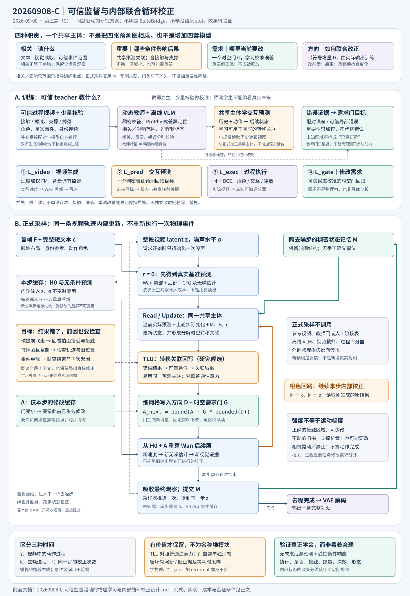
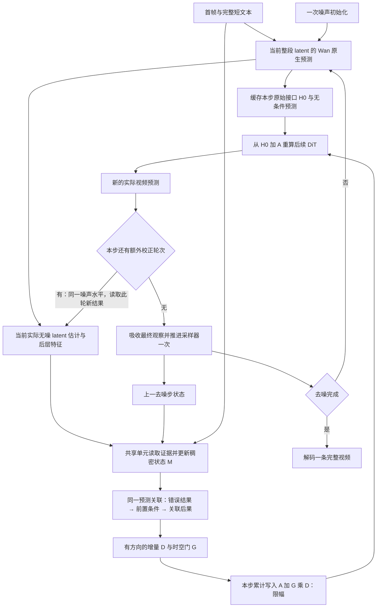

# 20260908-C：可信监督驱动的物理学习与内部循环校正设计

生成日期：2026-09-08；当日篇次：C（第三篇）。文献检索截至本日。本文是待实现、待验证的方法设计，不是已完成实验报告，也不预先宣称首次提出或效果领先。

承接 [A 篇](20260908-A-RIVIA_StateBridge_后续方法设计流程与依据.md)、[B 篇](20260908-B-RIVIA_内部循环校正_完整流程与训练设计.md)、[9 月 4 日方案](TRACE_v3_visual_audit_and_v4_statebridge_plan_20260904.md)、[9 月 5 日诊断](TRACE_strong_stage_json_visual_diagnosis_and_next_plan_20260905.md)及[技术说明](TRACE_strong_stage_json_visual_diagnosis_and_next_plan_20260905.technical_archive.md)。本篇按最新要求重新收敛；与旧篇冲突的设计，以本篇的取舍为准，旧文件不覆盖。

**监督来源的最终修订**：不要求大规模严格物理 GT。采用“可扩展的可信 teacher 信号为主、少量人工核验／受控 GT 为校准锚点”的方案。阅读用户建议的 [ProPhy v2](https://arxiv.org/abs/2512.05564v2) 后，纳入其任务相关区域监督思想，但不照搬整套专家结构。下文 `ref` 表示与当前训练样本有明确对应的参考，不自动等于物理真值；GT 专指真实配对或核实的标注。教师可靠性按信号与位置分别判断，不能一律设为 1。

**进一步收敛的主线**：把“与现象相关”“对后果重要”“当前需要改”“应该怎样改”分清，分别落实到读取、转移关联、门控和有方向回写；它们不是四套网络。新增结构只集中验证一个共享的关联校正机制，其他变化尽量放在已有训练视图、监督构造和采样策略中。

## 1. 先确定目标与最小方案

### 1.1 核心不是“生成一段看起来符合物理的视频”

需要建立的能力是：模型从真实过程、可信教师的动态／区域／过程信号、少量可验证的干预数据和自身生成错误中，学习动作条件下的状态转移；在生成内部利用这些信息，修正错误的作用关系、事件顺序、身份数量和运动形态。监督可为软目标或部分可靠的伪标签，不以“必须有完美标注”为前提。

“学到了物理”不能只用最终画质或一个物理合理性分数证明。至少要分别验证：

1. **预测能力**：不看真实未来，能否根据已见状态和动作预测后续交互与变化。
2. **条件敏感性**：在可观察条件发生受控改变时，后续响应是否随之改变；没有接触、没有支撑解除时，不能照搬原结果。
3. **生成中的实际利用**：干预或移除内部状态后，相关视频行为是否改变；内部读出正确而视频仍错，不算成功。
4. **过程完整性**：动作确实执行，角色、次数、身份与形态同时合理；静止、乱晃和重复执行不能替代任务完成。

单目真实视频通常不能唯一确定质量、摩擦、三维接触或外力。“学到了可迁移的交互与状态转移信息”是可检验的近期目标；“识别了完整物理定律／真实因果图”需要额外可辨识条件，不能直接等同。

### 1.2 推荐的最小架构：结构由问题决定，不由名称决定

**冻结的视频生成主干 + 一个共享的预测／循环校正单元 + 一个稠密时空写入门。**

该单元维护一份低维、分布式的时空状态记忆，读取最新实际预测，提出有方向的特征增量；门控决定哪里需要新增修改。写入后重新计算后续 DiT，下一轮读取新预测，而不是在隐藏状态里空转。共享单元内部重点验证一个问题驱动的新设计：**利用交互预测学到的转移关联，从错误结果回看前置条件，再检查受这些条件影响的其他位置，联合回写**，详见第 7 节。

不把 StateBridge、Reader–Writer–Corrector 或任何命名当作必须保留的结构。只借鉴其中有效的观点：非文本连续状态、共享计算、观察与写入的连接。下文统一称为 `SharedCell`；Read、Update、Write 只是职责划分，不是三套独立大网络。

**当前整合方案只设四项优化目标，上限不是必须凑满的数量：**

| 损失 | 唯一主要职责 | 为什么不能只靠其他项替代 |
|---|---|---|
| `L_video` | 事件区域适度加权的 Flow Matching | 学习可生成的视频分布、运动外观和写入方向 |
| `L_pred` | 可信参考过程的教师表征预测回归 | 使共享模块学习“给定前因，后续状态如何变化”，不只做画面编辑 |
| `L_exec` | 文本条件下完整过程是否正确执行的二元交叉熵 | 区分谁作用于谁、漏做、无因响应、复制、重放等过程错误 |
| `L_gate` | 参考误差／可信错误标签监督的时空修改需求回归 | 让门控学习“当前哪里确实需要改、需求有多强” |

不是把六项损失改名塞进四个括号。**本版不单设轨迹、身份、接触、事件计数、细节感知、循环单调改善或早期保持损失。** 相应问题优先通过可信过程数据、同一个预测任务、同一个过程判别任务及受限写入解决；做不到时先检查数据和监督是否有效，不自动恢复一长串约束。任何一项无独立收益就删去；更合适的监督可以替换现有项，但不超过四项。

同样，不承诺某个检索到的模块必须保留或永远排除。取舍标准是：**是否直接改变目标错误、是否适配主流程、是否有可靠监督、是否比更简单的对照值得其成本。** 本篇给出的是有优先级的可执行研究方案，不是按论文名预先选定的拼装清单。

### 1.3 对六个设计问题的直接回答

| 问题 | C 版决定 | 设计理由 |
|---|---|---|
| 人为把运动过程分成多阶段生成？ | **首版不做固定阶段分段生成**；保留可信事件区间与事件窗口采样 | 接触跨越阶段边界容易断裂；阶段钟不能保证动作完成，可能触发重放 |
| 多轮迭代生成？ | **做同一条生成轨迹内部的校正**；先比较 0、1、2 次额外校正 | 需要发现上一轮修改的实际后果；不额外生成多段视频再挑选 |
| Writer、Reader、Corrector？ | **保留职责，不强制独立模块** | 共享主体与小型投影足以先检验闭环是否有效 |
| 除 Flow Matching 外的监督？ | **增加三项，总数四项** | 分别解决物理相关预测、实际任务执行、修改强度学习 |
| 物理重点部分的强度约束？ | **做可信参考／教师监督的逐时空位置门控，同时保留背景监督** | 物理相关区域不等于运动最大的区域；正确的交互区域也不应被反复改写 |
| 建立 slot 语义清单？ | **不建立** | 不预设每个 query／通道代表速度、接触、对象或进度；实体标注只用于数据与评价 |

## 2. 从具体错误反推必须具备的能力

### 2.1 四个问题都重要，但不需要四个独立模型

| 要回答的问题 | 准确定义 | 主流程中的实现落点 | 监督与核验 | 是否新增独立网络 |
|---|---|---|---|---|
| **哪里与现象有关** | 哪些时空内容与当前文本事件有语义／视觉联系 | 原有文本—视觉读取注意力、事件窗口、低权重全场景上下文 | ProPhy 式差异定位或可信时间／区域标注 | 不新增相关性塔；教师图只在训练使用 |
| **哪里物理上重要** | 哪些条件、作用点或状态变化会影响任务后果；不等于面积大、动得快 | 同一共享单元的预测转移关联；把支撑、接触、源与接收端及空出区域联合起来 | 无未来泄漏的交互预测、受控条件变化、有限的遮蔽敏感性核验 | 不新增重要性预测器或物理定律分类器 |
| **哪里当前需要改** | 当前预测相对可信过程证据是否错误，错误需求有多大 | 逐时空位置 `G`，读取当前预测、已有状态与真实修改后果 | 配对参考误差／有定位证据的教师错误软标签 | 只保留已有的小门头 |
| **如何改正** | 哪些特征应沿什么方向改变，才能使前因和后果共同正确 | 关联路由后的带符号增量 `D`，写入并重跑 Wan 后部 | 实际输出上的 `L_video`、`L_exec`；下一轮看实际结果 | 只保留已有的小写入头 |

“重要”是**任务条件下的过程影响**，不是可直接从图像读出的力或能量。球拍接触的一小片区域、静止的支撑边缘，都可能比大面积运动背景更重要；蓝球的响应也很重要，因为它承载任务结果。重要性应覆盖前因与后果，不只找最显眼的结果。

这四种职责不做成四张必须相乘的预测图。若把 `相关 × 重要 × 错误` 作为硬开关，一次定位漏检就会让必要修改永远进不来。C 版保留全局读取和背景修正通道；相关／重要信息指导观察、关联和训练重点，**实际写入仍只由一个需求门乘一个有方向增量完成**。

`relevance_ref`、`impact_ref` 等下文记号是离线监督的不同证据来源，不是增加固定语义的 query／slot，也不新增持久 latent。推理时没有一个教师先替模型算好这些答案。

### 2.2 实际错误与最小干预路径

| 实际问题 | 缺少的能力 | 最小方案怎样介入 | 不能用什么替代验收 |
|---|---|---|---|
| 红球应撞蓝球，结果红球不动、蓝球自己动 | 动作角色绑定、作用前提与响应关联 | 状态预测用接近—交互—响应过程；文本角色互换作为过程负例；联合改两球及中间路径 | 两种颜色都出现、蓝球动了 |
| 球拍未碰球，球已经飞走 | 交互时序与条件依赖 | 同时读取接近段、拍面与离开段；接触／擦过干预对形成监督 | 单帧二维重叠、最终球在远处 |
| 书落下后原位置又出现一本 | 跨时刻身份与空出区域的状态变化 | 状态记忆保留整个过程；门控监督覆盖下落书和桌面旧位置；复制作为过程负例 | 只跟踪成功落下的那一本 |
| 动作执行两次且都不完整 | 全段事件次数与终态保持 | 全段时间位置、含结束区间的参考视频、重复过程负例；循环轮数与视频时间分离 | 只看一次局部动作、平均运动量 |
| 物体一直不动却被判完成 | 动作条件下必要变化的预测 | 参考视频包含连续中间过程；静止视频配碰撞文本标为执行失败 | “没有违反守恒，所以合理” |
| 液体只有接收端增加，来源不减少 | 关联区域的联动状态变化 | 同一时空记忆覆盖源、途中和接收端；成对过程样本及错误负例 | 单独看接收容器是否变满 |
| 运动主体变形、碎块化、手部异常 | 动态与外观协同、修正幅度控制 | 可信运动视频的 `L_video`、细网格写入、首帧参考、校准门控与残差上界 | 只提高动作完成率而忽略主体质量 |
| 后期画质变好、正确动作丢失 | 跨去噪保持与重新纠偏 | 跨步记忆；训练覆盖中后期的实际退化；仍用同四项目标训练 | 无条件锁死早期预测 |

“背景不需要物理”应改成“背景通常不需要额外改写”。桌面支撑、墙面阻挡、物体移走后的旧位置、液面和阴影变化都可能是事件的一部分。不能只对运动前景开放门控，也不能把背景永久排除在观察之外。

### 2.3 用书下落的例子检查职责有没有真正分开

- **相关性**找到书、桌面、下落段；不能只看到“书”这个名词。
- **过程重要性**保留支撑解除、书的连续移动、原位置空出与落地结果之间的联系。
- **当前修改需求**可能只出现在桌面多出一本书处；已经正确的下落轨迹无需再加大运动。
- **修改方向**应消除重复实例并补全合理的露出背景，而不是让两本书一起消失；若下落也缺少起因，则联合修正越过桌边的前段。

训练与评价必须同时包含“全部正确”“只错结果”“前因和结果都错”“与现象无关处有伪影”四类情况，否则门很容易退化为看到书就改、看到运动就加强。这里是采样覆盖，不是四个固定事件 slot。

## 3. 本轮跨领域检索：借鉴机制，而不是堆模型

### 3.1 与具体设计决策有关的研究

以下来自论文原文或作者官方资源。表中“本项目采用”是我们的设计推论，不代表原论文已经验证了本项目的组合。

| 要解决的问题 | 研究与领域 | 值得借鉴的小机制 | C 版取舍与边界 |
|---|---|---|---|
| GT 怎样提供有空间落点的动态表征 | [V-JEPA 2.1](https://arxiv.org/abs/2603.14482)，视频自监督 | 稠密时空特征及预测学习；官方提供较小蒸馏模型 | 作为冻结训练教师的候选，先校准接触、复制、顺序敏感性；不视为物理真值 |
| 预测监督怎样进入真正执行任务的网络 | [JEPA-WAM](https://arxiv.org/abs/2608.09381)，机器人策略 | 稠密当前—未来联合目标，预测与执行共享主体 | 让预测任务训练同一个 `SharedCell`，不另建只在辅助任务上工作的物理塔 |
| 如何防止“预测未来”变成偷看未来 | [VLA-JEPA](https://arxiv.org/abs/2602.10098)，视觉语言动作学习 | 学生只见当前／历史，未来只作监督目标 | 专门建立无未来泄漏的预测训练视图；不把机器人动作头搬进视频模型 |
| 如何利用新证据更新已有状态 | [CUT3R](https://arxiv.org/abs/2501.12387)，连续三维感知 | 持久状态随观察进行注意力更新 | 借鉴状态融合；我们的新预测不是真实传感器的新观测，不能当成独立证据累积置信度 |
| 参数不变时如何增加内部计算 | [Recurrent Depth](https://arxiv.org/abs/2502.05171)，语言模型潜在推理；[RIN](https://arxiv.org/abs/2212.11972)，迭代生成 | 跨迭代参数共享、紧凑 latent 与输入交互 | 复用同一单元；必须重算视频并检验等计算预算收益 |
| 简单门控能否代替复杂控制器 | [Gated Attention](https://arxiv.org/abs/2505.06708)，语言模型注意力 | 在注意力输出附近使用输入相关门控 | 借鉴低成本门控位置；本文门表示可信监督校准的修改需求，不声称语言模型结论直接证明视频物理收益 |
| 模块为何不会修正自己生成的错误 | [SOAR](https://arxiv.org/abs/2604.12617)，图像扩散后训练 | 用模型短 rollout 得到偏离状态，并以明确目标训练回正 | 采用局部、可配对的错误状态训练；不能对任意自由生成视频强配一个 GT |
| 已生成内容能否继续改 | [ProSeCo](https://arxiv.org/abs/2602.11590)，离散掩码扩散 | 用自身输出训练纠错，允许迭代修改既有预测 | 借鉴训练分布，不移植离散 token 解码或重掩码协议 |
| 如何学动作、角色、次数和顺序 | [VideoComp](https://arxiv.org/abs/2504.03970)，视频文本组合对齐 | 细微动作／顺序扰动与连续多事件负例 | 用于同一个过程执行判别任务；不采用其全部分层损失 |
| 观察训练与生成时历史分布不一致 | [Self Forcing](https://arxiv.org/abs/2506.08009)，自回归视频 | 训练时面对自身生成的上下文 | 借鉴短展开，首版不改 Wan 为自回归模型，也不直接套用 KV 缓存 |
| 长期身份与场景记忆怎么保留 | [WorldMem](https://arxiv.org/abs/2504.12369)，世界模拟 | 带时间／状态信息的历史记忆检索 | 说明不能只记外观而忘记何时出现；短视频首版不额外增加历史帧数据库 |
| 稀疏关注是否真的能减少计算 | [VSA](https://arxiv.org/abs/2505.13389)，视频稀疏注意力 | 可训练的选择与实际稀疏执行 | 首版只用分解式／局部注意力；软门乘法不冒充稀疏加速 |

本轮新增检索覆盖视频表征、机器人策略、语言模型门控与循环推理、图像扩散纠错、离散扩散、组合视频理解和高效注意力。旧论文若提供必要的基础机制可以引用，但不直接把旧式光流更新网络嵌入现代 DiT；**本方案不使用 RAFT。**

### 3.2 必须正面对照的接近工作

| 工作 | 已经做了什么 | C 版不能重复认领什么；拟验证的差别 |
|---|---|---|
| [VideoREPA](https://arxiv.org/abs/2505.23656) | 用视频教师的 token 关系对齐生成特征 | “用教师学物理表征”不新；需证明预测式共享状态和可执行循环的增益 |
| [PHANTOM](https://arxiv.org/abs/2604.08503) | 联合建模视觉与潜在物理动态 | “加一个 physics latent”不新；本篇不复制双生成大分支 |
| [PhysisForcing](https://arxiv.org/abs/2606.28128)，2026-06-26 | 重点区域中的点轨迹与语义关系监督 | “物理重点区域 + 表征约束”不新；必须比较预测学习和动态错误门控是否有额外价值 |
| [CAER](https://arxiv.org/abs/2608.30897)，2026-08-31 | 用动作／无动作预测差异分配监督权重 | “重要区域加权”不新；本文区分事件相关性与当前修改需求，重点是可学习更新而非只重加权 |
| [OMR](https://arxiv.org/abs/2608.29904)，2026-08-30 | 用冻结世界模型的反馈梯度修改单条采样轨迹 | “单轨迹世界模型反馈”不新；本文把更新规律学进共享模块，正式采样不运行外部世界模型反向传播 |
| [WorldForge](https://arxiv.org/abs/2509.15130) | 去噪步内递归细化、门控融合和纠偏 | “步内循环 + gate”不新；不采用其光流融合路线，研究 GT 监督、角色与过程错误的内部校正 |
| [VideoRepair](https://arxiv.org/abs/2411.15115) | 检测文本错配并局部修复视频 | “发现错配再局部改”不新；本文不依赖推理时 MLLM 外部诊断，且需要内部表征学习证据 |

CAER 原文明确区分了模型条件预测差与严格干预量：带噪未来本身可能已经携带动作结果。因而本篇也不把“删掉动作文本后特征变了”直接称为识别了因果关系。[CAER 方法说明](https://arxiv.org/html/2608.30897v1)

### 3.3 ProPhy：有价值的是哪些部分

核对的是用户链接当前对应的 v2（2026-04-12），不是只依据早期摘要。它使用视频级语义专家与 token 级细化专家；以 WISA 类别作粗对齐，用 Qwen2.5-VL-32B 对视频提问，提取相关文本到视觉 token 的注意力，再减去通用提问的响应，得到局部伪监督。细化路由经小投影对齐这些目标，并配合负载均衡；连同扩散目标共四项。作者也指出区域标注有噪声，类别定位仍不能充分表达深层物理规律。[ProPhy 方法、实验设置与局限](https://arxiv.org/html/2512.05564v2)

对我们的判断是：**有用，主要改进监督构造与局部响应学习，不必因此改成整套 MoE。**

| 可借鉴部分 | 在本 pipeline 中的具体落点 | 不照搬的部分与理由 |
|---|---|---|
| 任务相关提问与通用提问的差异定位 | 为事件窗口采样、`L_video` 与 `L_gate` 的重点权重提供软参考 | 不把注意力图直接当“错误图”“施力强度”或精确接触标签 |
| 学生通过小投影接收教师信息 | 保留 `L_pred` 的小读出头与门头，让共享 latent 有自身表达空间 | 不强制所有内部 attention 等于 VLM attention，不新增另一项对齐损失 |
| 不同位置需要不同物理响应 | 细网格写入与逐时空位置门控 | 不以整个视频的类别决定全图同一强度 |
| 专家分工 | 若刚体／柔体等出现可测的负迁移，可比较小型条件写入基替换单一写入头 | 首版不同时加入大物理分支、类别路由与平衡损失；新分工需证明比同参数共享头更有效 |

任务提问集合是离线采集教师证据的方法，不是生成模型必须维护的一套语义 slot。具体问什么可由输入任务与观察证据决定，不需要预定义每个潜在通道的物理含义。

ProPhy 式定位能缓解“监督落点太粗”，但它不自动解决角色反转、无因响应、数量和次数错误。C 版仍需要预测学习与过程执行监督；也不能把已有的教师定位蒸馏认领为本方法新颖性。

### 3.4 围绕“重要性、修改位置与修改方向”的补充检索

| 研究与领域 | 对应的问题与可借鉴之处 | 具体取舍 |
|---|---|---|
| [Causal-JEPA v2](https://arxiv.org/html/2602.11389v2)，关系预测／机器人控制 | 只做未来预测仍可能沿用对象自己的历史；有结构地遮蔽部分历史，促使模型使用交互信息 | 借鉴训练视图，不移植其 Slot Attention 或固定对象数；我们的稠密区域适配须另验证，不能照搬其对象级结论 |
| [CDL](https://arxiv.org/abs/2206.13452)，强化学习状态抽象 | 动态依赖比表面共现更有助于选择有用状态 | 借鉴“以预测后果检验重要性”；不建立手工状态变量表，也不加入 RL 奖励模型和因果图发现损失 |
| [CWM](https://arxiv.org/abs/2306.01828) 与 [ECCV 2024 的物理动态研究](https://www.ecva.net/papers/eccv_2024/papers_ECCV/papers/03523.pdf)，通用视觉预测 | 通过结构化遮蔽与预测响应探查输入影响，同一个预测器可承担多种读取 | 只借鉴有限的预测扰动检查；不搬其光流提取流程，不在每轮生成中逐区域做昂贵反事实搜索 |
| [Energy-Based Transformers](https://arxiv.org/abs/2507.02092)，语言／视觉迭代推断 | 输入与候选输出的兼容性可以驱动反复修正 | 借鉴“修正必须基于候选输出”；首版不再训练独立能量网络或做推理时能量梯度优化，现有过程监督和共享前向更新已经承担这两个职责 |
| [Transformer Interpretability Beyond Attention Visualization](https://openaccess.thecvf.com/content/CVPR2021/html/Chefer_Transformer_Interpretability_Beyond_Attention_Visualization_CVPR_2021_paper.html)，模型解释 | 原始 attention 与启发式传播不能自动当作可靠归因 | 作为 TLU 的边界提醒：不用漂亮热图代替有效干预；也不把本方案的关联回传说成首次提出 attention 归因 |

其中旧研究提供的是仍有用的概念与验证方式，不是要求采用旧式生成 backbone。最新方法也不因年份新就直接入选。**当前只把交互预测视图和关联联合回写纳入同一个共享主体；其余用于监督校准、设计边界或候选对照，不增加并行大分支。**

## 4. 完整流程图与计算边界



[打开可缩放 SVG](20260908-C-可信监督与内部循环校正完整流程.svg)。上半部为训练监督，下半部为正式采样；参考视频、教师与过程评分器都不进入正式采样回路。

SVG 保留可编辑的中文文字，使用系统中文字体回退；若显示为方框，需要在查看环境提供中文字体。已检查文件结构、链接和估算文字边界；当前服务器缺少中文字体，预览只用于布局检查，不宣称完成中文字体渲染终检。



图中累计的 `A` 是同一个去噪步的特征修改缓存。下一去噪步重建 `A`，只跨步传递 `M`。不能把不同噪声坐标下的写入残差直接相加。

## 5. 内部表示：保留什么，删掉什么

### 5.1 只保留一份学习型状态记忆

| 表示 | 作用 | 是否持久更新 |
|---|---|---|
| `z`：原生视频 latent | 由 Wan 与采样器生成完整视频 | 每个外层去噪步更新 |
| `H0`：选定层的原始视觉特征 | 保留基模型表达，作为本步所有写入的共同起点 | 同一步内缓存，跨步失效 |
| `M`：低维稠密时空记忆 | 保存任务相关的动态、关联、历史修正与状态转移线索 | 跨内轮与去噪步更新 |
| `F`：首帧稠密参考 | 提供起始身份、外观与布局参照 | 对当前请求固定 |
| `A`：本步累计特征残差 | 保留已经生效的修正，使小门控不撤销此前修改 | 只在本步累计，跨步清零 |
| 临时细网格特征 | 从当前视觉、`M` 与 `F` 产生写入方向及门 | 每轮重算，不另建独立循环分支 |

相对 B 篇，删除独立的 refinement 循环网络和预留的多套 motion／trajectory／interaction latent。`M` 内可以分布式编码这些信息，但不要求各占一个分支。细粒度执行仍由高分辨率视觉接口与小型写入头完成。

`M[τ,x,y,:]` 中的坐标表示视频的时空位置，通道意义由训练形成。没有“质量 q”“接触 q”“第一个物体 slot”之类预定义槽位，也没有手写事件进度表。训练数据中的对象 ID、接触区间和数量标注不等于模型的 slot 清单。

### 5.2 因果相关信息如何高效存在 latent 中

不要试图把一条语言因果链压成一句“已经接触”的标签。要让状态表征在训练中反复承担这些任务：从接近段预测交互后的局部变化；从支撑解除预测下落与旧位置空出；在动作条件改变时预测不同后果。

采用三种结构性安排，不额外增加损失：

1. **空间压缩、时间保留。** `M` 用较粗空间网格，但保留完整 latent 时间轴；不把全段平均成一个向量，否则接触先后与重复次数容易消失。
2. **关联靠注意力学习。** 先做逐帧空间注意力，再做时间注意力，并在细网格读写时关联当前视觉。跨区域关系由共享注意力表达，不显式维护每对物体一条图边。
3. **预测与校正共享权重。** 从可信参考的历史预测后果的网络，与生成时产生修正的网络使用同一时空更新主体；预测读出头很小，且其输入不得绕过 `M`。写入头必须读取 `M`，通过移除／打乱 `M` 检查生成是否真正依赖它。

首版不显式存储全时空 `N×N` 关系矩阵。记忆保存可重新计算关系的分布式特征；关系注意力按帧／时间分解。高分辨率外观主要留在 `H0` 和当前视觉证据，不迫使低维记忆同时复现全部纹理。

这是一种工程上紧凑的表示方式，不是证明 latent 已经识别了真实因果变量。真正的证据仍来自无泄漏预测、受控条件测试与生成干预。

### 5.3 首帧参考不能成为旧物体复制器

`F` 提供可检索的表面与起始布局，不逐帧复制首帧特征到原位置。书移走后，当前证据和时间状态应支持“原处已经空出”；新显露的书页、旋转后的表面、液体与合法形变不能被强行拉回首帧形状。

不引入全视频像素恒等约束。身份保持与物体状态不变是两回事，前者要保留，后者可能正是任务需要改变的内容。

## 6. 内部多轮校正：到底读什么，改什么

### 6.1 第零次观察必须来自当前实际预测

每个去噪步先运行一次原生条件前向，得到基准速度预测与后层特征，再形成当前无噪 latent 估计。这里的“无噪”指预测的 clean latent，不意味着其内容已经正确。第零次观察的计算计入成本；首次写入也要依据这个实际输出。

读取输入包括：当前后层视觉特征、无噪 latent 估计、与上轮预测的实际变化、首帧参考、噪声水平和历史 `M`。不同来源分别小投影后加来源／时空编码。

短文本保留完整上下文，通过原生 T5 路径和共享单元的文本注意力提供动作条件。观察特征不是 GT 状态；尤其 Wan 特征本身受文本影响，不能把其中“可读出碰撞”当成已经发生碰撞。

### 6.2 一个主体、两个小输出头

```text
evidence = Read(current_tail_features, current_clean_estimate,
                actual_change_since_previous_round, first_frame_reference)

M_next, links = SharedTemporalSpatialCell(M, evidence, text, noise_level, positions)
hint = TransitionLinkedUpdate(links, evidence, M_next)
fine = LocalCrossAttention(current_fine_visual, M_next, hint, first_frame_reference)

D = WriteProjection(fine)             # 有正负方向的特征增量
G = sigmoid(GateHead(fine, evidence, noise_level))  # 每个时空位置一个修改需求
```

`GateHead` 可用逐点 MLP 加小型时空卷积；其时间上下文已经由共享单元提供。首版不增加一个独立的 error predictor，再增加另一个 gate predictor。可信参考误差／校准后的教师错误证据直接监督这个门。

`G` 是 `[B,T,h,w,1]`，而不是整段一个标量，也不是每种物理属性一个 gate。空间较细以覆盖球拍边缘、运动轮廓和旧位置；共享状态较粗以承担关联推理。首帧条件位置强制不写入。

**记忆更新不由同一个写入门关闭。** 当前预测已经正确、`G` 较小，也仍需把接触或空出区域的证据写进 `M`。否则“停止修改”会错误地变成“停止记忆”。

### 6.3 门控控制新增量，不能撤销已生效的修正

对当前噪声步的第 `r` 次额外校正，定义：

```text
D_bounded = clip_token_rms(D, update_budget_from_H0)
A[r+1] = clip_token_rms(A[r] + G[r] * D_bounded, total_budget_from_H0)
H_input = H0 + A[r+1]
v_cond[r+1], features[r+1] = WanTail(H_input, timestep, text)
```

其中 `A[0]=0`；`clip_token_rms` 对 token 的通道向量做幅度上界限制，而不是裁掉负方向。预算相对 `stop_gradient(RMS(H0))` 设定，避免门控可以被写入头任意放大抵消；写入头从零初始化开始。

若使用 `H0 + G[r] × 新残差` 直接替换全部旧修改，修好后的 `G→0` 反而可能撤回正确结果。本篇采用**有界增量累计**解决这个问题。增量可以为负，因此也能撤销上轮错误修改；不能只允许单向增加“物理强度”。

限幅只限制干预规模，不保证更新方向正确，更不是优化收敛证明。方向由 `L_video` 和实际输出上的 `L_exec` 学习；校正器需见过有效更新及失败更新后的新预测。

### 6.4 每次写入之后必须重算、重读

每轮都从**同一个原始接口 `H0` 加当前累计 `A`**运行后续 DiT。不得重复使用已失效的后层 attention 缓存，也不得用新记忆搭配旧速度预测。

当本步 `z`、噪声时间和条件保持不变时，修改点之前的计算、无条件预测可以复用；下一去噪步必须重新计算。固定修改点的完整重跑与正确前部缓存应数值等价，缓存不是另一种弱化算法。

同一步内多轮校正只改变对**同一段视频**的估计。视频时间 `τ`、去噪步 `k`、额外校正轮次 `r` 三者分别记录。碰撞发生一次还是两次只由视频时间中的实际事件决定，与校正了几轮无关。

### 6.5 “重点修正”应覆盖原因、响应和遗留区域

只改球的最终位置，无法补上缺失接触；只改落下的书，无法消除桌面复制。模型必须能够联合修改相关时间段内的主动方路径、交互处、响应对象、离开后的原位置及结束状态。

门的精细落点是局部的，读取与判断不能只看局部。粗网格全段观察保持开放；局部窗口负责精细写入。运动幅度为零但重要的支撑边缘、未被正确移走的旧物体，也应能够获得非零修正需求。

## 7. 拟重点研究的新设计：转移关联回写 TLU

### 7.1 它专门解决什么问题

普通局部编辑容易把“错误出现的位置”当成“应该修改的全部位置”。例如球提前飞走，错误首先体现在球的响应段；但需要修改的可能是更早的拍面接近与接触。重复事件的错误出现在后段，原因却可能是前一事件没有形成稳定的结束状态。

提出 **Transition-Linked Update（TLU，转移关联回写）** 作为 `SharedCell` 内部的候选更新机制：让学习“哪些已有状态有助于预测后续变化”的关联，同时服务于“后续结果错了，应该回看哪些前置时空位置，以及这些位置还关联哪些后果”。它替代无差别的特征混合，不额外叠加一个大模型。这里不再单独预测一个“物理重要性分数”；过程影响由有用途的关联表达，是否值得修改还要经过需求门。

### 7.2 怎样实现

第一步，`L_pred` 的预测训练通过共享时空注意力，从已见历史预测可信参考视频的教师后续表征。保留其中用于信息传播的空间关联 `S` 与有向时间关联 `T`。`S` 按帧计算，`T` 按空间位置沿时间计算；`T` 的前向关联只允许较早来源指向较晚目标，遮挡／缺失位置按有效性处理。校正模式可以通过反向路由回看并修改过去，不是在推理时读取真实未来。不显式构造全时空两两关系表。

第二步，在校正模式下，用最新实际预测、当前记忆及上一轮实际变化构造低维差异线索：

```text
e = SmallMLP(concat(current_observation, M_next, actual_prediction_change))
back_hint = row_normalize(transpose(S)) @ (
                row_normalize(transpose(T)) @ e)
affected_hint = T @ (S @ back_hint)
linked_hint = (e + back_hint + affected_hint) / 3
```

这里 `@` 表示分别沿对应空间／时间轴的批量运算；前向是 `T(S·)`，回传沿相反顺序。`back_hint` 从结果回看可能的前置条件，`affected_hint` 再沿**同一组**关联检查受这些条件影响的位置，实现“结果—前因—关联后果”一次有限联查，不递归展开一张巨大图。保留 `e` 的直连，使方法仍能直接修正结果位置；三项固定平均只控制尺度，不增加三个路由控制器。

前向 `S`、`T` 按有效来源归一化；转置后重新归一化并屏蔽 padding，避免被许多位置关注的背景 token 收到无限放大的回传。首个时间位置没有更早来源时，关联行返回零，状态自身的残差路径保留，不能对全掩码行做会产生 NaN 的 softmax。所有关联运算都在低维网格上完成，再由细网格读写头读取。

多头实现可用 `S:[B,heads,T,Ns,Ns]`、`T:[B,heads,Ns,T,T]`，把 `e` 拆成对应头的低维通道，逐头路由后拼接并复用已有输出投影；`Ns` 是记忆网格的空间位置数，不是物体数。此式描述的仅是关联消息路由，不包含把整个 Transformer 非线性前向求逆的假设。

第三步，细网格写入头同时读取 `M_next`、`linked_hint` 和当前视觉，输出带方向增量 `D` 与可信监督的门 `G`。回传只提供**候选修改线索**；前置区域若本来正确，门控仍可拒绝修改。

共享单元每轮重新计算关联，不把一次错误的注意力图永久固定。首版只对一组低维分解注意力做此运算；不要把全部 Wan attention 矩阵保存或转置。

例如书的复制线索可以先回到支撑解除和起始占用，再联系下落书与桌面露出区域；球的异常响应可以回到球拍路径，再联系正确的接触与离开段。它只提供联合检查路径，不预设必须修前因还是结果，也不以“注意力大”强制改动正确位置。

### 7.3 为什么不需要新增第五项损失

关联由 `L_pred` 的可信过程预测训练赋予用途；回传线索是否提出了有效修改，由穿过真实 Wan 后续计算的 `L_video`、`L_exec` 训练；时空修改需求由 `L_gate` 监督。没有额外的“因果图损失”或每对对象的关系分类器。

`e` 是学习到的线索，不是推理时可获得的 GT 误差。也不直接把不同坐标系的视觉特征和物理 latent 相减，假装得到了精确物理残差。

### 7.4 创新边界与否证条件

注意力不等于因果图，转置注意力不等于生成网络的真实 Jacobian 或严格逆动力学。这里是一个**预测关联辅助的纠错归纳偏置**。前后关联也可能只传播外观相似性或把一次错误扩大，因此必须检查其能否区分作用方、受动方和无关背景。它有希望把修正从结果扩展到前置条件和其他关联后果，但效果必须通过受控接触／擦过、支撑解除、旧位置复制等实验确认。

预测误差信号与迭代推断本身有长期先例，例如 [PredNet](https://arxiv.org/abs/1605.08104) 与[迭代摊销推断](https://arxiv.org/abs/2510.11471)。本文不移植前者的旧卷积循环网络；拟研究的是**预测任务与生成纠错共用时空关联，并将关联回传用于有界、可信监督校准的内部回写**。当前检索不足以保证这个完整组合无人做过。

最重要的结构对照只增加一项：**保留共享主体的普通时空注意力和相同训练目标，取消关联回传，令 `linked_hint=e`**；已有细网格 attention 仍读取 `M` 和当前线索。这样不另加一个更大网络作为对照，保持主体、读写头和主要参数相同，明确记录少掉的路由计算，再补等耗时对照。若 TLU 初步有效，再用小规模“只回看前因／同时联查后果”替换实验检验第二次路由；无收益就删掉 `affected_hint`，不为对称性保留。打乱关联的推理检查可辅助定位，但不是替代训练消融的证据。如果 TLU 不比普通注意力更有效地补接触、消除旧位置复制、减少重放，就整体删除它。

### 7.5 其他新思路为什么暂不全部加入

| 思路 | 有价值之处 | 当前取舍 |
|---|---|---|
| Delta-rule 精确记忆更新 | [Gated DeltaNet](https://arxiv.org/abs/2412.06464) 将选择性记忆修改与遗忘结合；[DeltaFlow](https://arxiv.org/abs/2608.01240) 探索噪声相关的双向连续去噪 | 若测到跨步记忆污染或注意力开销主导，可替换现有更新核；当前不与 TLU 并列叠加，且记忆规则不能直接保证物体不复制 |
| 可靠教师试写后蒸馏更新步长 | 能更直接教“改多少才改善” | 需要多次后部重算与稳定教师方向；首版用较便宜的修改需求监督，并诚实区分需求与最优步长 |
| 反向视频预测／循环一致性 | [Cycle-World](https://arxiv.org/abs/2607.11836) 用反向预测缓解长视频漂移 | 当前会新增反向模型和监督；遮挡、破碎、扩散等观察过程也未必可唯一逆推，因此不把严格可逆当成通用物理约束 |
| 手工事件状态机 | 容易表达次数与阶段 | 若标签已经能支撑共享过程学习，状态机就冗余；只在失败诊断或明确受限的工具任务中使用 |

这些不是“永远不用”的名单，而是避免在尚未证明主要学习路径有效前，同时引入多个解释重叠的机制。

## 8. 四项损失的具体定义与监督对象

### 8.1 总目标与计数方式

```text
L_total = L_video + λ_pred * L_pred + λ_exec * L_exec + λ_gate * L_gate
```

只有这四种目标。对不同样本、有效 token 和展开轮次求平均，不新增一个循环改善目标。训练用过程评分器也复用下述 `L_exec` 二元交叉熵，不另列一套排序、计数或守恒损失。评分器的预训练成本仍需单独报告，不能因为正式采样不使用它就忽略。

### 8.2 第一项：区域适度加权的 `L_video`

采用说明性的线性 Flow Matching 约定：

```text
z_sigma = (1 - sigma) * z_ref + sigma * epsilon
v_target = epsilon - z_ref
w_i = (1 + gamma * priority_ref_i) / mean_valid(1 + gamma * priority_ref)
L_video = reliability_weighted_mean_i(w_i * squared_norm(v_cond_i - v_target_i))
```

实际代码以 Wan 调度器的时间、速度和首帧条件约定为准；`sigma` 与传给网络的离散 `timestep` 不能混用。FM 监督原始有条件速度，不直接要求 CFG 合成速度等于标准 FM target。

`z_ref` 来自可用于生成训练的参考视频，不要求附有力学参数真值；仅有文字或区域图时不能凭空构造 FM target。`priority_ref` 是可信相关区域与有依据的过程影响范围的软合并，详见 9.3；它不是预测门 `G`，也不把 ProPhy 式相关性直接改名为物理重要性。权重停止梯度，背景保留正权重，样本内归一化控制总尺度，样本可靠性另外控制总体贡献。这样不能通过把预测门关成零来逃避损失。

参考相关性加权可能改变统计上的目标分布；归一化并不证明它与原始 FM 完全等价。因此先采用温和加权、做相同数据的均匀权重对照，不把权重越大理解为物理越好。

这项继续承担视频外观、运动轮廓与局部细节学习，不再追加独立感知／平滑损失。FM 原理上能够从数据学到物理相关统计，不宜断言它只能学画质；问题是有限数据和当前训练条件下，稀少的关键交互未必获得足够监督。若主体形变仍然恶化，优先检查参考质量、写入幅度、VAE 重建上限与注入位置，再决定是否替换某项监督。

### 8.3 第二项：可信教师的状态转移预测 `L_pred`

**监督对象是参与校正的共享主体，不是只会报告“物理正确”的分类头。**

训练时取可信参考视频窗口 `V_ref[a:b]`，在窗口内部选择切点 `t`。冻结动态教师 `E` 编码完整窗口，得到保留空间与时间布局的软目标 `Y_ref`，不要求人工逐位置物理标注。学生只能读取 `V_ref[a:t]` 的 VAE 特征、动作文本和目标时间位置；后续位置使用不含参考未来的查询特征。

```text
Y_ref = stop_gradient(normalize(E(V_ref[a:b])))
M_predict = SharedCell(Read(VAE(V_ref[a:t])), text, future_positions,
                       mode="history_only_prediction")
Y_predict = SmallProjection(M_predict)
L_pred = reliability_weighted_mean(Huber(Y_predict, Y_ref))
```

损失主要取未来与转移相关位置；同样保留一定完整场景上下文。`SmallProjection` 只能读取 `M_predict`，没有绕过记忆的参考目标旁路。教师冻结，目标归一化规则固定，不能让学生和教师一起缩成常数来降低损失。可靠性决定区域／样本贡献，弱教师未确认的部分不被自动当成负例。

**必须阻止的泄漏**：如果先把整个 GT 加噪后送进双向 Wan，再只在预测头上遮住未来，历史特征已经读过真实未来；这只能证明去噪恢复，不是预测。预测训练视图应在进入任何双向视频编码之前截断真实未来，同时清除从完整 GT 得到的记忆和缓存。

文本也要防泄漏：预测视图只提供预测起点已知的动作意图、可观察条件和任务描述，删去“最后弹开三次并停在右侧”等实际结果答案。不能让未来预测主要依靠复述标注文本。条件干预必须在已见历史或给定动作中可辨认；如果所有输入完全一样而未来受不可见随机因素影响，不强迫确定性地猜中唯一结果。

预测视图是训练同一模块的辅助任务，不等于把正式 Wan 改成分段或自回归生成。正式校正模式可以看整段当前生成估计，因为那些是待修正的预测，不是真实未来答案。两种视图使用来源／模式编码、共享主要权重，并在联合训练中混合。

教师优先校验 V-JEPA 2.1 较小模型的稠密特征，使用[官方代码与权重](https://github.com/facebookresearch/vjepa2)。教师不是精确接触仪；必须检验其能否区分接触／擦过、移动／静止、单实例／复制及顺序变更。若教师对目标区别不敏感，应调整采样和选层或更换教师，不能仅凭 embedding loss 下降声称学到了物理。

只见一帧时，有些未来本来就不唯一。先用信息足够的短历史和事件邻近窗口训练可预测转移，再增加首帧条件样本；回归潜在表征而非唯一像素路径，也不代表多模态问题消失。自由生成的多个合法轨迹不能被逐像素强拉到一个 GT。

**针对“只会沿用自身轨迹”的训练视图。** 在一部分 `L_pred` 批次中，保留起始身份与布局、主动方接近过程和必要上下文，遮蔽受动方部分最近历史，使后续预测更需要借助交互信息。遮蔽使用可信区域范围／紧凑时空块，不增加对象 slot。仍然预测同一个教师未来、仍使用同一个 Huber，不新设历史重建或关系分类损失。普通历史视图与遮蔽视图混合，避免推理时完整观察变成分布外输入。

这借鉴了 [Causal-JEPA 的历史遮蔽思想](https://arxiv.org/html/2602.11389v2)，但不是直接复现它：其对象级表征与掩码有特定条件，稠密 tube 并不自动获得相同作用。我们只在仍可判断后果的交互窗口采用，保留身份锚点；掩码位置由**历史内**证据决定，不能沿真实未来轨迹画一个会泄漏运动答案的掩码。若通过编码后的邻域特征仍能直接复制被遮内容，应在编码前遮蔽并处理感受野，或降低对“阻断捷径”的主张。

遮蔽是在改变学生可见信息，不等于真实世界中拿走对象。对于接触／未接触等真实条件改变的配对样本，分别用各自正确后果监督；不能遮掉主动方后仍要求预测原来的被撞响应，再把这种训练称为因果约束。与普通预测、等比例随机掩码做小规模对照；如果关联学习没有改善，就删除特殊掩码策略，保留基本 `L_pred`。

### 8.4 第三项：实际视频的过程执行 `L_exec`

建立一个**只用于训练的、可微且经校准的过程评分器**。冻结视频教师特征和文本特征经过小型时序／文本交互头输出标量 `s(V,c)`；保留时间位置和局部事件窗口，不能只用全段平均向量。

先用已核实样本与经过校准的 teacher 软标签训练该头：

```text
p = sigmoid(s(V, text))
L_exec = confidence_weight * (-y * log(p) - (1-y) * log(1-p))
```

人工核实的 `y=1` 表示“相对这条文本，完整过程执行正确”，而不只是视频看起来物理合理；教师来源可使用经验证校准的 `y∈[0,1]`，另带置信权重。局部现象热图不能充当这个执行标签。以下统一作为同一种判别任务的数据，不为每种错误增设分类头或损失：

- 正确接触与响应，对比没有接触就响应。
- 正确主动方／受动方，对比角色互换或只动错误物体。
- 单个物体的连续变化，对比旧位置复制或无理由消失。
- 完整的一次事件，对比漏做、半做和重放。
- 合法刚体运动或任务需要的形变，对比错误融化、肢体碎裂等。
- 同一正常静止视频配静止描述可以是正例，配必须执行碰撞的描述是负例。

真实成对场景与经核实的模型失败样例优先。文本负例需要词汇／长度平衡；视频编辑负例要防止剪辑接缝成为捷径。并非所有反弹都是重复错误，也并非所有新可见部分都是复制，标签必须符合任务。

头校准通过后冻结。在生成器训练中，取每轮实际预测 `V_hat = Decode(z_clean_hat)`，使用同一个 BCE，期望标签为 1；梯度穿过评分器、视频教师、VAE 和 Wan 后部，到达校正单元。冻结参数不等于关闭输入梯度。

若推理协议采用 CFG，实际输出监督应覆盖对应 CFG 的无噪视频估计；不要只在未引导预测上训练后宣称最终 CFG 视频已被监督。首版可以只在抽中的训练轮次计算该昂贵目标。

**它不能独立证明因果学习。** 这是执行约束和错误反馈，真正的预测学习还依赖 `L_pred` 与干预数据；冻结评分器也可能被生成器利用。最终验收必须使用未参与训练的评价与人工连续帧检查。

### 8.5 第四项：可信修改需求监督的时空门 `L_gate`

**有配对参考时**：从一个可信参考视频加噪构造训练状态，将当前实际无噪估计与这个参考在同一教师、窗口和空间坐标下比较。这里需要的是配对关系及目标可信度，不是精确物理参数 GT。第 `r` 个门的目标由第 `r` 次写入之前的实际预测计算；写入之后的新误差用于下一轮，不能把已修好的低误差倒过来监督此前应打开的门。

```text
error_i = mean_channels(abs(normalize(E(V_hat_before_write))_i - normalize(E(V_ref))_i))
calibrated_error_i = clip((error_i - low_threshold[sigma]) /
                          (high_threshold[sigma] - low_threshold[sigma]), 0, 1)
gate_target_i = calibrated_error_i
L_gate = reliability_weighted_mean(w_i * Huber(G_i, stop_gradient(gate_target_i)))
```

`w_i` 复用 `L_video` 的有正底值重点权重：让关键区域的需求预测更受重视，但**不把相关性／重要性直接乘成门的真值**。重要而正确的位置目标仍低；不显眼但明确错误的位置仍有监督。这也删除了一个单独调节门目标的系数。阈值根据训练／开发集的噪声分桶、可信误差和合理差异校准，强制 `high_threshold > low_threshold + eps`，不按测试答案调节。教师可靠性／遮挡不确定性用作有效监督掩码，而不是把“看不清”标成“无需修改”。极高噪声且教师不可辨时跳过此项。

这个目标学习的是**物理相关的修改需求及粗强度**，不是经求解得到的最优更新步长，更不是力、加速度或物理能量。配对特征差也不是纯物理误差：它可能反映画面变化，因此须使用对过程敏感的表征，并用合法外观差异和 VAE 重建误差校准。关键区域本来就正确时，误差应落在可容忍范围内；任务重要不等于每轮都要强改。

参考／教师给出的门目标只能作监督，不能在训练前向中替换预测 `G`，否则得到的是依赖离线答案的模型，正式采样用不了。门目标停止梯度，避免学生通过改变目标降低自身损失。

**没有配对参考时**：可使用在对应错误类型上通过校准的 teacher，提供“某时间／区域存在何种实际错误”的软证据，再转成同一种门目标；不必每条由人标注。但是仅有现象相关热图、未定位的全局差评、未经校准的自信文本或与任意真实视频的差异，都不足以监督这个门。此时只用可用的 `L_exec`，局部门监督缺失的地方跳过。

因此采纳 ProPhy 的区域信号不会把门变成“物理现象一出现就打开”：相关性参与重点采样与已有损失的权重，过程影响通过共享关联参与联合检查，修改需求仍要有配对误差或独立错误证据，修正方向则由实际输出目标学习。四种职责有联系，但不能互相冒充。

### 8.6 四条梯度各自去了哪里

| 目标 | 主要梯度路径 | 明确不允许的捷径 |
|---|---|---|
| `L_video` | 实际条件速度 → Wan 后部 → 累计写入 → 写入头／门／共享主体 | 只调整一个读出分数，视频不变 |
| `L_pred` | 可信教师预测误差 → 小投影 → 同一个共享主体与转移关联 | 学生读到参考未来；头绕过状态 |
| `L_exec` | 实际输出 → 冻结可微评分器／教师 → VAE／Wan 后部 → 写入与状态 | 评分器直接读取期望状态或与生成器同步作弊 |
| `L_gate` | 可信参考／错误标签 → 门头及输入特征 | 使用离线门代替预测门；把未知标成零误差 |

内部各轮采用这些已有目标的监督采样／平均，不要求每轮严格单调。取消“每轮一定更好”的额外 hinge loss；变化趋势作为评价，不作为未经证明的收敛假设。

## 9. 可信监督怎样准备：教师为主，少量 GT 做校准

### 9.1 三类训练内容，各有职责

| 数据 | 提供什么 | 适用目标 | 不应声称什么 |
|---|---|---|---|
| 可信完整参考视频，以真实视频为起点 | 自然运动、外观、遮挡、交互和结束状态；教师补充稠密特征、事件范围与软过程标签 | 四项目标中的可靠部分 | 普通视频或教师生成视频自动提供精确物理参数、正确因果链 |
| 小规模受控干预对 | 保持场景条件尽量一致，改变可控的接触、支撑、主动方或作用条件 | `L_pred` 的条件预测、`L_exec` 标签、重点区域与门校准 | 单纯改两句描述就等于完成物理干预实验 |
| 模型自身的中间预测与失败视频 | 真正会遇到的错因、伪影、重放和过度修正 | 配对可靠时用相应目标；不配对时用校准后的过程标签及有依据的局部错误标签 | 所有生成视频均可和任意 GT 逐位置配对 |

沿用旧文档中 WISA／OpenVid 作为候选视频来源的方向，但本次没有验证每条数据的可下载性、授权或标注完备性。实际准备时需要核实来源版本与使用许可；不能假定它们现成提供本方案需要的接触、次数、实体数量或干预标签。

### 9.2 先建立四种受控问题族

1. **作用与未作用**：碰撞／擦过、球拍击中／未击中；未击中仍然运动的物体，需区分已有惯性与错误新增响应。
2. **支撑与失去支撑**：桌边书仍受支撑／越过支撑范围后掉落；同时检查旧位置不出现额外完整书。
3. **单次与重复过程**：保持合法一次动作，构造或收集重复起因、终态回滚后重做的失败；自然多次弹跳按不同任务语义标注。
4. **角色与材料联动**：交换主动方、方向或转移条件，观察响应是否跟随真正变化的条件，而不是颜色或固定位置。

受控数据可以来自模拟器或真实布置；模拟器输出状态、接触和分割只用于监督构造及评价，不变成生成输入的固定 slot。改变不可见参数却不给模型任何可辨识条件时，不要求其从同一首帧／文本唯一猜中不同结果。

真实与受控数据都应同时包含外观变化但过程不变、外观相近但过程改变的样本，减少“蓝色通常是受动方”“右侧物体通常不动”等捷径。训练／测试按场景、对象配置与原视频分组划分，而不随机拆相邻帧。

### 9.3 ProPhy 思路怎样变成可实现的离线监督

以下是**本项目的适配设计**，不把这些可靠性处理和错误标签步骤都归因于 ProPhy。正式采样不运行这一流程。

1. **先观察，再问任务。** 对参考视频或模型失败视频，先让可用的 VLM 描述可观察到的运动与先后顺序，允许回答看不清；再问与任务相关的问题。希望发生的事件与实际观察分开保存，避免“请描述球拍击中球”诱导教师把未接触的视频也补成正确过程。
2. **提取任务差异定位。** 使用可访问 attention 的开放权重 VLM，固定输入帧、裁剪、分辨率和视觉 token 顺序；对任务提问与通用提问分别提取相关回答 token 到视觉 token 的响应，按预先校准的层／头聚合和可比较尺度做差。得到的是候选 `relevance_ref`，不是物理重要性或错误图。不能直接相减两个任意长度回答未经处理的 attention 总和。
3. **覆盖完整作用范围。** 对接近、作用、响应及旧位置分别检查是否有证据；保留连续事件窗口和完整场景的低权重覆盖。差分中的低响应／负值表示此信号不充分，不等于“那里没有物理”或“无需修改”。对不显著但重要的支撑面、接触边缘，可用少量核验范围补充，不靠热图阈值一刀切。
4. **单独产生过程标签。** 针对文本角色、作用前提、响应顺序、身份数量和完整次数，要求教师给出与具体时间段对应的观察依据，再汇总成同一个过程有效性软标签。只有经校准确实能指出错误时间／区域的证据，才可额外产生门监督；全局负分不能直接广播成全图高门。
5. **映射、校准、缓存。** 将教师帧／patch 坐标通过实际时间戳、裁剪及缩放记录映射到视频与 DiT 网格；边界不确定时用保守软范围。存储目标、有效掩码、来源版本与可靠性，训练时直接读取，不逐步调用 VLM。

**过程影响范围如何补充。** 对有受控条件变化或经过核实的作用证据的样本，将改变作用条件的位置、被影响的后续区域及必要旧位置记为 `impact_ref` 的可信支持范围。对普通视频，没有这类依据就标记缺失，不要求 VLM 编造“因果重要度”。已校准到 `[0,1]` 的两种有效软范围可作 `priority_ref = 1-(1-relevance_ref)*(1-impact_ref)` 的软合并；只有一种有效时用那一种，两者都缺失时用均匀权重。没有依据不是重要性为零，所有情况都保留背景正权重。这个合并只是训练覆盖策略，不是因果运算。

重要性学习不依赖每条视频都具有 `impact_ref`：主要靠同一个 `L_pred` 的条件预测与交互视图学习关联。对于候选关联，可在少量核验样本上比较屏蔽相关前置区域／同面积无关区域后，未来预测的变化；但这种敏感性首先是**模型依赖性证据**。真正的过程影响仍需结合受控条件响应，不能把遮挡造成的分布外退化直接升级为因果真值。这些检查离线进行，不给推理回路增加逐区域搜索。

VLM 的主要职责是离线语义与定位监督；冻结的视频编码器 `E` 提供稠密过程表征，并支撑可微的小过程评分头。它们各有用途，不要求找一个教师同时准确完成一切。若同一个教师确实满足两种需求，可以合并；不要默认叠加多个大模型投票。

ProPhy 使用的教师型号不是本项目必须使用的型号。首版先检查可用开放权重教师的 attention 接口与目标错误辨别能力；若只拥有文本 API，就不能声称提取了其内部注意力，可以使用经校准的显式时间／区域回答，或者暂时只用时间窗与均匀空间权重。先保证监督可信，再决定是否值得升级教师。

### 9.4 可靠性不能取教师一句“我很确定”

少量人工核验与受控数据应覆盖目标错误，以及遮挡、接触极短、相机运动、正常多次反弹等容易误判的边界情形。按**信号类型与场景条件**校准，不用一个全局可信度掩盖局部盲点。

可靠性主要依据留出核验集上的分项表现，辅以保持任务语义的裁剪／抽帧扰动一致性和证据是否可定位。两次问同一个教师不算两份独立真值；多个教师一致也可能共享偏见。不一致或不支持的标签进入未知集合，不能强迫二选一。未在校准范围内出现的新错误类型，先降低使用范围并抽查，不外推已知精度。

所有四项中的可靠性权重都只控制**已有目标的有效贡献**，不是第五项置信度损失。使用有上界、停止梯度的离线权重；按有效样本／token 归一化，零有效目标时跳过该项。同时单独保留监督覆盖率，避免只筛出容易的静态样本而让动作学习数据消失。

为避免细粒度定位虚假精确，VLM 的时空分辨率不足以分清球拍与球时，只使用事件窗口，不把插值后的热图当成真正的像素级标签。精细门主要由有对应的参考误差训练；只有经过细粒度校准的错误证据才能承担同样职责。

### 9.5 拿到什么信号，就监督什么，不越界

| 已有可信内容 | 可用位置 | 不允许扩张成什么 |
|---|---|---|
| 任务相关区域／时间窗 | 事件采样、`L_video` 和 `L_gate` 的重点权重 | 当前错误强度、接触真值、完整过程成功标签 |
| 有受控依据的过程影响范围 | 与相关性软合并，补足作用点、支撑和关联后果的训练覆盖；核验共享关联 | 每个 attention 权重都等于真实因果强度 |
| 对应清楚的参考视频 + 视频教师特征 | `L_video`、历史预测的 `L_pred`、近参考状态的配对 `L_gate` | 任意另一条合法自由生成的唯一正确轨迹 |
| 相对文本的可信过程软标签 | 预训练／校准同一个 `L_exec` 评分头 | 无定位依据的逐位置门目标 |
| 有时空证据的可信实际错误标签 | 非配对样本上同一种 `L_gate` 回归 | 自动给出正确修复方向或最优步长 |
| 少量受控／人工核验 GT | 教师校准、条件响应训练和独立评估 | 所有训练样本必须拥有严格 GT |

教师对**已观察到的参考未来**提取表征，和教师自己**猜一个尚未观察到的未来**不是同等可靠。后者可作低权重候选；没有外部校验时不作为强因果答案。若使用教师生成的视频，也应先验证过程，不能因为来自更大模型就直接作为 FM 正样本。

只标“哪里重要／哪里错误”不足以教会修复方向。方向仍从可信参考视频及展开后的实际输出目标学习；不将一段看似合理的教师文字因果链直接填入固定 latent slot，然后把复述当成物理学习。

### 9.6 时间采样必须看得见交互

保持整段过程覆盖，同时优先采样接触／支撑变化前后的连续窗口。不要只取首末帧，不要把一次很短的接触在统一稀疏抽帧中跳过。

本地 Wan VAE 有时间压缩；原始视频的接触帧应映射到其对应的 latent 时间感受范围，而不是简单按帧编号四舍五入。教师局部窗口、参考权重和 VAE 输出均使用实际时间戳对齐。对小球和拍面，可在训练教师上采用包含双方的上下文裁剪，不能只裁一个球而丢失施力者。

首版可先用数百条经过检查的真实短片和一批受控配对做校准／可学性验证，再用通过校准的教师扩展未精细标注视频。这个量级只是试验起点，不是足以训练出广泛物理能力的承诺；扩大数据之前先确认教师、门和过程负例确实区分目标错误。

## 10. 训练与推理如何统一

### 10.1 四个实施阶段，不是四段视频

| 阶段 | 工作内容 | 放行条件 |
|---|---|---|
| 数据／教师校准 | 少量核验数据校准动态特征、差异定位、过程正负例；批量缓存可信软监督；用 `L_exec` 训练并冻结小评分头 | 接触、静止、复制与重放各类误差可被可靠区分；分别报告精度与覆盖率，不能只报平均 |
| 学习预测与单次修改 | 用 `L_pred` 训练共享状态并小规模比较交互遮蔽视图；由 `L_video`、`L_gate` 训练真实写入，逐步接入 `L_exec` | 无未来泄漏的预测有效，能利用作用条件而不只延续自身轨迹；实际修改有效且未显著恶化主体质量 |
| 学习闭环更新 | 展开 1／2 次额外校正；每轮用自己的新预测继续；比较 TLU 与普通注意力 | 第二轮带来可重复的实际过程收益，不是只提高内部评分 |
| 学习跨步状态 | 短去噪展开、记忆扰动／重置对照、中后期退化样例；保持相同四项目标 | 跨步记忆能减少回滚与重放，且允许早期错误被改掉 |

评分器和生成器不要一起不断追逐同一个自造分数。先冻结经校准的过程工具，再训练生成器；需要更新工具时重新做独立校准，并报告版本变化。

预测辅助任务便宜，可与生成批次交替；两种模式必须更新同一主体。首版不训练多个专家，不额外引入 RL、DPO 或多候选搜索。

### 10.2 跨去噪 rollout 的参考监督不能用错

同一个 `z_sigma` 下的内部多轮修改，配对参考和标准 FM target 不变，容易正确监督。

跨去噪自行 rollout 后，新的 `z_prime` 不一定仍位于原来的 `GT—epsilon` 直线路径。不能继续盲用最初的 `epsilon-z_GT` 作为它的标准 FM target。

参考 SOAR 的**局部回正**思路：从有配对的加噪 GT 出发，短步产生轻微偏离，在 GT 仍是合理修正锚点时，可用对应无噪估计约定下的目标：

```text
v_correction_target = (z_prime - z_GT) / sigma
```

这仍由 `L_video` 的回归算子训练，但属于近 GT 的纠错目标，不冒称任意自由生成状态上的无偏 FM。低噪声除法需要安全范围与相应权重，首帧固定位置排除；偏离过大、语义已转向另一合法视频时停止使用该 GT 配对。[SOAR 的目标与局限](https://arxiv.org/html/2604.12617v1)

若锚点来自可信参考而非严格 GT，上式可将 `z_GT` 换成 `z_ref`，但必须同时保留参考可信度与局部有效范围；它只是相对该参考的回正目标，不因换了符号就成为物理真值。

首版先做同噪声内部闭环，再做少量跨步短展开。不要在尚未建立正确配对的情况下展开完整 50 步反传；也不要在只看过 teacher-forced 输入后宣称已学会自由生成纠错。

### 10.3 正式采样伪代码

```python
z = initialize_noise_once(seed)
text = encode_short_full_prompt(prompt)
reference = encode_first_frame(first_frame)
memory = initialize_dense_memory(reference, text)

for k, timestep in enumerate(scheduler.timesteps):
    sigma = scheduler_noise_level(timestep)
    H0, context = wan_prefix(z, timestep, text, first_frame)
    v_uncond = wan_unconditional(z, timestep, first_frame)
    v_cond, tail_features = wan_tail(H0, context)  # r=0，真实基准观察
    v = combine_cfg(v_cond, v_uncond)
    clean = scheduler_clean_estimate(z, v, timestep)
    evidence = read_actual_prediction(tail_features, clean, reference, sigma)
    A = zeros_like(H0, dtype=float32)

    for r in range(extra_correction_rounds[k]):
        memory, links = shared_cell(memory, evidence, text, reference, sigma)
        hint = transition_linked_update(links, evidence, memory)
        direction, gate = write_and_gate_heads(memory, hint, evidence, H0)
        direction = bounded_direction(direction, H0)
        gate = mask_fixed_first_frame_and_padding(gate)
        A = bounded_accumulate(A, gate * direction, H0)

        v_cond, tail_features = wan_tail(H0 + cast_to_interface(A), context)
        v = combine_cfg(v_cond, v_uncond)
        new_clean = scheduler_clean_estimate(z, v, timestep)
        evidence = read_actual_prediction(
            tail_features, new_clean, reference, sigma,
            actual_change=new_clean - clean,
        )
        clean = new_clean

    # 也适用于本步没有额外校正的情况；吸收最新观察但不再写入视频。
    memory = shared_assimilate_final_observation(memory, evidence, sigma)
    z = scheduler.step(v, timestep, z)  # 每步只调用一次
    z = preserve_native_first_frame_condition(z, first_frame)

video = vae.decode(z)
```

`extra_correction_rounds` 首版采用在开发集上固定的噪声区间预算，不由未校准的“成功分数”自动停止。无额外校正的步骤仍可低成本更新状态；正式推理不读 GT／教师目标、不运行视频教师或离线 VLM、不运行过程评分器，也不计算外部损失梯度。

### 10.4 工程上最容易出现的假闭环

- 写入改变了 `M`，但没有重新计算受影响的 DiT 层。
- 第二轮读取第一轮之前的旧预测，或只读取上轮提出的残差而非实际后果。
- 用 GT 状态／GT gate 在前向中替代模型预测。
- 后部虽然冻结，却被整个 `no_grad` 包住，导致写入没有输出梯度。
- 内轮调用多次多步采样器，错误地推进了其历史状态。
- 门降低时撤回已生效的特征修改，或把上一噪声步残差直接累加到新步。
- 把内部高置信度当成真实观测的累积证据，放大了同一个错误。

这些要先通过接口与梯度测试排除，再讨论模型创新与效果。

## 11. 多阶段、状态多样性与后期退化如何处理

### 11.1 不固定分段，但保留事件结构

当前约 4 秒短视频整段生成。事件区间用于训练采样、监督重点和评价，不以五个定长阶段切换提示词，也不分别初始化五段噪声。

“接近—作用—响应—稳定”可以帮助标注一个碰撞，但不是所有物理现象的通用状态机。破裂、扩散、倾倒和弹性恢复有不同过程；不要为了统一阶段数制造重复动作或要求不必要的中间状态。

只有在短视频闭环有效且长度成为实际瓶颈后，才考虑事件边界处的续写。续写必须训练多帧上下文与状态传递，跨边界保持已执行事件的信息；单取上一段末帧无法可靠恢复速度和历史。先不为长视频引入额外模块与消融负担。

### 11.2 动起来与正确执行必须同时成立

验收使用任务条件下的必要变化：主动方是否按要求运动、作用是否发生、受动方是否在合理时序下响应、结束状态是否形成。不是最大化通用 motion score。

同一条视频应覆盖必要的初态、中间过程和结果；不同 seed 之间允许合法的速度、微小路径、细节和事件时刻差异。前者是过程覆盖，后者是样本多样性，两者分开评价。

静止、相机晃动、随机抖动、整段平移和动作重放不能用来刷“动态”。相反，文本要求静止平衡时，静止是正确结果；不能用全局非零运动约束破坏此类任务。

### 11.3 后期是否需要额外“保物理”模块

暂不独立增加。对中后期真实退化，继续使用跨步记忆和同四项训练目标，让模型学习晚期应保持或修正哪些内容；若已经正确，门降低新增扰动，若发生退化，仍允许重新纠偏。

[Seeking Physics in Diffusion Noise](https://arxiv.org/abs/2603.14294) 支持部分噪声层特征中存在物理相关可读信号；[PhaseLock](https://arxiv.org/abs/2606.06361) 研究少步运动先验与后续退化。这些不等于任何一条普通 50 步轨迹的早期状态都正确；PhaseLock 的独立两步采样也不能混同于 50 步采样的第 2 步。

因此不直接冻结早期 `M`，不添加跨噪声原始 latent 恒等损失。首先在本地记录各噪声阶段的实际动作、门与记忆变化。如果晚期保持仍是独立瓶颈，再考虑用一个更有效目标**替换**四项中的冗余项，而不是默认新增第五项。

### 11.4 一致性与各向同性

身份、数量、材料、时间顺序、因果与文本一致性分别检查。还要区分两种“各向同性”：物理定律／环境的方向性质，与模型是否对所有时空位置作同样响应。前者不能忽略重力、支撑和施力方向；后者正是局部门控要避免的——不能整张画面同时被一个物理提示强度推着修改。ProPhy 所强调的局部差异响应，可在这里借鉴为逐位置的条件响应，而非强行施加空间旋转不变性。[ProPhy 的问题定义](https://arxiv.org/abs/2512.05564v2)

可以做保持物理条件的等变测试：平移场景、改变相机视角、交换颜色；对方向性文本和重力坐标同步处理。翻转画面却不改“向左”等条件，会制造错误监督；时间反转也不普遍保持物理任务语义。

## 12. 对现有 Wan 的实现落点与真实成本

### 12.1 接口有明确实现位置

本地 [Wan 配置](/home/liuzhirui/model/Wan2.2/wan/configs/wan_ti2v_5B.py:16) 为 30 层、3072 隐藏维，VAE stride 为 `(4,16,16)`，patch 为 `(1,2,2)`；[原生前向](/home/liuzhirui/model/Wan2.2/wan/modules/model.py:410) 在 patch／时间／文本处理后顺序执行 blocks。可在一个选定 block 边界拆分前后部，插入上述残差。

先以中层切点作为原型，例如前 15 层／后 15 层，但不是已验证最优值。保持 RoPE、有效序列长度、原生时间调制、首帧条件及 CFG 协议。不要依照旧脚本复制阶段文本分支；也不要直接依赖 `forward` 注释中的旧空间缩放值推导当前 VAE。

冻结 Wan、T5、VAE 的权重，训练共享单元、输入输出投影及门头；冻结的后部仍保留所需梯度。若单个中层接口确实无法修改早期布局，再比较更早的写入位置或很少量 LoRA，作为结构替换实验，不在首版同时铺开多层控制。

### 12.2 原型尺寸与内存账

以项目审计所用的 `97 帧、1280×704` 为示例，VAE 时间维约 25，DiT 空间网格约 `22×40`。97 帧来自本项目测试协议，并非配置文件中默认的 121 帧。

```text
H0 : [B, 25, 22, 40, 3072]
M  : [B, 25, 11, 20, 256]   # 原型值，不预定义通道语义
G  : [B, 25, 22, 40, 1]
```

单样本 BF16 的 `M` 约 2.7 MiB，`H0` 约 129 MiB。若累计 `A` 用 FP32，另需约 258 MiB；不能只报告小记忆而漏掉写入缓存。细网格临时特征、注意力权重、参数、优化器与训练激活还需另外计入。

TLU 只保留共享单元低维的分解关联。空间关联约按 `T×Ns²`、时间关联按 `Ns×T²` 存储；不能物化整个视频的 `N²` 矩阵。回看前因和联查后果复用同一组矩阵，但各有张量乘法成本；“没有新增参数”不等于“没有新增计算”。转置路由可能需要显式注意力权重，不能假定能无代价使用不返回权重的高效 attention kernel，原型必须计时和测峰值内存。

首版主体可从 2–4 个宽度 256 的低维块试起，细写入使用小型投影；参数量以代码实际统计为准。小球在粗网格中可能不足一个 token，因此细网格读写与事件教师裁剪不能删除，必要时提高状态空间分辨率，而不是增加一套语义 slot。

### 12.3 推理计算量：先计入第零次观察

设主干层数 `L`、切点之前层数 `L_pre`，本步额外校正次数为 `R`。原生 CFG 近似成本为 `2L`；C 版成本为：

```text
2L + R * (L - L_pre) + 共享单元、读取和路由开销
```

因为本步先做一次真实原生观察，不能漏算它后再把所有校正都当作“免费替换”。以 `L=30、L_pre=15` 为例，50 步中 10 步各额外校正 2 次，按主干层数粗估增加约 10%；若全部步骤均额外校正 2 次，约增加 50%。这些不是实测速度；TLU、显存访问和动态形状会改变实际时间。

正式采样读 latent／中间特征，不逐轮运行大型视频教师。训练的 `L_exec`、`L_gate` 需要抽样解码和教师特征，成本不能忽略：缓存参考视频的教师目标与 VLM 软标注，只在部分轮次计算预测视频的可微教师特征，并使用包含交互双方的连续窗口。VLM attention 采集本身可能禁用节省显存的 kernel，应另计离线标注时间与峰值内存，不承诺免费。先以较低空间分辨率调试闭环，保留完整动作持续时间，避免为了省显存直接删掉接触和结束段。

### 12.4 建议的代码职责，不在本次实现代码

| 职责 | 内容 |
|---|---|
| `video_interface.py` | 原生 Wan 前后部、同一步缓存、CFG 与首帧协议 |
| `shared_cell.py` | 稠密状态、分解时空注意力、预测模式与校正模式 |
| `transition_update.py` | TLU 的关联回传、普通注意力替代对照 |
| `bounded_write.py` | 写入方向、可信监督门、增量累计与限幅 |
| `training_targets.py` | 参考预测目标、任务差异图、过程软标签、配对误差与可靠性／时间／遮挡掩码 |
| `objectives.py` | 仅四项损失及有效样本归一化 |
| `rollout_train.py` | 单步内展开、近 GT 的短跨步纠错、梯度截断 |
| `process_eval.py` | 动作执行、角色、接触、复制、次数、形态与独立预测测试 |

本报告只产出 Markdown 与 SVG，不表示这些文件或模型已经实现。工程首批测试应覆盖零写入等价、非零写入有效、真实重读、门关闭仍保留累计修改、GT 不泄漏及冻结后部输入梯度非零。

## 13. 消融设计：少量实验必须能回答关键问题

### 13.1 一套基线，加六个训练配置

| 配置 | 相对完整方案的变化 | 要回答的问题 |
|---|---|---|
| 原生 Wan | 不训练、不新增模块 | 项目原始能力与真实计算成本；不是旧“弱阶段增强” |
| C1：仅视频目标 | 同一校正架构，仅 `L_video` | 额外参数和视频微调能解决多少问题 |
| C2：完整方案 | TLU、状态记忆、真实反馈与四项损失 | 总体效果 |
| C3：去预测监督 | 去 `L_pred`，其余相同 | 是否真正需要可信过程预测学习，而不只输出约束 |
| C4：去过程监督 | 去 `L_exec` | 表征预测是否仍会遗漏角色、次数与完成度 |
| C5：去门监督 | 去 `L_gate`，保留可学习门及其他梯度 | 可信门校准是否比仅靠下游隐式学习有效 |
| C6：普通注意力 | 保留共享注意力与读写头，令 `linked_hint=e`、取消关联回传，其余相同 | 新的转移关联回写是否有独立价值；另报告路由算量差 |

各配置共享数据、教师版本、训练步数、噪声采样、主要参数规模和采样协议。不能让完整方案独享更多核验数据或额外负例，再把差异归给模块。

先在小样本可学性实验中完成 C1、C2、C6。若完整方法不能改变缺接触与旧位置复制，就先修正主学习路径，暂不开展更大消融矩阵。

教师方案先做低成本的监督质量对照：同一核验集比较原始任务响应、任务差异定位及校准后信号的准确性／覆盖率；小规模训练再比较均匀权重与教师重点权重。没有提升就关闭区域加权，不因已引用 ProPhy 而保留。默认不对每个教师、每类错误和每种提示做完整模型笛卡尔积消融。

### 13.2 可复用检查点的内部机制检查

- **额外轮数 0／1／2**：在训练支持的轮数范围内比较；同时做实际耗时匹配的更多原生采样步数对照。
- **新预测／旧预测重读**：两者都执行相同后部计算，仅替换读入证据，隔离真实反馈作用。
- **保留／重置／打乱记忆或关联**：查看是否对目标交互产生可重复影响；这些属于机制干预，分布偏移较大时需补对应训练对照，不能单凭性能下降证明因果机制。

若初步结果表明预测监督有用，再加一项关键预测视图对照：在相同数据与预算下比较真正历史预测与只做全视频去噪特征恢复。两者不能混称“因果预测”。

特殊历史遮蔽和 TLU 的二次后果路由，先各做一个小规模替换对照，只有初步有效才进入完整训练配置。它们不新增大模块，但也不能逃避必要的证据；若研究预算不足，先关闭未经验证的增强，不扩大主消融矩阵。

### 13.3 验收不是平均分掩盖失败

分别报告动作执行率、角色对齐、接触／作用与响应、复制／消失、重复事件、运动主体变形，以及推理耗时和峰值显存。联合成功要求任务必要项同时满足，画质不能抵消没有执行动作。

至少选择缺接触、角色反转、书复制、事件重放和主体变形五类固定测试，保存各校正轮与中后期噪声位置的连续预测、门图和实际变化。预先固定多个 seed，全部计入，不只展示成功样例。

**物理信息学习另行验收**：冻结训练后的共享状态，用小读出探针测未知场景的后续响应、作用条件变化、身份占用变化与顺序预测；与未训练状态、仅 FM 状态和教师表征分别对照。探针好不等于生成有用，因此还必须结合状态／关联干预与视频结果。

对于真正受控的干预对，检验未见过的物体外观、布局、作用条件组合是否能产生正确条件响应。普通颜色互换主要测试角色解耦，不能单独充当物理因果实验。

额外记录**联合修正率**：在一个错误案例中，前置条件、响应与遗留区域是否同时改对，原本正确内容是否被破坏。分别统计“只需改结果”与“需联动改前因后果”的样本；如果 TLU 只在单点编辑上胜出，不能据此支撑联合过程校正的核心主张。

## 14. 核心创新主张与最终取舍

### 14.1 推荐聚焦的两项方法贡献

**贡献候选一：交互预测关联驱动的前因—后果联合内部回写。** 同一共享主体通过无未来泄漏的可信过程预测学习转移关联，再将错误线索沿同一关联回看前置条件、联查受影响结果，用于实际视频修正。重点不是有多少 latent，而是“预测中学到的过程影响能否转化为可执行的联合修改”。

**贡献候选二：可信需求校准、真实反馈的有界增量校正。** 将教师提供的事件相关性与当前预测的修改需求分开；一个逐时空位置门学习何处应新增修改，同一步内保留已生效残差，重算视频后继续纠错，跨步只传状态。重点是“门控是否学会拒绝不必要修改，并把正确更新维持到后续生成”，而不是 gate 或 recurrent 这两个词本身。

四项损失、可信教师监督和少量受控过程数据是这两项贡献的训练支撑，不另包装成许多独立创新点。视频生成、世界模型、潜在推理、预测编码与注意力路由已有大量相关研究；需要持续检索精确重合工作，不能在实验前保证首创与领先。

### 14.2 面向 CVPR 的可辩护研究主张

建议论文主线不是“加入物理 teacher、latent、gate 和 recurrent”，而是：**从现象定位推进到过程依赖，再把预测依赖变成生成内部的联合修正能力。** 相关、重要、错误、方向的区分只是清晰的问题定义；真正的方法证据应集中在同一关联能否同时服务预测与纠错。

最接近的边界要正面区分：[ProPhy](https://arxiv.org/abs/2512.05564v2) 已做局部教师对齐；[Causal-JEPA](https://arxiv.org/html/2602.11389v2) 已用预测训练促进交互依赖；[WorldForge](https://arxiv.org/abs/2509.15130) 已有步内递归与门控；[OMR](https://arxiv.org/abs/2608.29904) 已有世界模型反馈修正。因此不能把这些单个概念重新命名后称为首创。潜在差别在于**同一预测关联参与无外部教师的、实际视频反馈下的联合回写**，并用联合修正率、未见条件响应与等预算实验验证。

如果效果只来自更多训练数据、更多去噪计算或过程评分器优化，而关联共享本身没有收益，应删去对应创新主张并重新设计；如果动态教师不包含目标交互信息，换一种门控结构也不能凭空学到它。投稿竞争力必须由机制证据、目标错误的系统改进与合理成本共同建立，本设计不能保证录用或事先保证前人未做。

### 14.3 每一部分的保留条件

| 部分 | 为什么目前值得验证 | 什么情况删除／替换 |
|---|---|---|
| 共享预测主体与 `M` | 连接可信过程学习、跨轮状态与实际写入 | 只提升读出、不改变生成；或更简单的视觉适配器已同等有效 |
| TLU | 针对只改结果、遗漏前因的错误 | 普通注意力同等有效，或回传持续扰动正确前置区域 |
| 可信监督门控 | 针对全图过强注入、局部细节破坏与不必要重改 | 在等幅度／等预算对照下无收益，或修改需求目标无法可靠校准 |
| ProPhy 式任务差异定位 | 低成本补充事件范围与局部监督落点 | 接触／支撑等关键信息被漏掉，或不优于均匀权重和简单事件窗口 |
| 多轮真实反馈 | 检查上次修改的实际后果，修复互相牵连的问题 | 同预算更多采样步数更好，或者第二轮只增加伪影 |
| 独立过程目标 | 补足教师表征对角色、次数与任务完成的盲点 | 校准不可信，或去掉后过程成功率没有损失 |
| 固定阶段、更多 latent、独立反向模型、复杂长视频记忆 | 当前尚未证明是必要瓶颈 | 不放进首版；只有明确问题与对照收益才引入，优先替换冗余组件 |

最终选择可以不是 StateBridge，也可以不是目前的 TLU。ProPhy 也不是必须整套采用：**能把可信监督中的过程规律转化为内部可利用的信息，并在真实视频里解决缺接触、角色错位、复制、重放和变形，才是保留模块的理由。** 本版优先验证这一闭环，再依据同预算对照决定删减或替换。
