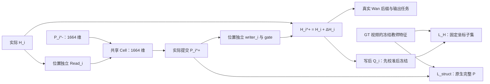

# D 的 H_i^+ 中间监督与 SharedCell 对齐方向：方法证据和可实施设计

> 2026-09-12 最新执行口径：v4 已使用 `image_text_gt`，训练 P₀ 以 75% 概率使用文字＋首帧＋干净 GT 视频 latent，以 25% 概率去掉 GT；同一初始化器每个样本只算一次 P₀。推理／验证不输入 GT，JEPA 特征只作监督。暖起默认关闭，显式非零配置保留同视频双视图对照；P 不跨视频传递。六个 A corrector 仍各自独立。下文保留历史设计与审查，涉及旧初始化输入或每三步暖起的内容不再是当前默认。完整规格与检查见 [GT 初始化说明](../../v4/evaluation/GT_CONDITION_PRIOR.md)。

> **2026-09-12 实现同步：** 当前 v4 已改为文本＋首帧预测整段 P₀；GT 视频在训练时用于教师目标与 Wan 加噪输入，推理没有 GT，部署初始化器不读取未来视频 latent。A1 在第 5／10／15／20／25／30 个 Wan block 后分别使用完整独立 corrector，reader／writer／注意力／核心／条件／门控均不跨 block 共享；同一 block 跨去噪 step 复用自己的权重。前向连续更新 P/H，梯度分别累积后统一优化。B 和 P₀ 初始化器也独立，B1 冻结 P₀ 与六套 A、训练完整 B。新增可消融的粗时序 L_prior（0.02），默认仍不执行 L_out／L_align；1000 条训练样本，A1 500 步，后续各 250 步。当前 P/H 融合为门控双向交叉注意力：P 查询 H 更新，H 查询提交后的 P 写回，不做读写时空插值，仍保留双方位置编码。A 阶段可训练参数 837,932,274，完整 A+B 974,156,790；每卡 A 静态参数／梯度／Adam 预算约12.99 GiB，未计 Wan／激活。旧 shared RESUME 保持旧结构，A／AB 的 INIT_FROM 可复制为独立参数并重建优化器。具体以 [独立参数检查](../../v4/evaluation/INDEPENDENT_CORRECTORS.md) 为准。交互选择与检查见 [双向注意力审查](20260912-D-PH双向交叉注意力与加法融合_实现审查.md)。下文保留原专题讨论，其中旧初始化、跨 block 共享、插值加法、6／18 两位置、匹配头、阶段及预算描述已被当前 [主设计](20260908-D-结构先导与细粒度响应校正_方法重构.md) 和 [v4 实现方案](../../v4/20260909-D-原生P校正器训练与推理实现方案.md) 替代；不作为当前启动要求或收益证据。


## 1. 结论与本文的设计边界

**可以合理监督 \(H_i^+\)，但监督对象应是“从这个实际写入后的 hidden 中能预测出的固定目标”，而不是凭空制造唯一的 \(H_{GT}\)。** 当前 D 的 \(L_{struct}\) 监督 \(P_i^+\)，没有经过本位置的 writer；因此，为 \(H_i^+\) 增加独立的局部任务，确实能补上对本位置写入的直接训练路径。这与仅仅给 \(\Delta P\) 再加一个损失有本质区别。

本文建议的第一项研究改动是：**在每个启用的 corrector 写入后，接一个位置独立、先校准后冻结的轻量读出头 \(Q_i\)，让 \(Q_i(H_i^+,\sigma)\) 预测冻结 V-JEPA 2.1 对同一 GT 视频产生的特征。** GT 侧不训练映射；\(Q_i\) 不读取 \(P\)、文本或未来 GT。这个设计直接监督 writer、写入 gate 和它们实际形成的 \(H_i^+\)。它是本文针对 D 提出的、需要实测的方案；REPA 提供的是中间表征对齐的先例，并没有验证这一冻结读出头方案在 Wan 上的效果。[REPA](https://arxiv.org/abs/2410.06940)

它仍然只能证明表征更容易读出。若要强化物理过程，下一步应增加**有可核查标签的运动轨迹／事件任务**；若要声称学到了物理因果机制，还需要已知干预目标的数据和对应实验。V-JEPA 特征、光流、时间顺序和注意力图，都不单独构成物理因果真值。

对 SharedCell 的建议是：**保持 \(P\) 在教师原生 1664 维空间，使用每个位置独立的 \(H\to P\) Read，在 1664 维 cell 内更新 \(P\)，再由独立 writer 写回 3072 维 hidden。** 在 3072 维工作空间融合也可以成立；只要更新后的持久 \(P\) 返回 1664 维，\(L_{struct}\) 仍能直接监督。后者没有自动更强的监督性，成本却明显更高。

本文基于当前[D 主设计](20260908-D-结构先导与细粒度响应校正_方法重构.md)、[E 实施方案](20260908-E-实际过程监督与反馈校正_增量模型构建及周度验证方案.md)及[监督根因审查](20260909-D-完整实现前不确定性与监督根因审查.md)。它是新的研究与实施建议，不把尚未验证的辅助损失当作现有基准已经采用的组件。候选位置仍为第 6、18 个原生 block 后的同一种 CorrectorBlock，不扩展到全部 30 层。

## 2. 先纠正“没有 H 的唯一 GT，所以只能监督最终输出”的推论

当前实际路径为：

\[
P_i^+=P_i^-+D_i,\qquad
H_i^+=H_i+\Delta H_i(P_i^+),\qquad
v=F_{>i}(H_i^+,P_i^+;c,\sigma).
\]

\(D_i\) 是门控和调度之后的有效状态增量，区别于候选 \(\Delta P_i\)。\(F_{>i}\) 是真实剩余 Wan 层、后续 corrector 和输出头。

| 监督方式 | 目标来自哪里 | 能否直接训练当前 writer | 可以得出的结论 |
|---|---|---|---|
| \(P_i^+\leftrightarrow F_{GT}\) | 固定视频教师 | 不能，本位置 writer 在 loss 下游 | 提交的 P 更接近教师表示 |
| \(Q_i(H_i^+)\leftrightarrow F_{GT}\) | 固定视频教师 | 能 | 写入后的 hidden 更符合该读出任务 |
| \(V_i(H_i^+)\leftrightarrow v^*\) | GT latent 与采样噪声 | 能 | 写入后的 hidden 更容易预测正确的去噪目标 |
| \(M_i(H_i^+)\leftrightarrow y_{motion}\) | GT 视频上的可靠运动标签 | 能 | 写入后的 hidden 更容易表达被标注的运动过程 |
| 实际后缀输出监督与同前态干预 | 真实生成路径与任务指标 | 能 | 判断这些修改是否改善最终执行结果 |

“不存在唯一 hidden 标签”和“不能在 hidden 处施加监督”是两回事。分类器的中间特征同样没有唯一 GT，但可以通过任务头训练它。FitNets 和 REPA 已经使用学生侧映射，将中间表征接到明确的教师目标上。[FitNets](https://arxiv.org/abs/1412.6550)、[REPA](https://arxiv.org/abs/2410.06940)

输出监督也不是数学上必然太弱。它的局部梯度包含：

\[
\frac{\partial L_{final}}{\partial H_i^+}
=J_{F_{>i}}^\top\frac{\partial L_{final}}{\partial v}.
\]

长路径可能造成梯度衰减、目标冲突或信用分配困难，但残差结构也可能保持有效梯度，需要测量。新增局部头将梯度路径缩短为：

\[
\frac{\partial L_{H,i}}{\partial H_i^+}
=J_{Q_i}^\top\frac{\partial L_{H,i}}{\partial Q_i}.
\]

**缩短梯度路径不等于增加了正确的物理知识。** 目标本身是否覆盖接触、轨迹、事件顺序，和梯度能否到达 writer，是两个需要分别解决的问题。

## 3. 相关方法的广泛比较

下表中“已有证据”限于相应论文研究的任务；“对 D 的判断”是本文的适配分析，不把图像生成、科学场生成或仿真结果直接外推为自然视频效果。

| 方法／研究线 | 已有证据与核心操作 | 如何用于 H_i^+ | 对 D 的判断及关键限制 |
|---|---|---|---|
| [FitNets](https://arxiv.org/abs/1412.6550) | 用学生侧映射拟合教师中间提示 | 为不同位置定义不同 Q_i | 证明跨维度中间监督可实现；不证明教师提示包含物理机制 |
| [REPA](https://arxiv.org/abs/2410.06940) | 带噪 DiT／SiT hidden 经投影，对齐干净图像教师特征 | 将投影接在实际写入后的 H_i^+ | 最直接的表征监督先例；原论文主要是图像，原投影与生成器联合训练 |
| [iREPA](https://arxiv.org/abs/2512.10794) | 比较多种教师，强调空间结构，改进投影和空间归一化 | 保留位置对应，检查动态区域的教师信号 | 教师的分类能力不等于生成监督质量；其空间归一化不应未经实验改写当前原生 P 定义 |
| [HASTE](https://arxiv.org/abs/2505.16792) | 研究表征对齐与去噪梯度的阶段性冲突，适时停止辅助对齐 | 检查辅助损失的训练阶段和噪声区间 | 反对“所有位置、所有 σ、全程强对齐必然更好”；不是要求机械复制其停止步数 |
| [DDT](https://arxiv.org/abs/2504.05741) | 区分语义条件编码与细节／速度解码角色 | 解释不同层需要不同读出与监督强度 | hidden 不应全部变成同一种语义表示；无需因此重建整个 Wan |
| [Internal Guidance](https://arxiv.org/abs/2512.24176) | 中间层增加输出头和去噪监督，再利用中间／最终输出做采样引导 | 借用训练部分，增加局部 v 预测头 | 真实目标明确，是必要的强对照；D 无需同时引入其采样外推 |
| [RKD](https://openaccess.thecvf.com/content_CVPR_2019/html/Park_Relational_Knowledge_Distillation_CVPR_2019_paper.html) | 蒸馏样本间的距离、角度关系 | 扩展为选定时空 token 的关系蒸馏 | 可跨通道维度比较，但 token 扩展是适配；相似关系不自动包含有向因果 |
| [VA-VAE／LightningDiT](https://arxiv.org/abs/2501.01423) | 在 tokenizer 训练中加入视觉基础模型对齐 | 提示“表示宽度、重建与生成”存在权衡 | 不是 D 中单独加 corrector 的等价方案；不能直接推论扩大 cell 必然更好 |
| [REPA-P](https://arxiv.org/abs/2605.20780) | 中间层轻量头解码物理场，对场计算 PDE／边界残差 | 借用“先读出可解释状态，再监督”的原则 | 与问题高度相关；原任务是已知物理场，不能在 Wan／JEPA 通道上直接套 PDE |
| [Physics-Informed Diffusion Models](https://arxiv.org/abs/2403.14404) | 科学场生成中加入已知方程约束 | 若有真实尺度、状态及边界条件，可监督读出场 | 普通自然视频通常缺少这些前提；错误方程比没有方程更危险 |
| [CoTracker3](https://arxiv.org/abs/2410.11831) | 点跟踪及真实视频伪标签训练 | 离线生成 GT 视频上的轨迹／可见性标签 | 可实施的运动标签来源；标签有误差，2D 轨迹不是 3D 力学状态 |
| [Physics-Grounded Fluid Video Generation](https://arxiv.org/abs/2607.25321) | 流体视频中加入显式光流分支和监督 | 说明运动监督值得单独验证 | 流体领域的预印本证据；不能把其双分支效果等同于 D 的局部头效果 |
| [Interaction Networks](https://arxiv.org/abs/1612.00222)／[GNS](https://arxiv.org/abs/2002.09405) | 在对象／粒子图上学习相互作用和动力学 | 有对象状态标签时，可采用关系读出或状态预测 | 给出了物理归纳偏置；先要解决对象身份、状态和单位，不能给任意 token 改名“粒子” |
| [CITRIS](https://proceedings.mlr.press/v162/lippe22a/lippe22a.pdf)／[iCITRIS](https://arxiv.org/abs/2206.06169) | 在已知干预目标及其他假设下识别时序因果变量 | 设计有干预标签的独立因果验证任务 | 说明因果主张需要什么数据；不能直接移植到无干预标记的自然视频集合 |
| [Jacobian Matching](https://proceedings.mlr.press/v80/srinivas18a.html) | 不仅匹配输出，还匹配对输入扰动的导数 | 有同语义干预变量时，匹配物理可观测量的响应 | 无明确干预变量时不采用；匹配隐藏坐标导数不等于物理因果，训练可能涉及二阶导数 |
| [V-JEPA 2.1](https://arxiv.org/abs/2603.14482) | 强化密集时空特征学习 | 为 P 与局部 H 读出提供固定过程表示 | 是有依据的教师候选；不是接触力、质量、因果图的带标签真值 |

最值得用于第一轮 D 实验的是 **REPA 式写后表征监督**，最需要保留的强对照是 **Internal Guidance 式中间去噪头**。面向物理能力，优先增加有实际标签的运动／事件任务；面向因果机制，优先补足数据与验证条件，而不是再增加一个名为“因果”的注意力或 loss。

## 4. 推荐候选：位置独立、经校准的写后表征监督

### 4.1 明确区分三个映射

| 模块 | 输入→输出 | 是否用于生成 | 参数策略 |
|---|---|---|---|
| Read_i | H_i → cell 的观察 O_i | 是 | 各位置独立训练 |
| writer_i | P_i^+ → ΔH_i | 是 | 各位置独立训练 |
| Q_i | 实际 H_i^+ → 教师特征预测 | 仅训练／诊断 | 各位置独立；先校准，主实验冻结 |

Q_i 不是旧版 P→教师的结构读出 R。**P 依然直接与原生 GT 特征比较；新增 Q_i 的用途是检查已经写回 Wan 的结果。** 它也不与 Read_i 绑定参数：Read 面向 cell 的任务观察，Q 面向写后状态的独立监督。

不同位置的 hidden 信息不同，所以 Q_A、Q_B 的参数分别训练；它们预测相同表示定义并不要求采用相同映射。两个位置同为 3072 维，仅说明张量接口相同，不能说明坐标基底、噪声敏感性和任务角色一致。



图中 GT 只进入损失，Q 只读实际 H_i^+；两条监督都不把 GT 当成生成输入。

### 4.2 GT 不变，但监督坐标必须可实现

保持当前教师：冻结 V-JEPA 2.1 G/16、384 视图、最终层原生 1664 维特征。16 帧示例中：

\[
F_{GT}\in\mathbb R^{B\times 8\times24\times24\times1664}.
\]

型号、checkpoint key、返回层与 token 布局应按当前 D 契约断言；实现以官方 2.1 编码器为准。[官方实现](https://github.com/facebookresearch/vjepa2/blob/main/app/vjepa_2_1/models/vision_transformer.py)

新增 Q 需要面对一个当前 P 没有的限制：**线性头对粗 H 网格的输出再插值，不能表达任意细教师网格。** 增加通道数也不会自动解除空间／时间插值的秩限制。不能把所有细 token 的不可拟合误差都解释为“writer 没学好”。

首个可审计实现使用固定子集 \(\mathcal U\)：

1. 从请求视图、真实时间戳、Wan `grid_sizes` 和教师 patch／tubelet 坐标建立对应；不靠两者长度比例直接 `reshape`。
2. 在教师原生 token 中，选取与有效 Wan 锚点接近的唯一位置；每个 Wan 时空单元至多对应一个监督点，冲突按固定索引规则去重。集合由请求几何决定，不能根据 GT 动作选择输入位置。
3. 在这些教师坐标处，固定采样 \(S_{H\to\mathcal U}H_i^+\)；目标直接取 \(F_{GT}[\mathcal U]\)，不做 GT 通道映射、不插值 GT 值、不学习 GT 压缩器。
4. 目标数量 K 不超过此视图可对应的有效粗网格数量；记录未覆盖细节。先验证这个子集的可读性，再决定是否值得开发带子 patch 解码能力的更强头。

这不保证目标一定可预测，但排除了“仅靠插值凭空获得细网格自由度”的错误前提。**P 的 L_struct 仍监督原生完整网格；H 的辅助项在明确声明的子集上监督，二者覆盖范围不同。** GT 子集是原表示的选择，不是被未知映射修改后的“新 GT”。

教师特征仍可能利用全视频上下文。相同帧在不同编码窗口中的特征未必相同；必须固定 GT 上下文和视图。因果 VAE 时间锚点与教师两帧 tubelet 的锚点不同，延用主文档的坐标契约，不用简单的均匀时间缩放替代。

### 4.3 Q 的最小结构和损失

每个位置独立定义：

\[
X_i=S_{H\to\mathcal U}H_i^+,\qquad
\widehat F_i=Q_i(X_i,\sigma)
=W_i\operatorname{LN}_i(X_i)+b_i+C_i e_{32}(\sigma)+d_i.
\]

\(e_{32}\) 为固定 32 维正余弦噪声编码；σ 项沿 token 广播，只补偿噪声条件，不接收文本／GT。首版不在 Q 中放额外 Transformer，避免辅助头变成另一个有较强生成能力的网络。

\[
L_{H,i}=g_{H,i}(\sigma)
\frac{\sum_{u\in\mathcal U}\rho_u
\|\widehat F_{i,u}-\operatorname{sg}(F_{GT,u})\|_2^2/1664}
{\sum_{u\in\mathcal U}\rho_u+\epsilon},
\qquad
L_H=\sum_{i\in\mathcal I}\alpha_iL_{H,i}.
\]

ρ 只表示合法对应和经审核的标签可靠性；它只进入 loss。所有归约在 FP32 中进行；整组无有效 token 时跳过该组，不能产生 NaN。α 在启用位置间归一化；外层噪声权重 g 不在分母中被抵消。

MSE 在这里是为了与现有原生 P 目标保持可解释的比较尺度，**不是声称它优于 REPA 常用的归一化余弦目标**。余弦、空间关系等可以作为单独对照，不能在没有对照的情况下改变目标又把效果归因于“写后监督”。

### 4.4 先校准、后冻结，具体如何做

联合训练 Q 与 corrector 是合法方案，REPA 本身就采用联合优化；不能说所有联合投影都会作弊。但在 D 的问题中，我们尤其关心“写入是否改善了同一读出标准”，因此主候选采用下面的两步流程：

**校准阶段。** 冻结生成路径，在合法 GT 加噪样本上采集对应位置 H。训练 Q 预测相同 GT 特征。A 的初始校准使用冻结原生前缀；若已有 A 的 FM＋struct 热身 checkpoint，可以同时采集其正常写前／写后状态。B 的校准必须使用已经验收并冻结的 A 基础所产生的 B 位置 hidden。这里的特征采集允许 `no_grad`，不训练 corrector。

**corrector 阶段。** 冻结通过校准的 Q，计算真实 H_i^+ 的预测与损失。Q 的参数不更新，但其前向不能放进 `no_grad`，因为需要对 H_i^+ 反传。冻结 Wan 后缀和 SharedCell 的参数时也遵守同一规则。

Q 的准入不能只看训练集误差。应按位置、σ、动作类别和动态区域检查：它是否优于训练集均值／σ 条件均值基线；是否优于只利用已知首帧得到的预测基线；在未见场景上能否区分不同的真实运动过程。训练、校准验证、最终测试应按源视频划分，不能把同一视频相邻 clip 分到不同集合。

**如果 Q 在某个 σ 区间主要输出条件平均，那个区间不能获得高置信局部监督。** g_H 由校准集确定并固定用于实验；纯噪声及无法读出的区间关闭，最接近干净端的区间还要检查与细节去噪是否冲突。阈值需要真实权重实验，本文不伪造一个通用 σ 数字。

冻结 Q 防止了训练过程中读出标准随 writer 一起漂移，但没有消除分布外误导。若实际 H_i^+ 明显超出校准分布，先暂停该辅助项、评估对应状态，并在新的独立准备阶段重新校准；不能边更新 corrector 边把追随它的 Q 宣称为稳定的监督器。

### 4.5 它究竟约束了 ΔH、gate 和 H 的哪部分

对同一次调用，在固定写前 H 的局部意义上：

\[
\frac{\partial L_H}{\partial\Delta H_i}
=\frac{\partial L_H}{\partial H_i^+}.
\]

若写入为 \(\Delta H=U[g\odot W_{out}Z]\)，则该梯度经 U 传到方向矩阵与 gate。gate 学的是“当前写入对这个任务的损失影响”，没有额外的 0／1 物理正确标签。

不能写成 \(L_H(P_i^+)\)，也不能拿进入 corrector 前的 H 代替 H_i^+。本位置写前量只作对照：

\[
\mathrm{gain}_{Q,i}=
\ell(Q_i(SH_i),F_{GT}[\mathcal U])-
\ell(Q_i(SH_i^+),F_{GT}[\mathcal U]).
\]

Q、σ、采样坐标和目标必须相同。冻结 Q 时，若 H 没改变，仅靠优化 Q 降低这个差值的情况就被排除了。主损失仍用绝对 GT 误差，不另加“每次更新必须超过固定 margin”的排名损失：写前已经正确时，强迫非零改进会产生错误压力。

Q 并未给出唯一 ΔH_GT。忽略 LN 的局部非线性，一个 3072→1664 满行秩线性读出的零空间仍有 1408 维；LN、坐标采样还会改变可观测方向。因此：

\[
Q_i(H_i^+)=F_{GT}\quad\not\Rightarrow\quad
F_{>i}(H_i^+,P_i^+)\text{ 已生成正确视频}.
\]

例如，示意读出 Q 只观察 H 的前两维。H 从 (0,0,0) 改为 (1,1,100) 可以准确读出目标 (1,1)，但第三维可能严重破坏后缀执行。这个反例说明，局部头和真实后缀监督的职责不能相互替代。

## 5. 怎样进一步监督物理过程，且不制造伪物理 GT

### 5.1 推荐第二步：可观测运动，而不是 latent 上的牛顿公式

对自然视频，最容易核查的标签是像平面轨迹、可见性、对象身份及经人工确认的事件时刻。先在 GT 视频上离线运行点跟踪器，再审核可靠性；CoTracker3 是可用来源之一，但其结果必须称为伪标签而非精确物理真值。[CoTracker3](https://arxiv.org/abs/2410.11831)

首个运动任务可以固定为：**给定首帧合法参考点，预测它们在后续帧中的二维位移及可见性。** 不要求一次性覆盖力、质量、接触、因果图。模型已经可以通过主路径看到允许的首帧；辅助头不能从未来 GT 提取查询坐标作为预测输入。

| 标签 | 获得方法与有效性条件 | 可以监督什么 | 不能据此声称什么 |
|---|---|---|---|
| 参考点轨迹 x_m(τ), y_m(τ) | GT 跟踪＋可靠性审核；点来自首帧固定网格／合法首帧对象区域 | 运动方向、连续位置、对象持续性 | 不是世界坐标的加速度、受力或质量 |
| 可见性 | 跟踪输出或人工标注；不确定帧单独置未知 | 遮挡／重新出现 | 不可把遮挡位置全部当不存在 |
| 接触／释放／落地时刻 | 人工或可核验的专门标注 | 对应事件的时序 | 二维投影重叠不一定接触，先后也不单独证明因果 |
| 3D 状态、质量、外力、边界 | 校准多视图、传感器或仿真数据 | 在已知适用条件下的动力学约束 | 普通单目 RGB 无法自动提供全部量 |

相机运动不应被悄悄当成物体运动。首版可以限定相机稳定、对象清晰的物理子集；若使用移动相机数据，应报告像平面任务的含义，或使用经过验证的相机补偿。不能直接把 px/frame 代入 m/s² 的公式。

### 5.2 一个可实现的 H_i^+ 运动读出头

运动头 \(M_i\) 只读取实际 H_i^+、σ、请求坐标和合法首帧参考点。参考点 q_m 与视频时间 τ 构成查询，使用少量查询读取 H 的时空特征，再输出相对 q_m 的归一化位移和一个可见性 logit：

\[
(\widehat d_{m,\tau},\widehat a_{m,\tau})
=M_i(H_i^+;q_m,\tau,\sigma).
\]

可固定每个 clip 至多 64 个查询点。一个用于估算成本的结构是：H 的独立 LN 与 3072→256 投影；固定坐标编码；32→256 的 σ 投影；一个 256 维、8 头的标准交叉注意力；256→256→3 的输出 MLP。查询和键分别有预 LN，输出 MLP 另有预 LN，不加入其他可训练 token 或隐藏层。参数统计见第 8 节。

GT 轨迹仅在 loss 侧形成：

\[
d^*_{m,\tau}=
\left(\frac{x^*_{m,\tau}-q_{m,x}}{W},
\frac{y^*_{m,\tau}-q_{m,y}}{H}\right).
\]

运动监督明确含两个子项：

\[
L_{motion}=\operatorname{Mean}_{valid\ position}
\operatorname{Huber}(\widehat d-d^*)
+\lambda_{vis}\operatorname{Mean}_{known\ visibility}
\operatorname{BCEWithLogits}(\widehat a,a^*).
\]

位置监督只使用可靠的可见位置或确有可靠标注的遮挡位置；未知位置不能用 (0,0) 充当标签。两个有效集合可以不同，各自为空时分别跳过。可见性不能兼作让模型选择性逃避位置误差的预测权重；位置权重来自停止梯度的标签可靠性。

运动头先在冻结基础的合法加噪 hidden 上校准，再冻结用于主候选实验，要求通过非零运动、未见运动方向及相似外观不同运动的验证。若首帧／文本先验就能解释所有标签，必须扩大验证覆盖，否则无法说明 H 中增加了实际过程信息。

轨迹一阶／二阶差分可以作为诊断，首版不重复叠加“位置＋速度＋加速度＋平滑”所有损失。尤其在碰撞处，全程平滑加速度会惩罚真正的冲量响应。需要接触事件时，单独补齐对应事件标签和任务定义，再进行增量实验。

### 5.3 REPA-P 的启发应该落在哪一层

REPA-P 的中间投影输出有明确定义的压力、速度等物理场，损失也包含对应的方程和边界条件。其证据支持“在中间表征处监督可读出的物理状态”值得研究；不支持把任意视频 latent 的空间导数叫作物理残差。[REPA-P](https://arxiv.org/abs/2605.20780)

因此，D 当前自然视频方案采用的是上述**有观测标签的过程读出**。没有质量、3D 坐标、边界条件时，不加入 \(F=ma\) 或 Navier–Stokes 残差。如果以后有合适的仿真子集，应同时约束观测状态、初始／边界条件和适用方程；只要求某个残差为零可能允许与样本无关的常量解。这是对拟议 D 约束的数学风险分析，不是把 REPA-P 的实验结论否定为无效。

### 5.4 因果问题必须区分两种干预

**模型内部干预：** 在同一 H、P、σ 和后缀策略下打开／关闭本位置 writer，判断该模块是否改变生成结果。这能够支持“这个 corrector 对模型结果有因果作用”。

**现实物理干预：** 改变释放、推力、支撑、初始速度等已知因素，并观察后续过程如何改变。这才用于验证物理机制。CITRIS／iCITRIS 的可识别性结论依赖干预目标及相应生成假设，不能仅用时间顺序替代。[CITRIS](https://proceedings.mlr.press/v162/lippe22a/lippe22a.pdf)、[iCITRIS](https://arxiv.org/abs/2206.06169)

例如，标注“移除支撑后物体下落”可以训练事件预测；要区分模型是否真正利用“支撑移除”，还应有保留支撑、改变释放时刻等可比较条件。单纯反转帧序或换提示词不等价于得到了这些干预条件下的真实视频。

若扩展到严格的状态转移任务，监督应是 \(s_{\tau+1}\mid s_{\le\tau},a_\tau\)，其中 a 是已知干预。必须限制预测器的实际可见输入；Wan hidden 可能已通过时空注意力混入未来的带噪视频信息，在它之后加 causal mask 并不能撤销这些信息。此类独立任务要使用真正的历史前缀编码，不能把完整 GT 的双向 V-JEPA 特征切出“历史 token”充作无泄漏输入。

当前无干预标记的数据配置下，可以增强并验证物理过程一致性，**不能仅靠新增 L_H 或 L_motion 证明识别了因果机制**。这部分缺口需要数据和实验解决，不能通过改 loss 名称完成。

## 6. 其他候选如何取舍

### 6.1 局部去噪头：最干净的 GT 对照

在 H_i^+ 上增加位置独立的 \(V_i\)，输出原生 latent 的 patch 速度。对当前直线路径：

\[
z_\sigma=(1-\sigma)z_0+\sigma\epsilon,
\quad v^*=\epsilon-z_0,
\quad L_{H\text{-}FM}=\sum_i\alpha_i
\operatorname{Mean}_{valid}\|V_i(H_i^+,\sigma)-v^*\|^2.
\]

Wan 的 latent 通道 48、patch 为 (1,2,2)，所以每个 H token 的输出宽度是 192，再按真实网格 unpatchify。可用 LN、3072→192 线性层及 32→192 的 σ 偏置投影实现，不需要每个位置运行 VAE 或完整后缀。Internal Guidance 的中间输出监督给出了很直接的研究先例。[Internal Guidance](https://arxiv.org/abs/2512.24176)

这是 \(v^*\) 的真实任务标签，不是假造 H 标签。它与最终 FM 的输出位置不同，梯度不等价，因此不是仅乘 σ² 的冗余 latent 重建项。但它仍主要提供生成／去噪训练，不额外提供接触或因果标签。

首轮以它**替换 L_H 作为对照组**，不默认把两者同时加入。如果经校准的教师 Q 明显不可靠，而局部去噪头可以稳定学习，应保留后者并停止采用错误教师读出梯度。生成器仍需通过真实后缀任务验证，不能把辅助头拟合成功当最终效果。

仅在合法 GT 加噪路径上使用上述速度标签。自由采样中任意 latent 不能继续套用某条无关 GT 的 \(\epsilon-z_0\)。已知首帧、固定位置和 padding 延用原生 I2V loss mask。

### 6.2 关系蒸馏：能绕过通道对应，绕不过语义问题

对相同索引的 token 对 (u,v)，可以比较：

\[
L_{rel}=\operatorname{Mean}_{(u,v)\in\mathcal E}
\left[\cos(H^+_u,H^+_v)-\cos(F_{GT,u},F_{GT,v})\right]^2.
\]

双方分别在自身通道内计算余弦，3072 与 1664 无需相同。这个 D 变体借用了关系蒸馏的思路；RKD 原方法研究的是样本间关系，并不直接等于上述视频 token 公式。[RKD](https://openaccess.thecvf.com/content_CVPR_2019/html/Park_Relational_Knowledge_Distillation_CVPR_2019_paper.html)

限制很明确：对称相似度本身不能表示因果方向；保持 Gram 结构不保证后缀正确；对整个 H 强制教师几何可能损害该层保留噪声和细节的功能。若采用，按真实坐标抽取有定义的时空边，避免完整 N² 矩阵；它作为独立对照，而非继续追加的默认损失。

### 6.3 Jacobian、注意力和一致性不能充当通用物理标签

匹配“输出对某个可解释干预变量的响应”有研究价值。Jacobian Matching 提供了函数导数蒸馏的框架，但双方必须对相同含义的输入求导；若训练损失包含这些导数，通常需要额外的高阶自动微分开销。[Jacobian Matching](https://proceedings.mlr.press/v80/srinivas18a.html)

对 D 的任意 hidden 通道求梯度，没有自动的力学单位或干预语义。两种噪声视图预测一致，也可能一致地错误；注意力指向接触对象也不证明正确模拟了接触。因此首版不以这些量替代固定 GT 任务。

## 7. SharedCell 应该在哪个空间计算

### 7.1 先分清持久状态、临时工作空间与损失空间

\[
\underbrace{P_i^+,F_{GT}\in\mathbb R^{N_P\times1664}}_{\text{状态与监督}}
\qquad
\underbrace{Z_i,Y_i\in\mathbb R^{N_W\times d_W}}_{\text{临时计算}}
\qquad
\underbrace{H_i,H_i^+\in\mathbb R^{N_H\times3072}}_{\text{Wan 执行}}.
\]

L_struct 的定义由持久状态 P 的语义决定，不由临时工作宽度 d_W 决定。**“送进 cell 前把 P 升维”和“把 GT 也升维后才监督 P”不是同一件事。** 前者可以合理，后者会改变当前固定教师监督契约。

### 7.2 方案一：H→P 工作空间，建议保留

省略偏置、位置编码和条件项后：

\[
O_i=S_{H\to P}(R_i\operatorname{LN}_{H,i}H_i),\qquad
Y_i=C_{1664}(P_i^-+O_i;\sigma,c,i),
\]
\[
P_i^+=P_i^-+D_i(Y_i),\qquad
H_i^+=H_i+U_{P\to H}\,W_i(P_i^+).
\]

R_i 为 3072→1664；C 是当前两层全宽共享 core；D_i 包含候选头、状态 gate 及位置／σ 调度；W_i 包含写入 LN、方向投影与 gate。损失仍为：

\[
L_{struct,i}=\operatorname{Mean}\|P_i^+-F_{GT}\|^2/1664.
\]

Read 压缩的是校正器的观察接口，不是把整个 Wan hidden 替换成 1664 维。原 H 通过残差主路完整保留。R_i 应学习提取有助于更新过程状态的信息，没有必要可逆重建全部 H。

代价是：线性 Read 存在不可见方向，粗网格采样也可能损失关键信息。若碰撞所需信息恰好无法经接口进入 cell，增加 L_struct 权重不能恢复它；需要以实际状态预测、动态区域和读出秩／误差诊断确认接口容量。维度选择是一项可验证假设，不是数学保证。

### 7.3 方案二：P→H 工作空间，也可以合法实现

为公平比较，先令工作 token 网格仍是 P 网格，只改变工作宽度：

\[
Z_i=T_i(P_i^-)+A_i(S_{H\to P}H_i)+e_{3072},
\qquad Y_i=C_{3072}(Z_i;c,\sigma,i),
\]
\[
P_i^+=P_i^-+\eta_iG_i\odot B(Y_i),
\quad T_i:1664\to3072,
\quad B:3072\to1664.
\]

之后仍只从实际 P_i^+ 写回 H，并用同一个原生 F_GT 监督 P_i^+。A_i 表示位置适配，最小实现可以用位置独立 LN；若加入完整 3072→3072 矩阵，需要另计成本。相同宽度的不同 H_i 也不能默认共享一个无条件适配器。

这不是非法方案：T_i 可以满列秩，B 可以满行秩，宽工作空间不必限制 1664 维状态更新的线性范围。**不能把此前“256 维共享线性瓶颈”的低秩问题直接套到 3072 维工作空间上。** 升维本身也不会产生 P 原本没有的物理知识。

有两种容易写错的实现需要排除：

- 直接把 3072 维 Y 称作新的 P，却继续声称它与 1664 维原生 GT 直接监督。维度和定义已经不一致。
- 让 Y 同时绕过 P 直接生成 ΔH，而仍宣称 P 的正确性是写入的必要前提。这样执行可以走私有 H→Y→ΔH 路径，原来的 P 控制逻辑发生改变；若研究该变体，必须重新做 P 的必要性实验。

### 7.4 成本与适用性对照

为避免把不同结构混在一起，下表的 cell 成本只比较：两层标准 pre-LN block；每层 self-attention＋text cross-attention＋4 倍 MLP＋3 个 affine LN；条件已投到相同宽度。每层参数为 \(16d^2+19d\)。不含 Read、writer、条件投影及 P 更新头。

| 比较项 | 1664 维 P 工作空间 | 3072 维 H 宽度工作空间 |
|---|---:|---:|
| 持久 P／GT 宽度 | 1664 | 1664，必须有返回 P 的更新头 |
| 两层共享 core 参数 | 88,667,904 | 302,106,624 |
| 相同上述结构的 core 参数比 | 1 | 约 3.41 |
| 同 N 下单个工作激活宽度比 | 1 | 3072/1664≈1.85 |
| dense projection／MLP 主导计算 | 基准 | 主要项约随 d² 放大 |
| attention 的 token 混合主要项 | O(N²d) | 同 N 下随 d 放大，不是统一 3.41 倍 |
| H 观察容量 | 显式压缩到 1664 | 可以在较宽通道内处理，但仍受采样与融合限制 |
| L_struct 是否直接监督原生 P | 是 | 是，只要监督返回后的真实 P_i^+ |
| 是否自动获得更强 H_i^+ 监督 | 否，需要写后任务 | 同样否 |
| 第一轮 D 实施建议 | 使用 | 作为成本匹配或容量诊断对照，不默认采用 |

若方案二改为在 Wan 网格计算，N 也随之改变，必须重新统计时间覆盖、写回 P 的插值损失和实际 FLOPs。不能一边换成更少 token，一边把全部速度差归因于 3072／1664 通道。若要给方案二报完整参数量，必须先确定 A_i、T_i、B、条件模块及共享范围；这里只给定义完整的 core 精确值，不伪造未定模型总量。

异构 cross-attention 也是可行的接口：P 作 query，H 作 key/value，内部各自投影到注意力宽度，从而不要求原始 P 与 H 同维。它不会自动解决不同层的语义差异或教师标签问题；在当前基础上属于新的融合对照，暂不引入默认路径。

### 7.5 对用户问题的直接回答

**就 L_struct 而言，两种工作空间都可以正确实现，关键是监督的必须是最终提交的原生 P_i^+。就当前 D 的成本、固定语义与共享设计而言，H→P 后在 1664 维 cell 内处理更合适。** P 不需要变成 Wan hidden；Read 也不需要被强制等于 P_GT。Read 是观察，P 是状态估计，writer 是执行，Q 是写后监督读出，四者职责不同。

## 8. 训练设置、损失数量与参数成本

### 8.1 新损失如实计数

原完整基准有 FM、struct、out、align 四个生成器目标。研究候选增加 L_H 后为五个目标；再增加运动组后为六组，而运动组内部明确含位置与可见性两个子项。准备阶段的 Q／运动头拟合是独立优化任务，也应记录。

最初 A-only 阶段尚未启用 out／align 时，FM＋struct＋H 是三个目标；这是阶段配置，不是声称最终系统仍只有三个。局部去噪头、关系蒸馏作为替代对照，不与所有候选一起堆叠。

\[
L_{candidate}=L_{FM}+\lambda_sL_{struct}
+\lambda_oL_{out}+\lambda_aL_{align}
+\lambda_HL_H
\quad[+\lambda_mL_{motion}\text{，仅物理标签实验}].
\]

保留原有各损失的合法 σ 区间。新增 H 与 motion 权重分别校准，不能只因 P 与 H 使用同一个教师就共用相同噪声权重。HASTE 的结果提示辅助对齐可能与后期去噪冲突；iREPA 则显示教师的空间结构也影响收益，二者不是一句“语义教师都该尽早关闭”可以概括的。[HASTE](https://arxiv.org/abs/2505.16792)、[iREPA](https://arxiv.org/abs/2512.10794)

首轮用固定权重网格与独立验证选择，不增加另一个可学习“可信度 gate”让模型自行决定是否接受监督。监测 writer 参数或 H_i^+ 上的辅助／主任务梯度夹角；持续冲突且实际效果退化时，停止该辅助配置，而不是自动再叠加梯度修补算法。

### 8.2 参数量与冻结关系

当前 D 两个全宽 cell block 配置下：共享组 103,968,385；A 位置组 10,236,417；B 位置组 10,236,418。由现有明确模块公式得到 A＋共享 114,204,802，A＋B＋共享 124,441,220。

每个 Q 的精确参数为：

\[
2\times3072+(3072+1)\times1664+(32+1)\times1664
=5,174,528.
\]

| 实验／阶段 | 优化器中的训练参数 | 额外冻结辅助模块 | 说明 |
|---|---:|---|---|
| A 的 Q 准备 | Q_A：5.17M | 原生生成路径或固定热身 checkpoint | 不更新 D，验证 Q 的 σ 与领域适用性 |
| A＋共享训练，Q_A 冻结 | 114.20M | Q_A：5.17M | FM＋struct＋H 起步；后续按原计划引入 out／align |
| 备选：Q_A 与 A 联合训练 | 119.38M | 无冻结 Q_A | 作为对照；读出标准可能随训练变化 |
| B 的 Q 准备 | Q_B：5.17M | 已验收 A 基础与其余路径 | 用真实 A 基础下的 B 输入分布 |
| 冻结基础，仅训练 B | 10.24M | Q_A、Q_B 共 10.35M | 保持现有 M3a 的高 σ 全旁路 |
| 可选 A＋B 联合，Q 均冻结 | 124.44M | 两个 Q 共 10.35M | 必须重验基础保持及逐位置收益 |
| 备选：A＋B 与两个 Q 联合 | 134.79M | 无冻结 Q | 非主推荐；成本需如实纳入 |
| 局部 v 头替代 Q | 每位置 602,496，约 0.60M | 冻结／联合按该对照方案登记 | LN＋3072→192＋32→192，两个线性层均有 bias |
| 运动头独立准备 | 每位置 1,132,547，约 1.13M | 生成路径冻结 | 按第 5.2 节完整结构计数 |
| 正式 A＋B 推理 | 新增生成参数仍为 124.44M | 不加载 Q／运动辅助头 | 辅助头只用于训练和研发验收 |

若在主训练中冻结运动头，生成器训练参数不会因此增加，但前向、输入梯度和显存成本仍会增加。运动头计数具体为：LN_H 6144，H 投影 786688，σ 投影 8448，query/key 两个 LN 共 1024，cross-attention 四个带 bias 线性层共 263168，MLP 前 LN 512，MLP 两层共 66563。

既有视频文本 matcher 的独立准备仍为约 3.06M，不计入上面的 Q 或生成器参数。本文没有增加 LoRA 或解冻 Wan；“骨干冻结”不等于“训练无需存储其反向所需激活”。

### 8.3 建议按四步验证，而不是一次启动完整配置

1. **接口与监督器准入。** 真实权重加载、坐标验证、P 直接目标复核；拟合 Q_A 并确定其可用区间。如果教师对所关心的物理现象缺乏敏感性，优先准备运动标签；不要仅增大 λ_H。
2. **A-only 局部监督实验。** 同数据、同训练预算比较原基准、加 Q、替换为局部 v 头三组。通过后再验证固定预算下是否需要运动任务；out／align 的启用在各比较组保持一致。
3. **基础固定后验证 B。** 校准 Q_B，只训练 B；保留现有状态与写入的恒等初始化、高 σ 完整旁路。验证 B 是否在保持原正确样本的同时提供中期收益。
4. **独立场景与自由采样验收。** 使用完整部署采样协议、多个 seed 和所有生成结果；有干预数据时另做物理因果实验。联合训练只是可选扩展，不是通过 A／B 分阶段验收的替代品。

GT 教师特征可离线缓存。Q 的主训练不需要每个位置解码一次视频，也不新增完整 Wan 后缀；但局部头输出、损失和输入梯度仍有成本。P 与完整 GT 各自一个 BF16 状态约 14.625 MiB，Q 的 K 个预测约为 \(2K\times1664\) 字节；这些都不是完整训练峰值显存。实际吞吐、OOM 风险和缓存 I/O 需要真实集成后测量。

## 9. 如何检验“真的校正了”，而非只有局部 loss 好看

固定一个 checkpoint，并只计算一次本位置前缀。克隆 H_i、P_i^-、σ、条件、RNG、缓存和 solver 状态后做同前态对照：

| 检查 | 正分支／对照分支 | 能定位的根因 | 不通过时的处理 |
|---|---|---|---|
| Q 的独立可读性 | H 预测／条件均值与首帧基线 | 监督器是否只预测平均外观 | 关闭不可靠区间；不要用随机／失效 Q 指导写入 |
| 写后局部收益 | Q(H+ΔH)／Q(H) | ΔH 是否改善固定局部任务 | 查 writer、gate、梯度和任务冲突 |
| 写入的实际收益 | F(H+ΔH,P_after)／F(H,P_after) | 固定相同 P 后，ΔH 本身是否有用 | 局部收益为正但实际无益时，不接受该头作为有效校正证据 |
| 整个 corrector 收益 | F(H+ΔH,P_after)／F(H,P_before) | 状态更新与写入合起来的作用 | 区分 P 更新、写入以及跨步缓存问题 |
| 后续补偿诊断 | 两分支同样启用后续 corrector；另做两分支同样关闭后续 corrector | 后层是否在掩盖前层破坏 | 修改／移除有害位置，不强迫全部位置单调通过 |
| 对 P 内容的使用 | 正常 P；离线置换同 σ 的 P；单独的 ΔH 关闭对照 | 是否仅利用固定模式或忽略过程差异 | 置换本身是分布外诊断，结合正常写入收益判断，不能单独当证明 |
| 高 σ 基础保持 | 完全相同初态与部署协议下比较前缀 | B 的旁路是否真的保持 z、P、solver 状态 | 修复旁路／缓存，不靠辅助 loss 抵消 |
| 多样性与完整成功 | 完整自由采样，多个 seed，全量报告 | 是否以静止、平均未来或筛选结果换分数 | 不能仅以特征 MSE 验收 |
| 物理泛化 | 留出对象、接触布局、运动方向与场景 | 是否只是外观捷径 | 重新界定数据与任务，而非宣传“理解物理” |
| 物理因果 | 已知干预下的真实响应对照 | 是否正确响应物理因素变化 | 无干预标签时不作可识别性主张 |

局部 Q／运动任务和真实后缀任务的收益应逐样本配对报告，并按 σ、位置、物理现象分组。用按源视频聚合的置信区间，避免把大量同视频 token 当作独立证据。重点报告“局部改善但实际退化”的比例，而不只报告平均局部误差。

配对后缀不是免费计算：复用正分支后，每个位置至少增加一个相应对照后缀；若评价解码视频，还需对应 VAE／教师／指标计算。这里是研发归因，不改变单轨迹生产推理，不增加推理候选筛选。

只有局部 loss 下降，说明辅助任务被改善；只有完整 FM 下降，说明训练路径拟合改善；只有完整自由采样与独立物理指标共同改善，才支持生成质量得到实际校正。**三层证据应连起来，而不是让任意一层替其他两层作证明。**

## 10. 最小实现的计算图契约

下面为局部监督接入的伪代码，省略完整 Wan、坐标采样和阶段训练入口。它表达梯度边界，不是已经实现的 v4 训练程序。

```python
# Preparation is a separate optimizer run on legal GT-noised examples.
# Freeze generator, fit and validate one Q per corrector position.
# In generator training: freeze Q weights, retain Q's input gradients.
for parameter in q_i.parameters():
    parameter.requires_grad_(False)

with torch.no_grad():
    # Fixed checkpoint/layer selection and a reversible grid reshape.
    # Shape: [B, T_P, H_P, W_P, 1664], identical to persistent P.
    f_gt = canonical_teacher_grid(frozen_vjepa(gt_view))

p_before = p
h_before = h
p_after = corrector.update_state(h_before, p_before, sigma, text)
delta_h = corrector.write(p_after, sigma)
h_after = h_before + delta_h

loss_struct = masked_native_mse(p_after, f_gt, struct_mask)

# Chosen by request geometry, never by future GT values.
# Keep native GT values at the selected token indices.
h_query = sample_hidden_at_teacher_coords(h_after, query_coords)
pred_features = q_i(h_query, sigma)  # NO no_grad / detach here
# Flatten only grid axes, then gather the declared indices per example.
target_features = gather_teacher_tokens(f_gt, teacher_indices).detach()
loss_hidden = masked_native_mse(
    pred_features, target_features, hidden_supervision_mask
)

# Pass precisely these states onward. Frozen weights retain input gradients.
velocity, p_next = actual_wan_suffix(h_after, p_after, sigma, text)
loss_fm = native_fm_loss(velocity, noise - clean_latent, fm_mask)

# g_struct and g_hidden are applied per example before batch reduction.
loss = reduce_weighted(loss_fm, loss_struct, loss_hidden, sigma)
loss.backward()
```

必须检查的工程细节包括：

- `loss_hidden`、writer、真实后缀读取的是同一个 h_after；不另造一份未实际执行的辅助 hidden。
- B 全旁路时不调用其 cell／writer／局部训练任务，不意外改变 P、随机状态或缓存；局部损失不会在旁路位置训练一个未执行的校正。
- writer 零初始化时，先检查方向矩阵能否收到梯度。方向仍为零时写入 gate 的梯度可能为零，不能误判为永久断图；方向更新后再检查上游。
- BF16／FP16 张量、FP32 loss、有效 mask、实际 padding、首帧约定和各位置的索引一致；对零范数余弦对照加稳定 ε。
- Q 冻结不能用 `torch.no_grad()` 包其主训练前向；如需诊断梯度，可用 `autograd.grad`，不在正式训练中无意引入二阶图。
- 同一 clip 的缓存必须记录教师型号、层、取帧、crop、预处理和坐标；不同上下文的缓存不可混用。

当前文档解决的是监督对象、目标来源、映射方向、梯度路径和验收逻辑的定义。**真实 Q 的可读性、任务梯度与后缀执行是否一致、物理泛化幅度，以及实际硬件开销，仍需上述实验回答。** 这些是明确的实验判定项，不能在没有运行真实模型的情况下写成已解决的效果。

已完成的有限检查：文档内部文件链接与公式／代码围栏检查通过，伪代码可通过 Python 语法解析；PyTorch meta 参数计数核对了 Q 与局部 v 头；缩小维度的 CPU 计算图验证了“本位置 struct 无 writer 路径”和“冻结 Q 参数后，局部损失仍能反传到 writer、写入 gate 与 P”，并验证了读出零空间反例。没有运行真实 Wan／V-JEPA 端到端训练或生成效果实验。

## 11. 参考来源

1. [FitNets: Hints for Thin Deep Nets](https://arxiv.org/abs/1412.6550)：学生中间表征映射与提示监督。
2. [Representation Alignment for Generation: Training Diffusion Transformers Is Easier Than You Think](https://arxiv.org/abs/2410.06940)：REPA，中间带噪表征对齐干净教师目标。
3. [What Matters for Representation Alignment: Global Information or Spatial Structure?](https://arxiv.org/abs/2512.10794)：iREPA，教师空间结构与投影设计。
4. [REPA Works Until It Doesn't: Early-Stopped, Holistic Alignment Supercharges Diffusion Training](https://arxiv.org/abs/2505.16792)：HASTE，辅助对齐的收益与冲突。
5. [DDT: Decoupled Diffusion Transformer](https://arxiv.org/abs/2504.05741)：语义编码与速度解码的角色差异。
6. [Guiding a Diffusion Transformer with the Internal Dynamics of Itself](https://arxiv.org/abs/2512.24176)：Internal Guidance，中间输出监督；本文仅借用其训练思路。
7. [Relational Knowledge Distillation](https://openaccess.thecvf.com/content_CVPR_2019/html/Park_Relational_Knowledge_Distillation_CVPR_2019_paper.html)：距离／角度关系蒸馏。
8. [Reconstruction vs. Generation: Taming Optimization Dilemma in Latent Diffusion Models](https://arxiv.org/abs/2501.01423)：VA-VAE／LightningDiT，tokenizer 对齐及容量权衡。
9. [Learning to Think in Physics: Breaking Shortcut Learning in Scientific Diffusion via Representation Alignment](https://arxiv.org/abs/2605.20780)：REPA-P，中间物理场与方程残差。
10. [Physics-Informed Diffusion Models](https://arxiv.org/abs/2403.14404)：科学扩散模型的物理约束。
11. [CoTracker3: Simpler and Better Point Tracking by Pseudo-Labelling Real Videos](https://arxiv.org/abs/2410.11831)：点轨迹与真实视频伪标签。
12. [Physics-Grounded Fluid Video Generation with a Simulation Dataset and Dual-Stream Optical-Flow Supervision](https://arxiv.org/abs/2607.25321)：流体视频运动监督的预印本证据。
13. [Interaction Networks for Learning about Objects, Relations and Physics](https://arxiv.org/abs/1612.00222)：对象及关系上的动力学建模。
14. [Learning to Simulate Complex Physics with Graph Networks](https://arxiv.org/abs/2002.09405)：粒子图与消息传递的物理仿真。
15. [CITRIS: Causal Identifiability from Temporal Intervened Sequences](https://proceedings.mlr.press/v162/lippe22a/lippe22a.pdf)：干预目标与时序因果表示的可识别性。
16. [Causal Representation Learning for Instantaneous and Temporal Effects in Interactive Systems](https://arxiv.org/abs/2206.06169)：iCITRIS，瞬时与时序因果作用。
17. [Knowledge Transfer with Jacobian Matching](https://proceedings.mlr.press/v80/srinivas18a.html)：函数输入导数的蒸馏。
18. [V-JEPA 2.1: Unlocking Dense Features in Video Self-Supervised Learning](https://arxiv.org/abs/2603.14482)：视频密集特征教师的依据；[官方编码器代码](https://github.com/facebookresearch/vjepa2/blob/main/app/vjepa_2_1/models/vision_transformer.py)。
