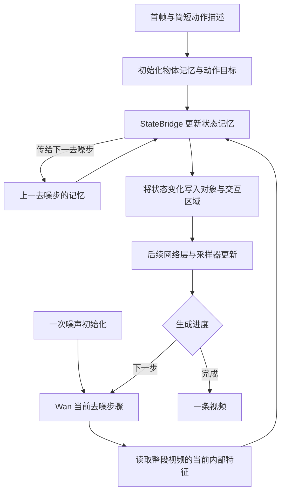

# RIVIA（循影）：视频生成的根因诊断与修复计划

更新：2026-09-05。本文说明方法、逐例修复目标和实施顺序；[技术说明](TRACE_strong_stage_json_visual_diagnosis_and_next_plan_20260905.technical_archive.md) 保留对应的代码分析、参数推导、连续帧证据和训练细节。两份文档采用同一套方案。

**修复主线：用共享 StateBridge 的状态读写，替换强阶段 JSON 的文本差分注入。** 模型在同一次生成中读取物体状态，根据动作目标更新状态记忆，再把变化写入视频特征。训练同时学习完整动作和运动中的清楚外观。

模型名称定义为 **RIVIA：Recurrent Inference for Video with Iterative Adjustment**，意为“通过循环推理与迭代纠正生成视频”。Recurrent 对应跨去噪步骤的记忆，Inference 对应从视频特征读出状态，Iterative Adjustment 对应持续纠正与写回。“循影”是根据这套方法起的中文意译。

**正式输入为首帧和简短动作描述。每次请求初始化一次噪声，沿一条采样轨迹输出一条视频。** 数据使用 WISA-80K 和 nkp37/OpenVid-1M 原始视频。本轮完成两份文档的修订，模型实现、训练和新视频实验按下文推进。

## 1. 这批视频说明了什么

### P02 baseline 是弱阶段引导参考

`trace-v3-p02-baseline-20260904-141716` 使用本地 **Wan2.2-TI2V-5B** 的既有权重，通过 v3 阶段推理路径生成一条 P02 视频。其阶段注入较弱，后段进一步减小；模型按预设阶段生成，物理状态读取与反馈属于下一版的建设内容。

| 项目 | P02 baseline | 强阶段 JSON 中的 P02 |
|---|---|---|
| 输入与采样 | 同一首帧路径、seed 42、50 步、CFG=5 | 相同 |
| 已保存的文本与时间路由 | 全局、阶段、负面提示和时间路由与强版本一致 | 在此基础上启用额外 JSON 文本条件 |
| 控制方式 | 小幅阶段差分，随去噪过程变化 | 多路文本差分经幅度匹配后持续加入 |
| 运动外观 | 红球轮廓相对圆滑，带运动模糊 | 红球出现彩块、碎块与脏拖影 |
| 动作过程 | 红球从蓝球前方经过，蓝球静止 | 同样绕过蓝球，蓝球静止 |

直接查看：[弱引导视频](../outputs/trace_writer/trace-v3-p02-baseline-20260904-141716/P02/i2v/seed_000042/video.mp4)、[强引导视频](../outputs/trace_writer/trace-v3-p01-p20-strong-stage-json-20260904-144957/P02/i2v/seed_000042/video.mp4)、[原尺寸对照](strong_stage_json_audit_20260905/P02_native_pair.png)。

这个对照支持两个判断：**较弱的额外注入更好地保留了原有外观能力；碰撞过程需要实质性的状态控制与训练。** 当前直接弱引导对照覆盖 P02，其他样例通过逐例视觉证据诊断。强度、层位置和去噪时段各自的影响留给配对实验确认。

### 已确认的实现事实

| 事实 | 对根因的指向 |
|---|---|
| 强路径额外条件幅度平均约为全局文本注意力输出的 **1.65 倍** | 测量对象是注意力模块内的条件增量，表明额外注入对中间特征有较大影响 |
| 强路径覆盖 10 个中层模块和全部 50 步；现有幅度截断触发次数为 **0** | 当前外观形成全过程都承受较强的文本条件扰动 |
| JSON 经 T5 编码后进入文本注意力 | 接触、液面、数量等要求仍以语义条件参与生成，实际视频状态尚待建模 |
| 时间路由将阶段权重铺到整幅画面的空间位置 | 对象定位和接触区域应进入新的空间读写逻辑 |
| 视频均为 1280×704、97 帧、24 fps | 低清感主要表现为运动局部的有效细节流失 |

参数分析来自 [条件记录](strong_stage_json_audit_20260905/conditioning_summary.json) 和 [推理代码](../inference/infer_trace_writer.py)。代码能确认注入方式和幅度；P02 画面对照支持它加剧局部外观损伤的解释。各类伪影的具体产生位置仍需通过生成、VAE 解码和视频编码三个环节的画面比较定位。

## 2. 根因与直接替换方案

当前的核心问题是：**动作信息混在文本外观条件里，生成过程按固定时间安排推进，物体状态与相互作用缺少直接表示。** 更完整的句子已经表达了挥拍、源量减少、压缩后恢复等要求，视频仍然出现对应失败。因此下一版直接改变信息表示和计算方式。

| 当前错误逻辑 | 产生的具体问题 | 替换后的正确逻辑 |
|---|---|---|
| 多路文本差分经幅度匹配后叠加 | 运动、材质、形状同时被扰动 | 短文本承担语义；训练后的状态特征承担对象运动与相互作用 |
| 固定五阶段决定整段视频接收什么条件 | 动作迟发、结果突现、过程重复 | 每个视频时刻记录对象与事件状态，按接近、接触、响应、稳定形成连续过程 |
| 时间权重铺满空间 | 球、手、反射和背景共享同一方向的修改 | 从当前特征定位对象及交互区域，在对应位置读写 |
| 用终态外观替代中间过程 | 闭书跳成开书，玻璃变软，纸中央消失 | 用位姿、书脊开合、裂口和碎片归属描述真实变化 |
| 源、流、接收端分别生成 | 满杯持续倒沙，冰保留而液池增长 | 同一材料记录统一更新来源、途中与接收端的量 |
| 每次前向重新估计，历史观察分散 | 球被复制、状态来回变、动作重做 | 共享记忆关联同一物体和整段动作，跨去噪步骤继续更新 |
| 用内部状态分数概括效果 | 漂亮末帧掩盖中间过程错误 | 直接评估完整动作、物理关系与运动主体画质 |

实施时移除旧的阶段文本增强分支、JSON 文本残差和相关强度参数，生成入口统一调用 RIVIA 状态读写。原生 Wan 作为实验参考，历史视频继续提供问题证据。每次改动对应上表的一项计算逻辑，并通过相关视频检验结果。

## 3. P01–P20 的修复目标

下面保留全部反馈，并把解决方法写成可观察的正确过程。帧编号从 f0 开始。

| 样例 | 当前具体表现 | 替换逻辑与验收目标 |
|---|---|---|
| P01 滑板车 | 车接近桶后仍保持直立 | 前轮到达桶边并接触，随后整车连续侧倒、停住；车架保持形状 |
| P02 双球 | 红球绕过蓝球，蓝球静止，红球碎块化 | 两球真实接触，蓝球启动、红球速度相应改变，球面与轮廓连续 |
| P03 球拍 | 球拍几乎固定，球自行向右离开 | 同时生成手、拍与球的运动；挥拍、接触、球改变方向依次发生 |
| P04 骨牌 | 长时间直立，倒下时弯折、收缩成薄片 | 每块骨牌保持厚度与比例，相邻接触驱动连续转倒 |
| P05 木块 | 方块从 f8 起拉成长木条 | 用同一方块的连续位置与姿态表现下坡，方块与坡面保持独立身份 |
| P06 书 | 下落时像软袋，f77–f78 附近切换成开书 | 保持书脊与封面结构，连续经历下落、触地、沿书脊展开和停留 |
| P07 箱子 | 倾倒时角部揉皱，手附近扭曲 | 箱体绕支点整体转动，角点与面比例连续，手部接触和轮廓清楚 |
| P08 冰 | 外部细流进入，中央冰块仍接近原大小 | 冰的固态部分逐渐减少，融水从接触边缘形成；采用合理热源或延时设定 |
| P09 黄油 | f57→f58 液池突现，后续细流间歇出现 | 同一块黄油逐步软化、降低，周边液池与固体变化同步 |
| P10 气球 | 充气阶段体积跳增，表面棱面化，爆后出现绿雾点阵 | 充气连续改变体积与张力，随后一次爆裂，橡胶薄片运动和落下可信 |
| P11 瓶子 | 触地前轮廓波浪化，落地后呈压瘪透明瓶 | 完整玻璃瓶保持刚性下落，触地后形成可辨碎片并散开、落地 |
| P12 蒲公英 | 飞出部分呈网格、重影和糊团，花头仍饱满 | 种子从花头脱离后沿连续轨迹运动，花头相应变稀，细丝呈自然纹理 |
| P13 倒水 | 源壶近直立且液面低于壶嘴时出流，接水杯升高 | 源壶姿态使液体到达出口，源量减少与杯中增加对应，杯子保持合理位置 |
| P14 倒液体 | 倾倒与停流已出现，源瓶仍很满，瓶与手碎面化 | 统一生成源液量、流束与杯量，移动瓶身和手的几何保持连续 |
| P15 倒沙 | 沙堆增长，源杯保持较满，沙流出现伪影 | 出料、源沙减少、空中沙流与堆积同步更新，停流后继续自然沉降 |
| P16 染料 | 起始小滴变大冠状团，水线上方出现疑似空气色云 | 表现液滴入水过程，染料在水域内扩展，空气液滴、飞溅与反射分别建模 |
| P17 海绵 | 手接近后撤离，海绵保持原厚度，手指出现彩点 | 手压下时海绵变薄，释放后恢复，底部持续受桌面支撑，手部细节连续 |
| P18 弹球 | 首次触地后上方出现新球，下方球缩小消失 | 同一球连续完成逐次衰减的反弹并停留，球与地面倒影分别识别 |
| P19 撕纸 | f24→f25 中央大开口突现，双手位移有限 | 抓持点运动带动裂口发展，原纸形成两片，材料位置随折叠和拉开连续变化 |
| P20 水壶 | 倒水后收尾移动时壶身波纹化、碎块化 | 壶身、壶盖、手柄整体移动，水流与杯量对应，火焰自然变化 |

证据入口：[全程抽帧](strong_stage_json_audit_20260905/)、[连续帧与原尺寸裁剪](strong_stage_json_audit_20260905/feedback_followup_20260905/)。检查采用密集抽帧、关键事件连续帧和局部原尺寸图。

评价依据物体和材料的真实变化：爆裂与裂口扩展允许快速发生；液位变化结合容器姿态解释；金属水壶的内部量按可观测范围评价；遮挡、出画、反射和实体消失分别记录。

## 4. 一个 StateBridge，贯穿生成的状态记忆

### 有用信息怎样进入模型

StateBridge 把首帧外观、当前运动与材料变化放进同一个内部状态空间，具体表示随任务选择。

| 信息 | 表示方式 | 解决的问题 |
|---|---|---|
| 物体身份与外观 | 首帧局部视觉特征，加上当前物体对应关系 | 运动中的同一球、书、瓶子持续保持身份与材质 |
| 位置与相互作用 | 各时刻的位置、朝向、接触与支撑关系 | 碰撞、倾倒、下落与施力具有明确原因 |
| 材料转移 | 来源、途中、接收端的共同状态 | 液体、沙子、融化与种子脱落具有连续来源 |
| 合法形变 | 书脊开合、海绵厚度、气球体积、裂口与碎片归属 | 形状变化符合物体结构和事件过程 |
| 局部细节 | 对象内部、边缘和新显露区域的视觉特征 | 保持玻璃轮廓、手指、种子细丝与移动高光 |

视觉特征容纳丰富外观；位置、接触、相对量等少量状态用于监督和判断。外观随对象运动传播，书、海绵、气球和玻璃按各自结构改变形状。液体使用区域分布，可辨种子使用轨迹，碎片保留材料来源。

### 同一次生成中的读、改、写

latent 是视频在模型里的压缩表示，DiT 特征是生成网络处理到中间阶段的表示。RIVIA 把状态变化写入 DiT 特征，随后由正常的网络预测和采样器更新视频 latent。

每一去噪步按下面顺序执行：

1. **读取实际状态。** 从当前视频特征定位对象、读出接触和变化。目标状态作为后续比较的输入，观察值来自视频特征。
2. **更新记忆。** 将当前观察、动作目标、上一轮记忆和噪声时间一起输入共享模块，学习本轮应改变的位置、关系和材料状态。
3. **写入变化。** 对象当前位置、接触区域、材料流经区域和刚离开的区域共同接收相应特征。写入方向和尺度由视频训练学习。
4. **继续生成。** 当前有条件前向的后续层产生预测，采样器推进一步；下一步根据更新后的视频特征继续读写。

状态记忆按“物体 × 视频时间”组织。当前 97 帧视频对应 25 个 latent 时间位置，每个位置保存相应状态。视频时间描述动作先后，去噪步骤描述同一整段视频的逐步形成；每轮都重新估计这段动作。

一次有条件前向内部完成读取和后续写入，跨层复用共享模块，每个去噪步提交一次记忆更新。无条件前向沿用 Wan 计算，持久记忆由有条件前向更新。两路预测通过原有 CFG 合成，采样器按原顺序推进，首帧条件按现有图生视频方式持续保留。

### 动作目标与纠正方向怎样获得

目标初始化根据首帧、动作描述和当前生成特征学习粗略过程。用户给出“红球撞蓝球”，模型据初始布局学习能够形成接触的路径。已有结构化输入中的对象编号、方向和源/接收关系，直接编码到状态空间。

P02 的纠正需要同时改变接触前路径和接触后的响应。模型读出红球绕行后，沿视频时间共同调整两球轨迹，使接触发生在合理位置，并让速度变化与接触对应。P13/P15 则统一更新容器姿态、出口流动和材料分配，让来源与去向一起变化。

真实视频提供这些过程的训练依据。开发实验使用人工状态轨迹检验写入能力；正式评估使用首帧与动作描述预测目标。两种输入条件分别报告结果。

已有 [RIN 研究](https://arxiv.org/abs/2212.11972) 提供了内部向量读写和跨去噪步骤传递信息的结构参考。RIVIA 要检验的是：对象与材料状态记忆能否在单条生成中提高动作完成度、物理合理性和运动画质。

## 5. 用 WISA 与 OpenVid 学习真实过程

| 数据 | 输入内容 | 训练侧重点 |
|---|---|---|
| [WISA-80K 指定数据](https://huggingface.co/datasets/qihoo360/WISA-80K/tree/dddbd5683581c2ebf0b463e2b1c3342b2094bfb3/data) | 原始视频与 `data/wisa-80k.json` | 完整接触、下落、形变、材料转移与其他相关物理过程 |
| [nkp37/OpenVid-1M](https://huggingface.co/datasets/nkp37/OpenVid-1M) | 原始视频、描述及质量和运动等元数据 | 清楚的物体运动、手部操作、反光表面和丰富场景 |

两套数据统一经过 **视频解码 → 按真实时间取帧 → Wan VAE 编码 → 训练缓存**。相关动作片段同时提供物理过程和外观学习，采样比例按任务覆盖和画面质量安排。

WISA 的类别、物理描述与视频说明用于检索和辅助标注；其中估计性的温度、密度等内容作为背景信息。逐帧位置、接触和可见量由视频观察获得。[官方说明](https://github.com/360CVGroup/WISA)、[字段预览](https://huggingface.co/datasets/qihoo360/WISA)

OpenVid 的审美、运动、时间一致性和镜头运动等元数据用于初筛；具体过程标注由相关视频提取。[数据集说明](https://huggingface.co/datasets/nkp37/OpenVid-1M)

第一批数据处理聚焦五件事：

1. 保留原因、动作、结果完整的片段，覆盖施力者、接触处和动作结束。
2. 检查运动中的主体细节，并将物体运动与相机运动分别处理。
3. 按实际时间取帧，为融化类明确热源或延时设定，为较长动作选择合适长度。
4. 用分割、跟踪辅助标注少量可靠状态，人工复核接触、裂口、出流停止等关键事件。
5. 按原视频和场景划分训练与评估，相邻片段与近重复内容放在同一分区。

标注优先覆盖对象区域、连续位置、接触区间、相对液量、开合角度和海绵厚度。字段同时记录可见范围；遮挡和视角含糊的部分采用未知标签，其余视频继续用于生成训练。真实视频中的量以可见相对变化为主，几何标定充分的样本再使用体积等量。

## 6. 训练与实施顺序

第一版训练 StateBridge 的目标初始化、状态读取、记忆更新和写入部分，Wan 与 VAE 保持既有权重。写入投影从零初始化，训练梯度经过相关主干计算到达写入模块。训练目标由两部分组成：**真实视频的生成目标 + 可靠状态的预测目标**。

| 阶段 | 具体工作 | 判断依据 |
|---|---|---|
| 1：建立直接替换的生成路径 | 原生 Wan 提供参考；生成入口以共享状态读写替换阶段文本差分；统一语义编码、采样和首帧处理 | 同输入下比较动作、运动外观与计算成本，确认变化来自新的状态计算 |
| 2：学习目标与写入 | 先整理约 500–1,000 条相关视频，抽查约 100–200 条关键过程；主攻接触、单球连续性和材料转移 | 人工状态输入能推动正确过程，首帧与描述预测的目标也能落实到视频 |
| 3：学习实际状态与循环 | 补充模型生成中间状态的观察标签；训练时先连续展开 2–4 个去噪步骤，再评估完整 50 步 | 读数反映当前视频，反馈带来实际过程改善，运动主体清楚且动作完整 |
| 4：扩充动作与材料 | 扩到约 5,000–10,000 条有效片段，再依任务覆盖增加数据；补刚体、手部、融化、破碎、种子与染料 | P01–P20 逐项验收，并在独立场景报告结果 |

数据量是原型规模建议，训练时间与显存根据实际运行测量安排。普通运动视频和物理过程视频共同参与训练，分组统计能显示各类数据的作用。

读取模块先用真实视频加噪后的特征学习状态，再用模型实际生成过程校准。离线解码中间步骤对清楚视频的估计，标注它实际呈现的位置、数量和接触。当前失败 MP4 用于归纳症状和评价样例；中间特征监督使用具有对应特征记录的生成数据。

循环训练沿用同一条视频的状态记忆、噪声时间和采样更新。真实视频提供生成目标，实际生成过程提供观察与纠错监督。实验分别比较原生 Wan、按目标写入的 StateBridge、带反馈记忆的 RIVIA，并通过去掉跨步记忆的对照判断记忆的贡献。所有方法使用相同输入协议，独立 seed 的评估结果全部计入统计。

## 7. 实验定位到哪个根因，就修哪段计算

| 实验表现 | 对应的根因定位 | 直接修改位置 |
|---|---|---|
| 原生参考较清楚，旧强路径明显碎块化 | 额外文本残差破坏生成特征 | 删除增强注入计算，以训练后的状态特征写入替换 |
| 正确状态输入后画面仍走错轨迹 | 状态表示、对象对应或写入训练存在缺口 | 修对象定位和状态编码，使位置、接触和写入区域对应 |
| 人工目标有效，自行提出的目标走偏 | 首帧与动作到目标过程的预测存在缺口 | 补布局和过程训练，修目标初始化与状态更新 |
| 读数与画面呈现偏离 | 观察分支学习到了目标暗示或训练分布偏差 | 从当前特征读出状态，补实际生成特征及其观察标签 |
| 循环中出现动作重做或轨迹来回变化 | 记忆沿去噪步的更新与视频事件时间混用 | 明确物体、视频时间、去噪步三个索引，每步更新一次整段状态 |
| 瓶子、手或种子在真实视频的 VAE 重建中已失真 | 输入尺度或编解码表示损失 | 根据重建对照修输入尺寸或编解码表示，随后重新评估生成 |
| 倒水或倒沙只有接收端增长 | 来源、途中和接收端仍是独立预测 | 用同一传递量更新三个区域并监督其可见变化 |
| 末帧像结果，中间动作突变 | 训练偏重终态外观 | 补完整动作片段，监督接触、开合、裂口与碎片形成过程 |

这些修改直接发生在对应的数据表示、状态更新和特征写入位置。完成标准是相关失败在视频中得到解决，并且同类新场景表现一致。

## 8. 工程替换与验收

| 位置或职责 | 具体替换内容 |
|---|---|
| `compile_structured_guidance` 及其调用 | 将对象、方向、事件和材料字段直接交给状态编码；移除额外 JSON 文本上下文 |
| `encode_direct_contexts` / `project_direct_contexts` | 编码简短全局动作语义，状态输入经 StateBridge 处理 |
| `build_direct_stage_gates` 对应的生成控制 | 用物体随视频时间变化的位置与事件状态驱动空间读写 |
| `staged_model_forward` 的增强段 | 用训练后的共享读写接口替换文本差分与幅度匹配计算 |
| `predict_with_direct_stages` / `generate_with_direct_stages` | 统一为 RIVIA 前向与采样调用；每条视频初始化记忆，每个去噪步更新一次 |
| 数据与训练职责 | 统一两套原始视频的时间处理、Wan 编码、状态标注和循环训练 |
| 视频评价职责 | 输出动作完成、物理关系、运动画质、错误区间和实际计算成本 |

正式验收同时满足三项：动作的必要步骤完整可见；同一物体、接触和材料变化符合场景；运动主体具有清楚轮廓与自然细节。每个失败按类型和发生区间记录。独立视频检查与人工复核负责最终评价，内部读数用于解释生成过程。

本文与技术说明共同继承 [9 月 4 日 StateBridge 设计](TRACE_v3_visual_audit_and_v4_statebridge_plan_20260904.md) 的共享读写思路，并把目标预测、实际观察、跨步记忆和真实视频训练连成一条实施路径。详细代码依据与关键帧见 [技术说明](TRACE_strong_stage_json_visual_diagnosis_and_next_plan_20260905.technical_archive.md)。
