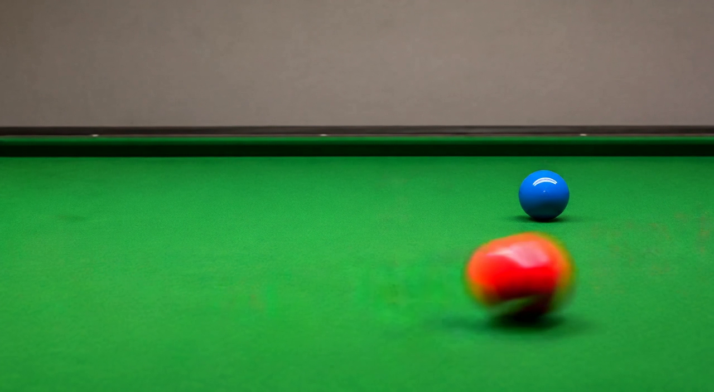
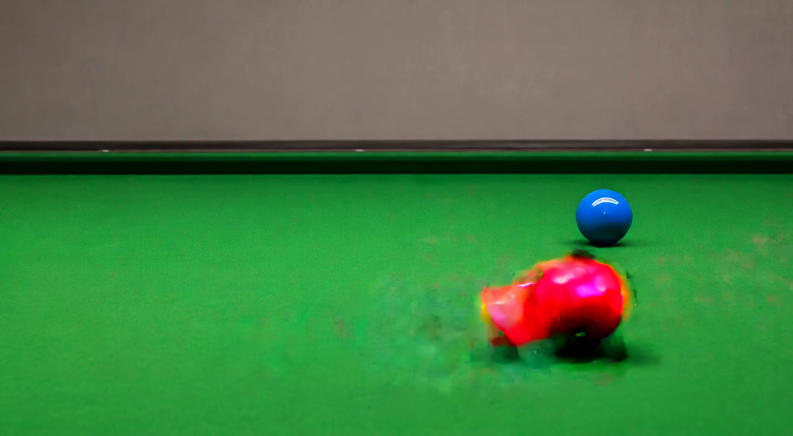

# RIVIA（循影）：根因分析与实现技术说明

更新：2026-09-05。本文与 [主文档](TRACE_strong_stage_json_visual_diagnosis_and_next_plan_20260905.md) 采用同一套设计，在原技术存档位置保留参数依据、逐例关键帧和实现细节。

**RIVIA = Recurrent Inference for Video with Iterative Adjustment。** 方法通过共享 StateBridge 读取视频状态、更新跨去噪步骤的记忆、写回对象与材料变化。正式输入为首帧和简短动作描述，一次噪声初始化对应一条生成轨迹与一条输出视频。

**工程主线是直接替换：把阶段文本差分控制替换为经过训练的状态读写计算。** 每项修复都明确原逻辑、发生问题的环节、替换实现和视频验收结果。训练使用 WISA-80K 与 nkp37/OpenVid-1M 原始视频。

本文引用已有的视觉审计和条件记录。当前完成的是两份文档修订；实现、训练与新视频实验列入后续工作。

## 1. 运行背景与证据范围

### 1.1 两组运行各自是什么

| 项目 | 弱阶段参考 | 强阶段 JSON 运行 |
|---|---|---|
| 目录 | `trace-v3-p02-baseline-20260904-141716` | `trace-v3-p01-p20-strong-stage-json-20260904-144957` |
| 样例 | P02 一条 | P01–P20 共 20 条 |
| 模型 | 本地 Wan2.2-TI2V-5B 既有权重 | 相同模型配置 |
| 生成方式 | I2V，v3 自定义阶段前向 | I2V，v3 强阶段 JSON 前向 |
| P02 输入 | 同一首帧路径；保存的全局、阶段、负面文本与时间路由一致 | plan 的解析结果也与参考一致 |
| 采样设置 | seed 42、UniPC、50 步、CFG=5、shift=5 | 相同 |
| 视频格式 | 1280×704、97 帧、24 fps | 相同 |
| 状态反馈 | 按预设阶段生成 | 按预设阶段与额外 JSON 文本生成 |

baseline 的原始阶段差分系数为 `0.05 / 5 × step_gate`。第 0–14、15–34、35–44、45–49 步对应系数分别为 **0.005、0.01、0.003、0.001**。这组数表示模块内的乘法系数，幅度还取决于原始差分本身。其准确名称是“弱阶段引导参考”。原生 Wan 的全局语义前向作为后续配对实验的基础参考。

[baseline 视频](../outputs/trace_writer/trace-v3-p02-baseline-20260904-141716/P02/i2v/seed_000042/video.mp4)、[强版本 P02 视频](../outputs/trace_writer/trace-v3-p01-p20-strong-stage-json-20260904-144957/P02/i2v/seed_000042/video.mp4) 展现同一种动作失败：红球从蓝球前方经过，蓝球保持静止。强版本增加了彩块、碎块和异常拖影。它支持“增强路径加剧运动外观损伤”的解释，也说明碰撞能力需要新的状态控制和训练。

P02 是当前直接弱/强对照；其他 19 例的现象由逐例视频观察确认。各参数的独立作用通过同输入配对实验判断。

### 1.2 已有画面检查

| 检查内容 | 范围 |
|---|---|
| 强版本全程抽帧 | 20 条视频，每 4 帧取 1 帧，每条 25 张 |
| 首轮关键事件 | P02/P03/P04/P06/P10/P13/P18/P19 连续帧，共 181 个帧次 |
| 首轮原尺寸复查 | 14 个帧次，涵盖球、书、骨牌、木块、气球、瓶子、染料、手与水壶 |
| 弱参考全程 | P02 25 张抽帧及原尺寸图 |
| 后续补查 | P09/P10/P11/P12/P16/P17，共 114 个连续帧次和 36 个原尺寸裁剪帧次 |
| 条件记录 | 20 条视频共 10,000 条注入记录 |

首轮记录合计 720 个目视帧次，包含缩略图与原图的重复观察；后续补查也有重叠。检查范围可由 [视觉覆盖记录](strong_stage_json_audit_20260905/visual_review_coverage.json) 和 [后续复查记录](strong_stage_json_audit_20260905/feedback_followup_20260905/visual_review_record.json) 查看。

现有 PNG 来自 MP4 解码，连续帧图经过缩小和标注，局部裁剪保持原解码尺寸。生成环节的定位实验应分别观察 VAE 输出、编码前图像和编码后帧。

### 1.3 文件尺寸与有效细节

21 条视频的格式为 H.264 High / yuv420p。封装时长约 4.041667 秒，f96 的呈现时间为 4.000 秒。P02 弱参考平均码率约 8.13 Mbps，强版本约 9.35 Mbps；P12 约 14.33 Mbps。这些记录把分析重点指向运动主体的内容与细节。

本地 VAE 的时间和空间压缩比例为 `(4,16,16)`，DiT patch 为 `(1,2,2)`。当前视频对应 `25×44×80` 的 VAE 网格，以及 `25×22×40` 的 DiT 网格，共 22,000 个视频 token。DiT 空间采样步距对应 32×32 输入像素，细节通过多通道与跨位置特征表达。[本地配置](/home/liuzhirui/model/Wan2.2/wan/configs/wan_ti2v_5B.py)

P12 的细种子、P17 的指缘值得检查压缩后的表示能力；P14/P20 的大瓶、大壶也出现块状变化，因而额外注入对整体几何的作用同样重要。通过真实视频的 VAE 重建可测压缩损失，通过同输入生成可测控制损伤。

## 2. 旧计算为什么会损坏运动主体

### 2.1 实际注入方向与幅度

记 `A(q,c)` 为文本注意力输出，`G` 为全局文本输出，`E` 为空上下文输出。旧增强段将阶段文本和 JSON 文本分别编码，计算与空上下文的差分，再把差分幅度匹配到全局文本输出：

```text
D_stage       = Σ temporal_weight × MatchAmplitude(A(stage) - E, G)
D_json_global = MatchAmplitude(A(json_global) - E, G)
D_json_stage  = Σ temporal_weight × MatchAmplitude(A(json_stage) - E, G)
D_extra       = 1.00 × D_stage + 0.25 × D_json_global + 0.50 × D_json_stage
H_updated     = H + G + D_extra
```

实际匹配在活动时间 token 子集上计算，最大放大系数为 10。依据见 [差分幅度匹配](/home/liuzhirui/Project/physGen/code/v3/inference/infer_trace_writer.py:568) 与 [增强段](/home/liuzhirui/Project/physGen/code/v3/inference/infer_trace_writer.py:750)。

| 记录中的幅度比 | 最小值 | 平均值 | 最大值 |
|---|---:|---:|---:|
| 阶段差分 / 全局文本 | 0.9404 | 0.9850 | 1.0313 |
| 全局 JSON 差分 / 全局文本 | 0.2500 | 0.2500 | 0.2500 |
| 阶段 JSON 差分 / 全局文本 | 0.4799 | 0.4969 | 0.5167 |
| 总额外条件 / 全局文本 | 1.4319 | **1.6506** | 1.7434 |

现有幅度截断的缩放系数全为 1，触发次数为 0。前 10 步的总额外条件比例平均为 1.6527，最后 10 步仍为 1.6466。10 层、50 步对应每条视频 500 个注入位置。[条件记录汇总](strong_stage_json_audit_20260905/conditioning_summary.json)

这说明外观形成后段仍承受同量级的额外文本扰动。阶段差分中混合了对象、材质、构图和动作，幅度匹配会共同放大这些分量。**优先根因解释是：模型接收到较强的混合语义改写方向，运动中的对象对应、轮廓与材质因此更容易一起改变。** 具体层与噪声位置的作用由干预实验确认。

替换实现直接使用训练后的状态特征写入。它的方向由正确视频和状态监督学习，语义上下文继续负责场景与动作描述。

### 2.2 参数与 CFG 的真实作用位置

`stage_strength` 控制弱阶段分支；强增强分支使用 `stage_ratio_to_global`、`json_global_ratio_to_global` 与 `json_stage_ratio_to_global`。配置中的 `0.05` 因而只解释对应的弱路径。调用位置见 [强度选择](/home/liuzhirui/Project/physGen/code/v3/inference/infer_trace_writer.py:898) 和 [采样调用](/home/liuzhirui/Project/physGen/code/v3/inference/infer_trace_writer.py:1040)。

原有 CFG 在预测输出处合成。设相同视频 latent 与时间下，基础有条件预测为 `v_g`，加入控制后的有条件预测为 `v_gc`，则：

```text
Δv_final = CFG × (v_gc - v_g)
```

中间特征经过后续网络到达预测输出，这个映射具有非线性。1.65 倍描述局部注意力增量，最终预测的改变量需要在输出处测量。[CFG 合成位置](/home/liuzhirui/Project/physGen/code/v3/inference/infer_trace_writer.py:935)

RIVIA 统一使用一次有条件状态读写前向与一次无条件前向，通过原有 CFG 得到采样预测。训练与评估采用一致的 CFG 设置，报告实际输出变化和视频效果。旧增强段及其强度参数从正式路径移除。

### 2.3 时间条件与真实动作过程的对应缺口

`build_direct_stage_gates` 把阶段时间权重展开到整幅空间网格。它表达的是“这个视频时刻接收哪段文字”。P02 的接触位置、P03 的拍面、P13 的流出口和 P17 的受压区域，都需要对象级的空间信息。[时间权重构造](/home/liuzhirui/Project/physGen/code/v3/inference/infer_trace_writer.py:525)

固定五段也把动作安排交给了预设时钟。真实事件需要由同一物体的状态序列表达：接近后的接触、接触后的响应，以及随后的稳定。RIVIA 将这些关系放入逐时状态，整段状态随去噪步骤重新估计。

替换范围包括时间权重构造、阶段上下文编码和增强段调用。新的写入位置来自当前对象对应关系，动作顺序来自训练得到的状态过程。

### 2.4 JSON 要求与实际视频之间的接口

现有 prompt 已经描述挥拍、源量减少、压缩后恢复等行为。JSON 经文本编码后与阶段文本一起进入注意力，当前生成逻辑仍主要依靠语义条件。

RIVIA 直接编码对象编号、初始位置、动作方向、源与接收者等字段。运行中的观察分支从当前视频特征读出状态，更新部分将观察与目标结合，写入部分把所需状态变化转换成对象区域的特征。

这个接口用可学习的对象状态替换重复的文本条件，根因修复发生在模型处理信息的方式上。

### 2.5 生成、解码和编码分别定位

VAE 解码封装会把输出截断到规定范围；当前抽帧已经包含视频编码的影响。检查伪影来源时，对同一组预测视频 latent 观察解码输出、编码前图像和编码后帧，并对清楚的真实运动视频做 VAE 编解码重建。[VAE 解码封装](/home/liuzhirui/model/Wan2.2/wan/modules/vae2_2.py:1037)、[视频导出](/home/liuzhirui/model/Wan2.2/wan/utils/utils.py:90)

判断与处理直接对应：编码前已出现的彩块定位到生成或解码；真实视频重建出现同类细节损失则定位到表示或编解码；编码后新增的损伤定位到视频导出设置。每种结果都修改它实际发生的环节。

## 3. 全部样例的过程证据

下表记录已有观察，最后一列说明需要改变的计算内容。现象、根因解释与待训练能力分别陈述。

| 样例 | 连续过程与关键帧 | 根因修复位置 |
|---|---|---|
| [P01](strong_stage_json_audit_20260905/P01_dense.png) | f0–f80 缓慢接近；f84–f96 车在桶边仍保持直立 | 前轮与桶的接触位置、整车转动和侧倒终态进入同一状态序列 |
| [P02](strong_stage_json_audit_20260905/P02_dense.png) | f16–f27 红球彩块与拖影明显；f26–f28 红球沿右侧出画；蓝球静止 | 共同生成两球接触前后的轨迹与速度变化，身份特征沿各自轨迹传播 |
| [P03](strong_stage_json_audit_20260905/P03_dense.png) | 拍面近固定，球向下向右离开，f74–f78 出画 | 联合表示手、拍面位姿和球轨迹，让拍面运动参与接触响应 |
| [P04](strong_stage_json_audit_20260905/P04_dense.png) | f0–f60 主要直立；约 f64 起倒下；f65–f83 骨牌弯折收缩 | 每块保持刚体尺寸，以支点转动表达倒下，邻接触传播关联各块状态 |
| [P05](strong_stage_json_audit_20260905/P05_dense.png) | f8 起出现长木条，f48 后长板覆盖坡面 | 方块与坡面分别关联身份，以位移和旋转表达下坡过程 |
| [P06](strong_stage_json_audit_20260905/P06_dense.png) | f20–f72 封面与厚度漂移；f77–f78 闭合外观跳成打开外观 | 用根位姿、书脊轴和开合角生成连续过程 |
| [P07](strong_stage_json_audit_20260905/P07_dense.png) | f16–f44 倾倒伴随顶面与角边起皱，f64 后横放 | 角点、面连接、支点与手接触共同决定转动 |
| [P08](strong_stage_json_audit_20260905/P08_dense.png) | f20–f44、f60–f72 外部细流进入，冰保持较大体积 | 固体与液体共享材料来源，用融化进展驱动边界和液池 |
| [P09](strong_stage_json_audit_20260905/P09_dense.png) | f57→f58 右侧液池突现，f61–f65 细流间歇出现，f73 后再有外部流 | 固液共同更新，以同源融化过程替换独立液池增长 |
| [P10](strong_stage_json_audit_20260905/P10_dense.png) | f25→f26 充气跳增，f44–f48 再次变化，f74 起出现破裂与点阵残留 | 连续充气量、表面张力变化和破裂后橡胶片归属分别表示 |
| [P11](strong_stage_json_audit_20260905/P11_dense.png) | f24–f52 触地前轮廓已波浪化；约 f52 触地；f60 后呈揉皱瓶 | 接触前的玻璃刚体与接触后的碎片组由同一次破裂事件连接 |
| [P12](strong_stage_json_audit_20260905/P12_dense.png) | f36 后种子漂移；f60–f80 网格、透明重影和糊团清楚；花头仍饱满 | 花头附着量、脱离、飞行与出画共同更新，细种子保持对应 |
| [P13](strong_stage_json_audit_20260905/P13_dense.png) | f4 起近直立壶出水，杯量增加；f76–f80 停流；f88 后壶手块状损伤 | 源壶姿态、液面、出流与杯量统一更新，收尾运动继续保持壶手几何 |
| [P14](strong_stage_json_audit_20260905/P14_dense.png) | 倾倒与停流可见；源瓶仍有较高液位；f84–f96 瓶手明显棱面化 | 关联倾斜姿态下的液体分配，以及移动瓶身和手的外观 |
| [P15](strong_stage_json_audit_20260905/P15_dense.png) | f4–f36 沙流与沙堆形成，约 f40 停流，源杯持续较满 | 由同一出料量更新源、流与堆积 |
| [P16](strong_stage_json_audit_20260905/P16_dense.png) | f0 小滴，f1–f2 变大冠状团；f16–f48 水线及上沿附近有蓝色羽状纹理 | 入水事件与水域内扩散分开表达，结合透视识别空气滴、飞溅和反射 |
| [P17](strong_stage_json_audit_20260905/P17_dense.png) | 海绵保持原厚度；f68–f80 手撤离并出现指缘彩点；f82–f84 有残留 | 手接触驱动厚度下降，释放驱动恢复；手部随运动保持结构 |
| [P18](strong_stage_json_audit_20260905/P18_dense.png) | f27–f29 首次接地；f29–f39 上下两球共存，下球缩小消失；上球再次下降 | 同一球的整段轨迹和接触序列贯穿反弹，单独处理地面倒影 |
| [P19](strong_stage_json_audit_20260905/P19_dense.png) | f12 后起皱，f24–f25 中央大缺口突现，双手分离有限 | 抓持点运动、裂口发展与两片材料的对应共同生成 |
| [P20](strong_stage_json_audit_20260905/P20_dense.png) | 倒水、杯量上升和约 f76 停流可见；f80–f92 壶盖、壶身、手柄块状变化 | 刚体位姿与材质随收尾运动保持连续，水流和接收量关联 |

### 3.1 原尺寸证据

P02 弱参考 f24 的红球具有较圆滑的轮廓和运动模糊，强版本同帧出现洋红高光块、橙色突出部分与拖影：





[P02 接触区间连续帧](strong_stage_json_audit_20260905/P02_transition.png) 显示两球的实际路线。[P04 f68](strong_stage_json_audit_20260905/P04/f068.png) 和 [P06 f48](strong_stage_json_audit_20260905/P06/f048.png) 显示几何变化已进入骨牌与书的结构。

[P14 f96](strong_stage_json_audit_20260905/P14/f096.png) 与 [P20 f84](strong_stage_json_audit_20260905/P20/f084.png) 显示移动瓶壶损伤与相对稳定的杯子、背景并存。[P18 f32](strong_stage_json_audit_20260905/P18/f032.png) 及 [接触后连续帧](strong_stage_json_audit_20260905/P18_transition.png) 同时显示上方第二球、低处原球和低处球的地面倒影。

### 3.2 补查的运动细节

| 样例 | 连续帧 | 原尺寸裁剪 | 检查内容 |
|---|---|---|---|
| P09 | [f56–f80](strong_stage_json_audit_20260905/feedback_followup_20260905/P09_consecutive.png) | [黄油与液池](strong_stage_json_audit_20260905/feedback_followup_20260905/P09_native_crops.png) | 液池突现、外部细流、固体保留 |
| P10 | [f20–f32](strong_stage_json_audit_20260905/feedback_followup_20260905/P10_consecutive.png) | [气球表面](strong_stage_json_audit_20260905/feedback_followup_20260905/P10_native_crops.png) | 充气阶段体积变化和表面粗块 |
| P11 | [f44–f64](strong_stage_json_audit_20260905/feedback_followup_20260905/P11_consecutive.png) | [瓶身](strong_stage_json_audit_20260905/feedback_followup_20260905/P11_native_crops.png) | 接触前后材质和碎片形成 |
| P12 | [f60–f80](strong_stage_json_audit_20260905/feedback_followup_20260905/P12_consecutive.png) | [飞行种子](strong_stage_json_audit_20260905/feedback_followup_20260905/P12_native_crops.png) | 网格、双影、细丝与花头变化 |
| P16 | [f0–f12](strong_stage_json_audit_20260905/feedback_followup_20260905/P16_consecutive.png) | [水线附近](strong_stage_json_audit_20260905/feedback_followup_20260905/P16_native_crops.png) | 入水过程、介质边界和反射 |
| P17 | [f68–f88](strong_stage_json_audit_20260905/feedback_followup_20260905/P17_consecutive.png) | [撤离的手](strong_stage_json_audit_20260905/feedback_followup_20260905/P17_native_crops.png) | 指缘、彩点、残影与手的连续形状 |

## 4. 按物体结构表达正确过程

### 4.1 接触、支撑与合法形变

物体记录包含身份、各视频时刻的位置与朝向、可见性、接触和支撑。视觉特征保存材质和细节；状态量表达可检查的运动关系。

| 对象或动作 | 合适的状态表示 | 变化如何发生 |
|---|---|---|
| 双球与弹球 | 球身份、中心与轮廓、接触区间、速度方向 | 同一球连续接近、接触、响应，反弹高度随序列变化 |
| 球拍击球 | 手与球拍的连接、拍面朝向与速度、球轨迹 | 拍面运动和接触共同决定球的后续方向 |
| 骨牌与箱子 | 刚体位姿、角点、厚度、转动支点 | 整体旋转改变姿态，邻接触或手部施力提供原因 |
| 开书 | 书的根位姿、书脊轴、封面与页组开合 | 坠落和触地后，围绕实际连接结构连续展开 |
| 压海绵 | 手接触、海绵上下表面、厚度、桌面支撑 | 施力时厚度下降，释放后恢复，底面持续受支撑 |

P02 首先需要学会到达接触位置，再学习运动传递。P03 的球拍运动、P17 的真实压缩同样属于必要中间过程。对终点或单个进度数字的监督应被整段状态监督替换。

首帧特征主要提供对象身份与材质，运动对应关系决定这些特征随对象转移的位置。旋转显露的表面由当前视觉特征与视频训练共同生成，书与海绵按自身结构改变外形。

### 4.2 来源、途中与接收端共享材料状态

倒水、倒沙、融化与种子脱落具有共同结构：同一材料在不同位置或形态间转移。状态编码使用材料总记录，并以同一传递量更新相关区域。

```text
source(τ) + transit(τ) + receiver(τ) + accounted_outflow(τ) = initial_amount
source(τ + Δτ)   = source(τ)   - q_out × Δτ
transit(τ + Δτ)  = transit(τ)  + (q_out - q_in - q_leave) × Δτ
receiver(τ + Δτ) = receiver(τ) + q_in × Δτ
```

这些量可以表示经标定的质量，也可以表示归一化材料份额，训练记录明确对应的含义。首轮真实视频以可见相对量为主。

- **倒水与倒橙汁：** 容器姿态和液面使液体到达出口，源、流束与接水杯由同一转移过程驱动。P13 的接水杯可保持位置，源壶需要形成合理出流姿态；P14 已有倾倒，重点补源量与瓶手外观。
- **倒沙：** 杯内沙面随姿态与出料量变化，途中沙流连接出口与堆积，停流后的颗粒继续沉降。
- **融化：** 同一材料的固态部分减少、液态部分增加，液体从相应边界形成。热条件与显示时长共同确定合理的变化速度。
- **蒲公英：** 附着、脱离、飞行和出画保留共同来源，花头稀疏度随脱离量更新。可辨种子使用个体轨迹，细密部分使用群体分布。

内部材料关系提供正确条件，输出视频中的源端、流和接收端变化提供实际执行证据。液位结合容器姿态解释；金属水壶的内部材料量按可观测范围标注。

### 4.3 破碎和撕裂使用来源关联与形态转换

P10/P11/P19 的共同表示是：材料保留来源，事件改变其连接关系。

气球使用充气状态、泵嘴连接、表面变化和破裂事件，破裂后由同源橡胶片继续运动。充气过程可以非线性，爆裂可以快速发生，两者用各自的连续过程评价。

玻璃瓶在接触前用完整刚体表示，接触后由同源碎片组表示形状与运动。材料父记录保存来源，完整瓶体的可见区域随碎片形成转换。碎片尺寸依据实际事件，允许可辨瓶底、瓶颈等较大部分。

纸张以双手抓持点、裂口前沿、折叠和两片材料的位置对应表达撕裂。投影面积随折叠和遮挡变化，材料连续性通过对应关系判断。

这组表示直接替换“初态外观与终态外观相互插值”的生成思路。过程监督让每次变化沿物体结构和实际作用发生。

### 4.4 染料扩散以入水点和水域为基础

P16 同时涉及入水过程和介质边界。状态中记录容器、水域、空气中液滴、入水事件和水中染料分布。模型先生成液滴穿越水面的过程，再更新水中的区域分布。

水域中的扩展可参考有来源的输运与扩散关系。对于普通真实视频，第一版使用可见区域和相对浓淡变化；具有标定或仿真依据的样本再使用浓度与流速。透视、折射与反射参与水域判断，空气中飞溅有其来源与轨迹。

对应的替换是：让粗区域图经过共享 StateBridge 驱动水中分布，并把入水前液滴作为独立阶段的同源材料处理。水面附近的深色核随实际分布更新，颜色变化结合光程与视角解释。

### 4.5 运动细节随对象对应关系生成

移动手指、玻璃边缘和种子细丝需要连续的局部对应。读写空间包含对象内部、边缘、交互区域、刚离开和新显露的区域。P02 的残影、P17 的指缘和彩点、P20 的壶盖与手柄均可在这些位置检查。

原型先通过真实视频重建和正确状态写入确定细节损失来源。若对象内部状态清楚而边缘细节受表示尺度影响，就在同一 Bridge 中调整边缘特征的采样尺度；数据继续提供对应材质的正常运动。接触速度变化、爆裂与细丝摆动按其事件特点评价。

## 5. 共享读写与循环记忆怎样实现

### 5.1 状态组织

首轮结构采用共享 StateBridge，包括目标初始化、视觉读取、记忆更新和特征写入。各部分共享状态空间，读与写可使用各自的小型投影。

| 内容 | 来源 | 用法 |
|---|---|---|
| 身份特征 | 首帧对象区域与当前对应区域 | 关联同一对象在各时刻的表现 |
| 观察状态 | 当前去噪步骤的 DiT 特征 | 描述当前整段视频的对象位置、关系和变化 |
| 动作目标 | 首帧、简短动作描述及初始生成特征 | 提出符合布局的粗略过程 |
| 跨步记忆 | 上一去噪步骤的记忆与本轮观察 | 保留身份、过程意图和变化历史，并据当前特征更新 |
| 材料区域 | 来源、途中、接收端及介质分布 | 联合生成同源材料的变化 |

状态按物体和视频时间索引。当前设置有 25 个 latent 时间位置，每次去噪都更新整段序列。可见、遮挡、出画、完整物体与同源碎片分别表达。未知字段通过训练标签的可见范围处理。

### 5.2 读取、更新与写入

记 `H_k` 为第 k 个去噪步骤读出位置的特征，`M_k` 为跨步记忆，`G` 为动作目标，`σ_k` 为实际噪声时间。共享模块按以下顺序计算：

```text
observed_k = Read(H_k, object_identity, σ_k)
M_(k+1), state_change_k = Update(observed_k, M_k, G, σ_k)
H_l_updated = H_l + Write(H_l, state_change_k, object_regions_k, σ_k)
```

Read 的状态输出来自视频特征，Update 再结合动作目标。这样，当前观察与期望过程在计算上具有各自来源。

Update 学习怎样调整完整状态序列。接触问题同时涉及接触前路径和接触后的响应；材料问题同时涉及源、途中与接收端；形变问题沿书脊、受压表面或裂口等结构更新。这些关联属于状态计算的主体。

Write 把更新后的状态特征送入对象与交互区域。写入投影从零初始化，方向和尺度由生成训练共同学习。当前前向在较前位置读取，在后续少量层写入，每步提交一次持久记忆。

噪声时间参与读取、记忆更新与写入训练。中前段形成动作结构、后段完成外观细节的分工通过不同噪声位置的监督与实验确定。

### 5.3 一条生成轨迹的调用顺序

以下是待实现的职责示意，具体函数组织随推理入口的替换确定：

```python
z = initialize_video_noise(seed)
memory, goal = bridge.initialize(first_frame, action_context, z)

for step, timestep in enumerate(scheduler.timesteps):
    v_cond, memory = conditional_forward_with_statebridge(
        z, timestep, action_context, first_frame, memory, goal
    )
    v_uncond = unconditional_forward(z, timestep, first_frame)
    prediction = v_uncond + cfg * (v_cond - v_uncond)
    z = scheduler.step(prediction, timestep, z)
    z = apply_first_frame_condition(z, first_frame_condition)

video = vae.decode(z)
```

`conditional_forward_with_statebridge` 在同一次前向内部执行 Read、Update 和后续 Write。无条件前向使用基模型计算；新的记忆由有条件前向产生。采样器每步接收一次合成预测，并按自身历史推进。

初始噪声生成一次，状态记忆持续到该条视频结束。下一条请求重新初始化自己的记忆。最终视频通过独立评价衡量动作、物理与画质，内部状态记录用于分析原因。

### 5.4 名称与论文方法的对应

RIVIA 的 Recurrent 对应 `M_k → M_(k+1)`；Inference 对应从 `H_k` 读取视频状态；Iterative Adjustment 对应状态更新、特征写回以及下一步对结果的重新观察。“循影”取自循环反馈与连续视频过程。

论文可以围绕三个可检验内容组织：共享对象与材料状态表示；跨去噪步骤的记忆与反馈；真实视频监督下的过程纠正和外观保持。实际贡献由状态写入、反馈和记忆的分别对照确认。

## 6. 真实视频数据与训练目标

### 6.1 数据接入

| 数据源 | 使用内容 | 准备方式 |
|---|---|---|
| [WISA-80K](https://huggingface.co/datasets/qihoo360/WISA-80K/tree/dddbd5683581c2ebf0b463e2b1c3342b2094bfb3/data) | 视频、类别、物理描述、caption 与质量信息 | 从完整物理过程开始，结合画面补状态标签 |
| [nkp37/OpenVid-1M](https://huggingface.co/datasets/nkp37/OpenVid-1M) | 原始视频、caption、质量与运动等元数据 | 补充清楚运动、手部操作、材质和场景多样性 |

共同路径为原始视频解码、真实时间取帧、Wan VAE 编码与训练缓存。样本选择保留施力者、接触点、材料来源与动作结束。热变化和长过程明确显示时间尺度。

WISA 的语义类物理信息用于检索和辅助标注，逐时接触与材料变化由视频观察建立。[WISA 官方说明](https://github.com/360CVGroup/WISA)、[在线字段预览](https://huggingface.co/datasets/qihoo360/WISA-80K)

OpenVid 元数据帮助初筛，完整动作与局部运动细节仍按相关片段观察。[OpenVid 数据说明](https://huggingface.co/datasets/nkp37/OpenVid-1M)

首轮从约 500–1,000 条相关视频起步，抽查约 100–200 条关键过程；随后按类别覆盖扩大到约 5,000–10,000 条有效片段，再扩展数据规模。这些数量是启动安排，具体取决于相关动作的实际覆盖。

### 6.2 标注与数据划分

| 状态 | 可用监督 |
|---|---|
| 对象身份与位置 | 连续框、分割区域、轨迹和遮挡标记 |
| 接触与支撑 | 接触区间、接触对象、支撑解除与响应顺序 |
| 几何变化 | 位姿、角点、书脊开合、海绵厚度 |
| 材料转移 | 来源、途中、接收区域与可见相对量 |
| 破碎与撕裂 | 事件区间、材料来源、裂口和碎片组 |
| 细粒子与染料 | 可辨个体轨迹、群体分布、介质边界 |

自动工具辅助得到标签，人工复核关键区间。字段标明图像坐标、归一化尺度或已标定单位，并记录可见范围。未知部分保留未知；已标注部分参与状态监督，全部清楚视频参与生成监督。

训练与评估按原始视频和场景分组。同一视频的相邻片段、加噪版本和近重复内容处于同一分区。P01–P20 用作开发验收，独立场景用于评估泛化。

### 6.3 先学习目标与写入

Wan、T5 和 VAE 保持既有权重，训练共享 StateBridge。写入模块的梯度经过相关主干层传播，训练保存必要的中间激活。

训练目标保留两个主要部分：

```text
L = L_generation + λ_state × L_state
```

`L_generation` 学习真实视频的画面与过程。`L_state` 学习目标预测和可观察状态，连续量按尺度归一化，离散事件采用相应分类监督，各字段按标注有效范围参与。

在下面的加噪约定中，单步生成训练使用与模型一致的速度目标：

```text
z_σ = (1 - σ) × z_clean + σ × noise
v_target = noise - z_clean
z_clean_estimate = z_σ - σ × v_pred
```

实施时采用 Wan 实际的时间与速度约定，并保留首帧条件。位置、接触和源量的可靠状态提供辅助学习，清楚的真实视频同时提供球面、玻璃、手部与金属表面的生成目标。

先比较人工过程状态输入与首帧/描述预测目标两种设置。前者测写入表示是否足够，后者测正式条件下的目标生成能力。进一步通过移除状态输入的实验测量状态控制实际贡献。

### 6.4 观察监督使用实际生成状态

真实视频加噪提供读取训练的起点，模型实际生成过程补充其会遇到的中间状态。离线保存少量去噪步骤的特征，并解码这些步骤对清楚视频的估计，用独立工具和人工标注实际表现。

对应标签分别描述球的位置与数量、拍面接触、液面变化、海绵压缩和纸裂口等。高噪声、遮挡与反射含糊的区域按可辨程度提供监督。当前最终 MP4 继续用于问题归类，内部状态训练使用带对应特征的记录。

观察值和动作目标各有标签来源：观察描述当前生成内容，目标描述任务需要的过程。训练与评估都保持这一分工。

### 6.5 短循环训练与完整采样

短循环从同一真实视频的加噪表示开始，先展开 2–4 个去噪步骤。每步使用当前模型更新后的 latent 与上一轮记忆；动作目标由该样本的首帧和描述产生，开发阶段的人工状态实验另行报告。

单步训练使用速度监督。短循环训练可在展开末端用当前预测得到 `z_clean_estimate`，与这条参考视频的 `z_clean` 对齐，把它作为该阶段的生成监督。这样，监督目标与展开起点来自同一个视频；中途状态的更新由实际网络预测产生。该训练安排需要通过完整采样结果检验效果。

自由生成记录用于补充读取与状态纠正监督，真实视频的配对训练负责清楚视频的生成目标。随后评估完整 50 步下的状态连续性，并逐步增加实际生成中间状态在读取训练中的比例。

如果效果定位到目标预测、观察或写入中的某一部分，就直接修改该部分的数据与计算，再重复对应的完整视频实验。

### 6.6 计算规模

当前单层特征有 22,000 个 token、每个 3072 通道，bf16 下约 129 MiB。若记录 6 层、8 个去噪位置，仅完整特征就约 6 GiB/视频。

训练数据优先保留对象池化特征和必要的区域图，少量研究样例记录完整特征。Reader 的离线训练可复用这些特征；写入和循环训练需要经过实际视频主干计算。

原型尺寸、帧数与批量根据显存测量安排。改变视频尺寸或长度时，同步调整 VAE 网格、DiT 时间位置、状态序列和首帧条件。最终回到 1280×704、97 帧评价当前问题，尤其查看手、种子和玻璃的运动细节。报告时间、峰值显存、训练参数量与前向次数。

## 7. 用配对实验验证根因修复

### 7.1 对照设置

| 实验 | 要回答的问题 |
|---|---|
| 原生 Wan 与现有弱/强参考 | 基础外观能力与旧文本增强的影响分别是什么 |
| 人工过程状态与预测过程状态 | 写入能力和目标初始化各自表现如何 |
| 按目标写入与根据观察反馈写入 | 读取实际偏差是否改善动作过程 |
| 每步重建记忆与跨步保留记忆 | 历史状态是否减少身份切换、过程重复和状态摆动 |
| 联合材料状态与各区域独立状态 | 共同更新是否改善源、流、接收端的对应 |
| 对象对应写入与原整帧时间注入 | 空间作用位置是否改善运动主体的形状和细节 |
| 真实视频 VAE 重建与生成输出 | 压缩表示和生成控制各自造成哪些细节损失 |

每个方法在同一输入协议下单次生成。独立 seed 用于预先安排的稳定性评估，全部结果进入统计。计算成本随结果一起报告。

先使用 P02/P18 和 P13/P15 建立接触、身份与材料转移能力，P06/P14/P20 检查运动外观，再扩展到骨牌、手部、融化、破碎、种子和扩散。每组同时检查其他已覆盖类别。

### 7.2 视频验收

| 维度 | 检查内容 |
|---|---|
| 动作完成 | 原因、启动、关键作用、中间变化、结束与终态保持 |
| 物理关系 | 同一物体的连续性、接触后响应、支撑、材料转移、合法形变 |
| 运动画质 | 主体轮廓、材质、原尺寸细节、拖影与空出区域 |
| 计算成本 | 完整生成时间、显存、网络调用次数 |

主文档中的 P01–P20 表规定各例通过目标。技术评价进一步记录首个错误帧、错误区间、对象和事件类型，并查看最差的连续片段。

球出画与消失分别判定；倒影与第二个实体分别计数；海绵恢复结合先前的压缩；源量结合容器姿态；裂口、碎片和爆裂结合材料来源。自然运动模糊、火焰变化和真实快速破裂按其物理过程评价。

独立视频检查与人工复核承担最终判断。动作、物理与画质分别报告，联合结果要求三项同时达到相应标准。以视频和场景作为统计单位，样本规模随稳定性实验逐步增加。

## 8. 在现有入口直接替换错误逻辑

以下为待实施改动，按计算职责组织。

| 现有位置 | 旧逻辑 | 替换实现 |
|---|---|---|
| `compile_structured_guidance` | 把 JSON 编成额外文本描述 | 对象、关系、方向与材料字段直接进入状态编码 |
| `encode_direct_contexts` / `project_direct_contexts` | 编码并投影多路阶段和 JSON 上下文 | 全局语义走文本编码，状态与首帧视觉特征走 StateBridge |
| `build_direct_stage_gates` / `stage_step_gate` | 用阶段时钟与固定幅度安排控制 | 由整段对象状态确定空间作用位置，噪声时间参与共享模块训练 |
| `staged_model_forward` | 多路文本差分、幅度匹配和增强段 | 同一次前向内部读取、更新记忆，并在后续层写入状态特征 |
| `predict_with_direct_stages` | 在有条件分支叠加阶段增强 | 使用统一 RIVIA 有条件前向，与基模型无条件预测按 CFG 合成 |
| `generate_with_direct_stages` | 循环传入阶段上下文和强度参数 | 初始化物体记忆，按去噪步传递记忆、更新一次采样状态 |
| 数据与训练 | 主要依靠描述驱动动作 | 原始视频生成监督、可靠状态监督和短循环训练共同学习 |
| 评价 | 通过张量状态或单一分数概括结果 | 以完整动作、实际物理关系和运动主体画质验收 |

移除旧增强段时，同时移除其上下文构造、参数传递和调用入口。正式推理使用统一的状态读写逻辑；原生参考通过模型原有接口运行，历史结果保留为对照证据。

实施顺序为：统一前向与数据接口；训练目标与状态写入；建立实际状态读取；训练并评估循环记忆；按材料与事件扩充数据。每阶段把观测到的失败定位到对应计算后直接修改。

## 9. 与既有 StateBridge 思路的整合

[9 月 4 日方案](TRACE_v3_visual_audit_and_v4_statebridge_plan_20260904.md) 提出了短语义、非文本状态和共享读写接口。RIVIA 继续使用这条主线，并明确以下设计：

- 对象身份与每个视频时刻的状态共同进入记忆，跨去噪步骤更新整段过程。
- 实际观察与动作目标分别计算，共享更新部分学习怎样修正偏差。
- 接触、支撑、材料转移、书脊开合和裂口发展用适合的状态表示。
- 同一前向内部完成读取与后续写入，正常采样器负责推进视频 latent。
- WISA 与原始 OpenVid 提供主要训练视频，状态标注按可观察范围逐步补充。

旧报告审计的是三组历史运行，本轮分析针对 P0 直接提示路径后的强 JSON 与 P02 弱参考。当前 P01 朝向、P10 泵嘴、P19 双手和 P20 持壶手已与部分历史样例不同。根因判断依据当前运行的实际输入和计算路径。

论文方法与完成标准围绕同一个问题组织：**通过带记忆的内部状态读写，让单条生成中的动作原因、中间过程和最终结果连续成立，并保持运动主体的清楚外观。**

## 10. 方法参考与证据入口

| 来源 | 对本方案的具体参考 |
|---|---|
| [RIN](https://arxiv.org/abs/2212.11972) | 内部向量读写数据特征，并把内部信息传到后续去噪步骤 |
| [Readout Guidance](https://arxiv.org/abs/2312.02150) | 从生成网络中间特征学习可观察属性的读出 |
| [VideoJAM](https://arxiv.org/abs/2502.02492) | 联合考虑外观与运动表示，为状态写入的训练组织提供参考 |
| [现有 StateBridge 方案](TRACE_v3_visual_audit_and_v4_statebridge_plan_20260904.md) | 短语义、非文本状态和共享模块的项目设计基础 |
| [条件记录](strong_stage_json_audit_20260905/conditioning_summary.json) | 强路径实际注入幅度的依据 |
| [全程抽帧](strong_stage_json_audit_20260905/) 与 [连续帧复查](strong_stage_json_audit_20260905/feedback_followup_20260905/) | 各样例动作、局部形变和伪影的画面依据 |

研究参考支持结构与训练方向，RIVIA 在当前 Wan 模型上的效果由上述配对实验和逐例视频验收建立。
