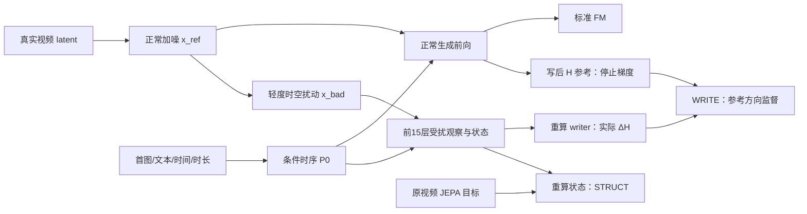

# v4.2：直接监督 ΔH 与条件时序状态的增量设计

日期：2026-09-17。本设计接续[故障与监督信号分析](20260917_v4.2_监督信号与生成故障修正设计.md)。**本轮的主体是改变训练任务与状态初始化，不是增加一套监控后维持原方法。** 新正式配方是 `fm_struct_write_repair_trajectory_v1`，已写入 `configs/stability.yaml`。固定 Wan、VAE、T5、JEPA 路径与数据配置保持不变。

## 1. 从失败经验出发，应该改什么

v4 已有少量有用修正，但仍有外观/身份变形、提示词动作未完成、运动中融化、闪色和物理响应错误。旧 v4.2 的 step0100 则出现更严重的色块。此前实测说明：

- 不能归因于一个 gate：v4 某些 state gate 接近零，但 writer 的实际 ΔH/H 仍可达约15%；state gate 与 write gate 不是一件事。
- 不能只增加 STRUCT：旧比例规则在 step100 允许 core 的有效结构梯度约为其生成梯度36倍；与此同时，STRUCT 不直接训练 writer。
- 不能只追求更接近 teacher 的 P：把 P 换成真实 teacher、令 STRUCT=0，单步 FM 并未达到最优。P 表征和 H 中有益的修正之间缺少明确执行监督。
- 不能把时间复制当成运动先验：旧 P0 各时间槽完全相同，T2V 的不同提示词初始化差异极小；I2V 初始化不读文本。core 要同时补出动态状态并找到正确写回方向。
- 原随机训练 FM 曲线没有稳定下降；固定面板上旧权重仍比 base 有几个百分点的单步改善。说明有学习，但局部均方误差收益不足以保证自由生成质量。
- 本地同条件 base-only 也有异常，故新方法不能被描述成“已经证明解决所有噪声根因”。真实缓存局部重建正常，原生与现有 VAE 对相同故障 latent 的解码完全相同。

据此采用两个实质增量：**让 writer 学习有参考目标的 ΔH 修复；让 initializer 直接产生受首图/文本约束的时序状态。** FM 保持最终生成约束，STRUCT 保持视频状态监督，取消旧 RGB TEMP、特殊第八条和固定6/2模式配额。

## 2. 各类问题与新机制的对应关系

| 失败 | 旧方法缺口 | 本轮改变 | 预期改善机制 |
|---|---|---|---|
| 物体/脸部形变、局部伪影 | 只知道 P 要像 JEPA，不知道 H 应往哪里改 | 同噪声配对 H 目标直接监督 ΔH | 学会将受扰隐状态拉回真实视频对应的隐状态附近 |
| 运动过程中外观漂移、闪变 | 旧 RGB 差分目标可能靠抑制变化取巧 | 连贯的时空扰动与真实参考配对，目标仍保留真实运动 | 修复偏离真实轨迹的表征，不把运动差分压到零 |
| 提示词/首图利用弱 | I2V P0 忽略文本，T2V 时间槽复制，结构梯度曾被切断 | 首图/均值、完整文本 tokens、时间位置、时长共同生成 P0 | 为 core 提供与条件有关的粗时序状态；FM 与 STRUCT 都能训练 initializer |
| 接触响应、轨迹等错误 | 静态状态复制与 writer 执行缺口叠加 | 时序 P0 + 最终状态监督 + 实际 H 修复任务 | 更好利用真实视频中的过程信息，减少状态学到了、生成未执行的脱节 |
| 扩大校正后画质崩坏 | 幅度与方向混为一谈 | ΔH 向量目标、实际幅度上限及 FM 梯度方向协调 | 学会具体纠错方向，同时避免无约束破坏已学分布 |

最后一列是机制层面的预期，不是已测得的百分比收益。尤其碰撞、支撑、守恒等，当前数据没有可靠逐事件物理标签；本轮利用真实视频过程作隐式监督，不能声称加入了显式动力学求解器。

## 3. 直接监督 ΔH：配对隐状态修复

### 3.1 使用同一参考，避免跨空间硬对齐

设真实视频 latent 为 `x0`，噪声为 `ε`，正常加噪输入为：

`x_ref = (1−σ)x0 + σε`。

学生读取 `x_bad = x_ref + e`。参考与学生具有相同视频、文本、首图、σ、噪声和几何坐标。正常FM前向已经给出两处**完成 writer 更新后的** `H_ref,5⁺`、`H_ref,15⁺`；直接复用它们并stop-gradient，不新增EMA参考前向。受扰支路只运行到第15层以取得修复起点。两条路径均从可部署条件初始化P，不把GT JEPA状态塞进initializer。

学生正常计算：`H_bad,ℓ⁺ = H_bad,ℓ⁻ + ΔH_ℓ`。直接监督目标为：

`ΔH*_ℓ = stopgrad(Π_B[H_ref,ℓ⁺ − H_bad,ℓ⁻])`。

`Π_B` 把目标投影到该层原有的 token/帧 RMS 预算内。这个目标在 **同一 Wan 的同一层、同一噪声强度、同一坐标空间** 中形成，不是把1664维JEPA向量硬投到3072维H后假定它正确。

参考保留当前 writer 在正常输入上已学到的修正，而非永远要求回到原始基座 H。第15层目标以学生实际进入第15层的 H 为起点，因此包含第5层校正传播之后仍需修复的偏差，不假定两层写入彼此独立。

### 3.2 学什么损失

对第5/15层分别计算：

`L_WRITE,ℓ = mean_valid ||(ΔH_ℓ − ΔH*_ℓ)/(B_ℓ R_ℓ)||²`，

`L_WRITE = (L_WRITE,5 + L_WRITE,15)/2`。

`R_ℓ` 使用和实际写回一致的基座/当前 H 帧 RMS 参考；归一化分母 detach，并设数值下限。已知首片与纯 padding 不参与损失。目标投影是对**两级soft-bound联合可达范围**的幂等径向投影。令 `r_t=RMS_token(target)/(2BR_token)`、`r_f=RMS_frame(target)/(BR_frame)`，每帧按 `min(1,0.95/max_token sqrt(r_t²+r_f²))` 缩放。它使目标有有限的前限幅候选解；已经位于该范围内部的参考修正不再缩小。不能只把目标硬裁到帧上限B：那可能处于soft-bound不可达到的边界，反而逼候选幅度无限增大。0.95是可达性余量，不是STRUCT的梯度比例缩放。

这里监督的是非零的有方向向量，**不是 `||ΔH||²` 收缩正则**。gate 也接受该损失：该位置有可学习修复目标时，长期关门会留下误差；无需人为规定“gate 必须大”。关闭 gate 本身不再被当作校正成功。

### 3.3 如何产生受扰输入

当前实现采用轻度、连续变化的 latent 空间形变和通道漂移，配对目标始终是原真实视频。扰动先排除 padding 与 I2V 已知首片，再按真实 latent RMS 归一化：

`e = σ(1−σ) · a · d`，其中 `a∼U(0,0.2)`，`RMS(d)=RMS(x0)`。

空间位移场的RMS配置尺度为0.5个latent像素；它与平滑通道漂移组合。所有曝光的FM都使用正常加噪输入。辅助支路中25%曝光保持 `e=0`，其余使用连续扰动强度；该比例不削减正常FM曝光。所有8条普通曝光遵循同一规则并计算相同损失，没有“第八条才启用另一套目标”的调度。

这是可恢复的表征扰动任务，不宣称latent某个通道就是RGB颜色，也不把形变扰动自动标注为违反物理。真实参考中的运动、变形、遮挡仍是目标；液体形变与刚体形变不能用一个手工物理标签混淆。

**标准FM不在受扰输入上训练。** 原FM继续使用 `x_ref` 和 `ε−x0`。因为扰动依赖σ，把 `ε−x0+e/σ` 直接称为新插值路径的精确FM速度是不成立的：它是端点恢复目标，而该路径的导数涉及 `∂e/∂σ`。本轮明确避免这种目标混淆。

辅助WRITE在 `x_bad` 上学习修复，STRUCT也用同一受扰观察重算状态，teacher目标仍是原视频。另在固定health中记录 `v_endpoint = ε−x0+(x_bad−x_ref)/σ` 的恢复误差，仅用于诊断是否能回到原latent；字段明确标为 `endpoint_velocity_mse`，不计入FM训练或冒充标准FM验证。

### 3.4 梯度职责

| 目标 | initializer / core | writer / write gate | Wan/JEPA |
|---|---|---|---|
| FM | 有梯度 | 有梯度 | 权重冻结，但保留对校正输入的反传 |
| STRUCT | 有梯度 | 无梯度 | 冻结 |
| WRITE | 无梯度：P与H观察detach | **直接有梯度** | 参考分支no_grad |

实现先在正常输入完成FM反向并保留detach的参考H；受扰时再运行冻结的前15层观察路径。两个小writer用detach的受扰P/H重算WRITE梯度，状态支路用受扰H重算STRUCT梯度。不会对参考目标反传，不加载第二个5B模型，也不在微批处理中替换参数。

这比“所有监督都压给 core，希望 writer 跟上”更明确：状态监督负责视频表征，WRITE负责将有用信息转换成 H 空间执行，FM负责最终速度预测。保留每组对 FM 冲突方向的辅助梯度投影：core/initializer 对应STRUCT，writer对应WRITE；不再沿用全模型20%缩放。

## 4. 条件时序初始化：让 P0 表达过程

新 `ConditionTrajectoryInit` 使用：

- I2V：首图 JEPA anchor + 完整文本 tokens；T2V：训练集首图均值 + 完整文本 tokens。
- 每个状态位置的真实时间相位/空间位置，以及 `log(duration/5)` 时长条件。
- 两层空间、时间、文本 attention，输出16个时间槽各自的初始状态增量。

`P0 = A_condition + bounded ΔP_init(text, A_condition, time, duration)`。

输出层零初始化，因此训练开始仍等于原锚点/均值；之后不再由expand强制所有时间槽相同。初始化增量按teacher尺度作界限，FM和STRUCT共同训练。I2V initializer也可学习文本所要求的后续动作，不再把同一首图无条件复制成全部未来状态。

推理只计算一次条件 P0，在每个solver调用中仍reset到这个P0。保留原“每步reset”契约；本轮没有再叠加跨去噪步的可变记忆或额外未来输入。

## 5. 配方、成本和兼容

正式目标共三项，各自信息来源和职责不同：

`L_nominal = L_FM + λ_S L_STRUCT + λ_W L_WRITE`。

`λ_S = 0.1·min(step/200,1)·clip((1−σ)/0.2,0,1)`；

`λ_W = 0.05·min(step/200,1)·clip((1−σ)/0.2,0,1)`。

STRUCT沿用teacher MSE，不另加RGB TEMP、时间差分损失或未经标注的守恒项。WRITE新增的是执行空间的配对目标，不能把它藏进STRUCT里声称“没有增加损失”。raw loss不硬截断，保留系数上限、全局grad_clip=1和原ΔP/ΔH/最终velocity预算。

数据仍为2400条原划分与原处理，I2V/T2V逐条等概率；总1200步、每步8曝光、LR组、EMA=.995、基座路径、采样器/50步/CFG5均不改。新initializer将总可训练参数从65,046,274增至68,266,498（增加3,220,224），因此必须新建run，旧checkpoint仍按旧结构推理。不能将v4或无gate的step0100当成这个新结构的断点。

原FM前向为55次Wan block执行；有扰动时辅助观察增加25次（前5、基座5→15、校正5→15），无扰动时直接复用原观察。默认75%受扰，平均前向block数增加约34%；实际总耗时还包括反向，不能直接等同于34%。辅助观察无需head/VAE/负提示词，也无需第二份5B权重。新initializer推理可缓存，WRITE训练支路在推理中完全不存在。

三个已提供的训练入口配置：

| 配置 | 方法 |
|---|---|
| `configs/stability.yaml` | **正式新方案**：时序初始化 + 配对WRITE + FM/STRUCT |
| `configs/stability_trajectory_control.yaml` | 时序初始化 + 普通FM/STRUCT，无配对WRITE |
| `configs/stability_fm_struct_control.yaml` | 上一轮静态初始化 + 普通FM/STRUCT |

另可在新recipe中将 `loss.write: 0`，保留相同受扰STRUCT而只关闭WRITE，细分配对扰动与WRITE各自的贡献。保留对照是为了区分增量贡献，正式实现不等待对照才写。`train/train_stability_1x96g.yaml`仍为正式提交入口；CONFIG可显式选对照配置。原模型路径、数据缓存和原输出不覆盖。

## 6. ΔH 监控放在哪里，以及如何解释

| 项目 | 训练 | 推理 | 能回答的问题 |
|---|---|---|---|
| 实际ΔH范数、token p50/p95/p99/max、能量集中度、逐帧分布 | step1及每25步的全部8条曝光 | 每个去噪步 | 少数位置/帧是否承受集中修正 |
| 固定位置的时空变化、gate/限幅压缩 | 同上 | 同上，另保存4个去噪位置的空间图 | 写回在哪里突然变化；不等于物理运动判断 |
| 第15层writer前相对base的H偏移 | 同上 | 同上 | 第5层ΔH经过后续主干是否被放大 |
| `dL_FM/da`，`H⁺=H⁻+aΔH` | FM反向hook，不增加反向次数 | 无GT时不计算 | 正值表示局部增大该次写入会增大条件FM |
| full/half/单writer的FM | 固定health输入同x、同noise、同σ | 有GT时可另作诊断 | 有限关闭某层是否实际改善单步预测 |
| 完整视频各variant、latent轨迹、CFG方向关系 | checkpoint后生成 | 支持 | 校正是否在自由生成中放大失败 |

FM方向检查使用未混入STRUCT/WRITE的FM梯度，撤销梯度累积除数。它是局部导数，不能替代有限干预，更不是物理分数。时空粗糙度不作平滑loss，否则可能压掉碰撞瞬间与真实运动。gate、幅度和方向联合看，避免“gate大就是有效”的错误解释。

推理新增 `VARIANT=full/base/half/writer5_only/writer15_only`。half在实际限幅之后缩放ΔH；单writer模式只关闭另一writer，两个P状态仍正常计算传递；base才完全跳过adapter。不同完整轨迹随后会分叉，不能误称为同一个x上的单步对照。输出使用 `_r3_<variant>`。

每条视频自动得到 `delta_h_summary.json`、`delta_h_curves.png`、启用adapter时的 `delta_h_maps.png`，无需先运行JEPA评估。`inference/intervention_report.py`还会验证提示词/首图/几何/噪声seed/采样设置与模型资产一致，生成成组视频审核表。

## 7. 什么结果才说明这些改动解决了问题

本轮预期最直接改善的是可恢复的形态/外观偏差、运动中形变和状态到执行的脱节。评估必须将画质、语义、运动和物理事件分别记录，避免用一个均值掩盖失败：

1. 正常样本不能因修复任务退化：全部曝光保留原FM，固定正常加噪health与自由生成视频均检查。
2. WRITE不能只靠关门：同时看目标RMS、实际RMS、预测/目标方向、目标投影压缩及最终视频；目标明显非零时零ΔH不是成功。
3. 动作不能被“稳定性”抹去：提示词动作必须发生，事件要完成；静止画面即使无闪烁也算动作失败。
4. 物理事件看过程：接触前/接触/响应，支撑解除后运动，物体身份和遮挡顺序；正常液体形变不按刚体规则处罚。
5. 不把恢复已知错误等同于全部物理推理：更强的接触/动力学监督仍需要可信事件标注或受控数据。保留现有数据，不自动生成未经验证的物理真值。

已做的必要代码检查与真实5B梯度验证记录在[实现文档](20260916_v4.2_代码实现与审核.md)。目前尚未正式重训，故不宣称已经改善完整视频，也不把小尺寸两步的loss升降解释为方法有效性。

## 8. 研究依据与本项目设计的区别

本项目采用停止梯度的同噪声配对隐状态目标。正常FM、冻结Wan与实际残差限制共同约束正常支路；不会把一个自由训练的辅助头自身变好当成生成变好。

[VideoREPA](https://arxiv.org/abs/2505.23656)研究了视频理解模型到生成模型的关系对齐，支持继续利用视频表征监督的研究方向，但不证明当前JEPA逐元素MSE就是物理正确性评分。本轮不把该论文名义当作新方法已经有效的证据。

[VBench](https://arxiv.org/abs/2311.17982)将身份、闪烁、动作等生成质量分开评价；[VideoPhy-2](https://arxiv.org/abs/2503.06800)分别评价语义遵循与物理常识。这支持本项目分项审核，而不是从ΔH或FM换算“物理正确率”。

这是一套针对本项目失败提出并实现的增量方法；没有检索充分的依据声称所有组成部分或其组合为文献首创。
