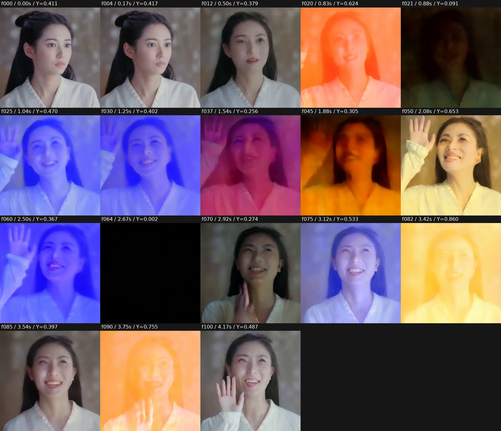
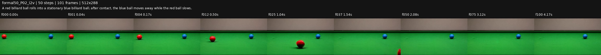
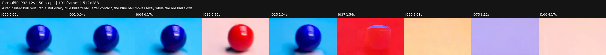
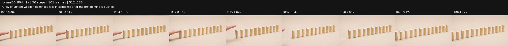
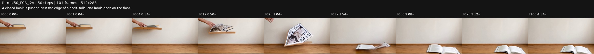
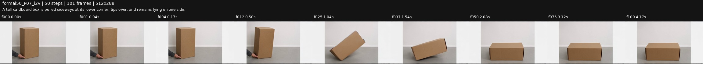
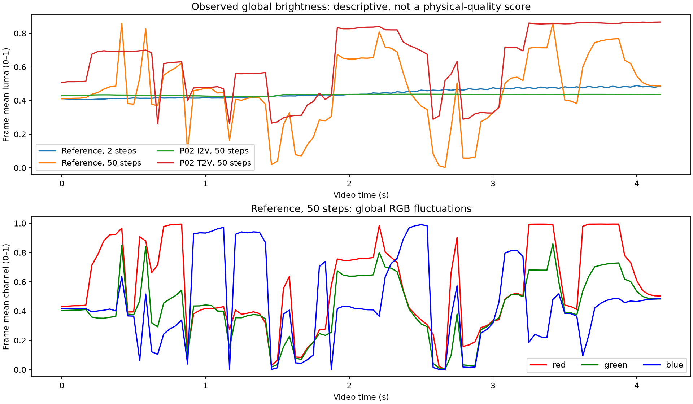
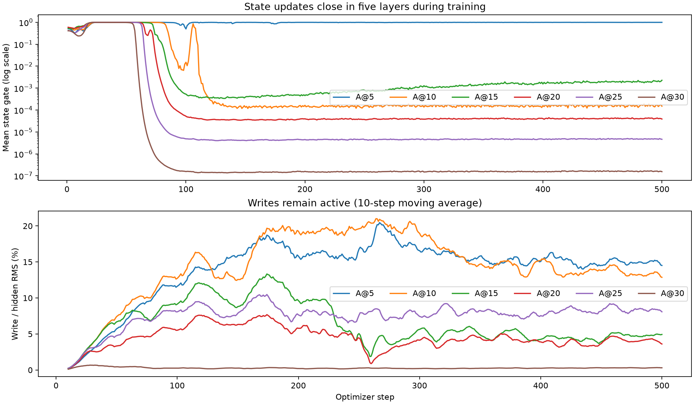

# Experiment 61018 / Trial 61858：checkpoint-final 生成质量与训练全流程诊断

分析日期：2026-09-13（UTC）。目标 run：`wisa_native_p_A1_4x96g_20260912T151800Z-e189c27c`。

本报告结合实际生成视频抽帧、全帧数值统计、完整训练日志、逐样本记录、checkpoint 保存配置与源码，以及教师缓存做归因。只进行了 CPU 文件读取、统计和证据图导出；没有启动新的推理/训练任务，没有修改训练、推理代码或 checkpoint，没有新增单元测试。

## 1. 核心判断

**当前结果确实有严重问题，而且至少包含两个需要分别解决的问题：一是画面、身份和物体形状不稳定；二是画面即使稳定，提示词要求的物理事件仍没有发生或没有完成。50 步不能自动解决这两类问题。**

现有证据最支持以下判断：

1. **目标 checkpoint 的 A1 训练已完成，但整个物理生成设计并未完成训练或通过质量验收。** 实际只有 500 个 optimizer steps、1000 个唯一训练视频、4000 次样本曝光；新增可训练参数约 8.38 亿。B 没有训练，output teacher loss 为零。`final` 代表该阶段最后保存，不能解释为已具备稳定物理生成能力。
2. **训练期间后五个 A 模块的 P 状态更新已经退化，但它们仍在明显改写 Wan 特征。** A@5 仍然更新，后五层 state gate 接近零；A@5/A@10 的写回却约为 hidden RMS 的 15%/14%。这说明当前模型没有实现预期的六次有效状态校正，仍然具有显著改变生成轨迹的能力。这是最明确的模型内部异常，但它对闪色、脸部形变的因果贡献尚需关闭 corrector 的同条件对照确认。
3. **训练与部署条件存在实质差异。** 374/500 个训练步骤给 P₀ 完整干净未来视频；正式推理完全没有未来 GT。无 GT 且空文本的 CFG 无条件路径只占训练样本的 2.325%。无首帧 T2V 更是整个训练从未覆盖的模式。
4. **数据与监督并没有充分约束“事件必须发生且符合物理”。** 所有实际训练 caption 都描述原视频，974/1000 条训练只取原视频的一部分；教师只看到最多 16 帧，prior loss 又按每个时间槽做空间平均。结构 MSE 下降不能等同于碰撞、连倒、刚体保持或色彩稳定改善。
5. **训练验证几乎无法发现本次失败。** 实际只验证一条山谷航拍视频的五个噪声点，没有人物/接触事件的完整 50 步生成，也没有同条件原 Wan 基线。日志数值正常与最终视频难用可以同时成立。

**目前不能准确地把全部问题归结为某一个超参数、某一行 VAE 代码或“训练步数不够”。** 尚缺原 Wan/禁用 corrector 的配对生成，因此不能宣称已经证明“全部是外挂训练破坏主干”，也不能宣称“推理绝对无问题”。合理做法是先拆分共同推理路径与已训练写回的影响，再修正训练条件、动态监督和验收方式。

此前 checkpoint 适配检查的结论应严格限定为“权重、架构与运行链路能够匹配”。它不构成对物理能力、完整采样质量或无首帧模式有效性的验证。

## 2. 本次实际审查了什么

### 2.1 训练来源已经对上

主日志 [experiment_61018_trial_61858_logs.txt](/home/liuzhirui/Project/physGen/code/v4/logs/experiment_61018_trial_61858_logs.txt:36) 的 session 与目标 run 一致；第 68/69 行记录实际训练配置和 GT 条件；第 519/774 行对应 step 250/500 验证；第 779 行保存 final。

逐步与逐样本证据来自：

- [steps.jsonl](/home/liuzhirui/Project/physGen/code/v4/train/train_log/wisa_native_p_A1_4x96g_20260912T151800Z-e189c27c/20260912T151800Z-e189c27c/steps.jsonl)：500 条 train、2 条 validation。
- [micro_rank0.jsonl](/home/liuzhirui/Project/physGen/code/v4/train/train_log/wisa_native_p_A1_4x96g_20260912T151800Z-e189c27c/20260912T151800Z-e189c27c/micro_rank0.jsonl)：4000 条训练微批记录。
- [checkpoint-final/config.yaml](/home/liuzhirui/Project/physGen/code/v4/checkpoints/wisa_native_p_A1_4x96g_20260912T151800Z-e189c27c/checkpoint-final/config.yaml) 及其 `source/`、`data_manifest.json`。

旧的 `20260912_实验61002_训练损失平台与P门控退化分析_v1.md` 属于另一个 run，不能把旧实验“六个门全部关闭”“使用 persistent warmup”的结论直接套用本次。**本次 A@5 仍然工作。**

### 2.2 视频覆盖范围：按已完成文件取快照

50 步任务仍在持续写入结果。本报告的全帧统计快照为 **2026-09-13 07:23:13 UTC**：

| 目录/集合 | 已纳入全帧统计与主要抽帧观察 | 说明 |
|---|---|---|
| `20260912T151800Z-e189c27c_smoke_step2` | 7 条 | 旧 persistent reference 1 条；reset reference + P01–P05 共 6 条 |
| `wisa_native_p_1xada48g/final_20260913-070408-373326450` | 14 条 | reference 1 条；P01–P06 各 I2V/T2V；P07 I2V |
| 后续补充抽帧 | P08 I2V/T2V 2 条 | 每条检查 12 帧，见补充附件；不混入上述 14 条全帧指标 |

07:28:14 UTC 目录复核为 **18/41 完成**，P09 I2V 已完成、P09 T2V 运行中。这里不把尚未审阅的视频或未完成的 P10–P20 算作已分析。后续目录继续增长不会改变本报告使用的固定证据范围。

所谓本批“原测试集/reference”实际是 **1 张人物参考图 + 1 条提示词**，不是整个 WISA held-out 集：`overfit_ref5.jpg`，提示词 `The woman smiles and waves at the camera.`。默认 41 条是这 1 条加 20 个 demo 的两种模式。

主要观察采用 f0、1、4、12、25、37、50、75、100；reference 追加高密度关键帧与亮度极值帧。全帧指标读取了每条完整视频的全部 101 帧。**抽帧可确认大幅变色、消失、持续静止等现象；对很短的接触瞬间，仅凭稀疏图不作精确动力学判定。**

原始 MP4 路径、prompt、metadata、逐帧统计及图像路径均保存在 [video_inventory_metrics.json](experiment_61018_generation_20260913/video_inventory_metrics.json)。

## 3. 实际画面表现：哪些失败，哪些部分成功

### 3.1 人物 reference：动作出现了，但严重闪色和身份漂移使其不可用

50 步视频出现微笑、抬手、挥手动作，因此不能说这个 prompt 的动作完全没有出现。问题是动作伴随明显的脸部几何/身份漂移，眼口形态、下颌及整体相貌连续性差；全画面还反复出现蓝紫、橙黄、暗红和近黑帧。

这是整幅画面的强烈变化，包括衣服和背景，不只是脸部表情或自然运动。f20 到 f21，帧均值亮度由约 **0.624 降到 0.091**；f64 约 **0.002**，几乎全黑；f82 约 **0.860**。在这个普通人物挥手场景里，这些变化没有对应的光源或场景切换依据。



2 步 reference 更接近从首帧逐渐变成模糊、重影的人物：微笑/手部轮廓隐约出现，但后段脸与手细节严重消失。它没有 50 步的强烈闪色，**这不能说明 2 步训练效果更好**：严重欠采样、低动态和模糊会掩盖另一类不稳定。

### 3.2 Demo：逐例区分事件、形状与时间一致性

| 案例与目标 | 50 步 I2V 实际观察 | 50 步 T2V 实际观察 | 可支持的判断 |
|---|---|---|---|
| P01：滑板车撞垃圾桶，再侧倾停下 | 街景、桶基本保持；滑板车移动后出现转向、靠近镜头及尺度变化，未清楚完成撞桶后侧倒停靠的完整链条 | 更像宽轮摩托/踏板车，桶的语义不清；车体倾斜、抬起、局部形状及构图变化大 | 有运动但事件链偏离；T2V 的对象语义和几何也差 |
| P02：红球撞静止蓝球，蓝球移走、红球减速 | 红球向镜头方向移动、变大并离开下沿；蓝球始终大致留在原处；未见要求的接触与动量传递链 | 巨大单球主导画面，蓝/红身份切换，球体出现透明/扁化效果，后段成为大面积纯色/空场景 | I2V 是清楚的事件失败；T2V 还存在物体身份/数量及场景稳定性失败 |
| P03：球拍击打来球，同一个球反向返回 | 来球接近球拍，存在接近接触的片段；后段球消失，手臂退出/消失，球拍缺乏持续的持握关系；未见清楚的同球反弹返回 | 球的数量/尺寸改变，拍面不稳定、难持续识别，背景强烈变化 | 不能把“球接近拍子”算作完成击打反弹；对象持续性有问题 |
| P04：第一块被推后，多米诺逐个倒下 | 手指移动，木牌大体一直竖直；后段列的位置/排列略变，没有清楚的逐块倒下 | 能生成一列木牌，前部有局部变化，但整体主要是近静态及构图漂移，未形成连续倒伏波 | 典型“物体对了、事件没发生”；并不严重闪色 |
| P05：木块下坡，进入粗糙地面后减速停下 | 斜坡和地面保持较好，但独立木块从坡顶滑到地面的轨迹不清楚；后段构图移动，斜坡离开画面 | 初始大块木质斜面/构件靠近镜头，随后离开，余下地面；未清楚保持独立木块与坡/地面的关系 | 事件分解与对象绑定失败；不能只把镜头移走当作物体完成滑动 |
| P06：闭书被推出架边，落地时展开 | **推书、离架下落、落地展开可见**；过程中书页/封面形状变化明显，刚性与页片连续性仍需评价 | 对象很快变成不稳定块状外观，背景与颜色大变，后段只剩地面 | I2V 有事件成功部分，不应算全部失败；T2V 明显崩坏 |
| P07：抓纸箱下角侧拉，纸箱倾倒并躺下 | **倾斜、倒下、横躺停住的顺序可见**；本例整体较稳定 | 不在本报告主要快照观察范围 | 是必须保留的正向反例，不能以坏例推出模型任何事件都不会 |
| P08：冰块缩小、水洼增大 | 冰块、盘子、桌面稳定，几乎静止；未清楚表现持续缩小与水洼扩张 | 透明偏蓝块体与盘子存在，近静态，未出现清楚的相变过程；未见 reference 式闪色 | 事件呈现不足，但有时间尺度歧义：4.17 秒普通融化本来可能不明显 |

P08 的 prompt 没有指定延时摄影，也没有高温条件；不能为了“动作显著”把不真实的快速融化视为更物理。若要将它作为可判定基准，应说明 time-lapse 或给出足够观察时长。

输入图也已做针对性核对：P04 的木牌与手指、P06 的闭书/架边/手/地面、P07 的纸箱与拉下角的手都支持相应起始事件。**P05 原图坡顶确实存在独立木块**，不是输入缺少物体；它与斜坡同色、缩小后尺寸较小，只能作为困难因素。P07 左右浅灰边带原图已有，不应记成生成新增故障。见 [原始首帧审查](demo_input_visual_notes_20260913.md)。

主要对照图：











### 3.3 2 步结果能说明什么

2 步 P01–P03 主要有拖影、虚化、对象逐渐消失；P04 保留竖直木牌，后段变模糊；P05 接近静态。它们能说明程序完成了编码、采样、解码、保存，不能证明接触、反弹或刚体运动已经学好。

两种 reference smoke 的状态策略不同：`smoke_before.mp4` 是 persistent，`batch_smoke_21` 是 reset。正式 50 步已使用 reset。因此 **不能用旧 smoke 的状态持久化问题解释当前 50 步全部失真**。

Euler、shift=5 的 2 步 sigma 是 `1 → 0.83333 → 0`，最后一次跨越 0.83333；50 步最后一次约 `0.09259 → 0`。2 步没有少步蒸馏支持，其质量不是正规收敛评价。50 步看起来更清晰、更有动作，同时暴露闪色/身份问题，是本次实际现象；它还不能证明“增加步骤本身导致崩坏”，因为积分精度、轨迹和模糊程度一并改变了。

### 3.4 颜色问题的描述性量化

对 RGB 除以 255 后，令 `Y=0.2126R+0.7152G+0.0722B`，先求每帧全图平均；亮度范围为视频内最大减最小，最大跳变为相邻帧均值差的最大绝对值。像素差为相邻帧 RGB 绝对差的全图平均。

| 视频 | 帧均值 Y 范围 | 最大相邻 Y 跳变 | 平均相邻像素差 |
|---|---:|---:|---:|
| reference，2 步 reset | 0.0836 | 0.0112 | 0.0065 |
| reference，50 步 I2V | **0.8575** | **0.5327** | **0.1187** |
| P02，50 步 I2V | 0.0166 | 0.0056 | 0.0033 |
| P02，50 步 T2V | **0.6055** | **0.4226** | **0.0861** |
| P03，50 步 I2V | 0.0181 | 0.0019 | 0.0152 |
| P03，50 步 T2V | **0.8394** | **0.6478** | **0.1279** |
| P04，50 步 I2V | 0.0300 | 0.0050 | 0.0017 |
| P06，50 步 I2V | 0.0945 | 0.0146 | 0.0127 |
| P06，50 步 T2V | **0.8320** | **0.6438** | **0.1156** |
| P07，50 步 I2V | 0.0385 | 0.0056 | 0.0037 |

这些不是物理正确率或通用闪烁评分：运动、镜头和真实照明也会改变指标，静止失败视频反而可能分数很低。它们与本次抽帧一起支持“某些视频有异常的全局色彩/曝光跳变”，不支持“所有视频都闪色”或“差值越小物理越好”。



## 4. 训练实际上做了什么

| 项目 | 保存配置与日志的事实 | 含义 |
|---|---|---|
| Backbone | 冻结 Wan2.2-TI2V-5B | 主要学习新增模块如何影响原生成器 |
| 阶段 | A1；A@5/10/15/20/25/30，独立参数，每个内部迭代一次 | 没有完成后续 A2/A3/B/AB 的整个规划 |
| 参数 | 837,957,970 可训练；checkpoint 总 974,182,486 个 corrector 参数 | 保存的 B 等参数不代表 B 已被训练；基座 Wan/T5/VAE 仍来自各自外部资产 |
| 数据 | manifest 4000：3800 train/200 val；12 个过短 train 排除；实际 limit=1000 | 并非训练了全部 WISA，也不是用了全部 3788 个有效 train |
| 训练量 | 500 updates × 8 accumulation = 4000 样本，每个唯一视频恰好 4 次 | 对复杂新增模型的覆盖有限 |
| 并行 | world_size=1，平台 slots=1 | 目录名 `4x96g` 不代表本次四卡训练；不能据目录名估算训练样本量 |
| 学习率 | 1e-4；100 步 warmup，后续 cosine 到约 1e-5 | 500 是预算结束点，不是生成质量最优点 |
| 初始 P | image_text_gt；GT dropout 配置 0.25 | 训练多数步骤有推理不存在的未来输入 |
| 首帧 | 始终干净且固定 | 没有训练无首帧模式 |
| 状态 | state_warmup_every=0 | 每次训练 forward 从 P₀ 起步，正式 reset 与之对应 |
| 损失 | FM + dense struct + pooled prior，out_weight=0 | 没有通过生成视频的 teacher 输出训练本阶段 |

1000 个视频与约 8.38 亿可训练参数的组合，构成明显的优化效率/泛化风险；但它本身不证明已经过拟合，也不说明只需多跑若干步就能修好已经退化的机制。

## 5. 最强内部证据：动态状态更新退化，写回仍显著

### 5.1 训练日志显示退化发生在训练中

最后 100 个训练步骤的均值：

| 层 | state gate | 有效 ΔP RMS | write gate | 写回/H RMS | struct gain |
|---|---:|---:|---:|---:|---:|
| A@5 | 0.9931 | 0.2071 | 0.99993 | 14.98% | 0.05467 |
| A@10 | 1.577e-4 | 2.507e-5 | 0.99999 | 13.56% | 2.97e-8 |
| A@15 | 0.001884 | 2.995e-4 | 0.4853 | 4.60% | 4.17e-9 |
| A@20 | 4.089e-5 | 6.415e-6 | 0.4954 | 3.90% | -1.15e-8 |
| A@25 | 4.768e-6 | 7.010e-7 | 0.8325 | 8.31% | 1.64e-9 |
| A@30 | 1.606e-7 | 1.992e-8 | 0.0867 | 0.291% | 1.64e-9 |

`struct gain` 是本层更新前后到同一 teacher target 的 MSE 改善。后五层几乎没有改善；A@5 仍有实际更新。早期 step 25/50 各层 gate 一度接近 1，随后深层先关闭，至约 step 100–120 后形成上述格局。



### 5.2 50 步实际推理继续呈现同样的模式

人物 reference 的 cond/uncond 合计 100 次前向平均：A@5 gate 约 0.995，后五层约 `8.62e-5 / 0.00262 / 4.22e-5 / 4.62e-6 / 1.50e-7`。A@5/A@10 写回/H RMS 分别约 **14.6%/14.1%**，A@5 单次峰值约 **19.4%**。P02 T2V 的 A@5 峰值约 21.9%。

P RMS 仍稳定，reference 约 1.288–1.323，且没有 NaN/Inf。**这里是学习机制退化与潜在的向量场扰动，不是已经证实的 P 数值爆炸。**

代码中 state gate 和 write gate 是两个独立控制：[corrector.py](/home/liuzhirui/Project/physGen/code/v4/physgen_v4/corrector.py:411)。简化后为：

```text
P_after = P_before + state_scale × state_gate × delta
H_after = H_before + write_scale × write_gate × writer(H, P_after)
```

所以后层不更新 P，仍可用 H 查询前层留下的 P 并写回。当前设计更接近“初始化器 + A@5 一次有效更新 + 多层读取/写回的 adapter”，没有证据证明实现了六次逐层改善的物理状态推理。

`write_strength=0.1` 也不是“写回永远小于 hidden 的 10%”：它乘在可学习投影输出上，没有相对 H 范数的硬上界。另一方面，各层 RMS 比例不能直接相加成总破坏百分比，50 步也不能当成简单线性累加 50 倍。

### 5.3 为什么会走到这里：有计算图支持，但仍需避免过度因果化

每层都被要求逼近同一个完整未来 teacher 状态。如果 P₀ 或 A@5 已经降低误差，后层关闭增量可以避免再增加该代理损失。writer 则还能通过 FM 学习，所以主目标并不强制每层 state 更新必须有价值。门进入 sigmoid 饱和区后，增量路径及门自身的梯度都容易变小。

P₀ 还接收六处 dense struct 沿恒等状态路径传来的梯度；不只是直接权重为 0.02 的 prior loss 在训练它。降低 `prior_weight` 一项不会切断 dense 监督初始化器的路径。最后 100 步，初始化器占全局梯度平方范数的平均比例约 84.27%，提示优化集中于初始化器；**这不是按 loss 来源分解的梯度，不能说“JEPA 占 84% 梯度、压死 FM”已经被证明。**

还要区分“理想未来目标”和“可预测未来”：只给首帧与文本时，未来运动通常存在多种可能。让不含当前噪声/生成假设的 P₀ 逐 token 回归某一条完整未来，用 MSE 时存在学成条件平均的机制风险。更合适的职责可能是让 P₀ 表达粗场景/条件，动态状态再依据当前去噪 H 补充未来细节；这应作为新设计验证，不能仅凭现有 loss 值认定 P 已严格变成常量。

## 6. 训练/推理条件差异：当前最应优先治理的设计问题

### 6.1 完整未来 GT 在训练中太常见，部署条件覆盖不足

实际 374/500 步有 GT，即 2992/4000 样本；126 步、1008 样本无 GT。GT 选择是每个 optimizer step 共用，8 个微批并不独立选择。

- 无 GT 样本仅覆盖 685 个唯一视频。
- **315/1000 个视频训练了四次，却一次都没有在无 GT 条件下训练。**
- 正文本且无 GT：915 次、643 个唯一视频。
- 无 GT 且空文本：**93/4000 = 2.325%**，而正式 CFG 每一步都要调用这一类无条件分支。

这是实际部署条件覆盖不足，不是“标签监督使用未来真值”本身有错。区别在于这里未来视频作为模型前向的输入条件，可被用于预测；推理时这一输入被移除了。

不能仅根据这些数字断言模型必然依赖 GT：末 100 步有/无 GT 两组不是相同样本、相同 sigma 的配对，两组 MSE 均值并未证明 GT 分支更优。**条件差异确定存在，GT 捷径是否是主要像素崩坏原因尚待配对证据。**

合理修法：以真正部署的 image_text/no-GT 学生路径为主要训练路径；完整 GT 放在 teacher/posterior 监督侧。若确需保留 GT 分支，应对同一样本显式做有/无 GT 的一致性或蒸馏，并保证所有训练视频有足够无 GT 覆盖。不能只保留固定 25% dropout 就认为问题已解决。

### 6.2 T2V 是明确的未训练模式

本次训练的 `noisy_view` 始终替换干净首个 latent 时间片，FM 始终排除首片：[losses.py](/home/liuzhirui/Project/physGen/code/v4/physgen_v4/losses.py:5)、[FM loss](/home/liuzhirui/Project/physGen/code/v4/physgen_v4/losses.py:68)。没有 image dropout。

新推理代码正确区分了无首帧时不 clamp、不把首片 timestep 置零、prior 不输入 image tokens。但这只解决调用语义，不会补上训练：T2V 同时改变 prior 模态、首片 hidden 的噪声分布及第一片也需要去噪的任务。

因此当前 T2V 的严重失败不能与 I2V 一起统计成“已训练任务内的统一失败率”。要把它变成正式能力，训练中必须混合有图/无图模式，按模式调整首片时间条件和 FM mask，并单独验证两种模式。基础 Wan 支持 TI2V，不等于外挂 corrector 自动具备这一能力。

### 6.3 CFG 可能放大分支不一致，但目前缺少直接轨迹证据

若将 corrector 引起的预测变化记为 δ，则 CFG=5 的额外变化为：

```text
delta_cfg = delta_uncond + 5 × (delta_cond - delta_uncond)
          = 5 × delta_cond - 4 × delta_uncond
```

因此分支误差并不一定互相抵消。考虑到真正 no-GT/empty-text 条件覆盖少，这是值得优先检查的放大路径。但现有日志只有各分支内部 RMS，没有 cond/uncond velocity 差、相对 base 的预测差、latent 每步动态范围，不能据此宣布 CFG 已失控，也不能凭空指定最佳 guidance。

### 6.4 reset 只解决 P 起始策略，不解决闭环生成分布

训练输入每次来自 GT 直接加噪，推理输入来自前面若干步模型自己生成的轨迹。一旦前段对象结构或颜色方向有偏差，后段模型见到的 latent 不再等同于训练的 GT 加噪样本。每步 reset P 与当前训练一致，但没有让训练覆盖这种误差积累。

这也是为什么必须验收完整采样，而不能只依靠一个噪声点的 velocity MSE。

## 7. 数据与教师目标：事件监督存在系统性盲区

### 7.1 原视频 caption 与中心窗口可能描述的不是同一件事

实际 1000 条训练记录全部为 `caption_scope=video`；974 条没有使用完整源视频；527 条窗口少于源帧数的一半。连续原生 fps 中心窗中位约 3.33 秒，200 条短于 2 秒，最短 0.133 秒。

对应逻辑见 [data.py](/home/liuzhirui/Project/physGen/code/v4/physgen_v4/data.py:20)、[caption 绑定](/home/liuzhirui/Project/physGen/code/v4/physgen_v4/data.py:75)。

如果 caption 描述“推倒→碰撞→最后停下”，而 GT 只取中间片段，训练会把完整事件文本绑定到缺少起因或结果的输出。FM 拟合这样的 GT 并不会迫使生成补齐缺失事件；teacher 也只看到同一个局部窗口。

这里统计证明的是**系统性错配风险**，没有人工逐条确认 1000 个 caption，不能编造“974 条 caption 都错了”。应优先审查事件的前态、接触、后态是否同窗，并让 caption 描述实际窗口；过滤极短片段、剪辑切换、无关描述，按物理事件类型覆盖训练与留出集。

源 fps 含 24/25/30/50/60 等，101 个连续帧代表的真实时长并不相同；推理固定 24 fps、101 帧，首末帧时间跨度约 4.17 秒。P 坐标包含秒数，不意味着基础 Wan 和教师自动获得统一速度条件。应明确重采样/保留原速策略，让训练、teacher 视图和最终播放时长一致，避免直接把帧序号当作统一物理时间。

### 7.2 教师只采 16 帧，而且表征 MSE 不等于物理约束

101 帧窗口通常只抽：

```text
0, 7, 13, 20, 27, 33, 40, 47, 53, 60, 67, 73, 80, 87, 93, 100
```

教师得到 8 个时间 tubelet；两帧 tubelet 里的实际原视频帧相隔约 6–7 帧。短暂接触、球反弹前后、手和对象的瞬时变形可能落在抽样空隙。**FM 仍覆盖全部未来 latent 时间位置，不能说整个训练只监督 16 帧。**

当前最后层 V-JEPA 特征可以提供场景/动作表征，但代码没有直接监督对象数目、同一球的身份、接触前后速度、刚体长度、质量守恒或人脸身份。A1 的 output loss 又关闭，所以没有通过解码视频的 teacher 特征纠正生成端点。

应让少量关键事件视图覆盖接触前/中/后，加入局部与时间差分的诊断/监督，并用生成的视频判断事件完成。只把 `teacher_frames` 改大、再复用旧 cache 或直接继续旧训练不是可靠修复；新的目标和采样定义需要版本化缓存并验证训练适配。

### 7.3 为什么结构/先验 loss 看着改善，运动仍可能没学好

prior loss 先按每个时间槽做空间加权平均；不同局部布局只要均值近似，就可能具有相似 prior loss。dense struct 又平均所有内容 token 和通道，因此静态场景/全局语义可能占很大数值份额。

CPU 检查验证 index12 + 日志第一个训练 step 的 8 个样本：每视频 GT 自身的全时空均值向量能解释 **54.1%–67.9%** 的 target 总能量。验证 index12 的逐位置静态模板只留下 **13.96%** 的时变残差能量；空间平均后，时间变化约为池化目标能量的 **1.73%**。

这九条并非随机总体抽样，不能推广为全部训练集比例；这些均值模板使用未来真值，是 **oracle 描述基线，不能实际部署，也不能证明学生学成常量**。它们说明：低 pooled MSE、高全局 cosine 很容易主要体现静态/语义改善，不能单独证明运动与因果学习。

应同时报告动态残差/时间差误差、空间局部误差和事件完成，而不是仅扩大现有全局 MSE 权重。做时间差分监督时也要区分相机运动、遮挡和对象运动，不能把所有变化越大越好当目标。

### 7.4 已确认一个小范围实现缺口：无监督边缘 P 仍可能被 writer 读取

teacher 的 `target_weight` 考虑源图像到 canvas、再到 teacher 的两次 letterbox；`process_valid_indices` 只考虑 canvas 到 teacher 的外黑边，遗漏部分源图像在 canvas 内的 padding。

实际训练 1000 条中 **6 条**存在这个问题；CPU 核对 index255/637，writer 可读集合里各含 192 个 `target_weight==0` token，分别占该样本可读集合 5.56%/7.14%。证据在 [coordinates.py](/home/liuzhirui/Project/physGen/code/v4/physgen_v4/coordinates.py:93)、[writer 读取](/home/liuzhirui/Project/physGen/code/v4/physgen_v4/corrector.py:445) 与 [教师审计附件](teacher_cache_audit_20260913.md)。

这是应修正的确定性几何不一致：训练和推理的可读 token 应共用真实内容区域定义。**它只影响这里少数样本，不能解释整批严重闪色或脸部崩坏。** 本报告没有偷偷修改这一行为；修复应作为明确的后续代码/缓存版本变化。

## 8. Loss 与验证报告应该如何解读

训练目标实际为：

```text
L = L_FM + 0.1 × warmup × noise_weight × L_struct
         + 0.02 × warmup × L_prior
warmup: 前 200 步从小到大
noise_weight = clip((1 - sigma) / 0.2, 0, 1)
```

struct 对六层求平均，没有因六个 A 而直接放大六倍。最后 100 步 FM/加权 struct/加权 prior 的均值约 `0.24806 / 0.13235 / 0.00805`，分别占 total 的 `63.86% / 34.07% / 2.07%`。前 200 步 total 上升受辅助 warmup 影响，不能用 total 曲线上升判训练变差。

所有 500 步指标有限，全局梯度最大约 **0.191437**，`grad_clip=1` 从未触发。没有支持 NaN、Inf 或过强裁剪使训练失效的证据。

唯一实际验证视频是 **index12 的山谷/河流航拍**，不是完整 200 条验证池。五个固定 sigma 的 FM：

| sigma | step250 | step500 |
|---:|---:|---:|
| 0.10 | 0.4124985 | 0.4113215 |
| 0.35 | 0.1572262 | 0.1560319 |
| 0.60 | 0.0958804 | 0.0952464 |
| 0.85 | 0.0694645 | 0.0696142 |
| 0.98 | 0.1690287 | 0.1549626 |
| 平均 | 0.1808197 | 0.1774353 |

平均改善约 **1.87%**，因此不能说“500 比 250 验证变差，已经证明后半程过拟合”。也不能反过来把这 1.87% 当成最终视频改善：它没有测人物身份、闪色、碰撞、多米诺、无首帧，甚至没有跑完整生成。

应保留少量固定且能发现真实失败的完整生成案例，用原 Wan 的同条件结果作参照，分别评价画面稳定性和事件完成；模型保存与模型验收分开。训练集上的加噪回归、代理表征 loss 和闭环生成要分别记录。

## 9. 推理链路：已核对的正确部分与仍需排除的差异

### 9.1 暂未发现以下常见直接错误

- 50 步 metadata 指向指定 `checkpoint-final`，从保存 config 构造结构，严格加载 791 个 tensor；没有发现错 checkpoint、漏掉 A 权重或错误启用 B。
- 正式 50 步记录为 **50 次 scheduler update、100 次 Wan forward、600 次 corrector call**，不是把 2 步误标成 50 步。
- FM 目标 `noise-clean` 与 `latent += Δsigma × velocity` 的符号一致。
- I2V 首 latent 的干净条件、每步重置、首片 token 的 t=0 与本地 Wan TI2V 相应逻辑一致。
- cond/uncond P 独立；正式 reset 符合本 run 的训练策略。
- VAE inverse scale、因果 cache、conv2、逐片 decode、unpatchify 顺序与本地 Wan 实现一致；每视频使用独立解码 cache。
- 输出 clamp 到 [-1,1] 后转 uint8，不存在已发现的未 clamp 溢出回绕错误。
- teacher token 1664 维、T/H/W flatten 顺序、teacher 采样索引与坐标一致；没有发现直接轴序错位。

这些结论是代码/metadata 审计范围内的排除，不能替代原生生成对照。运行 metadata 没有执行代码内容 hash、权重内容 hash，因此不能将文件路径与 tensor 数量当成历史执行字节的完整性证明；目前也没有证据表明历史文件被替换。

### 9.2 与原生 Wan 的差异仍然需要处理

| 差异 | 事实 | 合理处理与边界 |
|---|---|---|
| Solver | 当前默认 Euler；本地 Wan TI2V 默认 UniPC，另支持 DPM++ | Euler 的 FM 符号合法，不是“写错了”；已有 `SOLVER=unipc` 可做单变量对照 |
| VAE 精度 | v4 VAE 权重和 scale 为 BF16；本地原生默认 FP32 | 可能有数值影响，尚不能指认为闪色主因；最干净的是同一最终 latent 仅换 FP32 decode |
| 分辨率 | demo 512×288；reference 384×384；原生典型 TI2V canvas 1280×704 | 小球、脸、手、接触点信息少；当前为了对齐训练而低分辨率，不能直接改大后称为纯修复 |
| Negative prompt | 当前空串；原生空串通常替换为质量负提示词 | 比较原生时要对齐；补负提示词不能保证物理正确，且它也改变 uncond 条件分布 |

VAE BF16 在训练 cache 中已经使用，因此它不是本次推理独有的新变化。如果改成 FP32 后重新编码首帧、重新生成、再解码，会同时改变三个环节，无法精准归因。若以后排查 decoder，应临时保存一条 final latent 并分别解码。当前输出没有保存这份 latent，本报告没有伪造这一对照结果。

低分辨率是细节困难的可信因素；它本身不能解释为何有些同分辨率场景稳定、另一些全图剧烈闪色。Ada48g 与 96g 的显存大小也不是物理质量损失机制；精度、kernel 或 offload 的实质差异须有证据再讨论。

## 10. 原因排序：已经证明的问题和仍需确认的因果贡献

| 优先级 | 问题 | 证据强度 | 与症状的关系 |
|---|---|---|---|
| P0 | 没有原 Wan/禁用 corrector 的同条件生成基线 | 缺失事实确定 | 当前无法准确分配“基础推理问题”和“新增训练扰动”的责任，必须先补最少量对照 |
| P0 | 后五层状态退化，前/中层仍有显著写回 | 训练及推理均直接观察 | 最强的已训练模型异常；可能损害形状/颜色/身份，但像素因果待 ablation |
| P0 | GT/no-GT 部署差异，尤其 CFG uncond 覆盖少 | 完整 micro 日志直接统计 | 可能造成 P 预测、两个分支和闭环轨迹不一致；GT 依赖程度未实验证明 |
| P0（T2V） | 无首帧从未训练 | 训练源码确定 | T2V 的明确适配缺口；不能靠推理代码兼容补齐能力 |
| P1 | clip/caption 事件风险、低时长与稀疏 teacher、静态目标主导 | 数据/代码/少量缓存统计支持 | 对“物体有了、事件没有”解释力较强；具体错配数量未人工确认 |
| P1 | 验证只有一个风景、无完整采样 | 日志/代码确定 | 没有在训练过程中筛掉坏 checkpoint，不能发现本次失败类型 |
| P1 | 可训练容量大而实际样本少，优化集中 P₀ | 参数/曝光/梯度统计确定 | 泛化与职责退化风险，尚不等于已证明过拟合 |
| P1（排除项） | Euler、BF16 VAE、低分辨率、negative 差异 | 实现差异确定 | 需作为共同推理路径候选逐项排除，不能直接定为主因 |
| P2 | 双 letterbox 的 writer 可读区域不一致 | 6/1000 记录几何审计确定 | 应修正的局部实现问题；不足以解释全局崩坏 |

没有证据支持以下一刀切结论：六层 P 全关、P 数值爆炸、teacher channel/轴全错、cached teacher RMS≠1 就是 bug、500 比 250 已证明过拟合、换 96g 就好、改 100 步就好、强行开门就好、直接开未训练 B 就好。

## 11. 解决顺序：先定位，再做真正针对问题的训练修改

### 11.1 第一轮只做少量有辨别力的生成，不新增测试框架

利用现有 50 步 full 作为参照，优先选 **reference + P02 + P04**：分别代表画面失稳、碰撞失败、连锁事件失败。先补同条件 `VARIANT=wan` 的三条。

下面是供后续使用的现有入口命令，**本次没有执行**。不要先改变 seed、solver、CFG、分辨率，否则无法判断是否由 corrector 引起。

```bash
cd /home/liuzhirui/Project/physGen/code/v4
SUITE=both SAMPLE_IDS=P02,P04 DEMO_MODES=i2v \
SAMPLING_STEPS=50 SOLVER=euler GUIDANCE=5 SEED=42 VARIANT=wan \
OUTPUT_DIR=/home/liuzhirui/Project/physGen/code/v4/inference_outputs/diagnose_61018_wan_euler \
bash inference/infer_wisa_native_p_1xada48g.sh
```

`VARIANT=wan` 表示沿用当前封装和预处理，禁用 corrector 对 backbone 的校正；它还不是独立原生 Wan 入口的完整对照。

按结果决定下一步，而不是一次铺开几十组：

| 结果 | 下一步 |
|---|---|
| 封装 Wan 画面稳定，full 闪色/变形 | 优先检查写回及训练分布；用已有 `WRITER_OFF='A@5 A@10'` 做一条 reference 定位早层写回影响 |
| 封装 Wan 和 full 都明显闪色 | 先检查公共路径：原生 Wan 与封装 Wan，同分辨率/负提示词对齐；再逐个核对 solver、decode 精度 |
| 封装 Wan 和 full 画面都好，但事件都失败 | 先处理基础模型任务能力、prompt/时长/输入和事件数据；不能把 FM 或 JEPA 下降视为事件增强有效 |
| full 比 Wan 更能完成事件，但牺牲明显画质 | 把写回幅度、位置及训练目标作为质量/事件权衡，选同时合格的配置 |

若 base/full 差异已明确，可进一步只查 checkpoint250 对同一 reference 的结果。它用于辨别训练后段视觉变化，不能预先宣布 250 更好。不要先复跑全部 41 条或继续以 2 步做质量选型。

当前已有 `WRITER_OFF=A`、按层关闭、`SOLVER=unipc` 等开关，详见 [run_inference.sh](/home/liuzhirui/Project/physGen/code/v4/inference/run_inference.sh:27)。幅度缩放若要做，应增加明确的运行时配置并记录 metadata；不能在报告中假装已经有任意缩放 CLI，也不应静默编辑 checkpoint。

### 11.2 如果确认写回破坏了原 Wan：先保住生成，再重建动态机制

优先考虑更少校正位置、参数共享/更低容量、降低 writer 学习率、相对 base 的预测一致性或残差幅度约束。用实际写回/H RMS、分支预测差和生成质量确定力度，不凭 `write_strength=0.1` 判断安全。

新训练应避免 state gate 过早饱和，并要求层的更新带来可测量的正增益。可考虑降低 gate 的学习率、调整状态增量参数化、减少深层重复相同 target 的监督；如使用小正下限，应与 delta 幅度共同设计。**不能在旧 final 推理时强制将已关闭 gate 打开**，因为被长期压制的增量并没有对应训练质量保证。

已有零输出初始化等机制并不意味着训练后仍保守；要关注实际训练轨迹。不要把“再加零初始化”当作足够修复，也不要把迭代次数从 1 改成 2 当作重新获得动态推理能力。

具体而言，writer 已经零初始化，read gate 也已用零末层权重和 bias=-2 温和初始化；尚未这样处理的是 delta/state gate。写回已有高噪声抑制和低噪声衰减：本配置 σ=1 时系数约 0.01，中段约 0.1，σ→0 时约 0.025；P 状态已有低噪声衰减并保持 FP32。因此后续应调整现有强度曲线或添加相对能量约束，不能误写成“当前没有噪声门控/没有 FP32 P”。现有机制仍未阻止日志中写回增大与状态门饱和。

P₀ 与动态校正职责应明确：P₀ 学粗条件、动态块依据 H 学残差或细节。若减少辅助梯度进入 P₀，必须按目标路由；整体 `detach(P₀)` 会连同 FM 路径一起改变，不能作为无代价修补。辅助与 FM 的相互作用宜在一个固定小批上做分项梯度范数/方向检查后再调权，避免凭 loss 数值大小猜梯度竞争。

如做 FM-only 训练对照，必须明确：把 struct/prior 权重置零仍保留 P₀、全部 A/writer 和原 GT 输入策略，并不等于原 Wan 或 no-GT 学生。GT 条件与 loss 权重是独立因素；要定义 no-GT 对照需另显式禁用 GT 输入，归因时不要同时改两个因素却把差异全归给其中一个。

### 11.3 新训练优先保证部署条件与事件数据一致

1. **先做 no-GT I2V 的清晰基线。** 完整 GT 放在 teacher 侧；确保不依赖部署时拿不到的输入。
2. **若要正式支持 T2V，同一训练配方中明确混合无图样本。** 无图模式训练全部 latent，包括首片；有图模式保留首片 mask。分别记录 I2V/T2V 验证。
3. **事件完整窗口 + window caption。** 先审查接触/反弹/连倒/滑动/相变代表性样本，避免扩大现有错配风险；保证视频级去重与留出隔离。
4. **动态监督单独可见。** 对状态时间差、局部对象/接触区域单独报告误差，teacher 视图覆盖关键瞬间；不要仅优化全局 pooled target。
5. **先用较小、可理解的模型容量证明增益。** 例如少数 A/共享参数或低秩方案；更大数据和更长训练应跟随有效机制，而不是继续训练已关闭的门。
6. **修正内容区域几何，版本化缓存与目标。** 记录 upstream 权重、预处理与代码 hash；这提高可复现性，不代表当前已证实缓存污染。

开启 output teacher loss 可以增加生成端点约束，但相同 teacher 的语义/采样盲区仍存在，而且单步端点不等于 50 步闭环结果。它不能替代真实生成验收，也不能作为无需对照的唯一修复。

### 11.4 验收要对应用户真正遇到的问题

不需要大规模新测试框架，先固定少量代表视频和同 seed 的基线：

- **人物**：身份连续、脸/手结构、全画面非动机色彩/曝光跳变；允许正常表情变化。
- **碰撞/反弹**：同一对象在接触前后可追踪、接触确实发生、运动方向/相互作用与描述一致；不只看“球动了”。
- **连倒**：接触顺序和倒伏传播可见；镜头移动或整体平移不算完成。
- **刚体/物体持续性**：身份、数量、轮廓维持；允许遮挡、透视与物理合理形变，不以二维面积变化直接判错。
- **相变**：明确真实时间或延时摄影，评估与该时间条件一致的变化。

以同条件原 Wan 的画质和事件表现为参照选 checkpoint；允许某例改进、某例退化，但不能只报平均 FM 或 final 保存成功。只有模型在这种验收下稳定改善，再扩到 20 个 demo/更多留出视频，才值得追加后续阶段与算力。

## 12. 证据文件与本报告的限制

专项附件与可复核数据：

- [训练全量统计和源码依据](training_diagnosis_20260913.md)、[训练统计 JSON](training_diagnosis_20260913.json)。
- [推理、状态策略、VAE 与原生差异审查](inference_audit_20260913.md)。
- [教师缓存/坐标/目标审查](teacher_cache_audit_20260913.md)、[CPU 样本统计](teacher_cache_sample_stats_20260913.json)。
- [P08 补充画面观察](additional_visual_audit_20260913.md)、[原始 demo 输入图审查](demo_input_visual_notes_20260913.md)。
- [全帧视频指标与原始文件路径](experiment_61018_generation_20260913/video_inventory_metrics.json)。
- [抽帧/指标脚本](experiment_61018_generation_20260913/inspect_outputs.py)、[证据图脚本](experiment_61018_generation_20260913/plot_evidence.py)：只读视频与日志，不加载生成模型。

当前尚未完成的因果证据是：同条件原 Wan/full 生成、同 latent FP32 decode、checkpoint250 的生成质量对照、同一样本有/无 GT 的配对行为。这些缺失不妨碍确认训练机制退化和条件/监督/验证缺口，但限制了对“闪色究竟由哪一环贡献多少”的精确归因。

本报告的建议是按这个证据边界安排少量有辨别力的下一步，不以推测代替已验证修复，也不把当前视频继续增加误报为已看完全部 20 个 demo。
