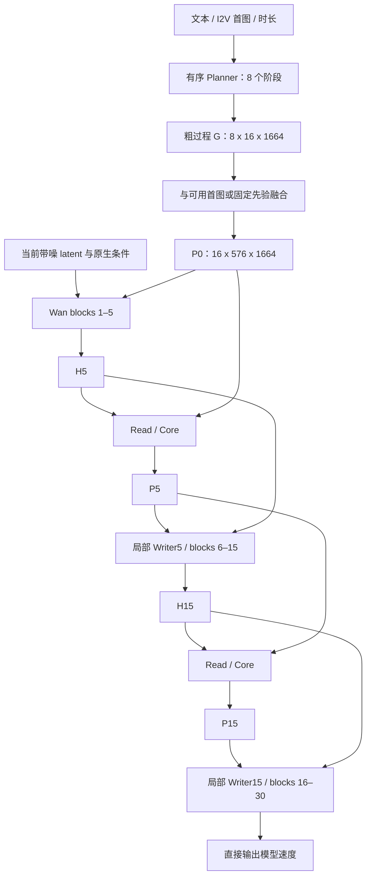

# PhyBrain：保留 V4 原生维度的 P 驱动生成方案

日期：2026-09-18。本文结合本次对话、v4 历史诊断、本轮审阅的 v4.2 源码与配置、已存在的静态 LoRA 实验，以及相关原始论文，提出下一版的实现与验证方案。

**版本范围：审阅过程中 v4.2 又切换到了三处 fullwidth corrector 配置。第 1.3 节记录收尾时的更新。本文涉及“两处 512 宽 Core、最终速度限幅、旧 CFG”的分析均指本轮先前读到、随后被归档的 v4.2 版本，不适用于新切换的 fullwidth3 实现。**

**建议采用你的第二轮修订：Planner 初始化 P，P/H 交互更新 P，Wan 在多个深度读取 P 的内容，并由 P 调节 LoRA。把“P 带来可重复的生成净收益”设为版本验收条件。** 第一轮独立 G 与观察 P 的方案保留为研究思路，本版不再建立独立的计划—误差控制系统。

**按你随后明确的要求，本文撤销小内宽和一亿参数以内的限制：P、Planner、Read/Core、P 内容注意力及控制器的过程特征保持 1664 维，其中过程 attention 采用 V4 的 26 heads、每头 64 维；Transformer FFN 使用 6656 维，Wan H 仍为 3072 维。禁止复用 512 内宽的过程模块，也不通过跨读写节点共享参数来凑预算。** 历史实现中的该数值仅用于说明应替换的代码，不是新方案选项。

据此重新核算，本文明确列出的两处独立完整 corrector、四处独立内容写入、四层全维 Planner、全维 gate 和 rank16 LoRA 合计约 **6.066 亿附加参数**，详见第 9 节。这里只枚举了设计对应的参数形状，没有证明这一规模已经能在目标视频规格下训练。资源安排必须适应架构；不能先承诺小参数预算，再悄悄缩窄 P。

执行顺序建议固定为：**确认完整采样基线 → 数据与协议对齐 → 静态 LoRA → 有序 P₀ 与内容写入 → H→P 更新 → P 调节 LoRA → 必要的联合微调。** 其中静态 LoRA 与 Planner 可以分别训练；新增生成通路分阶段接入，便于定位失败来源。

本文是设计与实施计划。本次完成了文件、源码、配置、已有诊断和文献核对，查看了一张既有生成对照图，并核算了参数与缓存规模；没有运行新的 GPU 训练或生成，也没有修改现有实验配方。下文明确区分已观察事实、机制推断和建议实验。

## 1. 先明确版本事实，避免针对过时架构设计下一版

### 1.1 三套现有代码不能统称为“当前 v4”

| 对象 | 核对到的实现/记录 | 对下一版的意义 |
|---|---|---|
| `v4`，实验 61018 / final500 | 六套独立 corrector，位于 5/10/15/20/25/30；训练约 8.38 亿新增参数；1000 个视频、500 次更新；多数训练步骤向 P₀ 输入完整干净 GT latent | 保留监督与几何经验；不直接继承六套大模块、训练条件或 optimizer |
| `v4.2`，旧 step1200 配方 | 两套独立 core/writer，位于 5/15；512 内宽；已有 `condition_trajectory_v1` 时序初始化；存在局部写回与最终速度限幅 | 已经有时序 P₀ 和 P 内容写入，不能把它们重新描述为全新能力 |
| `v4.2`，本轮开始时的默认配置 | `condition_trajectory_gt_v1`；75% 概率使用 GT 未来初始化；FM + 多层 STRUCT + PRIOR + WRITE；TEMP=0；联合反传 | “沿用现有三项、只加 plan”并不准确，必须显式替换损失及数据路径 |
| `v4-static-lora` | rank32；30 层 self/cross-attention q/k/v/o；47,185,920 个 LoRA 参数；仅 FM；已有 step1200 文件和完成标记 | 先评估现成执行器基线；它与新建议的 rank16、self-attention+FFN 配置不相同 |
| `v4.2`，收尾时的 fullwidth3 更新 | 三套 1664 宽 corrector，5/15/25；仅 I2V；GT75；WITH/WITHOUT PRIOR 两配方；已移除旧最终速度 Bound | 单独作为新的历史架构对照，不把旧限幅和约 68M 参数的分析套在它身上 |

证据：[v4 总说明](../README.md)、[61018 完整诊断](20260913_61018_checkpoint_final_生成质量与训练全流程诊断.md)、[审阅版 v4.2 说明快照](../../v4.2/analysis/v4_restoration_20260918/source_before/README.md)、[GT75 配置快照](../../v4.2/analysis/gradient_projection_ablation_20260918/source_before/configs/stability_v4_joint.yaml)、[旧 step1200 核验](../../v4.2/analysis/20260918_step1200_inference_audit.md)、[静态 LoRA 说明](../../v4-static-lora/README.md)。

本次确认存在的静态 LoRA 权重目录为：

`/home/liuzhirui/Project/physGen/code/v4-static-lora/checkpoints/lora_20260917T140727Z_dae2a0/step1200`

其中有 `config.json`、`complete.json`、`lora.pt`、`ema.pt` 和训练状态。本次核对了配置及文件存在性，没有重新加载权重验证数值，也没有据此宣布生成有效。其保存配置采用旧的模式/噪声配比；不同 v4.2 配方的模式分布与训练目标已变化。两者不能仅凭同为“1200 步”就视为公平对照。收尾时静态 LoRA 又完成了独立运行改造，默认入口改指 step0800；本文发现的 step1200 与默认推理 step 需要分别指定，见第 1.3 节。

另有 v4.2 新配方 step0400 的既有诊断文件，说明目录内记录会随实验推进。后续比较必须绑定 **run、step、raw/EMA、保存配置和源码指纹**，不依据 README 的默认路径推断实际生成用了哪一版。

### 1.2 对两轮讨论需要做的五个修正

1. **P 的 Value 进入 Wan 并非本次首次提出。** v4 和 v4.2 的 Writer 已以 H 为 Query、P 为 Key/Value 计算 ΔH。新增价值在于更早、更广、更便于训练的消费位置，以及与可训练主干适配的结合。[读写实现快照](../../v4.2/analysis/v4_joint_20260918/source_before/physgen_v42/model.py)
2. **“P₀ 所有时间槽相同”只适用于更早的静态初始化。** 旧 step1200 已测出不同时间槽的非零差异；该版 `ConditionTrajectoryInit` 也明确包含时间、时长和文本。下一版应验证“有序展开是否优于已有并行时序初始化”，不能只证明它优于静态复制。
3. **V4 的原生宽度与参数独立性必须保留。** `BlockCorrector` 按层分别实例化，主 Read/Core/Writer 在 1664 维处理过程特征。新方案的 A@5/A@15 和四处新增内容写入均各自持有参数，不把多个节点合并成一个小 Core。Planner 在八个时间阶段复用同一个预测函数属于自回归展开，其内部四层仍各自独立。
4. **已有损失不等于 FM/STRUCT/TEMP。** GT75 联合版和收尾 fullwidth3 的有 PRIOR 配方均包含 FM/STRUCT/PRIOR/WRITE。新版本应删除训练专用的 WRITE 修复目标、用 PLAN 替换旧 PRIOR，再按阶段恢复 TEMP；不能把四个新名字叠加到旧目标上。
5. **贴近基模不是单一根因诊断。** 可能是有效适配不足、计划没有信息、状态被忽略、映射方向不利、限幅、训练条件不匹配或采样链路本身异常。需要逐项实验，而不是先认定 P 无效或参数不足。

### 1.3 收尾更新：fullwidth3 与审阅版的差别

截至本次收尾复核（2026-09-18 06:49 UTC），训练入口已指向 [stability_v4_fullwidth3.yaml](../../v4.2/configs/stability_v4_fullwidth3.yaml)，另有[不含 PRIOR 的对照](../../v4.2/configs/stability_v4_fullwidth3_no_prior.yaml)。它使用三处 1664 宽、26 heads 的独立 corrector，位置为 5/15/25，500 updates，仅训练 I2V，GT condition dropout=0.25，WRITE 权重 0.01；主 corrector 已恢复原生宽度，并移除了旧最终速度 Bound。[切换后的 corrector](../../v4.2/physgen_v4/corrector.py)

但必须补充一个直接关系到你最新要求的细节：**原 V4 的 `ConditionPrior` 默认 `prior_width=512`；上述 fullwidth3 配置也仍保留这个初始化器宽度。** “corrector 是 fullwidth”并不表示每个过程模块都已全维。下一版需要明确替换这个 prior，不能照抄默认值；本文的 Planner 从输入投影后的工作状态到输出均为 1664 维。

本次 CPU meta 枚举得到该现有配置可训练参数 **429,284,425**。这是参数核算，不是训练/画质验证。它适合作为“恢复三处 V4 校正器”的单独实验；本文在相同过程特征宽度上增加部署条件初始化、多层内容消费和可训练 Wan 适配，训练目标及作用路径不同。

因此，第 5 节去除旧 Bound 的建议针对审阅版；**fullwidth3 已经没有这道限制，不应重复修改或声称这个问题还存在于它。** 但 GT 训练条件、只有 I2V 的模式覆盖、额外 WRITE 和大参数规模仍需与本文目标区分。

被移除的 `physgen_v42` 和旧配置保存在[源码归档](../../v4.2/analysis/v4_restoration_20260918/retired_v42_source.tar.gz)及[身份清单](../../v4.2/analysis/v4_restoration_20260918/retired_source_manifest.json)中。本次核对归档内 `model.py`、`backbone.py`、`geometry.py` 和 `stability_v4_joint.yaml` 的 SHA256 均与清单一致。旧窄模块仅用于复现历史基线，不迁入下一版；可复用其几何规则、诊断与缓存校验经验。

另一个版本变化发生在静态 LoRA：审阅中间阶段它仍导入 `v4.2/physgen_v42`，归档后曾出现源码依赖缺失；**最终复核的 [README](../../v4-static-lora/README.md) 与[包初始化](../../v4-static-lora/static_lora/__init__.py)已改为本目录独立实现，默认 step0800/demo41 推理无需兄弟源码。** 现存源码中的导入也已不再依赖旧包，不能把先前发现的依赖缺失继续列为当前未修复问题。历史训练/验证仍可能需要原数据缓存，且该目录明确区分推理兼容与严格恢复训练校验。本文没有改动这轮独立化代码，也没有重跑其报告中的测试或完整 GPU 推理。

## 2. 目前究竟要解决哪些问题

### 2.1 将画质故障、事件故障和机制故障分别验收

| 问题层面 | 现有证据 | 尚不能推出的结论 | 优先操作 |
|---|---|---|---|
| 画面稳定性 | v4 reference 有大幅闪色、身份与脸部几何漂移；部分 v4.2 对照出现条纹/色块 | 不能断言都是 P 写坏、VAE 损坏或分辨率导致 | 完整原生路径与 wrapper 配对采样，先确立可用基线 |
| 事件实现 | v4 双球案例未完成接触传递，多米诺未形成连倒；也有书下落、纸箱倾倒的部分成功 | 不能用“画面稳定”代替“事件正确”，也不能说所有事件都失败 | 保留成功样本，增加完整事件与交互时机评价 |
| 状态更新 | 61018 后五层 state gate 接近关闭，但早层 Writer 写回仍明显 | ΔP 小不等于 ΔH 小；门开得大不等于物理性高 | 减少 dense 更新点，记录状态内容和真实写回贡献 |
| 训练条件 | 历史 v4 没有 T2V 训练；当前新配方又使用 GT 未来初始化 | 有 GT 的训练 loss 下降不能代表部署能力提升 | 正式下一版全部使用部署可得条件 |
| 监督与执行 | 一条旧 oracle 诊断中，GT teacher 状态的 STRUCT=0，但 FM 没有优于学习状态 | 不能认定 teacher 无用，也不能认为 STRUCT 下降必然提高生成 | 单独验证执行器是否学会使用过程内容 |
| 数据与时间 | 旧训练大量使用整片 caption + 中心窗；当前缓存仍以中心窗、原 caption 为主 | WISA 来源不能保证这个裁窗包含完整事件 | 按事件覆盖重选窗口，同步更新所有缓存 |

其中，61018 最后 100 步 A@5/A@10 的写回/H RMS 均值约为 14.98%/13.56%，而 A@10 状态门约为 0.000158。这说明“关闭后层状态更新”没有关闭它对生成的影响。各层百分比不能相加成最终视频变化比例。[对应训练证据](20260913_61018_checkpoint_final_生成质量与训练全流程诊断.md)

### 2.2 第一优先级：补齐可用基线，而不是直接启动大改造训练

v4.2 既有诊断记录了：某个 P01 T2V 条件下，**base-only 和完整模型均异常**；两种 VAE 解码方式对相同 latent 的差异为零；wrapper 与本地原生 Wan 的首步预测也曾完全一致。它们缩小了故障范围，但首步一致不等于整个 solver、精度、首片处理和解码链路一致。[故障诊断](../../v4.2/analysis/20260917_v4.2_监督信号与生成故障修正设计.md)

本次查看的[旧 step1200 对照图](../../v4.2/analysis/step1200_generation_failure_20260918/comparison_overview.jpg)也显示了部分 base/full 图像异常。图中高分辨率基座仅展示前 13 帧，不能据此宣布完整 121 帧已经恢复，或者低分辨率就是唯一原因。

建议先完成一个固定的 8–16 条条件面板，包含普通人物动作、简单物体运动、接触事件、原来成功的案例；同时含 I2V/T2V。每条保存条件、实际初始噪声、采样日程、最终 latent 和全部视频帧，比较：

| 路径 | 必须回答的问题 |
|---|---|
| 原生 Wan 直接生成 | 当前资产、环境及支持规格下是否能得到正常完整视频？ |
| 新 wrapper，关闭全部 P/LoRA 增量 | 对相同输入是否复现原生路径？ |
| 已有静态 LoRA step1200 | 可训练 backbone 适配是否改善数据分布下的生成？ |
| 指定版本的 v4/v4.2 | P 相关适配在哪些条件下改善、无效或恶化？ |

先用官方支持的规格确认基础能力，再对计划训练的较小画布做配对检查。画幅、帧数、VAE 精度、负提示词、solver、CFG 的变化分别记录；不把同时改变多项的对照用于单一归因。官方 TI2V 配置为 30 层、hidden 3072、FFN 14336，默认 121 帧、24 fps、50 步、shift 5、CFG 5。[官方配置](https://github.com/Wan-Video/Wan2.2/blob/main/wan/configs/wan_ti2v_5B.py)

**若原生完整视频仍存在严重非语义性损坏，应先修复或明确稳定的运行规格，再投入主训练。** Planner 可以同时在缓存上开发，但其训练不应掩盖基座链路问题。

## 3. 下一版的研究问题和架构边界

建议工作名：**PhyBrain：V4 原生维度的过程状态与跨层生成适配**。不再用“小模型、低参数”作为预设卖点；保留单条扩散链和有限模块职责，以实验说明成本与收益。

P 的定义固定为：**在教师表征空间受到监督、结合当前去噪特征更新、供生成器持续消费的时空过程工作状态。** 它承载预期过程，也被 H 修订；不把它解释为无偏观察器、物理真值或错误检测器。

三个需要独立证明的假设为：

| 假设 | 需要看到的证据 |
|---|---|
| 有序初始化有价值 | 条件预测的过程状态优于静态复制/同规模并行初始化，并改善视频 |
| P 内容可以被执行 | 冻结静态 LoRA 后，训练 P 内容通路仍能带来额外生成收益 |
| P/H 更新与动态适配有额外价值 | 更新后的 P、以及 P 控制的低秩通道分别优于相应训练对照 |

本版只维护一个可变过程状态系统 P。Planner 的粗输出仍可记为 G，但它只是 P₀ 的构造中间量和 PLAN 的监督对象；**没有独立 G→Wan 或 E=G−Pool(P)→Wan 通路**。这样可以在计算图层面明确：新增的过程信息必须经过 P 才影响生成。

“经过 P”仍然不证明模型理解了过程：Core 可能把 P 当作 H 的普通适配状态，Planner 也可能只编码背景。结构消融、时间内容干预和完整视频评价仍然不可替代。原 V4 已有约 8.38 亿可训练参数却仍出现失败，说明保留容量是你的设计约束，不是性能有效性的充分条件。

保留原生文本条件、双向视频 attention、一个 Wan 采样链。P₀ 在一次采样中固定复用，每次去噪调用重新执行 P₀→P₅→P₁₅；不跨 50 步保存更新后的 P，不进行跨整段采样的反向展开。A@5/A@15 的“反馈”发生在网络深度上，不是两次真实时间测量。

## 4. 建议的完整网络



图中的 P→Wan 包含下表中的内容写入和 LoRA 通道控制，所有边均来自对应时刻的 P。两个 Read/Core 独立，四处新增内容写入也独立；共享的是 P 的语义坐标和几何定义。

| 位置，层号从 1 开始 | 可用状态 | 本轮操作 |
|---|---|---|
| 采样开始 | P₀ | Planner 只使用部署条件，产生整个过程的初始状态 |
| blocks 1–5 | P₀ | LoRA 读取 P₀；block 1 后全维内容写入 |
| block 5 后 | P₀→P₅ | H→P 的 Read/Core 更新；保留局部 Writer5 |
| blocks 6–15 | P₅ | LoRA 读取 P₅；block 10 后全维内容写入 |
| block 15 后 | P₅→P₁₅ | 再次 Read/Core 更新；保留局部 Writer15 |
| blocks 16–30 | P₁₅ | LoRA 读取 P₁₅；blocks 20、25 后全维内容写入 |

第一版固定这些层位，避免同时搜索大量布局。它们是工程起点，不代表这些层已经具有已知的物理语义分工。

### 4.1 原生维度契约：不能只保证 P 的最终输出有 1664 维

| 部分 | 新版必须采用的维度处理 | 不采用的处理 |
|---|---|---|
| dense P、G、Planner 隐藏状态 | 1664 | 先降到窄隐藏状态、最后升回教师维度 |
| P 内部 attention | Q/K/V/O 均在 1664 维，26 heads × 64 | 窄 attention 后接一个大输出层冒充全维 |
| Planner/Core 的 FFN | `1664 → 6656 → 1664`，与 V4 CellBlock 一致 | 缩窄中间通道以满足参数上限 |
| H→P 接口 | `LayerNorm(3072) → Linear(3072,1664)` | 在这两个原生空间之间另插一个瓶颈 |
| P→H 接口 | 全维 P attention 后 `Linear(1664,3072)` | 用窄 Value 替代教师坐标中的内容 |
| 文本→P | 原生 T5 的 4096 维投影到 1664 | 通过额外的小文本隐藏空间传递 |
| gate 控制器 | 1664 维过程状态、1664 维噪声/层条件、6656 维 FFN | 先把过程内容压到小向量再控制生成 |
| Wan 原主干 | H=3072、原 attention 与 FFN=14336 不变 | 缩小或替换基模的完整线性权重 |

沿用 V4 的 H↔P 跨空间投影是正常接口；不同原生表示本来就有不同维数。gate 的最终输出是每个低秩通道的控制系数，不是新的 P 特征。LoRA 的 rank16 也只定义附加残差的秩，不替代原始 W，更不会把 P 或 H 的工作状态缩到 16 维。这里保留你原建议的 LoRA rank 起点，不截断现成 rank32 checkpoint。

token 数量与特征通道维度要分别记录：

| 表示 | 形状，不含 batch | 数量与用途 |
|---|---|---|
| 教师目标 Z 与 dense P | `16 × 24 × 24 × 1664` | 9216 tokens；两处 dense 更新和 STRUCT |
| Planner 输出 G | `8 × 4 × 4 × 1664` | 128 tokens；8 个有序相对时间阶段 |
| 新增内容写入读取的 P | 每个 H 时间位置读取邻近 P 时间槽中的有效 `24 × 24 × 1664` 状态 | 默认不做 4×4 空间池化；按时间分组读取，保留 dense P 的空间内容 |

G 的 8 个阶段不是人工事件标签；P 的 16 个槽也不是质量、速度或力。仅初始化计划保留你原建议的 8×4×4 网格，用于有监督的粗过程展开；它不是 dense P 的替代品，也没有可学习的通道压缩。此次同时取消“新写入器只读 4×4 池化 P”的默认设计，让写入器直接消费全空间 P。这样保留局部交互信息，代价是注意力计算增加。

上述 P 规格对应 v4.2 的 32 帧 teacher 输入定义；历史 v4 teacher 时间采样不同。旧缓存与新目标必须逐项核对，不能仅根据“1664 维”认定兼容。

### 4.2 Planner：学习可部署的有序过程，不再读取干净未来

首版使用 **4 个独立 V4 风格 CellBlock，hidden=1664、26 heads、head_dim=64、FFN=6656**，按 8 个阶段展开。每阶段同时输出 16 个空间 token，不在同一阶段内人为规定物体的先后顺序。四层不绑参数；八次调用使用同一个预测器，这是有序展开的定义，不是把各个深度的网络合并以节省参数。

参数核算所采用的具体外围结构为：T5 `4096→1664`；anchor/history 各自 `LN(1664)+Linear(1664,1664)`；时长由固定 1664 维正弦编码经过两层 `1664→1664` MLP；16 个 1664 维阶段查询；模态/任务 embedding；四层 CellBlock；最后 `LN→Linear(1664,1664)→GELU→Linear(1664,1664)`。时空位置使用固定全维坐标编码。这个定义约 200.82M 参数，不再沿用此前 20–35M 的小 Planner 预算。

输入包括 T5 token、I2V 首图 anchor、模式、时长 D、真实归一化阶段位置，以及自己已预测的前序状态。T2V 不读取该样本的首图 anchor、GT latent 或完整视频特征。

\[
G_k=\operatorname{Planner}_{\theta}(G_{<k},c,A_{I_0},D,k),\quad k=1,\ldots,8.
\]

训练时使用预测前序状态并保留这 8 次展开的梯度；不喂 GT 前序 teacher token。完整视频 teacher 可以作为预测目标，但其特征可能含跨时间上下文，因此 causal mask 不能证明严格的物理因果推理。

与已有 `ConditionTrajectoryInit` 的真实差异是：**全维有序预测、显式的前序预测依赖、可独立预训练和验证的过程目标**。前序预测作为当前阶段的 history context，未生成的未来阶段不进入输入；不能直接复制 V4 `Attention` 中 `is_causal=False` 就声称一次并行前向已有因果 mask。若同参数的并行阶段预测表现更好，应保留有用的 P 驱动生成框架，删除没有证据支持的“有序展开优势”主张。

标签为固定的带几何权重池化：

\[
G^{GT}_{k,b}=\frac{\sum_{t,i}w_{k,b,t,i}Z^{GT}_{t,i}}
{\sum_{t,i}w_{k,b,t,i}+\epsilon}.
\]

权重由真实时间位置、有效内容面积与粗网格归属决定；不学习这个权重，不让池化器通过改变标签降低损失。空区域没有监督，也不能作为 attention 的有效 Key/Value。

### 4.3 P₀：保留首图细节，但避免把首图加两遍

I2V 使用冻结 teacher 得到的首图空间 anchor；T2V 使用仅由训练集统计得到的固定空间先验。**首图 anchor 必须单独从已知首图编码，必要时按 teacher 所需帧数重复这张图；不能从完整 GT 视频的 Z 中抽第一个时间槽来冒充首图特征，因为它可能已混入未来上下文。** 现有缓存只有在生成方式与身份明确一致时才能复用，推理时 teacher 的首图编码成本也要记录。

用 A 表示沿 P 时间轴展开后的先验，R 表示与计划目标一致的 token 池化，U 表示按同一几何映射回 dense 网格的固定插值，可采用：

\[
P_0=A+U\bigl(G-R(A)\bigr).
\]

这样 G 控制粗过程，A 提供粗网格之外的首图空间细节。直接采用 `P0=A+U(G)` 会叠加两个包含背景/外观的表示，存在尺度漂移风险。

U 默认不增加一个大 dense decoder。插值、有效边界及时间覆盖需要测试；一般插值不保证 `R(U(G))=G` 严格成立，不能依赖不存在的数学恒等式。记录 round-trip 误差即可，不为此新增损失。

P₀ 由部署条件构造，并不因为是“初始计划”而强制所有阶段都与首图相同。原生 I2V 的已知首 latent 约束仍保留；它与 P 的未来过程内容是两个接口。

### 4.4 H→P 更新：复用两套独立的 V4 原生宽度 corrector

两处调用均为：

\[
P_l=P_{\mathrm{in}}+\Delta P_{\theta}(P_{\mathrm{in}},H_l,c,\sigma,D,l).
\]

使用 [V4 `BlockCorrector` / `StateCore`](../physgen_v4/corrector.py) 的原生维度处理：H 通过 `3072→1664` 的 Read 进入过程坐标，P/H 以 1664 维注意力交互，Core 包含两个 1664 维 CellBlock，FFN=6656，输出与 P 同形的增量。保留 FP32 状态累加及既有位置、文本、噪声条件。不能把旧 v4.2 的窄分解时空 Core 改名后继续使用。

**A@5 与 A@15 各持有一套完整独立 corrector，包括 Read、Core、P/H attention 和局部 Writer。** 原生 V4 的门也先保留，新增可学习输出按零/近零残差启动。先记录 read/state/write gate、有效 ΔP 与 ΔH，再根据实测诊断饱和；不把“改宽度”和“同时更换全部门规则”混成一个无法归因的实验。

每套完整 corrector 的现有参数为 136,224,515，两套合计 272,449,030。不平均独立权重、不绑参数，也不为满足过去的一亿预算缩窄通道。六处 dense 更新收敛为两处属于计算布局选择，保留的每个模块仍使用 V4 原生维度；是否需要第三处可在机制成立后单独验证。

历史全维权重只有在模块结构、状态坐标和训练数据路径兼容时才能作为初始化候选。窄版本权重不能通过补零/复制解释为等价迁移；GT75 训练过的全维初始化器也不能直接当成已学会部署条件的 Planner。

P₅/P₁₅ 是生成工作状态。高噪声时对未来的推断不可避免；本版不要求它们先成为观察忠实的检测器，才允许其内容参与生成。

### 4.5 P 内容写入：让过程信息覆盖早、中、后层

在 block 1/10/20/25 后，按 Wan 时间坐标提取对应/邻近的 dense P 时间槽，保留其中全部有效空间 token，记为 Sₜ(P)。使用与 V4 一致的两段跨空间接口：

\[
h_l=R_l\operatorname{LN}_{3072}(H_l),\qquad
u_l=\operatorname{PositionedCrossAttention}_{1664}
\left(h_l,S_t(P)\right),\qquad
\Delta H^P_l=W_l\operatorname{LN}_{1664}(u_l).
\]

具体约束：

- Rₗ 为 `3072→1664`，Wₗ 为 `1664→3072`；中间 Q/K/V/O 全部 `1664→1664`，26 heads，Value 确实来自当前 P。
- 四个位置分别实例化完整投影与 attention，参数不共享。每处约 21.32M，四处约 85.29M；数量核算见第 9 节。
- Wan 的一个 latent 时间位置先读取几何上相邻两槽，每槽保留至多 576 个空间 token。用连续的时间距离偏置表达相对位置，并按 H 时间分组、使用 SDPA/FlashAttention 和 query 分块，不物化全视频 `N_H × 9216` 注意力矩阵。
- Writer、STRUCT 和计划池化使用同一个有效内容定义。完全 padding 的 token 必须屏蔽；部分 patch 的有效面积可作为固定 attention key 的 `log(area)` 偏置，不能简单乘 Value 后仍给 padding 同等注意力质量。
- I2V 已知首 latent 的新增内容写入为零，仍允许其他时间位置读取首图相关状态；T2V 不施加这项首片屏蔽。
- 仅最终输出矩阵零初始化；内部 Q/K/V 正常初始化。用固定短 warmup 逐步启用，避免同时设置“输出为零”和“可学习乘数为零”使整个乘积无法启动。
- P→写入器保留 autograd。每个位置显式传入当时的 P，避免重计算时误用后续状态。

这是对已有 P Writer 的跨层扩展，没有恢复全套 dense 状态更新，也没有降低特征宽度。时间局部窗口可能限制远程事件读取，因此原生 Wan 双向注意力和 dense Core 仍承担整段协调；窗口不是物理因果掩码。独立条件注意力有既有研究依据，但其可行性不等于当前任务的物理收益已被证明。[IP-Adapter](https://arxiv.org/abs/2308.06721)

### 4.6 P 控制 LoRA：首版按时间控制，空间广播

正式目标配置为 30 个 block 的 `self_attn.q/k/v/o` 和 `ffn.2`，rank16、alpha16。这里 `ffn.2` 是本地 Wan FFN 的输出投影；不把 cross-attention 也悄悄加入参数预算。

\[
y=Wx+\frac{\alpha}{r}B\left(g_{l,m,t}(P,\sigma)\odot Ax\right),
\]

\[
g_{l,m,t}=1+0.5\tanh f_{\psi}
\left(\operatorname{PoolSpace}(P)_t,\sigma,e_l,e_m\right).
\]

m 区分五个线性投影，t 使用 Wan token 对应的实际时间位置。控制器工作特征始终为 1664 维：对 P 做带 mask 的空间统计，使用 `LN(1664)`、两层全维 σ 编码、30 个层位置 embedding，以及 `1664→6656→1664` FFN，最后一次输出五组 rank16 系数，再按 m 选择。该全维控制器约 27.89M 参数，在时间片内空间广播。它是一个有层条件的控制函数，不与独立的 Core/Writer 绑权重，也不把 P 的完整内容替换成 gate 系数。

I2V 首片的动态门控第一轮固定为 g=1，保留静态 LoRA 对已知条件特征的处理；输出首 latent 仍按原生规则固定。这个选择减少启动阶段对首图条件的额外扰动，不保证其他帧的身份一致性。

控制器末层为零，使初始 g=1，接入后与已训练静态 LoRA 等价。因 B 已经在静态阶段训练为非零，门控可以获得学习信号；从 B=0 和全部新增路径为零同时起步时，需要允许若干步的梯度逐层启动。

g∈[0.5,1.5] 是温和的通道调制，不能完全关闭某个通道，也不能让固定 A/B 的子空间任意旋转。内容写入承担直接输入过程信息的职责；不把有界 gate 单独视为万能执行器。

**这里没有误差阈值或“偏差越大修改越大”的规则。** g 不是物理置信度；门控长期接近常数是需排查的信息使用现象，也可能意味着静态适配已经足够，不能通过额外 loss 强迫它变化。

## 5. 必须一起修改的执行、梯度和 CFG 路径

### 5.1 去掉“全部适配最后截回 frozen Wan 附近”的出口

已归档的窄版 v4.2 执行下列流程；第 1.3 节的 fullwidth3 已经取消此出口：

```text
base = frozen Wan 的正条件速度
plus = 加入两个 Writer 后的正条件速度
delta = Bound(plus - base)
cond = base + delta
guided = frozen CFG(base, negative) + delta
```

`Bound` 对最终速度再次限幅，中间噪声区间的名义帧预算最高为参考 RMS 的 20%，两端减小。[旧 backbone 快照](../../v4.2/analysis/v4_joint_20260918/source_before/physgen_v42/backbone.py)

新版本应让带 LoRA、P 内容写入和局部 Writer 的 Wan **直接产生训练和采样使用的速度**：

\[
v_\theta=\operatorname{Wan}_{W_0,\Delta W(P)}(x_\sigma,c,I_0;P).
\]

不再执行 `base + Bound(v_theta - base)`。否则新增参数仍受到旧出口约束，不能把它们视为能够学习新生成分布的完整适配路径。

这是扩大可学习输出空间的设计选择，**不是已经证明旧限幅导致全部故障**。早期历史日志甚至显示平均预算远未用满；限幅是否构成实际瓶颈要根据对应 run 的候选/有效残差、压缩程度与质量对照判断。[容量与限幅审查](../../v4.2/analysis/20260917_fm_capacity_and_trainable_scope_review.md)

### 5.2 局部 Writer 沿用 V4 启动方式，不再混用旧窄版限幅实现

全维主线从 V4 Writer 的零输出初始化、独立 write gate、state/write strength 及噪声区间 taper 起步。可先把现有配置中的 state strength=0.2、write strength=0.1 作为待验证初值；它们不是对实际 ΔP/P 或 ΔH/H 比例的硬保证。新增四处内容写入使用输出零初始化、短 warmup 和分组学习率。

**新主线不要求每次前向额外计算完整 frozen Wan，也不继承旧窄版对 `H_base` 的逐帧限幅依赖。** 这与用户原建议中“保留旧 Writer 预算”的关系需要说清楚：可以保留局部稳定措施，但当前已选的是 V4 原生 Writer，其幅度机制与旧 v4.2 的 RMS Budget 不同，不能写成已经等价复用。

先记录每层/噪声桶的有效 ΔH/H、ΔP/P、gate 饱和和画质变化。如果训练中确实出现无界放大，再单独加入只作用于局部 Writer 的可微限幅对照，并明确参考量；不能因为全维参数变大就预先把所有新路径截回基模附近，也不能为此新增第五个正则目标。

普通训练一次条件前向，加上必要的状态辅助重算；CFG 推理正/负各一次。原始 Wan 只在固定诊断面板定期运行，不作为每次去噪的第三条必需路径。

### 5.3 冻结参数不能使用旧的前五层 no_grad 路径

已归档版本的 `backbone.forward()` 把输入和前五层放在 `torch.no_grad()` 中，并 detach H₅。原 V4 为首个 corrector 保留的冻结前缀也需要重新检查。新方案从 block 1 就包含 LoRA 和 P 内容写入，**沿用任何覆盖新增可训练点的 no_grad 前缀，都会使早层模块得不到正确的生成梯度**。

实现时需要：

- 原 Wan 权重 `requires_grad=False`，但从第一个可训练 LoRA/P 注入点开始保留计算图。
- 不 detach P→内容写入、P→gate 或 H→Core 的正常生成路径。
- 激活 checkpoint 的函数显式接收该层使用的状态/门控张量。不能通过会变化的全局 `current_P` 在 backward 重计算时误读成 P₁₅；前五层必须重算原来使用的 P₀。
- 两个 CFG 分支、不同视频、不同 microbatch 的 P 状态与 gate 缓存独立；不原地覆盖缓存的 P₀。
- 所有新参数进入 optimizer、学习率分组、EMA、裁剪、保存、恢复和严格加载检查。仅设置 `requires_grad` 并不保证它被 optimizer 更新。
- 多 GPU 搬运 P/gate 时用保留 autograd 的张量传输，不通过 `.cpu().numpy()` 或 detach 中断训练路径。

旧 v4.2 的 `retain_state_graph=False` 会将返回用于日志的状态 detach。迁移诊断接口时要特别注意这一点；新损失必须使用明确的训练张量，不能把日志副本误用于训练。

### 5.4 CFG 回到同一适配模型的正负两分支

新主线建议使用普通 CFG：

\[
v_{\mathrm{cfg}}=v_\theta(x, c_u,I_0)+s\left[v_\theta(x,c,I_0)-v_\theta(x,c_u,I_0)\right].
\]

两分支共用参数，分别构造 P₀、更新 P、生成 gate。I2V 的两分支都保留同一首图条件；T2V 都不读取图像。这里不用旧的 `CFG_base + delta`，也不让负分支继续使用另一个未适配模型。

推荐新训练从 10% 文本丢弃开始，丢弃操作同步作用于原生文本路径、Planner 和 Core。正式机制比较使用相同的空文本编码作为丢弃条件和 CFG 的无条件分支。若继续使用原生质量负提示词，应把它作为独立、全模型一致的评价设置，明确它与训练空文本不同；不能宣称二者严格匹配。

同时保留 I2V 已知首 latent、对应 timestep=0、采样后重新固定首片等原生约定。teacher 时间槽与 Wan 首 latent 槽并非完全相同概念，不能按 tensor 下标粗暴混用。

零增量验收需要区分三种情况：

| 设置 | 预期等价对象 |
|---|---|
| LoRA B=0，所有新增写入输出为 0 | 相同推理设置下的原始 Wan |
| 加载静态 LoRA，g=1，P/局部写入输出为 0 | 相同静态 LoRA 模型 |
| 训练后的完整模型临时关闭 P | 只是一项干预诊断；不要求或声称等价静态 LoRA |

## 6. 四个损失，四种职责

\[
L=L_{\mathrm{FM}}+\lambda_s L_{\mathrm{struct}}
+\lambda_p L_{\mathrm{plan}}+\lambda_t L_{\mathrm{temp}}.
\]

这里是四项训练目标的总集合，不要求每阶段都开启。旧 PRIOR 被 PLAN 替换；旧 WRITE、输出 teacher loss、人工扰动恢复目标、错误归零和奖励目标不进入本版主训练。

### 6.1 FM：直接训练最终适配模型

沿用本地 Wan 的符号约定：

\[
x_\sigma=(1-\sigma)x_{GT}+\sigma\epsilon,\qquad
v^*=\epsilon-x_{GT},\qquad
L_{\mathrm{FM}}=\operatorname{MSE}_{valid}(v_\theta,v^*).
\]

上式加噪在 I2V 的未知部分成立；实际前向前将已知首 latent 覆盖为干净条件。I2V 的 FM 排除固定首 latent；T2V 监督全部有效 latent。padding 的权重按现有几何明确处理，各模型使用一致口径。用条件分支的实际 vθ 计算，不使用最后被旧 Bound 截断的替代输出。

FM 可以通过冻结的 Wan 计算层到达 P Writer、门控、Core；Planner 只有在解冻阶段才接收这条梯度。固定面板另记录同输入静态 LoRA 的 FM，随机训练 loss 不用来判断小幅机制收益。

### 6.2 STRUCT：保持 dense P 的教师坐标

首版只监督 P₁₅，使用冻结训练集尺度归一化的带有效区域权重 MSE：

\[
L_{\mathrm{struct}}=
\frac{\sum_{t,i}m_{t,i}\|P^{aux}_{15,t,i}-Z^{GT}_{t,i}\|_2^2}
{1664\,s_Z^2\sum_{t,i}m_{t,i}+\epsilon}.
\]

s_Z 是由训练集有效 teacher tokens 估计并冻结的尺度，不能用当前 P 的可学习范数作分母。新损失不与历史原始 MSE 的数值直接横比。

为保持“结构监督主要训练状态更新、生成损失决定怎样写入”的职责，建议第一轮复用已有辅助重算思路：

```text
正常路径：P0 → Core(H5) → P5 → 写入/LoRA → H15 → Core → P15 → 生成
辅助路径：stopgrad(P0), stopgrad(H5), stopgrad(H15)
          → 同一次正常前向所用的 Core5、Core15 重算 P5_aux、P15_aux → STRUCT
```

辅助路径没有第二组参数、第二个视频模型或第二条扩散链，复用正常路径各自独立的 Read/Core5 与 Read/Core15；其 H 来自同一次正常前向的准确读取位置。采用确定性 Core、相同精度和有效 mask，使辅助状态前向数值与实际状态一致；检查两者误差。STRUCT 只向 Read/Core 的状态更新参数回传，不执行局部 Writer，正常生成路径完全保留 FM 梯度。

这里重算的是 **1664 维、9216-token 的完整状态更新**，不能再称为两次小 Core 或忽略其成本。先量测辅助重算和反向的实际时间；它避免重新运行整条 Wan，但不意味着免费。

这比“一次相加反传却声称 STRUCT 只训练 Core”更准确：直接对实际 P₁₅ 联合 backward 时，STRUCT 还能经 H₁₅ 训练早层 Writer/LoRA，经 P₀ 训练 Planner。本轮审阅的 v4.2 联合配方就存在这种上游路由。它可以作为后续单变量优化对照，但本版首轮不把路由混在一起。

如果辅助重算的额外代价不可接受，可另做实际路径联合反传版本；要公开梯度到达范围，并对比每个参数组的 FM/STRUCT 梯度范数与夹角。首版不再默认叠加梯度投影、梯度比例控制等新优化机制。

### 6.3 PLAN：只有一个归一化 MSE

\[
L_{\mathrm{plan}}=
\frac{\sum_{k,b}m^G_{k,b}\|G_{k,b}-G^{GT}_{k,b}\|_2^2}
{1664\,s_G^2\sum_{k,b}m^G_{k,b}+\epsilon}.
\]

s_G 同样只由训练集的固定池化标签计算。监督值可以来自完整视频，输入只能来自部署条件。首版不对标签逐 token 做任意白化，不改变 teacher 坐标，不添加分类、对比、排序或“误差归零”子损失。

Planner 预训练时 λp=1；冻结阶段不计算无梯度作用的 PLAN；低学习率解冻后可从 λp=0.1 起步保留约束。这些是候选初值，最终根据固定验证及梯度量级决定，不是已验证最优值。

### 6.4 TEMP：限制稀疏解码成本，保留真实变化

\[
\hat x_0=x_\sigma-\sigma v_\theta,\qquad
L_{\mathrm{temp}}=
\operatorname{Mean}_{valid}\left|
(\hat I_{f+1}-\hat I_f)-(I^{GT}_{f+1}-I^{GT}_f)
\right|.
\]

冻结 VAE 参数，保留预测 latent 到解码图像的梯度；GT 图像不保留梯度。时序解码要遵守 VAE 的上下文和流式缓存约定，不能随意截取 latent 后声称与完整解码等价。

TEMP 对齐相邻变化，既不等于静态平滑，也不证明动作完成和因果顺序。初始只在低噪声曝光计算，例如 σ∈[0.05,0.15]，约每 8 条曝光一次；稳定后再启用。

本方案首版采用与 FM 相同的条件预测解码，减少额外 CFG 前向；这是相对部分旧 TEMP 配方的改变。实际 CFG 自由生成另行完整验收。若后续研究 guided TEMP，需单独记录额外负分支、不同重建分布和吞吐，不能静默混合两个定义。

稀疏曝光的归一化要写清楚：若仅 1/8 曝光计算 TEMP 后仍除以 8，则其有效权重就是全曝光的 1/8；若希望估计“低噪声子集上的平均 TEMP”，应除以本次有效 TEMP 曝光数，并在分布式训练中按全局有效数归一化。不要在更换 DDP 卡数或累积次数时悄悄改变权重。

### 6.5 首轮建议权重与梯度表

| 目标 | 候选设置 | 直接训练范围 |
|---|---|---|
| FM | 权重 1，全程 | 当前阶段开放的全部生成模块 |
| STRUCT | `0.03 × clip((1−σ)/0.2,0,1)`，50–100 步预热 | 两套独立 Read/Core 的状态更新参数；正常 P→生成路径不 detach |
| PLAN | 预训练 1；联合解冻时从 0.1 起 | Planner |
| TEMP | 起初 0；稳定后低噪声子集均值权重从 0.02 起 | 生成路径 |

这些数值因目标已归一化，不能直接套用当前 raw STRUCT 的 0.1。优先在 32–64 条诊断集上检查每项的实际梯度，再冻结配方。调整已有 λ 不增加损失种类，但不能反复用正式测试集挑选权重。

## 7. 训练安排：把 P 的生成价值从静态 LoRA 中分离出来

### 7.1 阶段 0：基线、数据和梯度契约

先完成第 2 节的完整视频基线，核对数据版本，测目标形状的峰值显存和真实一次更新耗时。已有静态 LoRA 可先评价，作为是否值得继续扩大 backbone 适配的证据。

建立 32–64 条包含完整事件的小诊断训练集和独立开发集。用途是验证接口、拟合与失败来源，不把小集记忆当作泛化结果。

### 7.2 阶段 A：两个独立任务

| 任务 | 训练对象与目标 | 需要交付 |
|---|---|---|
| 静态执行器 | 新目标集合的 rank16 LoRA，只有 FM；Wan 原权重冻结 | 可加载的静态基线、固定面板和完整视频 |
| 有序初始化器 | Planner，只有 PLAN；读取预编码条件及 128-token 标签 | 与重复首图、固定均值、并行时序初始化的比较 |

新主线建议先采用 I2V/T2V 约 1:1 的曝光比例，所有新训练对照保持一致。Planner 预训练也要覆盖同样的模式与文本丢弃条件；否则冻结后用于 CFG 的空文本计划路径可能未经训练。I2V 文本丢弃仍保留首图，T2V 文本丢弃不得补入 GT 图像。

现成 rank32 self+cross LoRA 可以回答初步问题，但不能无损截成 rank16 self+FFN 的训练起点。若为了速度先围绕现成权重做原型，则该整组实验都使用其原 rank/targets，重新统计预算，不能与另一组 rank16 混称同一基线。

Planner 验收不只看总 MSE。分别报告时间均值误差、去时间均值后的动态误差、相邻阶段变化误差、不同条件间差异；这些全是诊断指标，不反传成新损失。必须超过“首图重复”或训练集均值等简单基线，并检查现有并行初始化器是否已经足够。

确定性 MSE 会平均多个合理未来，T2V 尤其明显。第一版以粗计划、软注入、H 更新来缓和；保留多 seed 多样性评估。若未来平均化是明确主瓶颈，再研究随机计划，这不属于本轮必须实现的模块。

### 7.3 阶段 B1：冻结 LoRA 和 Planner，只训练 P 的内容执行

先令 g=1，暂不启用 H→P 更新，六处写入都读取相应的 P₀ 内容；训练内容写入器和保留的局部 Writer。以 FM 为主，TEMP 关闭。

这个阶段回答：**可部署的过程状态是否能通过写入通路改进已经训练好的执行器？** 它是定位问题的中间模型；不是最终交付，也不能在它未产生增益时直接堆上门控掩盖问题。

冻结 LoRA 后，新增容量仍可通过 Writer 学普通适配，因此“B1 有收益”尚不能证明 P 的动态语义有用。必须辅以时间均值、条件替换和公平训练对照。

### 7.4 阶段 B2：加入 H→P 更新与 STRUCT

启用两套独立全维 Core 的状态更新和 P₁₅ STRUCT，继续冻结 LoRA/Planner，保持 g=1。训练 Read/Core、四个独立内容写入器与两个局部 Writer。

这时后半段生成读取的状态确实受到前半段生成特征影响。比较 B1 与 B2，但正式结论使用匹配训练预算的独立训练对照；顺序训练时 B2 多见的数据不能被算成机制收益。

若更新没有带来收益，先检查：H 的时间/空间映射、状态动态变化、FM 到 Core 的梯度，以及 STRUCT 与生成目标的冲突。无需先制作“错误视频的正确校正量”标签。

### 7.5 阶段 B3：加入 P 控制的低秩通道

启用 g(P,σ,l,m)，从静态 g=1 起步，A/B 继续冻结。现在训练的增量主要来自 P 相关的内容与适配控制。

冻结 A/B 不代表任意执行能力：门控只能调节已学到的低秩方向。因此若只有内容注入有用、gate 没有附加收益，应保留简化版本，不能为了网络图完整而强保留 gate。

建议三个 B 子阶段先在诊断规模上定位可行接口，再确定正式配方；不要求每个子阶段都在全量数据上跑一次完整长训练。

### 7.6 阶段 C：在 P 收益成立后联合微调

只有当 B 阶段在留出完整视频上提供增益，再以更低学习率开放 LoRA，例如内容/Core `2e-5–5e-5`、LoRA `5e-6–1e-5`。Planner 优先继续冻结；明确存在计划瓶颈时再以约 `1e-6–5e-6` 解冻，并恢复 PLAN。

这些是搜索起点，不是超参数承诺。稳定后加入稀疏 TEMP，检查画质、动作幅度和完整性是否同时改善。

B 阶段与 C 阶段分别保存 checkpoint。若 C 只增加静态适配收益，却削弱 P 的实证贡献，可以选择 B 的模型作为研究主结果，或明确缩小最终机制主张。

不要用固定“1200 步”替代数据覆盖和收敛判断。所有模型同时记录总曝光、每种模式曝光、唯一视频数、更新数、训练墙钟时间和额外预训练开销。

## 8. 数据与几何：优先解决训练片段没有完整事件的问题

### 8.1 先整理现有样本，再决定是否扩到 8k

本次核对的 v4.2 manifest 有 2400 条记录，其中 2279 train、121 validation；包含实际帧索引、PTS、源 fps、duration 和 geometry。它适合开展首轮诊断，但不能由记录数量推断事件质量。

建议主训练从 **4k 左右经过过程筛选的视频**起步，成功后再增到 8k。WISA/OpenVid 约 80/20 可以作为混合起点，但要保留一部分普通、稳定且原基模能完成的动作，以衡量能力保持。先按源视频及近重复内容划分 train/dev/test，再筛窗口；同一源视频的不同裁窗不能跨集合。

优先覆盖可在当前时长和画幅内看清的刚体过程：接近—接触—响应、滚动/滑动—减速、支撑改变—下落、逐个传播的相互作用。复杂流体、破碎或相变可保留为边界集合，不作为第一阶段必须攻克的主要目标。

WISA 官方数据提供运动、质量、caption、类别和 physical annotation 等字段，适合低成本预筛；这些字段不等于可靠逐事件真值，也不要只取 motion score 最大的视频。[WISA-80K 官方数据](https://huggingface.co/datasets/qihoo360/WISA-80K)

具体筛选顺序：

1. 用现有字段排除明显低质、字幕遮挡和极端静止/相机运动主导样本。
2. 用低成本视频差分、镜头变化检测和稀疏预览寻找可能的事件窗口。
3. 检查动作启动、交互和结果是否可见，caption 是否与窗口一致，主体是否清楚且未被裁掉。
4. 抽查 100–200 条并按事件类别统计合格率；必要时只对疑难样本使用本地 VLM 辅助。
5. 保存选片理由和实际时间区间；无需为本版全量制作对象跟踪、SAM mask 或“正确校正量”。

### 8.2 保留真实时间，不通过裁短逃避事件结果

沿用原始连续帧窗口与已有 PTS 规则作为第一轮起点，帧数满足 Wan/VAE 的 `4n+1` 约束。较短片段可以按有效长度分桶，但不靠重复尾帧伪造过程完整性。

固定 121 帧在不同源 fps 下覆盖不同物理时长。D 使用真实首末 PTS 差，Planner/Core 同时读取相位 u 和时长 D；导出 fps 与 D 对应，并在 metadata 区分首末时间跨度和容器播放时长。

若某类事件不能被当前连续窗口覆盖，先选可以完整覆盖的同类样本，或在独立配置中增加时间覆盖；不要为保住“121”这个数字删除结果，再要求模型学习完成动作。改为统一 fps 重采样也可以作为后续数据方案，但它会改变采样定义和缓存，不应暗中混用。

例如普通冰块在几秒内几乎不变未必违反物理。只有明确延时摄影、温度条件或足够时长时，才适合把快速融化作为事件完成验收。[旧样本分析](additional_visual_audit_20260913.md)

### 8.3 用同一套坐标生成所有监督和条件

新池化器应复用已审阅的 [Geometry 快照](../../v4.2/analysis/generation_failure_20260917/source_before/physgen_v42/geometry.py)中的坐标规则，并与 V4 全维模块的坐标接口显式适配，而不是直接 `reshape(...).mean()`。这里复用的是无可训练通道的几何运算，不是旧窄 Core：

- 从源内容到 Wan canvas、再到 teacher 384×384 的两次变换共同决定有效区域。
- teacher 的 32 个输入帧按 16 个相邻帧对取样；P 的时间位置对应帧对中心。
- Wan latent 时间位置包含特殊首片，后续位置的中心也有自身定义。按实际 phase/PTS 映射，不把第 j 个 P 直接当作第 j 个 latent。
- G 的 8 个时间阶段按目标区间划分，空间网格按相同可见内容坐标定义。首图 anchor、Z_GT、P 的池化使用同一个版本的算子。
- 很短视频可能重复 teacher 采样索引。必须处理重复时间坐标和不足的独立观察，不能把重复采样宣称成 16 个独立过程状态；必要时将这类视频移到外观保持集合。
- 纯 padding token 在 loss、pooling 和 attention 三处一致屏蔽。有效区域为空的 coarse token 不能生成 NaN，也不能用零向量冒充有监督目标。

缓存键至少包含源文件身份、窗口索引/PTS、caption hash、模式条件定义、几何变换、teacher 权重/输出层、采样规则、dtype 和池化版本。

改变时间窗或空间处理时重建对应 VAE/teacher/anchor 缓存；只修改 caption 时，视频编码可在身份完全相同的前提下复用，但 T5 缓存必须更新。不能让 G 标签来自新窗口、FM 却读取旧窗口的 latent。

### 8.4 不让静态背景支配我们对 Planner 的判断

已有 teacher 抽查包含前 24 条 train 与前 8 条 validation，时间变化能量占总能量均值约 17.56%；这个非随机小样本不能代表全数据，也不能把能量比例当作物理信息比例。[原始统计](../../v4.2/analysis/generation_failure_20260917/teacher_energy.json)

它提醒我们：总 MSE 可以主要通过背景、布局与外观下降。首版保持一个 PLAN MSE，但开发评价要区分：

| 诊断 | 用途 |
|---|---|
| 原始 masked MSE | 是否掌握整体表征 |
| `G−时间均值(G)` 与对应 GT 的误差 | 是否超越静态背景 |
| 相邻阶段差分误差 | 是否反映可见变化；不自动解释为因果 |
| 动态样本/静态样本分层 | 避免静态多数掩盖过程失败 |
| 首图重复、时间均值、并行初始化对照 | 判断有序 Planner 的额外价值 |

如果粗计划标签里的快速交互完全不可辨识，优先检查时间分辨率、窗口与空间网格。8 阶段/4×4 是粗规划目标的起点，不是必须坚持的理论常数；可先独立比较 8/16 阶段标签的诊断能力，再决定是否改变主模型。dense P 与内容写入仍保留完整空间特征，且这些候选均保持 1664 通道。不要直接再加一个物理分类头。

## 9. 参数、缓存和算力：重新核算后再承诺规模

### 9.1 LoRA 与新增内容写入的明确参数数

线性层 LoRA 参数为 `r × (d_in+d_out)`。按核对过的本地及官方 Wan 配置：

\[
N_{LoRA}=30\times16\times
\left[4(3072+3072)+(14336+3072)\right]
=20,152,320.
\]

因此你提出的约 20.15M 是正确的，但只适用于这里的五类投影，不适用于现成的 rank32 self+cross 基线。

四个内容写入位置各自拥有 H→P 接口、完整原生 attention 和 P→H 接口。仅矩阵权重为：

\[
N_{content,weights}=4\times
\left[2\times3072\times1664+4\times1664^2\right]
=85,196,800.
\]

再加 Read 的 bias、attention 的 bias 和各归一化参数，每处为 **21,323,648**，四处为 **85,294,592**。这按 V4 `Site.read`、`PositionedCrossAttention` 和 `Site.writer` 的维度流程核算，未额外引入 learned scalar gate；σ/坐标采用固定全维编码，末端输出零初始化。若实现时增加参数化条件层，应重新枚举，不能复用这个精确值。

### 9.2 全维方案约 606.60M 附加参数，取消小模型预算

| 部分 | 本次形状枚举参数 | 说明 |
|---|---:|---|
| V4 完整 corrector ×2 | 272,449,030 | 每套 136,224,515；已包含其 Read/Core/P-H attention/局部 Writer，不能再把旧 Writer 加一次 |
| 四层全维 Planner | 200,821,504 | 四个 CellBlock 各 44,333,952；含第 4.2 节列明的条件投影与输出；替换旧 prior |
| 四处独立全维内容写入 | 85,294,592 | 每处 21,323,648；没有缩窄和节点间绑权重 |
| 全维 rank 控制器 | 27,887,056 | 含全维 σ MLP、层 embedding、6656 FFN 和 80 个系数输出 |
| 静态/受控 LoRA | 20,152,320 | rank16；30 层 self q/k/v/o + FFN 输出 |
| 总附加参数 | **606,604,502** | 约 6.066 亿；不含冻结 Wan、teacher、T5、VAE |

本次使用 CPU meta tensor：直接实例化 V4 `BlockCorrector(fusion=cross_attention)`；对新增 Planner、Writer、gate 按第 4 节声明的 `nn.Linear/LayerNorm/Embedding/CellBlock` 形状临时组装并 `sum(p.numel())`。这验证了**指定结构的参数算术**，不是已完成的集成模型，也没有执行 full-size forward/backward。正式实现必须导出逐模块参数清单和 shape trace 后再次核对。

这个总量小于历史六 corrector V4 的约 837.96M，是因为 dense 更新从六次改为两次，并重新安排四处内容消费；保留模块的通道没有缩减。它不再属于此前假设的 45–60M 增量或一亿以内方案，也不能以“参数少”作为预期有效的依据。若最终选择保留三个全维 corrector，应额外增加一套 136.22M，并同步改变层位/消融及吞吐测量。

阶段 B2 若开放两个完整 corrector 和四处内容写入、尚不训练 gate，对应 **357,743,622** 参数；B3 加上 gate 为 **385,630,678**。Planner 和 LoRA 冻结，但仍占前向权重与相关激活开销。阶段 C 根据实际解冻列表统计，不把总参数、可训练参数和某个损失能到达的参数混成同一个数。

容量对照也必须重做：同 targets 的 rank64 LoRA 只有 80.609M，**已经不能称为本全维方案的近参数对照**。rank480 为 604,569,600，接近上述总量，但如此高的 rank 带来明显训练成本，且表达结构仍不同。可优先采用约同参数的原生宽度普通 adapter 对照；或者明确把 rank480 作为高容量静态 LoRA 实验。报告其总参数、阶段开放参数、FLOPs 和训练曝光，不能只通过一个相近数字宣称完全公平。

还需要一个更接近方法本身的容量对照：保持同一全维 P 网络和执行路径，去掉 PLAN/STRUCT，按相同预算训练普通潜状态；另以无实际 H 输入的等结构 Core 对照 H→P 更新。前者检验教师监督的总价值，后者减少“只增加了两个大网络”对交互收益的混淆。

### 9.3 缓存规模并不小

下列为未压缩、单样本、FP32 张量元素大小，不含文件容器、VAE/T5、anchor、索引和备份：

| 缓存 | 单条 | 8000 条 |
|---|---:|---:|
| dense teacher，16×576×1664 | 58.5 MiB | 约 457.03 GiB |
| coarse plan，8×16×1664 | 0.8125 MiB | 约 6.35 GiB |

Planner 预训练应读取独立生成的 coarse 标签缓存，避免每个 epoch 都扫描数百 GiB dense teacher。dense 标签仍供 STRUCT 使用。

首版保留现有 FP32 teacher 缓存和 P 的 FP32 累加，不因新的参数规模自动降低标签精度。主要通过独立 coarse 预训练缓存、顺序读取与预取减轻 I/O；这些不改变状态通道或模型容量。

### 9.4 设备分工与真实吞吐

按你提供的 **2×96GB + 4×48GB** 规划；本次没有重新查询硬件可用性或集群配额。

| 资源 | 首选工作 |
|---|---|
| 2×96GB | 先测单副本完整训练步；若能放下，采用 DDP、每卡 microbatch=1、各累积 4 次得到全局 batch=8；否则采用显式分片 |
| 4×48GB | 分片编码、约 200.82M 的全维 Planner 缓存训练、不同模型/seed 的独立验证；不要同时把同一批 GPU 算给多个满负载任务 |
| 主训练显存不足时 | 激活重计算、精确 attention 分块/高效 kernel、优化器状态卸载、FSDP/模型并行；保留 1664/3072 及 FFN 宽度 |

不把两卡 192GB 理解为单进程自动可用的显存，也不直接混合六张异构卡做同步 DDP。已有[四卡 LoRA 实现](../../v4-static-lora/four_gpu/README.md)是单进程、8/8/7/7 层模型并行和 CPU 激活暂存，不是四份 DDP 副本，不承诺四倍吞吐。

按 FP32 参数、FP32 梯度、两份 FP32 Adam 状态和 FP32 EMA 的示例口径，每个开放参数约 20 bytes。B3 的这部分合计约 **7.18 GiB**；全部附加参数开放时约 **11.30 GiB**。这些数字不含冻结 Wan、冻结模块权重、attention/MLP 激活、状态重算、通信 buffer、临时张量和可微 VAE，不能当作总显存预测。混合精度、master weights 和分片实现不同，还需要按实际保存的张量重算。

现有小画布在 121 帧时对应 4464 个 Wan token；1280×704 像素画布对应 31×40×22=27280，约为前者 6.11 倍。这里说的是视频像素与 token 数量，不是过程特征宽度。V4 dense P 的 self-attention 还要处理 9216 个全维 token；新增写入每个 H 时间槽至多读取两组 576 个 P token。FlashAttention 降低显式注意力矩阵的内存开销，不消除全维投影与注意力计算量。

因此最重要的实测对象是：**带两个完整全维 Core、四个全维 Writer、STRUCT 辅助重算和真实噪声曝光的完整更新**，再单独测加入 TEMP 后的最坏情况。只跑静态 LoRA 或单个小形状 forward 无法回答主方案是否放得下。

较低分辨率先用于工程和机制验证，但前提是基座在该规格可用。最终画质与小物体交互评价必须在适当分辨率完成；若基座只在较高规格稳定，应据此调整训练预算，不能继续使用异常低分辨率基线承载论文结论。

真实预算按以下公式计算：

\[
U=\lceil N\times E/B_{global}\rceil,\qquad
T_{train}\approx U\times t_{update}.
\]

例如 N=8000、E=3、B=8，约 3000 updates；60 秒/update 对应 50 小时，180 秒/update 对应 150 小时。这只是换算。必须实测包含数据加载、累积、重计算、checkpoint 和稀疏 TEMP 的耗时，同时报告形状分桶的峰值显存及慢样本。

评价同样需要预算：模型数×条件数×seed 数×单视频采样时间。假设 4 个模型、200 个条件、2 seeds，共 1600 条；若每条 5 分钟，就是约 133 GPU 小时，还未计独立训练消融。这同样是示例，不是当前设备速度。两个月安排不能只统计主训练时间。

## 10. 如何验收“P 对生成有价值”

### 10.1 必需的模型对照

| 编号 | 模型 | 能回答的问题 |
|---|---|---|
| M0 | 原始 Wan，协议一致 | 基础能力和非语义性故障是否可控？ |
| M1 | 新协议下的静态 rank16 LoRA | 普通可训练执行器能达到什么水平？ |
| M2 | 有序 P₀ + 内容写入，g=1，不做 H→P 更新 | 初始过程条件能否提供额外信息？ |
| M3 | M2 + H→P 更新与 dense STRUCT，g=1 | 过程工作状态的更新是否有价值？ |
| M4 | M3 + P 调节 LoRA | 动态通道控制是否有独立贡献？ |
| A1 | M4 去掉 dense STRUCT，保留 PLAN | 你原有的 dense P 监督是否贡献生成净收益？ |
| A2 | 参数接近完整模型的原生宽度普通 adapter；或高容量 rank480 静态 LoRA | 收益是否主要来自新增容量？同时报告计算与训练预算差异 |

M2–M4 的递增顺序用于工程调试；正式对照需匹配数据、执行器起点、训练曝光、模式分布、生成协议和选 checkpoint 规则。不能让完整模型比 M1 多训练一轮，再把全部增益归给 P。

还应安排两个有针对性的补充：

- **有序 vs 并行时序 Planner**：先在 coarse 缓存上比较，同参数/输入/监督；若主张有序规划带来生成收益，再比较接入后的完整视频。
- **P₀ 固定使用 vs P/H 更新**：M2/M3 已提供基础比较；需要进一步排除 Core 普通容量时，可让等结构 Core 接收不含实际 H 的固定观察作为训练对照。

若预算不足，先保住 M0/M1/M2/M3 和 A1/A2；gate 作为在这些成立后才推进的增强。只有 M4 超过 M3，才能把动态低秩控制写入核心收益主张。B 阶段的“仅 P 通路训练” checkpoint 也应单独报告。

A1 仍有 PLAN，因此只能证明 dense STRUCT 的边际价值。若要声称整个 teacher 监督系统必要，还需一组去掉 PLAN/STRUCT 的等结构训练；不能把两个问题混在一起。

### 10.2 快速干预只做诊断，不能代替重新训练

| 干预/记录 | 可支持的判断 | 不能支持的判断 |
|---|---|---|
| 替换 P、时间打乱、时间均值化 | 模型是否对状态内容敏感 | 某种打乱必然违反物理；掉分必然来自语义损失 |
| g=1、关闭新增内容写入、关闭 H 读取 | 哪条路径改变预测或采样 | 与从头训练的无该模块模型公平等价 |
| 同噪声下 FM 对 P/Core 的梯度 | 训练信号是否连通 | 梯度非零就代表生成质量更好 |
| P 时间变化、gate 方差、ΔH 大小 | 模块是否发生非平凡运算 | 变化越大、写入越大越正确 |
| 原来正确样本是否受损 | 额外干预的代价 | 只看成功新样本就能判定净收益 |

打乱可能造成严重分布外输入，尤其跨视频替换会同时改变外观。优先使用条件相近、尺度匹配的状态替换，并与保持时间均值/外观的干预一起解释。已有能量统计不能保证每个 P 通道都是可解释的物理量。

### 10.3 oracle 计划分为两个级别

**级别一：替换测试。** 在明确标注的诊断集合中，用 GT coarse plan 构造 P₀，其他输入和 seed 不变，比较预测计划、GT 计划、首图重复和 GT 时间均值。只能判断当前接口对这些输入如何响应。

仅在推理时换 GT 计划却没有收益，可能是接口没学会使用，也可能是 predicted/GT 分布不匹配；不能立即断定“执行器没有能力”。已有旧 oracle 记录正说明了这一点。[既有 oracle 诊断](../../v4.2/analysis/20260917_v4.2_监督信号与生成故障修正设计.md)

**级别二：受控 oracle 执行实验。** 若级别一不清楚，在训练诊断子集上单独训练一个读取 GT coarse plan 的执行接口，仅用原 FM；用分离的诊断留出集检查。它是带特权条件的上界实验，必须独立保存和命名，不回流为正式模型多数训练、部署时再突然移除 GT 的配方。

| 结果 | 下一步 |
|---|---|
| oracle 接口经过适应仍无收益 | 优先查执行接口、标签几何、teacher 动态信息与训练预算，不先扩大 Planner |
| 受控 oracle 有效，预测计划无效 | 优先查 Planner、条件可预测性与多未来平均化 |
| 预测 P₀ 有效，H 更新无收益 | 优先查 H 的有效信息、更新路径、STRUCT/FM 冲突 |
| H 更新有效，gate 无额外收益 | 保留内容与更新，简化掉动态 gate |
| teacher 时间均值与完整计划一样有效 | 当前收益可能主要来自外观/布局，不足以支持过程规划主张 |

GT 计划包含未来的外观与布局，oracle 的收益不能全部归因于事件顺序。对 T2V 尤其应注意这个边界。所有 oracle 视频都从正式 SA/PC/JOINT 成绩中排除。

### 10.4 自由生成是最终验收对象

固定开发面板包括：事件完成、接触/响应时机、原因与结果次序、主体身份与数量、相机运动、闪色/条纹，以及原来正确的保留样本。每项给出可观察标准；“球接近球拍”不算完成同一球反弹，“镜头移开”不算木块完成滑动。

正式评价按 I2V/T2V 分开报告，同模型、同案例使用预先固定的 seed；小开发面板可以从每种模式 16–32 条开始，之后扩大到独立留出及外部基准。条件数、seed 数和重复训练数由真实吞吐确定，但所有对照必须保持一致，不能只给优势模型多挑 seeds。

建议保留以下结果列：

| 维度 | 记录 |
|---|---|
| 语义 | SA、事件完成率 |
| 物理/过程 | PC、接触响应、提前反应/明显延迟、过程遗漏 |
| 联合 | 同一样本同时达到 SA 与 PC 标准 |
| 画质与一致性 | 闪色/条纹、身份/数量、整体可辨认性；不要以更静止冒充更稳定 |
| 保持性 | 新修好多少，原来正确却被破坏多少 |
| 成本 | 附加参数、训练曝光/耗时、峰值显存、单视频采样时间 |

VideoPhy-2 的 human annotation 使用 1–5 分，官方测试数据给出的 joint 条件是 SA≥4 且 PC≥4；自动评价器则需固定权重、提示模板及阈值版本，不把不同量纲的平均分直接混为通过率。[官方基准](https://videophy2.github.io/)、[官方测试数据定义](https://huggingface.co/datasets/videophysics/videophy2_test/blob/main/README.md)

对于固定通过标准：

\[
\operatorname{JOINT}=\frac1N\sum_i
\mathbf{1}[SA_i\text{ 通过}\land PC_i\text{ 通过}],
\]

不是 `mean(SA) × mean(PC)`。定义基线通过、完整模型失败的数量为 n₁₀，反向为 n₀₁，则联合通过率净变化为 `(n01−n10)/N`；同时报告两个数量，避免只展示修好的案例。

采用配对评价，并按原始条件/源视频进行聚类 bootstrap；同条件多个 seed 不视为完全独立样本。关键比较在预算允许时复训至少两个训练种子。小开发集出现几个百分点差异只是扩大验证的信号，不能自动称为显著改进。

**版本通过条件建议定为：** 完整模型在独立留出上优于充分训练、协议匹配的静态基线；dense STRUCT 和 H→P 更新各有可重复的边际收益；画质退化与正确样本破坏没有抵消事件收益。若只达到部分条件，就交付对应的简化模型，并收缩研究主张。

## 11. 创新性：需要比原讨论更严格地定位

### 11.1 已核对的相近工作

以下为截至本次检索的直接相关原始来源，不构成穷尽检索。方法有效性与“首次提出”是两个问题。

| 工作 | 已有内容 | 对本项目主张的约束 |
|---|---|---|
| [VideoREPA](https://arxiv.org/abs/2505.23656) | 将视频理解模型的时空 token 关系蒸馏到生成模型 | “用视频教师提供物理相关监督”本身已有先例 |
| [PhysVideoGenerator](https://arxiv.org/abs/2601.03665) | 从带噪 diffusion latent 预测 V-JEPA 2 特征，通过专门 cross-attention 注入生成器；论文定位为可行性验证 | **与“P 预测教师特征并进入生成”非常接近**，不能只用这句话作为创新 |
| [PHANTOM](https://arxiv.org/html/2604.08503v1) | Wan2.2 与物理 latent 双 flow 分支，V-JEPA 表征，双向 cross-attention | “物理状态与视频状态双向交互”也不是独占差异 |
| [CoECT](https://arxiv.org/abs/2603.09094) | 事件链推理及时间对齐的视觉/语言条件 | 不能泛称首次引入有序事件规划 |
| [TempAct](https://arxiv.org/abs/2606.28016) | 自回归视频的 Planner–Executor RL，联合优化时间分解与执行 | 不能把 Planner–Executor 框架本身作为新颖性 |
| [DreamWorld](https://arxiv.org/abs/2603.00466) | 联合预测视频和多种基础模型特征，并研究约束与生成稳定性的协调 | “让辅助世界表征参与生成”已有系统性研究 |
| [IP-Adapter](https://arxiv.org/abs/2308.06721) | 分离的外部条件 cross-attention | 支持注入接口的工程依据，不能证明过程推理能力 |

尤其应完整讨论 PhysVideoGenerator 和 PHANTOM，不能只把后者列作宽泛的相关方向。与它们的差异应落实为可检查的计算、训练目标和实证结果，不依赖名称变化。

### 11.2 可以验证的技术主张

较稳妥的候选表述为：

> 在单条视频去噪链内，将部署条件预测的有序初始过程状态，通过两次隐藏状态更新、跨层内容读取与状态条件低秩适配，转化为持续参与生成的过程条件；在不引入独立过程扩散目标或校正量标签的前提下，验证过程监督对生成质量的净贡献。

这个表述中的每一部分都需要对应实验：

| 候选贡献 | 所需证据 |
|---|---|
| 全维有序过程初始化 | 同参数并行初始化/首图复制对照；预测动态部分确有改善 |
| 工作状态随生成深度更新 | P₀-only 与 H→P 更新模型的公平训练比较 |
| P 提供内容并调节执行 | content-only、加动态 gate 的比较；不是只看 gate 可视化 |
| 教师监督转化为生成收益 | 去 dense STRUCT；必要时去全部过程监督；参数接近的静态基线 |
| 资源可行性 | 参数、真实训练/推理成本和画质—过程质量的共同改善 |

与 PHANTOM 的明确方法差异是：本版不对 P 建立第二个 flow velocity 目标，也不从独立过程噪声进行联合采样；P₀ 由条件预测，P 在单次网络深度内更新，直接控制低秩执行。**这些是架构差异，不自动构成创新成立或性能更优的证明。**

跨层 P 内容读取、全维状态更新、gated LoRA 单独看都可能是常规组合。恢复原生宽度也不是创新点。真正能支持论文的是：一组职责明确的设计持续优于强基线，并由消融证明收益确实来自所宣称的机制；其较大参数和计算成本需要一并公开。

### 11.3 如何增加研究说服力，而不是继续加模块

优先增加三类证据：

1. **组合泛化。** 留出特定对象—动作组合、布局或交互顺序，避免 train/test 只是相似镜头。拆分难度与样本量要公开，不能把少量失败案例包装成全面泛化。
2. **过程敏感性。** 在相同首图/接近文本下，检查改变有效过程条件是否改变接触后响应，而不只是换背景。干预后的过程也需有可实现性，不把任意 token 编辑当作物理控制。
3. **质量—过程—成本的共同结果。** 同时报告正常样本保持、推理开销和实际事件收益。低 loss、低参数和漂亮 P 热图都不能单独替代这个证据链。

不建议为了“创新看起来更大”再引入 Causal Transition Head、排序判别器、独立错误预测器、第二条扩散链或奖励训练。若核心 P 路径尚未产生净收益，额外模块只会增加归因难度。

## 12. 从当前文件到下一版：建议的实现清单

建议在独立的新版本目录实现，保留现有 v4/v4.2/静态 LoRA 的源码、checkpoint 和缓存身份。以下是拟定模块职责，本文没有创建这些代码文件或提交训练任务。

| 优先级 | 拟定改动 | 可复用的现有实现 | 具体交付 |
|---|---|---|---|
| P0 | 固定推理与基线面板 | v4.2 inference、静态 LoRA native 路径 | 全视频配对结果与协议 manifest |
| P0 | 数据与 coarse 池化器 `process_geometry.py` | 归档 Geometry 的坐标算法、V4 coordinates、已有缓存身份检查 | masked pool/lift、时间坐标、空区域处理和标签版本；不依赖被移除的旧包 |
| P1 | `planner.py` 与缓存训练入口 | V4 `CellBlock(1664,26)`；独立的 T5/首图条件缓存 | 四层全维、8 阶段自回归预测、PLAN、简单基线报告；替换旧 prior |
| P1 | 静态 rank16 执行器 | `static_lora/lora.py` 的标准线性低秩实现 | 新 target 集合与参数枚举；不要沿用固定八目标断言 |
| P1 | `process_state.py` | V4 `BlockCorrector`、FP32 state、原生 Read/Writer | 5/15 两套独立完整模块、1664 attention / 6656 FFN、明确 checkpoint schema |
| P1 | `process_injection.py` | V4 Read→PositionedCrossAttention→Writer；有效区域逻辑 | 四处独立全维内容写入，按时间读取 dense P，保留空间 tokens |
| P2 | `controlled_lora.py` | 静态 LoRA A/B | 1664 工作维度、6656 FFN；按时间/层/目标生成 rank gate；g=1 等价测试 |
| P2 | 新 Wan 执行 wrapper | 原生 Wan 前向与激活重计算 | 前层 autograd、状态显式传递、直接输出 vθ |
| P2 | 训练分组与四项目标 | losses/optim/checkpoint/monitoring | 每阶段 freeze 配置、辅助 STRUCT 路由、稀疏 TEMP |
| P2 | 推理/评价 | 现有 cases/report/export | 正负 P 分离、P₀ 缓存、普通 CFG、统一结果表 |

应特别避免直接复制以下旧逻辑：

- V4 `ConditionPrior` 的 `prior_width=512` 默认值、旧 v4.2 窄 Core，以及“输出升回 1664 就算全维”的兼容方式。
- `image_text_gt` / `condition_trajectory_gt_v1` 的干净未来输入。
- 已归档 `v4_joint.py` 的 GT step 开关、pooled PRIOR 和 WRITE 扰动分支；新 fullwidth3 中的同类 GT/WRITE 配方也不默认沿用。
- 旧 `backbone.py` 将前五层放入 no_grad、最终 `base+bounded_delta`、`CFG_base+delta`。
- 静态 LoRA `inject_lora()` 中“每个 block 必须八个目标”的断言；新主线每层是五个。
- 旧优化器只收集 adapter groups 的假设，以及仅保存旧 adapter 的 EMA/恢复格式。

单独迁移 teacher/VAE/T5 缓存与迁移模型权重是不同工作。当前 GT initializer、旧独立 Core、rank32 attention LoRA 均不能直接当作新主线的完整 resume；新配方使用新的 run 标识和完整保存配置。

实现前可以先把以下**架构配置契约**写入新配置；这只是建议字段，不是现有入口可以直接执行的 YAML：

```yaml
process_dim: 1664
wan_hidden_dim: 3072
text_input_dim: 4096
process_heads: 26
process_head_dim: 64
process_ffn_dim: 6656
planner:
  depth: 4
  hidden_dim: 1664
  ordered_stages: 8
  plan_grid: [4, 4]
  use_gt_future_input: false
dense_process_grid: [16, 24, 24]
corrector:
  blocks: [5, 15]
  cell_depth: 2
  parameter_sharing: per_block
content_writer:
  blocks: [1, 10, 20, 25]
  hidden_dim: 1664
  parameter_sharing: per_block
  spatial_pooling: false
gate:
  hidden_dim: 1664
  ffn_dim: 6656
lora:
  rank: 16
  alpha: 16
  targets: [self_attn.q, self_attn.k, self_attn.v, self_attn.o, ffn.2]
```

配置校验要检查实际模块，而不仅检查字段：每个 attention 的 Q/K/V/O shape、每层 FFN、每个 P 工作张量、各节点参数对象是否独立，均需输出到 run manifest。发现宽度不符或默认回退就启动失败，不自动“适配”为窄模块。全维结构仍可使用精确重计算、参数分片和优化器卸载，这些不改变模型表达维度。

## 13. 实现后必须完成的检查

这些是后续实施的验收项，不表示本次已经运行通过。优先做能发现实际错误的契约与集成检查，不为简单文档改动增加训练测试。

| 检查 | 合格条件 |
|---|---|
| 原生维度 | P/Planner/Core/内容 attention/gate 工作状态为 1664；heads=26、FFN=6656；H=3072；无窄中间层回退 |
| 参数独立 | 两个 corrector、四个内容写入器、Planner 四层各自持有参数；逐模块计数与配置一致 |
| 部署条件隔离 | Planner/P₀ 函数不接受完整 GT latent/未来 teacher；T2V 不读取本条首图 |
| 池化几何 | 不同宽高比、边缘 padding、变长视频与短片重复时间坐标均有限且正确加权 |
| 分支初始等价 | 零 LoRA/P 增量复现基座；静态 LoRA + g=1 + 零写入复现静态执行器 |
| FM 梯度 | 输出投影启动后，FM 能到内容写入、gate、Core；Planner 解冻时也能到达 |
| 冻结范围 | B 阶段 LoRA A/B 和 Planner 无参数更新；原 Wan 始终无更新 |
| STRUCT 范围 | 辅助重算状态与实际状态数值一致；STRUCT 不更新 Writer/LoRA/Planner |
| 重计算一致性 | 开/关 checkpoint 时，同一层读取相同 P 阶段，梯度在容差内一致 |
| CFG 隔离 | cond/uncond 不共享可变 P；视频切换、重复调用与恢复采样不残留旧状态 |
| I2V 契约 | 已知首 latent、timestep 和写入屏蔽保持约定；T2V 无该屏蔽 |
| 保存与恢复 | 所有新增/冻结但需要部署的参数、EMA、统计量、配置和 RNG 完整恢复 |
| 资源 | 目标最长片段/最大画幅的完整 forward+backward、实际 TEMP 曝光可完成 |
| 完整生成 | 至少一个完整 50 步面板通过，不能用单步预测或 2 步 smoke 替代 |

零初始化后的第一步可能只有最后输出矩阵获得 FM 梯度，内部模块随后才启动；不能把首步 Core 梯度为零当成永久断图。反之，预热后持续无梯度、参数不变、ΔH 长期为零，必须排查，不能仅靠更多训练步数等待。

建议日志使用明确字段：`run/recipe/data_hash`、`module_shapes/parameter_counts`、`mode/sigma/duration`、`fm/base_or_static/fm_delta`、`plan_static_error/plan_dynamic_error`、`p0/p5/p15` 变化、`content_write_ratio`、`gate_channel_std`、`read/state/write_gate_saturation`、分目标梯度、每组参数更新量、有效曝光和训练耗时。所有质量判断绑定导出视频，而不是只看这些日志。

## 14. 两个月的安排与停止条件

以下为目标顺序，具体周数取决于第 1 周对本全维方案的实测；不承诺两个月解决大部分视频物理问题。若计算不足，优先减少同时开展的分支实验、暂缓 gate/TEMP、延后扩数据或增加训练时间；不能把过程宽度缩回小维度以满足日历。保留的模块继续使用 V4 原生维度。

| 时间 | 工作 | 必须交付的判断 | 未通过时如何收缩 |
|---|---|---|---|
| 第 1 周 | 完整基线、既有 LoRA 评价、样本抽检、几何与吞吐 | 基座链路可用；明确适合训练的规格；知道一组实验成本 | 基线仍严重损坏就先修链路，Planner 可在缓存上继续 |
| 第 2 周 | 新数据静态 LoRA、Planner 缓存预训练 | 静态执行能力及预测计划是否各有信息 | 数据/执行器未改善则先处理分布、训练和事件覆盖 |
| 第 3 周 | P₀ 内容接口、oracle 分级诊断 | 过程信息能否被执行 | oracle 分布适应后仍无效，停止扩大 Planner |
| 第 4 周 | H→P 更新、STRUCT；随后 gate | 更新和动态控制是否各有额外收益 | 删除无收益组件，保留能成立的机制 |
| 第 5–6 周 | 确定主配方，必要联合微调和 TEMP，补足覆盖 | 改善在留出集是否稳定，正确样本是否受损 | 不靠增加损失补所有失败；针对瓶颈调整数据/接口 |
| 第 7 周 | 关键训练消融、容量对照、必要复训 | 教师监督、更新及执行机制的归因是否成立 | 收缩创新主张；不要只保留好看的推理干预 |
| 第 8 周 | 固定模型、协议、正式评价与失败分析 | 有完整可复核结果和成本边界 | 若证据不足，交付阶段性研究结论，不宣称投稿条件已满足 |

最初 48 小时建议按以下顺序操作：

1. 固定 v4 final500、明确的 v4.2 checkpoint、已找到的静态 LoRA step1200 和原 Wan 的身份，整理统一对照清单。
2. 在目标节点完成少量完整采样的 native/wrapper/静态 LoRA 对照，保存相同初始噪声；追踪非语义性图像故障。
3. 抽查 100–200 条训练窗口，记录完整事件、caption 一致性、小物体可见性和相机主导比例；暂不扩大全量编码任务。
4. 实现固定 coarse pooling，先导出小批 G_GT；比较静态/动态信息保留，再启动 Planner 训练。
5. 按完整模型核对本次参数形状核算，先检查所有过程模块的 1664/26/6656 契约，再跑一个最长形状的训练更新，给出显存/耗时报告。

这五项已有独立价值：即使 Planner 方案最终失败，也会留下可用基线、明确数据问题、稳定的监督几何与真实算力预算。

## 15. 预期效果和决策边界

| 问题 | 本方案的作用机制 | 合理预期 | 仍然可能失败的原因 |
|---|---|---|---|
| 动作只开始、不完成 | 有序 P₀、完整窗口、跨层消费 | 优先争取可见的完整性收益 | 计划平均化、事件结果未入窗、执行器弱 |
| 接触响应提前/延后 | 时间对齐的状态与逐时间 gate | 争取粗粒度时机与顺序改善 | 8/16 个阶段不足以定位极短接触 |
| P 监督下降但视频不变 | FM 直达内容/控制路径，冻结 LoRA 的 B 阶段 | 更容易检验并训练 P 的实际贡献 | Writer 仍只用背景，Core 退化成普通 adapter |
| 身份与物体数量漂移 | 保留首图细节、dense P 内容读取、适配执行器、回归样本面板 | 有机会改善，但必须单独测量 | 没有对象级约束，粗计划仍可能忽略小物体，teacher 也未必保留所需细节 |
| 闪色、条纹、画面损坏 | 首先验证原生链路；温和启动与质量保持 | 不应靠过程规划代替基础数值/采样修复 | 原资产/精度/规格/路径异常，或适配破坏 |
| 复杂守恒、流体、断裂、多物体接触 | 有限教师表示与数据驱动适配 | 作为失败边界，不作强保证 | 没有显式物理量、模拟器或足够覆盖 |

本版值得推进的原因是监督来源明确、执行路径可训练、每个阶段都能独立验收；风险在于 teacher token 可能主要表达外观、预测未来存在多解、过程注入可能没有额外信息，以及基础采样质量尚需先确认。

最后的决策依据应保持具体：**P 的内容是否被使用；这种使用是否改善视频；dense 监督和 H→P 更新是否分别贡献增益；同容量的普通适配是否已能达到相同结果。** 只有这些比较支持时，才把“有序过程状态驱动生成”作为方法结论。否则保留得到验证的简化系统，并明确下一项瓶颈，而不是继续把模块数量当成进展。

## 16. 本次核对范围与主要本地证据索引

| 证据 | 用途 |
|---|---|
| [v4 61018 生成与全流程诊断](20260913_61018_checkpoint_final_生成质量与训练全流程诊断.md) | 历史训练规模、门退化、事件和画质失败、成功反例 |
| [v4 teacher 缓存审查](teacher_cache_audit_20260913.md) | 静态成分、有效区域及旧监督几何问题 |
| [2026-09-16 迭代设计](20260916_physGen_v5_生成稳定性优先的单模型迭代设计.md) | 两处读写、共享状态、稳定性方案的设计历史；不直接当作现行代码 |
| [V4 corrector](../physgen_v4/corrector.py) | 1664/26/6656 的原生维度、完整独立模块、旧 prior 默认宽度及参数核算依据 |
| [旧 v4.2 model 快照](../../v4.2/analysis/v4_joint_20260918/source_before/physgen_v42/model.py) | 历史独立 Core、时序初始化、P 内容写回和辅助重算；不作为新模块宽度来源 |
| [旧 v4.2 backbone 快照](../../v4.2/analysis/v4_joint_20260918/source_before/physgen_v42/backbone.py) | 历史 no_grad 前缀、最终速度限幅、旧 CFG 与状态返回 |
| [Geometry 快照](../../v4.2/analysis/generation_failure_20260917/source_before/physgen_v42/geometry.py) | 相邻 teacher 帧对、真实内容面积与时间对齐 |
| [旧 GT75 配方快照](../../v4.2/analysis/gradient_projection_ablation_20260918/source_before/configs/stability_v4_joint.yaml)及[实现说明](../../v4.2/analysis/20260918_v4_joint_实现说明.md) | GT75、FM/STRUCT/PRIOR/WRITE 与联合梯度路径 |
| [fullwidth3 配置](../../v4.2/configs/stability_v4_fullwidth3.yaml)、[源码归档身份](../../v4.2/analysis/v4_restoration_20260918/retired_source_manifest.json) | 审阅中发生的版本切换，避免混用全维与旧窄版结论 |
| [生成故障与监督诊断](../../v4.2/analysis/20260917_v4.2_监督信号与生成故障修正设计.md) | base-only 故障、解码比较、旧 oracle 及固定 FM 面板 |
| [容量审查](../../v4.2/analysis/20260917_fm_capacity_and_trainable_scope_review.md) | 模块参数、早期梯度与预算事实；不是后期收敛结论 |
| [旧 step1200 审核](../../v4.2/analysis/20260918_step1200_inference_audit.md) | 时序 P₀ 已存在、精确 checkpoint 和验证范围 |
| [新配方 step0400 记录](../../v4.2/analysis/step0400_generation_failure_20260918/record_evidence.json) | 新旧配方不可直接横比的记录与 caveat |
| [静态 LoRA 源码](../../v4-static-lora/static_lora/lora.py)、[保存配置](../../v4-static-lora/checkpoints/lora_20260917T140727Z_dae2a0/step1200/config.json) | 现成基线 target/rank、参数与训练配方 |
| [现有 2400 条 manifest](../../v4.2/cache/wisa2400_nativefps_f121_a147456_fp32_jepa32/manifest.json) | 2279/121 划分及索引、PTS、时长、几何字段 |

外部方法、官方模型规格、数据和评价定义已在相应段落给出原始来源链接。参数/缓存数值为本次公式核算或明确标注的既有记录；没有把新设计的预期写成已完成的实验结果。
